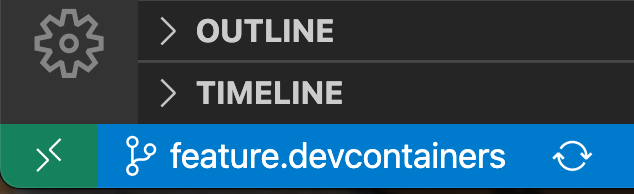
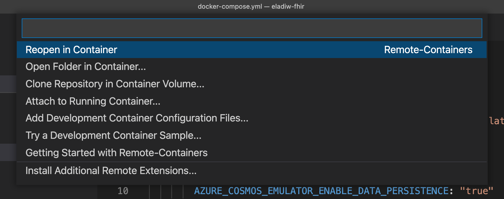
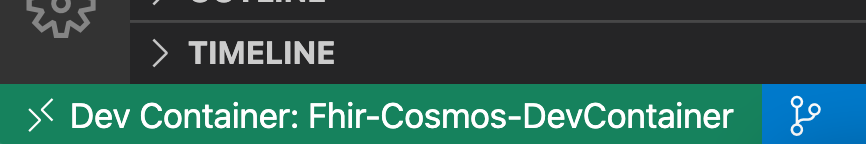
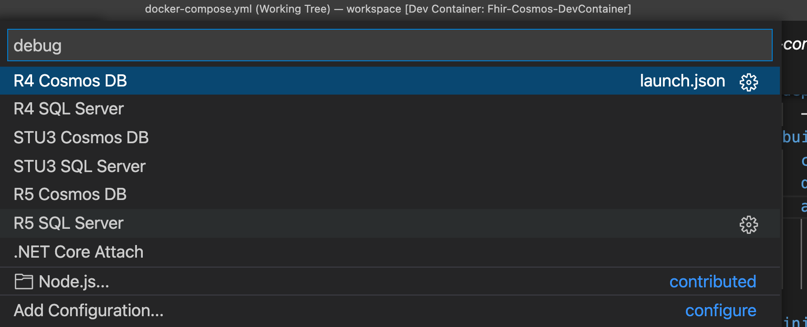

## DevContainers

[DevContainers](https://code.visualstudio.com/docs/remote/containers) lets you use a Docker container as a full-featured development environment. It allows you to open any folder inside (or mounted into) a container and take advantage of Visual Studio Code's full feature set.

In this project the devcontainer starts two containers:
1) the dev container with .net SDK
2) a container with the Azure CosmosDB emulator

The two containers are wired so after switching to the remote container, just hit 'debug/run' (cosmos version) and start debugging.

### Prerequisites

Visual Studio Code

### Usage

1. Install the 'Visual Studio Code Remote - Containers' extension.
2. Visual Studio Code will ask to open the folder inside a container. Allow it.
3. Your dev env is ready for use.

Another option
1. Install the 'Visual Studio Code Remote - Containers' extension.
2. Click on the bottom left corner and click 'reopen in a container'
&nbsp;
&nbsp;
3. The container will start
&nbsp;

### Running / Debugging FHIR

1. Run the selected profile
&nbsp;
2. Use postman to query the server. e.g. https://localhost:44348/Patient