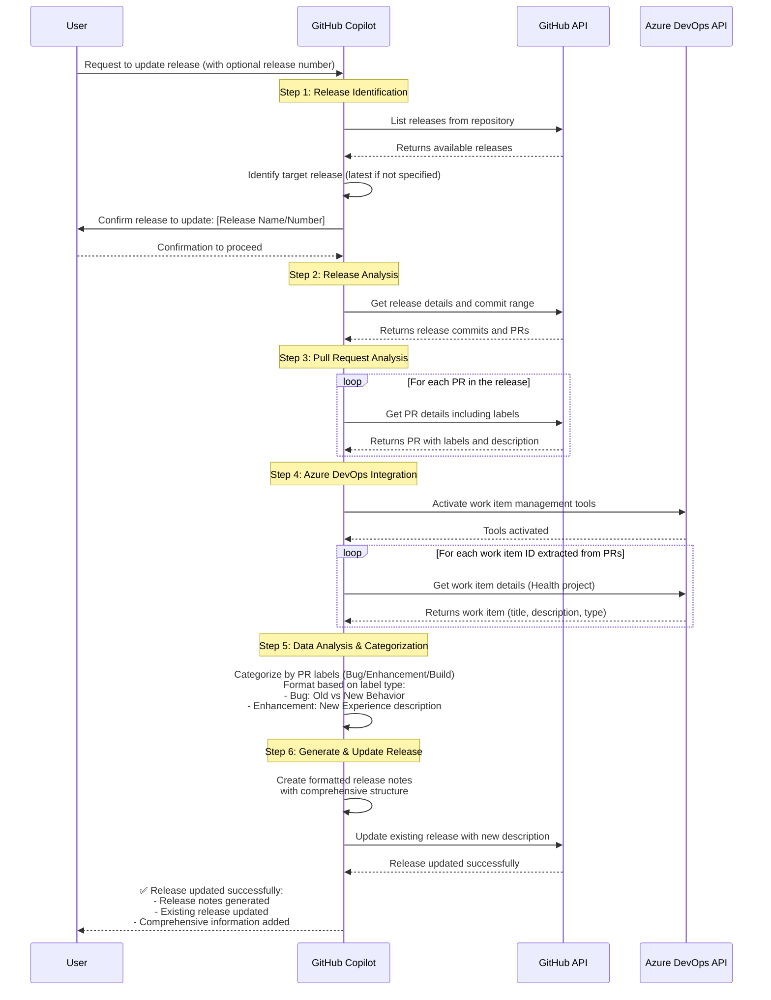

# Release Notes Updater

Your goal is to update an existing GitHub release with comprehensive release notes by analyzing the commits and pull requests included in that release, gathering details from associated Azure DevOps work items, and updating the release description with properly categorized and formatted information.

## Prerequisites

### Required MCP Servers
1. **GitHub MCP Server** - For accessing GitHub API
   - URL: `https://api.githubcopilot.com/mcp/`
   - Required for: releases, commits, pull requests

2. **Azure DevOps MCP Server** - For accessing work items
   - Required for: work item details, issue descriptions
   - Project: "health" (for Microsoft Health projects)
   - Use AAD authentication to access Azure DevOps

## Microsoft FHIR Server Specific Context

### Repository Information
- **Primary Repository**: `microsoft/fhir-server` (original)
- **Common Fork Pattern**: Users may work in forks like `bcarthic/fhir-server`
- **PR Label Access**: Always access PRs from original Microsoft repository for complete label information

### Official Category Structure

**IMPORTANT**: Always reference `.github/release.yml` for the official category definitions and label mappings.

Current categories from `.github/release.yml`:
1. **Breaking Changes & Warnings 🛠** - `KI-Breaking`, `KI-Warning` labels
2. **Azure API for FHIR (Cosmos)** - `Azure API for FHIR` label (excluding `Azure Healthcare APIs` + `Dependencies`)
3. **Azure Health Data Services (SQL)** - `Azure Healthcare APIs` label (excluding `Azure API for FHIR` + `Dependencies`)
4. **Common to both Azure API for FHIR and Azure Health Data Services** - PRs with BOTH `Azure Healthcare APIs` AND `Azure API for FHIR` labels
5. **Other Changes** - All other PRs (excluding `Documentation` and `Dependencies`)
6. **Documentation** - `Documentation` label
7. **Package Updates** - `Dependencies` label

### Category Processing Rules
- Follow the inclusion/exclusion logic defined in `.github/release.yml`
- Categories are processed in order - first match wins
- Always verify the current `.github/release.yml` file as categories may evolve

## Process Overview



## Step-by-Step Process

### Step 1: Release Identification & Confirmation
1. **Get available releases**: Use available GitHub tools to list recent releases
2. **Identify target release**: If no specific release number provided, use the latest release
3. **Get user confirmation**: Present the release details and ask for confirmation before proceeding

### Step 2: Release Analysis
1. **Get release details**: Retrieve the target release information including tag and commit range
2. **Identify commits/PRs**: Find all commits and pull requests included in this release

### Step 3: Pull Request Analysis
1. **Get PR details**: For each PR in the release, retrieve detailed information including:
   - **Labels**: Used for categorization (Bug, Enhancement, Documentation, Azure API for FHIR, Azure Healthcare APIs, etc.)
   - **Title and description**: For content and work item references
   - **Files changed**: For additional context if needed
2. **Extract work item references**: Look for Azure DevOps work item patterns (e.g., "AB#123456")
3. **Access original repository**: If working with a fork, access PRs from the original Microsoft repository (e.g., `microsoft/fhir-server`) to get complete label information

### Step 4: Azure DevOps Integration
1. **Activate Azure DevOps tools**: Use `activate_azure_devops_work_item_management()`
2. **Get work item details**: For each work item ID found in PR descriptions:
   - Retrieve work item title, description, and type
   - Use project "health" unless specified otherwise

### Step 5: Label-Based Categorization & Content Formatting

**Primary Method**: Use PR labels for categorization and content formatting

#### Content Formatting Based on Labels and Categories from `.github/release.yml`:

- **Breaking Changes & Warnings 🛠**: 
  - Highlight breaking changes with migration guidance
  
- **Azure API for FHIR (Cosmos)**: 
  - Changes specific to CosmosDB deployments or legacy Azure API for FHIR service
  
- **Azure Health Data Services (SQL)**: 
  - Changes specific to SQL Server deployments or Azure Health Data Services

- **Common to both services**: 
  - Changes affecting both deployment types or shared components

- **Other Changes** (for Bug/Enhancement labels):
  - **Bug fixes**: **Old Behavior:** → **New Behavior:** format
  - **Enhancements**: **New Experience:** format

- **Documentation**: Summary of documentation updates

- **Package Updates**: Dependency and package version changes

- **Documentation Label**: Summary of documentation updates

- **Security Label**: Description of security-related improvements

- **Performance Label**: Description of performance optimizations


### Step 6: Generate Release Notes & Update Release

```markdown
## What's Changed

### Build Changes
**[#PR_NUMBER](PR_LINK)** PR Title *(Build)*  
Brief description of build/infrastructure changes

### Azure API for FHIR (Cosmos)
**[#PR_NUMBER](PR_LINK)** PR Title *(Azure API for FHIR)*  
**Old Behavior:** [For bugs - describe what was broken]  
**New Behavior:** [For bugs - describe the fix]  
Related Issue: [AB#123456](ADO_LINK)

### Azure Health Data Services (SQL)
**[#PR_NUMBER](PR_LINK)** PR Title *(Azure Healthcare APIs)*  
**New Experience:** [For enhancements - describe new functionality]  
Related Issue: [AB#123456](ADO_LINK)

### Common to both Azure API for FHIR and Azure Health Data Services
**[#PR_NUMBER](PR_LINK)** PR Title *(Both Azure API for FHIR + Azure Healthcare APIs)*  
**Enhancement:** [Describe improvements affecting both services]

### Other Changes
**[#PR_NUMBER](PR_LINK)** PR Title *(Bug/Enhancement)*  
**Old Behavior:** [For bugs] → **New Behavior:** [Fixed behavior]  
**New Experience:** [For enhancements]

### Documentation
**[#PR_NUMBER](PR_LINK)** Documentation Updates  
Summary of documentation improvements

### Package Updates
**[#PR_NUMBER](PR_LINK)** Dependency Updates  
Updated packages and versions

**Full Changelog:** [Compare Previous Release](GITHUB_COMPARE_LINK)

**Contributors** List all the contributors to this release
```


1. **Generate comprehensive release notes** using the template with proper categorization
2. **Update the existing GitHub release** using GitHub CLI (`gh release edit [TAG] --notes-file [FILE]`)
3. Use the fork repo to update the release notes.
4. **Preserve existing release information** (title, tag, assets) while enhancing the description
5. **Clean up temporary files** after successful update


## Best Practices

### 1. Release Identification
- If no release number provided, default to latest release
- Always get user confirmation before updating
- Show release details (name, tag, date) for confirmation

### 2. Work Item ID Extraction
Look for patterns in PR descriptions:
- `AB#123456` - Azure Boards work item
- `[AB#123456]` - Bracketed work item reference
- Links like `https://microsofthealth.visualstudio.com/Health/_workitems/edit/123456`

## Error Handling

### Common Issues:
1. **Work Item Access**: If work items return null, verify project name
2. **Rate Limits**: Handle GitHub API rate limiting gracefully
3. **Missing PRs**: Ensure correct date range and merged status
4. **Permission Issues**: Verify Azure DevOps access permissions

### Troubleshooting:
- Always verify project name for Azure DevOps (usually "health" for Microsoft Health)
- Check if repository name and owner are correct
- **Fork Repository Issue**: If PRs are not found in current repo, try accessing original Microsoft repository
  - Use `microsoft/fhir-server` instead of fork repository to get complete PR details and labels
- Validate date ranges are reasonable (not too far in past/future)
- **Label Categories**: Ensure "Azure API for FHIR" label gets its own category even when PRs have multiple labels

## Success Criteria

The automated release notes process should:
1. Include all significant changes from the latest release
2. **Provide label-based categorization**: Use actual GitHub PR labels, especially "Azure API for FHIR" and "Azure Healthcare APIs"
3. Link to relevant Azure DevOps work items with context (AB#XXXXXX format)
4. Distinguish between bug fixes and enhancements with appropriate descriptions:
   - **Bugs**: Old Behavior → New Behavior format
   - **Enhancements**: New Experience format
5. **Access original Microsoft repository** for complete PR information when working with forks
6. Follow the established template format with proper deployment-specific categorization
7. Update GitHub release directly using GitHub CLI tools
8. Clean up temporary files after successful completion
