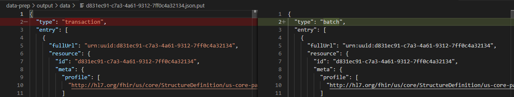
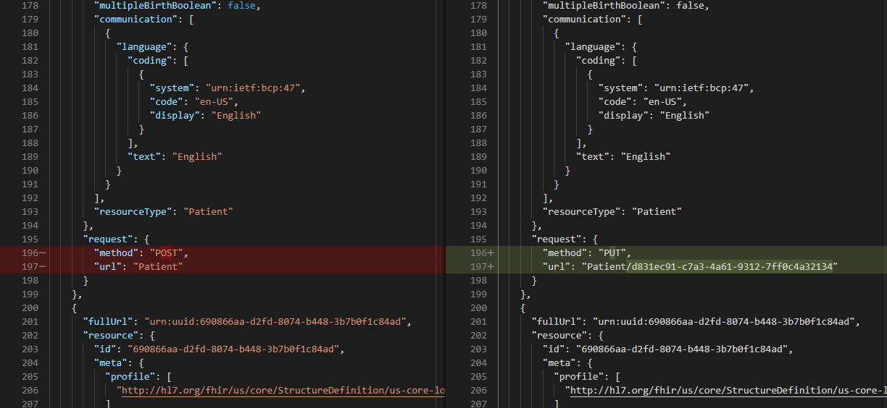

# Import test data

Inferno supplies multiple synthetic data sets suitable for testing. These data sets are ideal for testing because they provide coverage of all US Core profiles and support for all MUST SUPPORT data elements without requiring a large set of patients or sacrificing realism.

The synthetic data sets are available for download in compressed archives at [Inferno US Core Data Sets](https://github.com/inferno-community/uscore-data-sets).

Data set is available as FHIR JSON Transaction Bundles data format.

Due to the fact that Microsfot FHIR server with Cosmos DB doen't support transactions yet, we need to run a script to convert it to batch mode and fix reference IDs.

Specific details are marked in comments inside the [import.sh](../import.sh) script.

A short comparison of sample resource before and after the format conversion:

...
