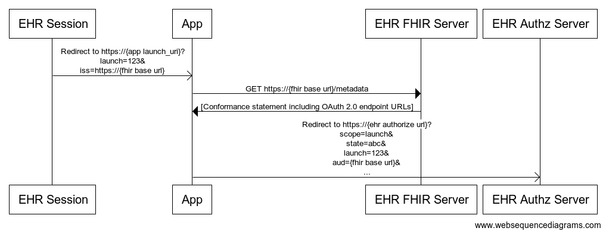
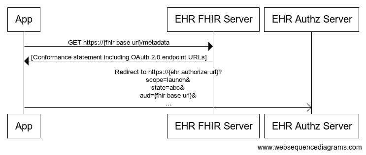
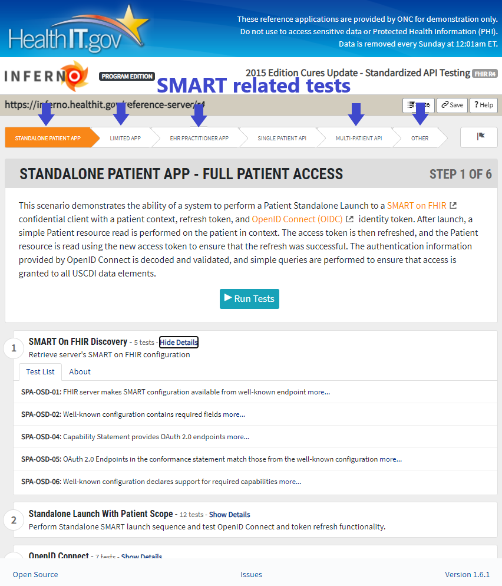
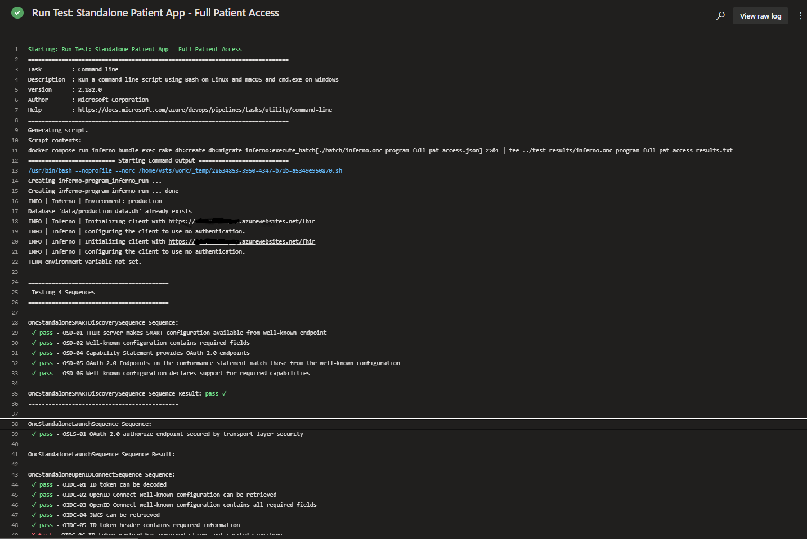

# SMART on FHIR

[SMART on FHIR](https://docs.smarthealthit.org/) is a set of open specifications to integrate partner applications with FHIR servers and electronic medical records systems that have FHIR interfaces. One of the main purposes of the specifications is to describe how an application should discover authentication endpoints for an FHIR server and start an authentication sequence.

Authentication is based on OAuth2. But because SMART on FHIR uses parameter naming conventions that are not immediately compatible with Azure Active Directory (Azure AD), the Azure API for FHIR has a built-in Azure AD SMART on FHIR proxy that enables a subset of the SMART on FHIR launch sequences. Specifically, the proxy enables the [EHR launch sequence](https://hl7.org/fhir/smart-app-launch/#ehr-launch-sequence).

Currenty Azure API for FHIR build-in Azure AD SMART on FHIR proxy doesn't implement all ONC open specifications, another OSS library named [fhir-proxy](https://github.com/microsoft/fhir-proxy) was developed seperatly and gained popolarity does implement most of these specifications.

To deploy, configure fhir-proxy along with all needed Azure Active Directory Applications inside your Azure Environment follow [this link](https://github.com/microsoft/fhir-proxy/blob/main/docs/INSTALL.md)

## SMART “launch sequence"

The two alternative launch sequences are described below.

### EHR launch sequence


In SMART’s EHR launch flow (shown above), a user has established an EHR session, and then decides to launch an app. This could be a single-patient app (which runs in the context of a patient record), or a user-level app (like an appointment manager or a population dashboard). The EHR initiates a “launch sequence” by opening a new browser instance (or iframe) pointing to the app’s registered launch URL and passing some context.

### Standalone launch sequence



Alternatively, in SMART’s standalone launch flow (shown above), a user selects an app from outside the EHR, for example by tapping an app icon on a mobile phone home screen. This app will launch from its registered URL without a launch id.

In order to obtain launch context and request authorization to access FHIR resources, the app discovers the EHR authorization server’s OAuth authorize and token endpoint URLs by querying their [.well-known/smart-configuration.json](https://hl7.org/fhir/smart-app-launch/conformance/index.html#using-well-known) file.

The app then can declare its launch context requirements by adding specific scopes to the request it sends to the EHR’s authorization server. The authorize endpoint will acquire the context the app needs and make it available.

## Inferno SMART related tests

Apart from Single Patient API step whithin Inferno tests are SMART related.
These steps validates diffrent types of SMART app launch sequences and API requierments.

For example Standalon Patient app step demonstrates the ability of a system to perform a Patient Standalone Launch to a [SMART on FHIR](http://www.hl7.org/fhir/smart-app-launch/) confidential client with a patient context, refresh token, and [OpenID Connect (OIDC)](https://openid.net/specs/openid-connect-core-1_0.html) identity token. After launch, a simple Patient resource read is performed on the patient in context. The access token is then refreshed, and the Patient resource is read using the new access token to ensure that the refresh was successful. The authentication information provided by OpenID Connect is decoded and validated, and simple queries are performed to ensure that access is granted to all USCDI data elements.



Each step (Inferno module) comprises of Test Sequences and expects different Input,
for example for the Standalone Patient App You need to provide a FHIR server endpoint to test, a registered Azure Active Directory Application Client ID and Secret, this application acts as the proxy client confidential application and needs to have inferno's Redirect URI configured as Web Platform reply URL and have all API permissions correlated to the Stand Alone Patient Scope to enable all requeried functionality.


For the CI pipeline, inferno as a CLI version without UI, you can read all about it [here](inferno-cli.md).

You need to configure each of the input json files with the requiered input variables,
for example inferno.onc-program-full-pat-access.json holds input variables for the Standalone Patient app:

```json
{
  "server": "##REPLACE##",
  "module": "onc_program",
  "arguments": {
    "onc_sl_url": "##REPLACE##",
    "onc_sl_client_id": "##REPLACE##",
    "onc_sl_client_secret": "##REPLACE##",
    "onc_sl_scopes": "launch/patient openid fhirUser offline_access patient/Medication.read patient/AllergyIntolerance.read patient/CarePlan.read patient/CareTeam.read patient/Condition.read patient/Device.read patient/DiagnosticReport.read patient/DocumentReference.read patient/Encounter.read patient/Goal.read patient/Immunization.read patient/Location.read patient/MedicationRequest.read patient/Observation.read patient/Organization.read patient/Patient.read patient/Practitioner.read patient/Procedure.read patient/Provenance.read patient/PractitionerRole.read",
    "onc_sl_oauth_token_endpoint": "##REPLACE##",
    "id_token": "##id_token##",
    "refresh_token": "##refresh_token##"
  },
  "sequences": [
    "OncStandaloneSMARTDiscoverySequence",
    "OncStandaloneLaunchSequence",
    "OncStandaloneOpenIDConnectSequence",
    "OncStandaloneTokenRefreshSequence"
  ]
}
```

you either fill onc_sl_* variables for authentication or provide id_token and refresh_token by authenticate prior running  inferno cli process.
to run inferno cli with this config file use this command:

docker-compose run inferno bundle exec rake db:create db:migrate inferno:execute_batch[./batch/inferno.onc-program-full-pat-access.json]

* note - CI step also directs all standard error and output to a log file and publishes it at a separate step to CI artifact.

Screeshot of inferno CI output:

