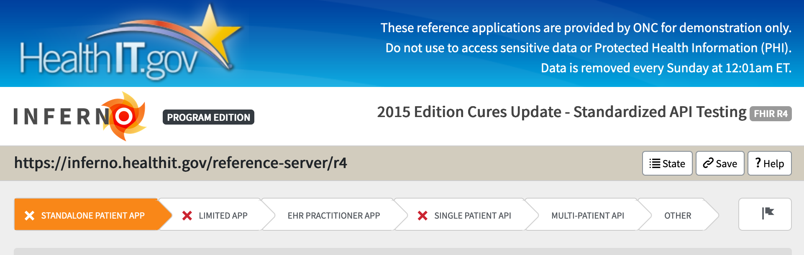

# Inferno with MS FHIR

## Introduction

Inferno is a testing suite for HL7 Fast Healthcare Interoperability Resources (FHIR) to help developers implement the FHIR standard consistently. (read more [here](https://inferno.healthit.gov/)).

The goal of this section is to understand how the MS FHIR implementation conforms to the requirements of the Standardized API. To do so we leverage the inferno CLI utility as the backend utility and created an AzDO pipeline to automate the process.

## Inferno tests

Inferno tests can be divided to two main areas: core functionality and SMART related functionality.
The project contains all the tests and sequences that check the SMART functionality, however the expectation is that these tests will pass only when the required functionality will be integrated into the MS FHIR implementation.
The core functionality tests are expected to pass.

Each test contains multiple sequences. Each test is defined in its own json file.
There are (currently) 6 tests files which meets the Inferno UI

1. Standalone Patient App - Full Patient Access
1. Standalone Patient App - Limited Access
1. EHR Practitioner App
1. Single Patient API
1. Multi-Patient Authorization and API
1. Additional Tests

## Inferno Test Data

To learn more about data needed for inerfo tests and how to import it to FHIR server, read [here](docs/import-test-data.md)

## Inferno CLI

To learn more about the inferno CLI utility, read [here](docs/inferno-cli.md)

## SMART of FHIR

To learn more about SMART on FHIR in the context of our project, read [here](docs/smart.md)

## Azure DevOps (AzDO) pipeline

To learn more about the automated pipeline, read [here](docs/pipeline.md)