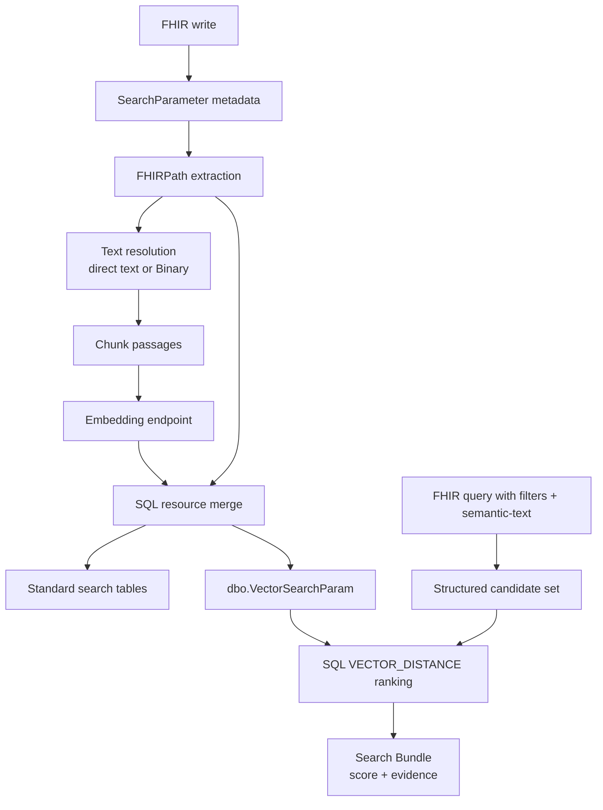

# Semantic Search for FHIR: Design Walkthrough and Live Demo


## 1. Purpose and Scope

Today I am demoing a FHIR-native semantic search implementation in the SQL Server FHIR backend. The goal is to show how standard FHIR search can keep its structured filters, patient scoping, and authorization boundaries, while adding meaning-based ranking over clinical narrative text.

The core path is working end to end: FHIR resources are indexed from SearchParameter metadata, embeddings are generated during writes, vectors are stored in SQL, and semantic queries return ranked FHIR results with score and evidence. I will first explain the design, then show the live FHIR requests, the SQL vector storage, and the planned work.

The demo question is:

> Has this patient had previous episodes of dizziness, fainting, or nearly passing out?

Structured FHIR search is still the deterministic filtering layer. Semantic search adds relevance ranking over clinical narrative text while preserving FHIR syntax, patient scoping, structured filters, authorization boundaries, and provenance.

The most important design principle is: scope first, similarity second. FHIR filters decide which resources are eligible first; semantic similarity only ranks within that eligible set.

---

## 2. Demo Scenario

Elena Marquez is a synthetic 60-year-old patient with hypertension and type 2 diabetes. She presents to the emergency department with recurrent positional dizziness.

Her chart contains relevant evidence written in different clinical language:

| Evidence | Resource | Demo purpose |
|---|---|---|
| "Lightheaded when standing with a near-syncopal episode and no loss of consciousness." | Observation | Exact calibration query. |
| Orthostatic vitals with blood pressure drop and lightheadedness. | Observation | Related measurement-based wording. |
| "Orthostatic presyncope rather than a primary rhythm disturbance." | DiagnosticReport | Specialist-language paraphrase. |
| Long ED note describing vision narrowing and reaching for a counter. | DocumentReference backed by Binary | Long-document passage retrieval. |
| Physical therapy note about guarded mobility and instability. | DocumentReference backed by Binary | Related but lower-ranked functional note. |

David Chen is the isolation control patient. He has an Observation with the exact same calibration sentence as Elena. His result must not appear when the query is scoped to Elena.

---

## 3. Design Walkthrough

### 3.1 Structured Search vs Semantic Search

Key vocabulary:

| Term | Meaning |
|---|---|
| Structured FHIR search | Ordinary FHIR REST search using SearchParameters such as `patient`, `status`, `date`, and `code`. |
| Deterministic filtering | Exact rule-based matching: a resource either matches the indexed field or it does not. |
| Coded search | Structured search over clinical code/system pairs, such as LOINC. |
| Semantic search | Meaning-based ranking over embedded clinical text. |
| Scoped semantic search | Structured FHIR filters define the safe candidate set first, then semantic ranking happens inside that set. |
| Hybrid FHIR search | A query that combines structured filters with `semantic-text`. |

Structured FHIR search uses deterministic patient, status, date, and code filters. Semantic search embeds query text and compares it to indexed clinical text, while scoped semantic search keeps FHIR filters responsible for the safe candidate set.

### 3.2 FHIR-native SearchParameter

Semantic search is exposed as a FHIR `SearchParameter` with `type = special` and `code = semantic-text`.

```json
{
  "resourceType": "SearchParameter",
  "url": "https://azurehealthcareapis.com/search-parameters/observation-semantic-text",
  "type": "special",
  "code": "semantic-text",
  "base": ["Observation"],
  "expression": "Observation.note.text"
}
```

Why this matters:

- It appears in `/metadata`.
- It uses ordinary FHIR syntax: `GET /Observation?semantic-text=...`.
- It composes with `patient`, `status`, `date`, `code`, and other structured filters.
- FHIR metadata drives what text is indexed instead of hardcoded resource-type rules.

Enabled demo SearchParameters:

| Resource type | FHIRPath expression | Source strategy |
|---|---|---|
| Observation | `Observation.note.text` | `directText` |
| DiagnosticReport | `DiagnosticReport.conclusion` | `directText` |
| DocumentReference | `DocumentReference.content.attachment.url.toString()` | `localBinaryReference` |

### 3.3 Configuration

Vector search has three configuration layers: runtime feature settings, built-in SearchParameter definitions, and the SQL model registry.

Where runtime settings live:

| Location | Purpose |
|---|---|
| `src/Microsoft.Health.Fhir.Shared.Web/appsettings.json` and deployment settings | Normal host configuration locations for a real deployment. |
| Environment variables | Local demo and deployment override path, for example `FhirServer__CoreFeatures__VectorSearch__Enabled=true`. |

Example settings:

```json
{
  "FhirServer": {
    "CoreFeatures": {
      "VectorSearch": {
        "Enabled": true,
        "Embedding": {
          "Endpoint": "https://YOUR-FOUNDRY-RESOURCE.cognitiveservices.azure.com",
          "DeploymentName": "text-embedding-3-small",
          "ModelName": "text-embedding-3-small",
          "ModelVersion": "YOUR-DEPLOYED-MODEL-VERSION",
          "Dimensions": 1536
        },
        "Indexing": {
          "Mode": "Synchronous",
          "ChunkSizeTokens": 800,
          "ChunkOverlapTokens": 100
        },
        "Query": {
          "DefaultCount": 10,
          "MaxCount": 50,
          "CandidateCount": 100,
          "DistanceMetric": "cosine"
        }
      }
    }
  }
}
```

Important settings:

| Setting | Purpose |
|---|---|
| `Enabled` | Gates semantic search dependency injection. |
| `Embedding.Endpoint` | Azure Foundry / Azure OpenAI embedding endpoint. |
| `Embedding.ModelName` and `Embedding.ModelVersion` | Model identity recorded in SQL. |
| `Embedding.Dimensions = 1536` | Must match the SQL schema contract. |
| `Query.DistanceMetric = cosine` | Chooses how vector closeness is measured. It does not switch exact search to ANN. |

Configuration does not hardcode resource behavior in code. Active, supported, searchable FHIR SearchParameter definitions in the registry say which resource types and fields are indexable.

Local embedding auth uses Azure identity, not an API key.

### 3.4 Scope Before Similarity

FHIR candidate selection happens before vector ranking. Patient compartment filtering, authorization, and structured query filters decide the eligible resources first. SQL `VECTOR_DISTANCE` then ranks only those candidates.

That is why David Chen's identical note is excluded from Elena's results. It may be a perfect semantic match, but it never enters Elena's candidate set.

### 3.5 End-to-End Design Diagram



### 3.6 Exact kNN, Score, and Evidence

The current SQL path uses exact nearest-neighbor ranking with `VECTOR_DISTANCE`. kNN means "k nearest neighbors": for a query vector, return the top `k` stored vectors closest to it. In this implementation, closeness is measured with cosine distance because the vector search configuration sets `DistanceMetric` to `cosine`.

The score is a normalized semantic relevance score used for ordering. It is not a clinical probability or diagnostic confidence value.

Semantic results return evidence with the resource: score, winning passage text, passage ordinal, SearchParameter URL, source resource, and source path.

---

## 4. Live REST Demo

The request files live in `demo/semantic-search/requests`.

### 4.1 Demo Order

| Step | File | What it proves |
|---|---|---|
| 1 | `00-preflight.http` | Server is running and returns `/metadata`. |
| 2 | `01-verify-search-parameters.http` | The three semantic SearchParameters are active. |
| 3 | `00-reset-vector-resources.http` | Optional reset forces fresh synchronous indexing. |
| 4 | `02-ingest-and-index.http` | Synthetic FHIR resources are written and vector rows are created. |
| 5 | `03-standard-search.http` | Standard FHIR search still works; semantic search composes with filters. |
| 6 | `04-semantic-search.http` | Patient-level semantic search ranks across supported resource types. |
| 7 | `05-long-document-search.http` | Long text retrieval and page-specific PDF provenance work. |

### 4.2 Standard FHIR Search

Structured search is the baseline behavior.

```http
GET /Observation?patient=8f789d0b-3145-4cf2-8504-13159edaa747&status=final&date=ge2025-01-01&_count=10
```

```http
GET /Observation?patient=8f789d0b-3145-4cf2-8504-13159edaa747&code=http%3A%2F%2Floinc.org%7C85354-9
```

These are normal FHIR searches. They are deterministic: the resource matches the indexed patient, status, date, or code fields, or it does not. There is usually `mode: match` but no relevance score because this is not ranked retrieval.

### 4.3 Resource-level Semantic Search

```http
GET /Observation?patient=8f789d0b-3145-4cf2-8504-13159edaa747&semantic-text=Lightheaded%20when%20standing%20with%20a%20near-syncopal%20episode%20and%20no%20loss%20of%20consciousness.&_count=10
```

Expected result:

- `Observation/demo-obs-exact-presyncope` should rank first or near first.
- David Chen's identical Observation should not appear because the patient filter applies first.
- The response includes semantic score and passage evidence.

### 4.4 Hybrid FHIR Search

```http
GET /DiagnosticReport?patient=8f789d0b-3145-4cf2-8504-13159edaa747&status=final&date=ge2025-01-01&semantic-text=What%20prior%20testing%20explains%20the%20near-fainting%20episodes%3F&_count=3
```

This is hybrid FHIR search. Patient, status, and date still define the candidate set, and semantic ranking orders only those matching resources.

### 4.5 DocumentReference Note

The DocumentReference path uses Binary-backed text extraction. Standard FHIR search confirms the DocumentReferences and Binaries are saved; semantic retrieval depends on vector rows being created for the resolved Binary text.

---

## 5. SQL View

The SQL view shows that semantic search is stored as passage-level vector rows linked back to FHIR resources. Schema version 117 adds two tables and one table-valued parameter for semantic search. Schema version 118 adds atomic vector replacement for system `$reindex`.

### 5.1 dbo.EmbeddingModel

Purpose: register the embedding model that produced stored vectors.

```sql
SELECT *
FROM dbo.EmbeddingModel;
```

| Column | Purpose |
|---|---|
| `EmbeddingModelId` | Primary key stored on vector rows so queries compare only compatible vectors. |
| `ModelName` | Logical model name, for example `text-embedding-3-small`. |
| `ModelVersion` | Version paired with `ModelName` as a unique model identity. |
| `Dimension` | Expected vector dimension, currently 1536. |
| `DistanceMetric` | Ranking metric, currently `cosine`. |
| `CreatedAt` | UTC creation timestamp. |

### 5.2 dbo.VectorSearchParam

Purpose: store passage-level embeddings attached to FHIR resources.

```sql
SELECT COUNT(*) AS VectorRows
FROM dbo.VectorSearchParam;
```

```sql
SELECT TOP (20)
    ResourceTypeId,
    ResourceSurrogateId,
    SearchParamId,
    EmbeddingModelId,
    ChunkOrdinal,
    SourceResourceId,
    SourceResourceVersion,
    SourcePath,
    LEFT(ChunkText, 200) AS ChunkPreview
FROM dbo.VectorSearchParam
ORDER BY ResourceTypeId, ResourceSurrogateId, SearchParamId, ChunkOrdinal;
```

| Column | Purpose |
|---|---|
| `ResourceTypeId` | SQL-local owner resource type. Part of the primary key. |
| `ResourceSurrogateId` | Version-specific owner resource surrogate ID. Part of the primary key. |
| `SearchParamId` | SQL-local semantic SearchParameter ID. Allows multiple vector params in one table. |
| `ChunkOrdinal` | Passage number for long text. Part of the primary key. |
| `EmbeddingModelId` | Model provenance and query compatibility filter. |
| `ChunkText` | Embedded passage returned as evidence. |
| `SourceTextHash` | Source-text hash for future change detection and reindex decisions. |
| `SourceResourceTypeId` | Resource type that supplied the text, such as Binary for DocumentReference. |
| `SourceResourceId` | Source resource logical ID for provenance. |
| `SourceResourceVersion` | Source resource version when available. |
| `SourcePath` | FHIRPath/source path, for example `Observation.note.text` or `Binary.data`. |
| `Embedding` | Native SQL `vector(1536)` used by `VECTOR_DISTANCE`. |

Primary key:

```sql
(ResourceTypeId, ResourceSurrogateId, SearchParamId, ChunkOrdinal)
```

This key makes each embedded passage unique for one resource version, one semantic SearchParameter, and one chunk position.

### 5.3 dbo.VectorSearchParamList

This table-valued parameter passes vector rows into the resource merge stored procedures. Its `Embedding` value is sent as text and cast to `vector(1536)` inside SQL.

---

## 6. Implementation Details

This section contains the deeper SearchParameter, indexing, and query details behind the live flow.

### 6.1 SearchParameter Extension

Each semantic SearchParameter carries a private vector extension that tells the server how to transform the FHIRPath value into embedding input.

Where it lives:

| Location | Purpose |
|---|---|
| `src/Microsoft.Health.Fhir.Core/Data/R4/ms-search-parameters.json` | Built-in R4 SearchParameter bundle. The three demo vector SearchParameters are defined here. |
| `SearchParameter.url` | Canonical identity used by the registry and persisted vector rows. |
| `SearchParameter.base` | Resource type the parameter applies to. |
| `SearchParameter.expression` | FHIRPath expression that selects the candidate text or Binary reference. |
| `vector-search-config` extension | Server-private indexing instructions for the selected values. |

Extension fields:

| Extension field | Purpose |
|---|---|
| `sourceStrategy = directText` | Use the FHIRPath string value directly. |
| `sourceStrategy = localBinaryReference` | Treat the FHIRPath value as a local `Binary/{id}` reference and decode the Binary text. |
| `extractionPolicy` | Choose whether values become separate inputs or are concatenated. |
| `maxInputTokens` | Limit source text before chunking. |

### 6.2 Write-time Indexing

Indexing is the write-time step where the server takes configured FHIR fields, such as `Observation.note.text` or `DiagnosticReport.conclusion`, turns that text into embedding vectors, and stores those vectors in SQL so future semantic queries can compare against them quickly. For standard FHIR search, indexing also happens on write, but it stores structured search parameters like patient references, codes, dates, and status values instead of vectors.

The write path is synchronous today. A successful write should be immediately searchable.

Design tradeoff:

- Benefit: semantic results are consistent immediately after write.
- Cost: writes include embedding latency.
- Planned option: asynchronous/background indexing for write-heavy deployments.

Operational demo note: byte-identical `PUT` requests are no-ops. Use `00-reset-vector-resources.http` before ingest if vector rows need to be regenerated.

### 6.3 Query-time Ranking and Normalizing

Query sequence:

1. Parse `semantic-text` as a vector SearchParameter.
2. Embed the query text once.
3. Build the standard FHIR candidate set.
4. Rank candidate vector rows with SQL `VECTOR_DISTANCE`.
5. Return resources with score and passage evidence.

Normalizing means converting the raw cosine distance returned by SQL vector comparison into a user-facing relevance score. Smaller cosine distance means more similar, so the server maps it into a higher-is-better score, roughly `score = 1 - distance / 2`, then clamps it into a clean range for the search Bundle.

For standard FHIR search, there usually is no relevance normalization because the result is deterministic: a resource either matches the structured filters or it does not.

### 6.4 Patient-level Semantic Operation

```http
POST /Patient/{id}/$semantic-search
```

This operation searches across Observation, DiagnosticReport, and DocumentReference and returns one ranked Bundle. Repeated `type` parameters can restrict the resource types.

---

## 7. Current Status and Planned Work

Working now:

- built-in semantic SearchParameter registration,
- synchronous write-time vector indexing,
- direct text and local Binary text extraction,
- SQL `vector(1536)` storage,
- query-time embedding and exact cosine ranking,
- resource-level `?semantic-text=...` queries,
- patient-level `$semantic-search`,
- vector-aware `$reindex` for existing resources,
- score and passage evidence in results.

Planned work:

- automatic owner reindexing when linked Binary content changes,
- continuation token semantics for vector-ranked pages,
- hardened authorization and lifecycle handling for linked Binary content,
- OCR and document extraction beyond UTF-8 text and text-based PDF Binary content,
- asynchronous/background indexing for write-heavy deployments,
- DiskANN approximate search for cross-patient cohort and research scenarios,
- metrics for embedding calls, indexing latency, vector row counts, and query latency.

---

## 8. Closing Summary

Semantic search is implemented as a FHIR-native retrieval feature: SearchParameter metadata controls what is indexed, existing FHIR filters control scope, SQL vector ranking orders the eligible resources, and Bundle evidence explains why each result matched.

The result is structured FHIR search and semantic search over the same FHIR resources, through the same API, with the same patient and authorization boundaries.

The main idea is not replacing FHIR search. It is extending FHIR search so structured filters keep their safety and precision, while semantic ranking helps clinicians find relevant narrative evidence when exact wording is not known.
