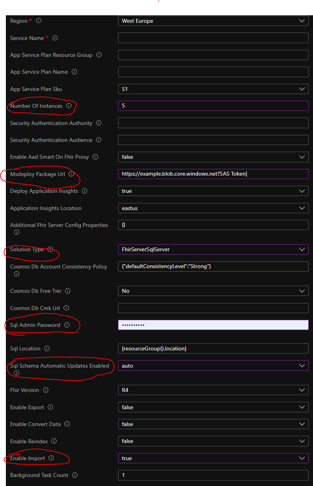
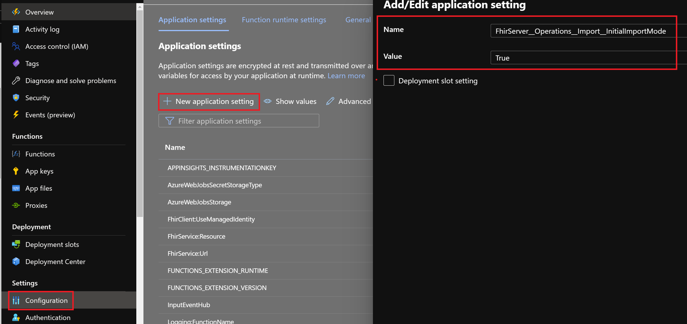

# Bulk import

There are two modes of $import supported today-

1. Initial mode is intended to load FHIR resources into an empty FHIR server. Initial mode only supports CREATE operations and, when enabled, blocks API writes to the FHIR server.
1. Incremental mode is optimized to load data into FHIR server periodically and doesn't block writes via API. It also allows you to load lastUpdated and versionId from resource Meta (if present in resource JSON).

The Bulk import feature enables importing FHIR data in the NDJSON format to the FHIR server. By default, this feature is disabled. To enable and use Bulk import, refer to the guidelines in this document.

## Prerequisites

* NDJSON FHIR data to be imported.
* Each NDJSON file should contain resources of only one type.
* You may have multiple NDJSON files per resource type.

### Current limitations

* Conditional references in resources are not supported for incremental mode import.
* If multiple resources share the same resource ID, then only one of those resources will be imported at random and an error will be logged corresponding to the remaining resources sharing the ID.

## How to use $import

Below are the high-level steps to use $import. The sections that follow in this document describe these steps in more detail.

1. [Deploy a new FHIR server](#deploy-a-fhir-server) if it's not already deployed. Ensure that **Enable Import** is set to **True** during the installation.
1. [Check and set up the configuration](#check-and-set-up-configuration) settings of the FHIR server. If your FHIR server is newly deployed, you can skip this step.
1. [Set initial import mode or incremental import mode](#change-initial-import-mode-on-the-fhir-server) on the FHIR server. 
1. Upload your NDJSON files to a container in the storage location associated with your FHIR server. For more information, see [Get started Azure Storage Explorer](https://docs.microsoft.com/azure/vs-azure-tools-storage-manage-with-storage-explorer?tabs=windows) or [az_copy](https://docs.microsoft.com/azure/storage/common/storage-ref-azcopy) to upload your data.
1. Ensure that the storage available in Azure SQL database is at least 3 times that of the sum of your NDJSON files.
1. Make the [$import API](#call-import) call.
1. Periodically [check the status](#check-import-status) of the import.
1. If using initial import mode, [Unset initial import mode](#change-initial-import-mode-on-the-fhir-server) on the FHIR server. This step removes the suspension of the write operations on the FHIR server.

### Deploy a FHIR server

See the [QuickstartDeployPortal](https://github.com/microsoft/fhir-server/blob/main/docs/QuickstartDeployPortal.md) guide for information about how to deploy a new FHIR server. Use the following guidelines for parameter values while installing the server.

- **Number of instances**: `>=2`
- **Solution type**: `FhirServerSqlServer`
- **SQL Admin Password**: Set a strong password.
- **SQL Schema Automatic Updates Enabled**: Auto
- **Enable Import**: True
    

### Check and set up configuration

Ensure the following settings are set correctly in your FHIR server:

- **FhirServer__Operations__Import__Enabled**: True
- **TaskHosting__Enabled**: True
- **FhirServer__Operations__Import__MaxRunningProcessingTaskCount**: Not set as default or have value >0. We suggest it has a value >= instance count for performance.
- **FhirServer__Operations__IntegrationDataStore__StorageAccountUri**: The URL of the Azure Storage Account used as adata source. For example: https://<accountName>.blob.core.windows.net/.<br>
                        **OR**
- **FhirServer__Operations__IntegrationDataStore__StorageAccountConnection**: The connection string of the Azure Storage Account that's used as a data source.
- 
---
**NOTE**

There are two ways by which one can set the source storage account to import from. One way would be to use the connection string for the storage account and update the `FhirServer__Operations__IntegrationDataStore__StorageAccountConnection` setting. The FHIR server will use the connection string to connect to the storage account and import data.

The other option would be to use the `FhirServer__Operations__IntegrationDataStore__StorageAccountUri` setting with the URI of the storage account. For this option, we assume that the FHIR server has permissions to contribute data to the corresponding storage account. One way to achieve this (assuming you are running the FHIR server code in the App Service with Managed Identity enabled) would be to give the App Service `Storage Blob Data Contributor` permissions for the storage account of your choice.

---

| :zap:! If you're doing custom deployments neither as a Linux app service or a custom Linux container, any nested JSON key structure in the app setting name like TaskHosting__Enabled needs to be configured in App Service as TaskHosting:Enabled for the key name. In other words, any __(double underscore) should be replaced by :(colon). |
|-----------------------------------------|

You can choose to use initial import mode or incremental import mode.

### Change initial import mode on the FHIR server

The FHIR server must have the `initial import mode` set to `True` for $import to work. Setting the Initial Import mode value to `True` also suspends the write operations (PUT and POST) on the FHIR server, and it must be reverted to `False` to resume the write operations.

```
FhirServer__Operations__Import__InitialImportMode: True
```
### Change incremental import mode on the FHIR server

The FHIR server must have the `initial import mode` set to `True` for $import to work. 

```
FhirServer__Operations__Import__InitialImportMode: False
```

After the FHIR server app is ready, browse to the Azure portal and click **Configuration**. If it's needed, create the `FhirServer:Operations:Import:InitialImportMode` setting by selecting **New application setting**. Set the value to `True` or `False` as needed.

Select **OK**, then select **Save**. When you're prompted, select **Continue** to restart the app and to allow the changes to take effect.



### Call $import

Make the REST call with ```POST``` method to ```<<FHIR service base URL>>/$import``` with the following required header fields, and [Parameters](http://hl7.org/fhir/parameters.html) resource in the body as described below.

As `$import` is an async operation, a **callback** link will be returned in the `Content-location` header of the response together with ```202-Accepted``` status code.

#### Header

```http
Prefer:respond-async
Content-Type:application/fhir+json
```

#### Body

| Parameter Name      | Description | Card. |  Accepted values |
| ----------- | ----------- | ----------- | ----------- |
| inputFormat      | String representing the name of the data source format. Currently only FHIR NDJSON files are supported. | 1..1 | ```application/fhir+ndjson``` |
| mode      | Import mode. Currently only initial load mode is supported. | 1..1 | For initial import use ```InitialLoad``` mode value. For incremental import mode use ```IncrementalLoad``` mode value. If no mode value is provided, IncrementalLoad mode value is considered by default. |
| input   | Details of the input files. | 1..* | A JSON array with 3 parts described in the table below. |

| Input part name   | Description | Card. |  Accepted values |
| ----------- | ----------- | ----------- | ----------- |
| type   |  Resource type of input file   | 1..1 |  A valid [FHIR resource type](https://www.hl7.org/fhir/resourcelist.html) that match the input file. |
|URL   |  Azure storage url of input file   | 1..1 | URL value of the input file that can't be modified. |
| etag   |  Etag of the input file on Azure storage used to verify the file content has not changed. | 0..1 |  Etag value of the input file that can't be modified. |

**Sample request:**

```json
{
    "resourceType": "Parameters",
    "parameter": [
        {
            "name": "inputFormat",
            "valueString": "application/fhir+ndjson"
        },
        {
            "name": "mode",
            "valueString": "InitialLoad"
        },
        {
            "name": "input",
            "part": [
                {
                    "name": "type",
                    "valueString": "Patient"
                },
                {
                    "name": "url",
                    "valueUri": "https://example.blob.core.windows.net/resources/Patient.ndjson"
                },
                {
                    "name": "etag",
                    "valueUri": "0x8D92A7342657F4F"
                }
            ]
        },
        {
            "name": "input",
            "part": [
                {
                    "name": "type",
                    "valueString": "CarePlan"
                },
                {
                    "name": "url",
                    "valueUri": "https://example.blob.core.windows.net/resources/CarePlan.ndjson"
                }
            ]
        }
    ]
}
```

### Check import status

Make the REST call with the ```GET``` method to the **callback** link returned in the previous step. You can interpret the response using the following table:

| Response code      | Reponse body |Description |
| ----------- | -----------  |-----------  |
| 202 Accepted | |The operation is still running.|
| 200 OK |The response body does not contain any error.url entry|All resources were imported successfully.|
| 200 OK |The response body contains some error.url entry|Error occurred while importing some of the resources. See the files located at error.url for the details. Rest of the resources were imported successfully.|
| Other||A fatal error occurred and the operation has stopped. Successfully imported resources have not been rolled back. For more information, see the [Troubleshooting](#troubleshooting) section.|

Below are some of the important fields in the response body:
| Field | Description |
| ----------- | ----------- |
|transactionTime|Start time of the bulk import operation.|
|output.count|Count of resources that were successfully imported|
|error.count|Count of resources that were not imported due to some error|
|error.url|URL of the file containing details of the error. Each error.url is unique to an input URL. |

**Sample response:**

```json
{
    "transactionTime": "2021-07-16T06:46:52.3873388+00:00",
    "request": "https://importperf.azurewebsites.net/$Import",
    "output": [
        {
            "type": "Patient",
            "count": 10000,
            "inputUrl": "https://example.blob.core.windows.net/resources/Patient.ndjson"
        },
        {
            "type": "CarePlan",
            "count": 199949,
            "inputUrl": "https://example.blob.core.windows.net/resources/CarePlan.ndjson"
        }
    ],
    "error": [
        { 
        "type": "OperationOutcome",
        "count": 51,
        "inputUrl": "https://example.blob.core.windows.net/resources/CarePlan.ndjson",
        "url": "https://example.blob.core.windows.net/fhirlogs/CarePlan06b88c6933a34c7c83cb18b7dd6ae3d8.ndjson"
        }
    ]
}
```

## Troubleshooting

Below are some errors you may encounter:

### 200 OK, but error URL in response

**Behavior:** Import operation succeeds and returns ```200 OK```. However, `error.url` are present in the response body. Files present at the `error.url` location contains JSON fragments like in the example below:

```json
{
    "resourceType": "OperationOutcome",
    "issue": [
        {
            "severity": "error",
            "details": {
                "text": "Given conditional reference '{0}' does not resolve to a resource."
            },
                "diagnostics": "Failed to process resource at line: {0} with stream start offset: {1}"
        }
    ]
}
```

**Cause:** NDJSON files contain resources with conditional references, which is currently not supported by $import.

**Solution:** Replace the conditional references to normal references in the NDJSON files.

### 400 Bad Request

**Behavior:** Import operation failed and ```400 Bad Request``` is returned. Response body has this content:

```json
{
    "resourceType": "OperationOutcome",
    "id": "13876ec9-3170-4525-87ec-9e165052d70d",
    "issue": [
        {
            "severity": "error",
            "code": "processing",
            "diagnostics": "import operation failed for reason: No such host is known. (example.blob.core.windows.net:443)"
        }
    ]
}
```

**Solution:** Verify the link to Azure storage for correctness. Check the network and firewall settings to make sure that the FHIR server is able to access the storage. If your service is in a VNet, ensure that the storage is in the same VNet or in a VNet that has peering with the FHIR service VNet.

### 403 Forbidden

**Behavior:** Import operation failed and ```403 Forbidden``` is returned. The response body has the following content:

```json
{
    "resourceType": "OperationOutcome",
    "id": "bd545acc-af5d-42d5-82c3-280459125033",
    "issue": [
        {
            "severity": "error",
            "code": "processing",
            "diagnostics": "import operation failed for reason: Server failed to authenticate the request. Make sure the value of Authorization header is formed correctly including the signature."
        }
    ]
}
```

**Cause:** We use managed identity for source storage auth. This error may be caused by a missing or wrong role assignment.

**Solution:** Assign _Storage Blob Data Contributor_ role to the FHIR server following [the RBAC guide.](https://docs.microsoft.com/en-us/azure/role-based-access-control/role-assignments-portal?tabs=current)

### 500 Internal Server Error

**Behavior:** Import operation failed and ```500 Internal Server Error``` is returned. Response body has this content:

```json
{
    "resourceType": "OperationOutcome",
    "id": "0d0f007d-9e8e-444e-89ed-7458377d7889",
    "issue": [
        {
            "severity": "error",
            "code": "processing",
            "diagnostics": "import operation failed for reason: The database '****' has reached its size quota. Partition or delete data, drop indexes, or consult the documentation for possible resolutions."
        }
    ]
}
```

**Cause:** SQL server disk is exhausted

**Solution:** Ensure that the storage available on your Azure SQL is at least 3 times that of the sum of your NDJSON files.

## Best practices and tips for increasing throughput

1. Deploy the FHIR server, SQL Server database, and the storage account in the same region to avoid data movement across regions.
1. The optimal NDJSON file size for import is 50MB-500MB. Combine smaller files of the same resource type together, and then split big files into smaller files.
1. If you find that LOG IO percentage or CPU percentage are very high during the import, upgrade your database tier.
1. Scale out to increase parallelism:
    1. Increase the number of machines in the app service plan.
    2. Ensure the number of tasks each machine is allowed to run is equal to or greater than number of v-cores on the machine. You can check number of tasks running with TaskHosting__MaxRunningTaskCount setting.
    3. Save changes to the configuration and restart the app.
1. Besides scaling out, you can also scale up each machine. For more information, see [Scale up an app](https://docs.microsoft.com/en-us/azure/app-service/manage-scale-up) to achieve this. In general, the P3V2 machine is enough for most of the scenarios.
1. Create the configuration ```FhirServer__Operations__Import__DisableUniqueOptionalIndexesForImport```, and set it to `True` when your input size is larger than 10GB.
