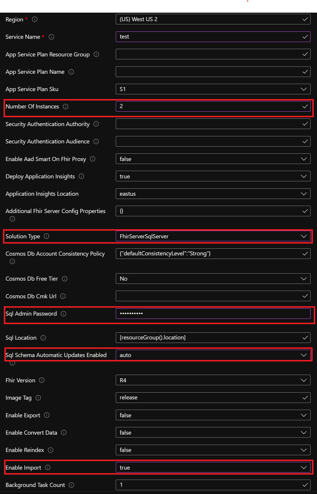

# Bulk import

This feature enables importing FHIR data in NDJSON format to the FHIR server. The feature is disabled by default and must be enabled by following this document to use.

### Prerequisites

1. NDJSON FHIR data to be imported. Each NDJSON file should contain resources of only one type. You may have multiple NDJSON files per resource type.

### Current limitations

1. Conditional references in resources are not supported.
2. If multiple resources share the same resource id then only one of those resources will be imported at random and error will be logged corresponding to the remaining resources sharing the id.

## How to use $import

Here are the high-level steps to use $import. Rest of the document describes some of these steps in detail:

1. [Deploy a new fhir server](#deploy-a-fhir-server) if needed. Ensure that _Enable Import_ is set to _true_ during the installation.
1. [Set init import mode](#change-init-import-mode-on-the-fhir-server) on the FHIR server. Setting this mode also suspends write operations (POST, PUT) on the FHIR server.
1. Upload your NDJSON files to a container in the storage location associated with your FHIR server. You may want to use  [_Azure storage explorer_](https://docs.microsoft.com/en-us/azure/vs-azure-tools-storage-manage-with-storage-explorer?tabs=windows) or [_Az_copy_](https://docs.microsoft.com/en-us/azure/storage/common/storage-ref-azcopy) to upload your data.
1. Ensure that the storage available on your Azure SQL is at least 3 times that of the sum of your NDJSON files.
1. Make the [$import API](#call-import) call.
1. Periodically [check the status](#check-import-status) of import.
1. [Unset init import mode](#change-init-import-mode-on-the-fhir-server) on the FHIR server. This step removes the suspension of the write operations on the FHIR server.

### Deploy a FHIR server

Follow the guide [_QuickstartDeployPortal_](https://github.com/microsoft/fhir-server/blob/main/docs/QuickstartDeployPortal.md) to deploy a new fhir server. Use the following guideline for parameter values while installing the server.

- *Number Of Instances*: **>1**.
- *Solution type*: **FhirServerSqlServer**.
- *Sql Admin Password*: Set a strong password.
- *Sql Schema Automatic Updates Enabled*: **auto**.
- *Enable Import*: **true**.
    

### Change _init import mode_ on the FHIR server

The FHIR server must have _init import mode_ set to _true_ for $import to work. Setting the value to _true_ also suspends the write operations (PUT, POST) on the FHIR server, and must be reverted to _false_ to resume the write operations.

After the FHIR server app is ready, navigate to app service portal and click **Configuration**. Create the *FhirServer:Operations:Import:InitImportMode* setting if needed by clicking **New application setting**. Set the value to _true_ or _false_ as needed.

Click **OK** then **Save**. Click **Continue** when prompted to restart the app and make the changes take effect.


### Call $import

Make the REST call with ```POST``` method to ```<<FHIR service base URL>>/$import``` with the following required header fields, and [Parameters](http://hl7.org/fhir/parameters.html) resource in body as described below.

As _$import_ is an async operation, a **_callback_** link will be returned in _Content-location_ header of the response together with ```202-Accepted``` status code.

#### Header

```http
Prefer:respond-async
ContentType:application/fhir+json
```

#### Body

| Parameter Name      | Description | Card. |  Accepted values |
| ----------- | ----------- | ----------- | ----------- |
| inputFormat      | String representing the name of the data source format. Currently only FHIR NDJSON files are supported. | 1..1 | ```application/fhir+ndjson``` |
| mode      | Import mode. Currently only initial load mode is supported. | 1..1 | ```InitialLoad``` |
| input   | Details of the input files. | 1..* | A json array with 3 parts described in below table. |

| Input part name   | Description | Card. |  Accepted values |
| ----------- | ----------- | ----------- | ----------- |
| type   |  Resource type of input file   | 1..1 |  A valid [FHIR resource type](https://www.hl7.org/fhir/resourcelist.html)|
| url   |  Azure storage url of input file   | 1..1 |  A valid url.|
| etag   |  Etag of the input file on Azure storage   | 0..1 |  A valid etag string.|

**Sample request:**

```json
{
    "resourceType": "Parameters",
    "parameter": [
        {
            "name": "inputFormat",
            "valueString": "application/fhir+ndjson"
        },
        {
            "name": "mode",
            "valueString": "InitialLoad"
        },
        {
            "name": "input",
            "part": [
                {
                    "name": "type",
                    "valueString": "Patient"
                },
                {
                    "name": "url",
                    "valueUri": "https://example.blob.core.windows.net/resources/Patient.ndjson"
                },
                {
                    "name": "etag",
                    "valueUri": "0x8D92A7342657F4F"
                }
            ]
        },
        {
            "name": "input",
            "part": [
                {
                    "name": "type",
                    "valueString": "CarePlan"
                },
                {
                    "name": "url",
                    "valueUri": "https://example.blob.core.windows.net/resources/CarePlan.ndjson"
                }
            ]
        }
    ]
}
```

### Check import status

Make the REST call with ```GET``` method to the **_callback_** link returned in the previous step. You can interpret the response using the following table:

| Response code      | Reponse body |Description |
| ----------- | -----------  |-----------  |
| 202 Accepted | |The operation is still running.|
| 200 OK |The response body does not contain any error.url entry|All resources were imported successfully.|
| 200 OK |The response body contains some error.url entry|Error occurred while importing some of the resources. See the files located at error.url for the details. Rest of the resources were imported successfully.|
| Other||A fatal error occurred and the operation has stopped. Successfully imported resources have not been rolled back. See the [Troubleshooting](#troubleshooting) section for more details.|

Here are some of the important fields in the response body:
| Field | Description |
| ----------- | ----------- |
|transactionTime|Start time of bulk import operation.|
|output.count|Count of resources that were successfully imported|
|error.count|Count of resources that were not imported due to some error|
|error.url|URL of the file containing details of the error. Each error.url is unique to an input url |

**Sample response:**

```json
{
    "transactionTime": "2021-07-16T06:46:52.3873388+00:00",
    "request": "https://importperf.azurewebsites.net/$Import",
    "output": [
        {
            "type": "Patient",
            "count": 10000,
            "inputUrl": "https://example.blob.core.windows.net/resources/Patient.ndjson"
        },
        {
            "type": "CarePlan",
            "count": 199949,
            "inputUrl": "https://example.blob.core.windows.net/resources/CarePlan.ndjson"
        }
    ],
    "error": [
        { 
        "type": "OperationOutcome",
        "count": 51,
        "inputUrl": "https://example.blob.core.windows.net/resources/CarePlan.ndjson",
        "url": "https://example.blob.core.windows.net/fhirlogs/CarePlan06b88c6933a34c7c83cb18b7dd6ae3d8.ndjson"
        }
    ]
}
```

## Troubleshooting

Below are some errors you may encounter:

### 200 OK, but error URL in response

**Behavior:** Import operation succeeds and returns ```200 OK```. However, error.url are present in the response body. Files present at the error.url location contains JSON fragments like this:

```json
{
    "resourceType": "OperationOutcome",
    "issue": [
        {
            "severity": "error",
            "details": {
                "text": "Given conditional reference '{0}' does not resolve to a resource."
            },
            "diagnostics": "Failed to process resource at line: {1}"
        }
    ]
}
```

**Cause:** NDJSON files contain resources with Conditional references, which is currently not supported by $import.

**Solution:** Replace the conditional references to normal references in the NDJSON files.

### 400 Bad Request

**Behavior:** Import operation failed and ```400 Bad Request``` is returned. Response body has this content:

```json
{
    "resourceType": "OperationOutcome",
    "id": "13876ec9-3170-4525-87ec-9e165052d70d",
    "issue": [
        {
            "severity": "error",
            "code": "processing",
            "diagnostics": "import operation failed for reason: No such host is known. (example.blob.core.windows.net:443)"
        }
    ]
}
```

**Solution:** Verify the link to Azure storage for correctness. Check the network and firewall settings to make sure that the FHIR server is able to access the storage. If your service is in a VNet, make sure storage is in the same VNet or in a VNet that has _peering_ with the FHIR service VNet.

### 403 Forbidden

**Behavior:** Import operation failed and ```403 Forbidden``` is returned. Response body has this content:

```json
{
    "resourceType": "OperationOutcome",
    "id": "bd545acc-af5d-42d5-82c3-280459125033",
    "issue": [
        {
            "severity": "error",
            "code": "processing",
            "diagnostics": "import operation failed for reason: Server failed to authenticate the request. Make sure the value of Authorization header is formed correctly including the signature."
        }
    ]
}
```

**Cause:** We use managed identity for source storage auth. This error may be caused by missing or wrong role assignment.

**Solution:** Assign _Storage Blob Data Contributor_ role to the FHIR server following [the RBAC guide.](https://docs.microsoft.com/en-us/azure/role-based-access-control/role-assignments-portal?tabs=current)

### 500 Internal Server Error

**Behavior:** Import operation failed and ```500 Internal Server Error``` is returned. Response body has this content:

```json
{
    "resourceType": "OperationOutcome",
    "id": "0d0f007d-9e8e-444e-89ed-7458377d7889",
    "issue": [
        {
            "severity": "error",
            "code": "processing",
            "diagnostics": "import operation failed for reason: The database '****' has reached its size quota. Partition or delete data, drop indexes, or consult the documentation for possible resolutions."
        }
    ]
}
```

**Cause:** SQL server disk is exhausted

**Solution:** Ensure that the storage available on your Azure SQL is at least 3 times that of the sum of your NDJSON files.

## Best practices and tips for increasing throughput

1. Deploy _fhir-server_, _sql server database_, and the _storage account_ in the same region to avoid data movement across regions.
1. The optimal NDJSON file size for import is 50MB-500MB. So, combine smaller files of the same resource type together and split big files into smaller files.
1. If you find that _LOG IO percentage_ or _CPU percentage_ are very high during import, upgrade your database tier.
1. Scale out to Increase parallelism:
    1. Increase number of machines in the app service plan.
    2. Set ```FhirServer:Operations:Import:MaxRunningProcessingTaskCount``` in app configuration, the value should be the number of machines + 1 or bigger.
    3. Save the configuration and restart the app.
1. Besides scaling out, you can also scale up each machine. Follow the guide [Scale up an app](https://docs.microsoft.com/en-us/azure/app-service/manage-scale-up) to achieve this. In general, P3V2 machine is enough for most of the scenarios.
1. Create the configuration ```FhirServer:Operations:Import:DisableUniqueOptionalIndexesForImport``` and set it to true when your input size is huge, e.g. more than 10GB.