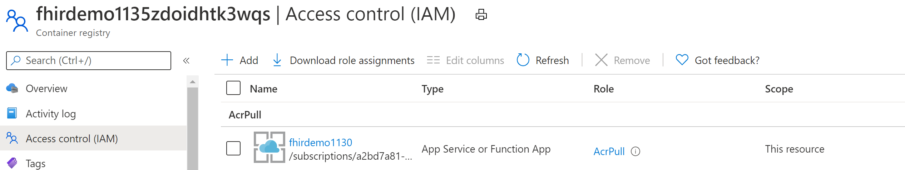
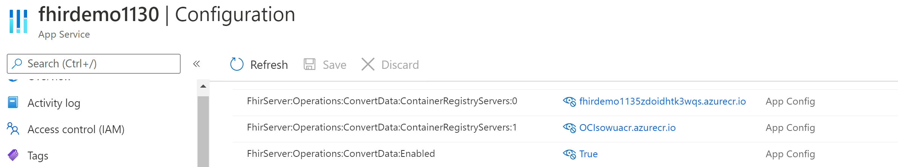

# Convert Data operation

FHIR server implements $convert-data, a custom operation to enable data conversion from legacy formats to FHIR format. Currently it supports HL7v2 to FHIR conversion. It uses the Liquid templating engine and default conversion templates from the [FHIR Converter](https://github.com/microsoft/FHIR-Converter/) project. 

## How to use $convert-data

Follow these steps to setup and use $convert-data API. Rest of this document details these steps. 

1. Ensure that $convert-data is enabled on the FHIR server.
1. Call $convert-data endpoint.
1. Evaluate default templates.
1. Customize templates if needed.
1. Publish custom templates.
1. Make templates accessible to the FHIR Server.
1. Verify.

### 1. Enable $convert-data
You can enable $convert-data while deploying FHIR Server. In order to enable or disable the feature at a later stage, set the `FhirServer__Operations__ConvertData__Enabled` setting in the FHIR server to _true_ or _false_ respectively.

### 2. Make API call
Make a call to ```<<FHIR service base URL>>/$convert-data``` with the [Parameters](http://hl7.org/fhir/parameters.html) resource in the request body as described below:

| Parameter Name      | Description | Accepted values |
| ----------- | ----------- | ----------- |
| inputData      | Data to be converted. | A valid JSON String|
| inputDataType   | Data type of input. | ```HL7v2```, ``Ccda`` |
| templateCollectionReference | Reference to a template collection. It can be the default templates, or an image on Azure Container Registry that the FHIR server can access. | ```microsofthealth/fhirconverter:default``` or ``microsofthealth/hl7v2templates:default`` for input data type ``Hl7v2``, ``microsofthealth/ccdatemplates:default`` for input data type ``C-CDA``, \<RegistryServer\>/\<imageName\>@\<imageDigest\>, \<RegistryServer\>/\<imageName\>:\<imageTag\> |
| rootTemplate | The root template to use while transforming the data. | ```ADT_A01```, ```OML_O21```, ```ORU_R01```, ```VXU_V04``` for input data type ``Hl7v2``, ``CCD`` for input data type ``Ccda`` |

**Sample request:**
```json
{
    "resourceType": "Parameters",
    "parameter": [
        {
            "name": "inputData",
            "valueString": "MSH|^~\\&|SIMHOSP|SFAC|RAPP|RFAC|20200508131015||ADT^A01|517|T|2.3|||AL||44|ASCII\nEVN|A01|20200508131015|||C005^Whittingham^Sylvia^^^Dr^^^DRNBR^PRSNL^^^ORGDR|\nPID|1|3735064194^^^SIMULATOR MRN^MRN|3735064194^^^SIMULATOR MRN^MRN~2021051528^^^NHSNBR^NHSNMBR||Kinmonth^Joanna^Chelsea^^Ms^^CURRENT||19870624000000|F|||89 Transaction House^Handmaiden Street^Wembley^^FV75 4GJ^GBR^HOME||020 3614 5541^HOME|||||||||C^White - Other^^^||||||||\nPD1|||FAMILY PRACTICE^^12345|\nPV1|1|I|OtherWard^MainRoom^Bed 183^Simulated Hospital^^BED^Main Building^4|28b|||C005^Whittingham^Sylvia^^^Dr^^^DRNBR^PRSNL^^^ORGDR|||CAR|||||||||16094728916771313876^^^^visitid||||||||||||||||||||||ARRIVED|||20200508131015||"
        },
        {
            "name": "inputDataType",
            "valueString": "Hl7v2"
        },
        {
            "name": "templateCollectionReference",
            "valueString": "microsofthealth/fhirconverter:default"
        },
        {
            "name": "rootTemplate",
            "valueString": "ADT_A01"
        }
    ]
}
```

**Sample response:**

Note the Content-Type is the response header is set to `text/plain` because the output format is determined by the mapping definition from your templates.

```
{
  "resourceType": "Bundle",
  "type": "transaction",
  "entry": [
    {
      "fullUrl": "urn:uuid:9d697ec3-48c3-3e17-db6a-29a1765e22c6",
      "resource": {
        "resourceType": "Patient",
        "id": "9d697ec3-48c3-3e17-db6a-29a1765e22c6",
        ...
        ...
      "request": {
        "method": "PUT",
        "url": "Location/50becdb5-ff56-56c6-40a1-6d554dca80f0"
      }
    }
  ]
}
```

### 3. Evaluate default templates
When you deploy the FHIR server, a copy of the latest templates released by the [FHIR Converter](https://github.com/microsoft/FHIR-Converter/) project is stored with the FHIR server. We call these **default templates**.

You can use these default templates in the conversion call by passing ```microsofthealth/fhirconverter:default``` in the request payload as described earlier.

⚠ Default templates help you get started quickly. However, as the FHIR Converter project releases new versions of the templates, the default templates on the FHIR Server may change when you upgrade the server. In order to have consistent data conversion behavior across FHIR server versions, you must store your own copy of templates on an Azure Container Registry and use with your API calls as described below.

### 4. Customize templates

You can obtain the latest templates from the [FHIR Converter](https://github.com/microsoft/FHIR-Converter/tree/main/data) github page. Use the FHIR Converter [Visual Studio Code extension](https://marketplace.visualstudio.com/items?itemName=ms-azuretools.vscode-health-fhir-converter) to customize the templates as per your needs. You will first need to install [Visual Studio Code](https://code.visualstudio.com/) if do not have it already.

### 5. Publish your templates to Azure Container Registry (ACR)
The FHIR server can read custom templates from the [ACR](https://azure.microsoft.com/en-us/services/container-registry/). Create a container registry, and use the [Template Management CLI](https://github.com/microsoft/FHIR-Converter/blob/main/docs/TemplateManagementCLI.md) tool to push the customized templates to the ACR.

### 6. Make templates accessible to the FHIR server

There are two steps needed to make the templates accessible to the FHIR server at run time.

a) Provide `AcrPull` permission to your FHIR service on the ACR you created.

&nbsp;


b) Register the ACR on your FHIR server by setting `FhirServer__Operations__ConvertData__ContainerRegistryServers__0` to your ACR login server. You can register multiple ACRs by adding more entries in the configuration as the following picture shows.  

&nbsp;

### 7. Verify

Make a call to the $convert-data API specifying your template reference in the templateCollectionReference parameter. You can use any one of the following two formats to specify the reference. However, we strongly recommend choosing digest because its immutable and stable.

`<RegistryServer>/<imageName>@<imageDigest>`

`<RegistryServer>/<imageName>:<imageTag>` 