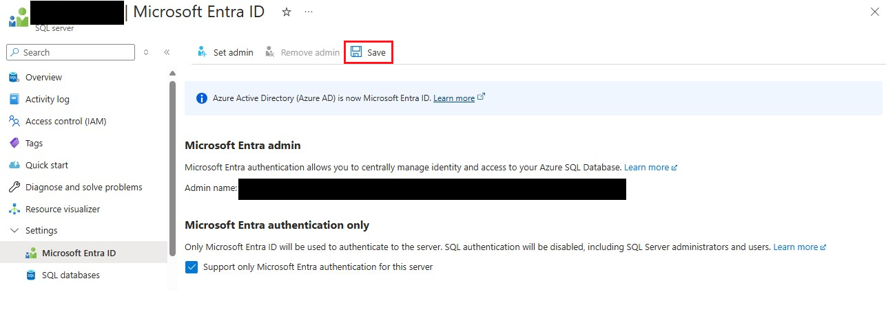

# Connecting to a SQL Database
The procedures for connecting to a SQL database are outlined in this article.

## Active Directory Administrator for SQL Server

The user must set themselves as SQL Server Active Directory Admin when they connect to the database for the first time. 

The actions to do are listed below for it.
*	Access the SQL Server
*	Click on Settings -> Microsoft Entra ID -> Set Admin

*	Choose the User Account

*	Press the "Save" button.


At this point, the user can connect to the database using `Active Directory authentication`.

Create a new user in the database and give them the role `db_owner` after connecting to the database.

The script for the same can be found below: 
```
CREATE USER [user-name] FROM EXTERNAL PROVIDER; 
ALTER ROLE db_owner ADD MEMBER [user-name];
```

Example query
```
CREATE USER [v-test@microsoft.com] FROM EXTERNAL PROVIDER;
ALTER ROLE db_owner ADD MEMBER [v-test@microsoft.com]; 
```

Revert the SQL Server Active directory admin user changes once the user has been created, that is, set the `OSS FHIR Server(App service)` user assigned identity back to SQL Server admin.

This is a `one-time only` activity. The user can utilize an active directory login to connect directly to the database the next time.

## Important Information


During that time, when the `user-assigned identity` assigned to the `OSS FHIR Server(App service)` is removed as the SQL Server admin, 
the App service would degrade since it won't be able to access to the database.

However, the `OSS FHIR Server(App service)` will return to normal once the user-assigned identity is changed back to admin when the user is created in the database.
