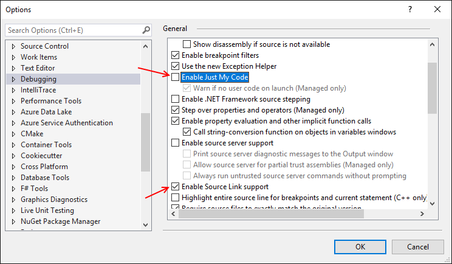
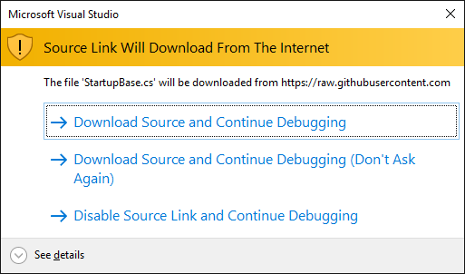

# How to debug

The projects are built with [Source Link](https://github.com/dotnet/sourcelink) enabled and are configured to include PDB files within the NuGet packages themselves. This allows source code files to be downloaded from our GitHub repo directly during debugging process.

## Enable debugging in Visual Studio

To enable debugging in Visual Studio, you need to:

1. Uncheck "Enable Just My Code".
2. Check "Enable Source Link support.

When debugging into the code, Visual Studio will ask to download source code from GitHub.

Click "Download Source and Continue Debugging" to continue.