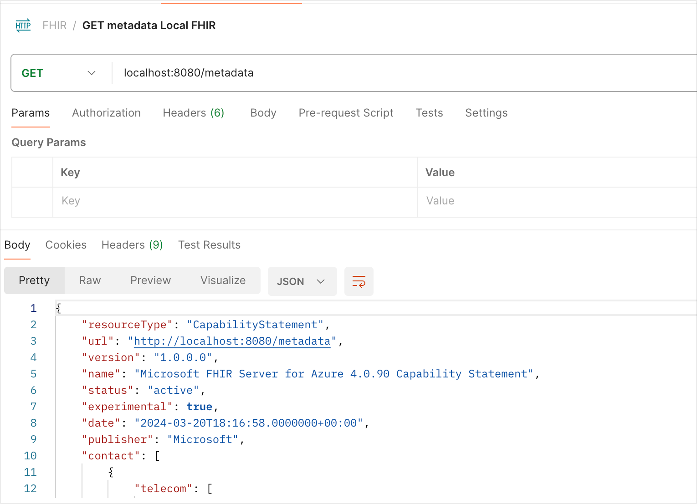

# Running FHIR server locally for development and testing

## Purpose of this document
This document provides guidance on how to set up a local development environment for using the FHIR Server.

We’ll leverage Docker to run the FHIR Server as a local dependency for our application. Whether you’re developing an application that uses the FHIR server or setting up a CI pipeline, this approach ensures consistency and ease of testing.


## Pre-requisites

* [Docker](https://www.docker.com/)


## Steps

1. If you haven’t already, install Docker on your local machine.
1. In the client application create a docker-compose file to run the application and the FHIR server in containers. Detailed sample docker compose is [here](../samples/docker/docker-compose.yaml) with its [instructions](../samples/docker/README.md).
1. Run the docker-compose file to start the application and the FHIR server in containers.
1. Test the application using the FHIR server running in the container.
1. You can use a REST client like Postman to test that the FHIR Server is up ( sample REST call is provided below under resources)

### Resources


#### Sample REST call ( using Postman)

```bash
GET http://localhost:8080/metadata

```



