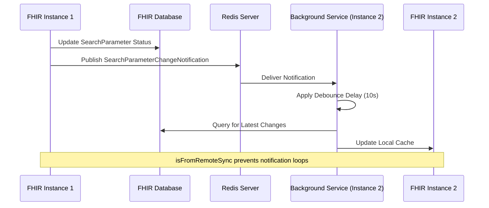

# Search Parameter Status Manager Redis Integration

## Overview

The `SearchParameterStatusManager` uses the FHIR server's Redis notification system to coordinate search parameter changes across multiple server instances. This ensures that when search parameters are added, modified, deleted, or have their status changed on one instance, all other instances are notified and can synchronize their local caches accordingly.

## Integration Architecture

The SearchParameterStatusManager leverages Redis through these key integration points:

1. **IUnifiedNotificationPublisher** - For publishing search parameter change notifications to other instances
2. **NotificationBackgroundService** - For receiving and processing Redis notifications from other instances  
3. **SearchParameterOperations** - For coordinating Redis vs. database polling fallback logic
4. **SearchParameterValidator** - For ensuring cache consistency before validation operations

## Redis Coordination Strategy

### With Redis Enabled

When Redis is enabled, the SearchParameterStatusManager uses a sophisticated coordination approach:

#### Publishing Changes (Local Instance)
```csharp
public async Task UpdateSearchParameterStatusAsync(
    IReadOnlyCollection<string> searchParameterUris, 
    SearchParameterStatus status, 
    CancellationToken cancellationToken)
{
    // 1. Update database first
    await _searchParameterStatusDataStore.UpsertStatuses(searchParameterStatusList, cancellationToken);
    
    // 2. Publish Redis notification to other instances (enableRedisNotification = true)
    await _unifiedPublisher.PublishAsync(new SearchParametersUpdatedNotification(updated), true, cancellationToken);
}
```

#### Receiving Changes (Remote Instances)
```csharp
public async Task ApplySearchParameterStatus(
    IReadOnlyCollection<ResourceSearchParameterStatus> updatedSearchParameterStatus, 
    CancellationToken cancellationToken, 
    bool isFromRemoteSync = false)
{
    // Apply changes to local SearchParameterDefinitionManager cache
    // ...
    
    // Prevent notification loops using isFromRemoteSync flag
    await _unifiedPublisher.PublishAsync(
        new SearchParametersUpdatedNotification(updated), 
        isFromRemoteSync ? false : true,  // Don't Redis-publish if from Redis
        cancellationToken);
}
```

### Without Redis (Fallback Mode)

When Redis is disabled, the system falls back to database polling:

```csharp
// In SearchParameterValidator and SearchParameterOperations
if (!_redisConfiguration.Enabled)
{
    await _searchParameterOperations.GetAndApplySearchParameterUpdates(cancellationToken);
}
```

## Notification Flow

### Search Parameter Change Sequence



### Message Structure

Redis notifications use the `SearchParameterChangeNotification` format:

```csharp
public class SearchParameterChangeNotification
{
    public string InstanceId { get; set; }
    public DateTimeOffset Timestamp { get; set; }
    public SearchParameterChangeType ChangeType { get; set; }
    public IReadOnlyCollection<string> AffectedParameterUris { get; set; }
    public string TriggerSource { get; set; }
}

public enum SearchParameterChangeType
{
    Created,
    Updated, 
    Deleted,
    StatusChanged
}
```

## SearchParameterStatusManager Methods

### Instance Identification

```csharp
public string InstanceId => _unifiedPublisher.InstanceId;
```

The instance ID (typically machine name) is used to:
- Identify the source of notifications
- Prevent processing notifications from the same instance
- Enable debugging and monitoring

### Core Status Update Methods

#### UpdateSearchParameterStatusAsync
Handles direct status changes with Redis coordination:

```csharp
public async Task UpdateSearchParameterStatusAsync(
    IReadOnlyCollection<string> searchParameterUris,
    SearchParameterStatus status, 
    CancellationToken cancellationToken)
{
    // Update in-memory SearchParameterDefinitionManager
    foreach (string uri in searchParameterUris)
    {
        SearchParameterInfo paramInfo = _searchParameterDefinitionManager.GetSearchParameter(uri);
        paramInfo.IsSearchable = status == SearchParameterStatus.Enabled;
        paramInfo.IsSupported = status == SearchParameterStatus.Supported || status == SearchParameterStatus.Enabled;
    }

    // Persist to database
    await _searchParameterStatusDataStore.UpsertStatuses(searchParameterStatusList, cancellationToken);
    
    // Publish to Redis - other instances will receive this
    await _unifiedPublisher.PublishAsync(new SearchParametersUpdatedNotification(updated), true, cancellationToken);
}
```

#### ApplySearchParameterStatus
Processes updates from other instances (via Redis):

```csharp
public async Task ApplySearchParameterStatus(
    IReadOnlyCollection<ResourceSearchParameterStatus> updatedSearchParameterStatus,
    CancellationToken cancellationToken,
    bool isFromRemoteSync = false)
{
    var updated = new List<SearchParameterInfo>();

    // Apply changes to local SearchParameterDefinitionManager
    foreach (var paramStatus in updatedSearchParameterStatus)
    {
        if (_searchParameterDefinitionManager.TryGetSearchParameter(paramStatus.Uri.OriginalString, out var param))
        {
            var tempStatus = EvaluateSearchParamStatus(paramStatus);
            param.IsSearchable = tempStatus.IsSearchable;
            param.IsSupported = tempStatus.IsSupported;
            param.IsPartiallySupported = tempStatus.IsPartiallySupported;
            param.SortStatus = paramStatus.SortStatus;
            param.SearchParameterStatus = paramStatus.Status;
            updated.Add(param);
        }
    }

    // Sync local tracking
    _searchParameterStatusDataStore.SyncStatuses(updatedSearchParameterStatus);
    _latestSearchParams = updatedSearchParameterStatus.Select(p => p.LastUpdated).Max();
    
    // Publish locally only if NOT from Redis to prevent loops
    await _unifiedPublisher.PublishAsync(
        new SearchParametersUpdatedNotification(updated),
        isFromRemoteSync ? false : true,  // Key loop prevention logic
        cancellationToken);
}
```

### Synchronization Methods

#### GetSearchParameterStatusUpdates
Used by background services to fetch changes from the database:

```csharp
public async Task<IReadOnlyCollection<ResourceSearchParameterStatus>> GetSearchParameterStatusUpdates(CancellationToken cancellationToken)
{
    var searchParamStatus = await _searchParameterStatusDataStore.GetSearchParameterStatuses(cancellationToken);
    return searchParamStatus.Where(p => p.LastUpdated > _latestSearchParams).ToList();
}
```

## Loop Prevention Strategy

### The isFromRemoteSync Pattern

The system uses a boolean flag to prevent infinite notification loops:

```csharp
// When processing Redis notifications in NotificationBackgroundService
await searchParameterOperations.GetAndApplySearchParameterUpdates(cancellationToken, true); // isFromRemoteSync = true

// In ApplySearchParameterStatus method
await _unifiedPublisher.PublishAsync(
    new SearchParametersUpdatedNotification(updated), 
    isFromRemoteSync ? false : true,  // Don't Redis-publish if from Redis
    cancellationToken);
```

### Flow Analysis:

1. **Instance A** makes local change ? publishes to Redis (`isFromRemoteSync = false`)
2. **Instance B** receives Redis notification ? processes with `isFromRemoteSync = true`  
3. **Instance B** publishes locally only (no Redis) ? no loop created

## Debouncing and Background Processing

### NotificationBackgroundService Integration

The background service handles Redis notifications with intelligent debouncing:

```csharp
private async Task HandleSearchParameterChangeNotification(
    SearchParameterChangeNotification notification,
    CancellationToken cancellationToken)
{
    _logger.LogInformation(
        "Received search parameter change notification from instance {InstanceId} at {Timestamp}. ChangeType: {ChangeType}",
        notification.InstanceId,
        notification.Timestamp, 
        notification.ChangeType);

    // Check if processing is currently happening
    if (!await _processingGate.WaitAsync(0, cancellationToken))
    {
        // Queue this notification by setting flag and updating delay token
        _isProcessingQueued = true;
        // Cancel only the delay, not the active processing
        lock (_delayLock)
        {
            _ = _currentDelayTokenSource?.CancelAsync();
            _currentDelayTokenSource?.Dispose();
            _currentDelayTokenSource = CancellationTokenSource.CreateLinkedTokenSource(cancellationToken);
        }
        return;
    }

    try
    {
        await ProcessWithDebounceAndQueue(cancellationToken);
    }
    finally
    {
        _processingGate.Release();
    }
}
```

### Debouncing Logic Benefits

1. **Configurable Delay**: Default 10-second delay (`SearchParameterNotificationDelayMs`) batches rapid changes
2. **Database Load Reduction**: Multiple notifications result in single database query
3. **Network Efficiency**: Fewer Redis messages during burst operations  
4. **Processing Efficiency**: Single update cycle handles multiple related changes

## Configuration Settings

### Redis Configuration for Search Parameters

```json
{
  "Redis": {
    "Enabled": true,
    "ConnectionString": "localhost:6379",
    "SearchParameterNotificationDelayMs": 10000,
    "NotificationChannels": {
      "SearchParameterUpdates": "fhir:notifications:searchparameters"
    }
  }
}
```

**Key Settings:**
- **`SearchParameterNotificationDelayMs`**: Debounce delay for batching notifications
- **`SearchParameterUpdates`**: Redis channel specifically for search parameter changes

## Error Handling

### Redis Unavailability

When Redis is unavailable, the SearchParameterStatusManager gracefully degrades:

1. **Publishing Failures**: Fall back to local MediatR notifications only
2. **Subscription Failures**: Continue with database polling mode
3. **Processing Errors**: Log errors and continue with next notification

### SearchParameterNotSupportedException Handling

```csharp
catch (SearchParameterNotSupportedException ex)
{
    _logger.LogError(ex, "The search parameter '{Uri}' not supported.", uri);
    
    // Use flag to ignore exception and continue processing other parameters
    if (!ignoreSearchParameterNotSupportedException)
    {
        throw;
    }
}
```

This allows bulk operations to continue processing valid parameters even if some are invalid.

## Performance Considerations

### Memory Management

- **Efficient Queuing**: Boolean flag instead of queue data structures
- **Automatic Cleanup**: Background service properly disposes resources  
- **Bounded Processing**: Semaphore prevents concurrent processing overlap

### Database Optimization

- **Batched Updates**: 10-second debounce reduces database query frequency
- **Incremental Sync**: Only processes parameters changed since last sync
- **Optimistic Concurrency**: LastUpdated timestamps prevent conflicts

### Scalability Features

- **Per-URI Granularity**: Different search parameters can be processed concurrently
- **Instance Coordination**: No conflicts between multiple FHIR server instances
- **Fallback Resilience**: System continues operating without Redis

## Monitoring and Diagnostics

### Key Logging Events

```csharp
// Status updates
_logger.LogInformation("Setting the search parameter status of '{Uri}' to '{NewStatus}'", uri, status);

// Redis notifications
_logger.LogInformation("Received search parameter change notification from instance {InstanceId} at {Timestamp}. ChangeType: {ChangeType}");

// Background processing
_logger.LogInformation("Successfully applied search parameter updates.");
```

### Metrics to Monitor

- **Notification Volume**: Number of search parameter change notifications received
- **Processing Latency**: Time from Redis notification to local cache update
- **Debounce Effectiveness**: Ratio of batched vs. individual updates
- **Error Rates**: Failed notifications or processing errors
- **Cache Consistency**: Search parameter hash comparisons across instances

## Troubleshooting

### Common Issues

1. **Delayed Synchronization**:
   - Check `SearchParameterNotificationDelayMs` setting
   - Verify Redis connectivity and channel subscriptions
   - Monitor background service processing logs

2. **Inconsistent Cache States**:
   - Verify `isFromRemoteSync` flag usage in logs
   - Check for notification loop patterns
   - Compare search parameter statuses across instances

3. **Performance Issues**:
   - Analyze debounce delay appropriateness for change frequency
   - Monitor database query patterns
   - Review Redis message volume and processing times

### Diagnostic Steps

1. **Enable Detailed Logging**:
   ```json
   "Logging": {
     "LogLevel": {
       "Microsoft.Health.Fhir.Core.Features.Search.Registry.SearchParameterStatusManager": "Information",
       "Microsoft.Health.Fhir.Core.Features.Notifications.NotificationBackgroundService": "Debug"
     }
   }
   ```

2. **Monitor Redis Activity**:
   ```bash
   redis-cli monitor
   # Look for fhir:notifications:searchparameters messages
   ```

3. **Verify Instance Coordination**:
   - Check instance IDs in logs
   - Compare search parameter hash values across instances
   - Monitor notification timestamps and processing delays

This Redis integration enables the SearchParameterStatusManager to provide robust, real-time coordination of search parameter changes across distributed FHIR server deployments while maintaining high availability through intelligent fallback mechanisms.
