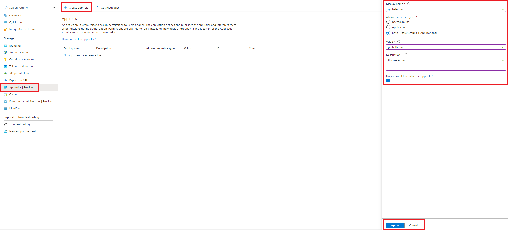

# Register a resource application in Azure Active Directory

In this article, you'll learn how to register a resource (or API) application in Azure Active Directory (Azure AD). A resource application is an Azure AD representation of the FHIR server API itself and client applications can request access to the resource when authenticating. The resource application is also known as the *audience* in OAuth parlance. 

If you are using the open source FHIR Server for Azure, follow the steps below to register a resource application. to learn more about application registration in general, review the Azure API for FHIR documentation on [registering applications](https://docs.microsoft.com/azure/healthcare-apis/fhir-app-registration).

## Prerequisites

To register a resource application in Azure AD, you must have either of the following Azure role-based access control (Azure RBAC) roles:

- [Application Administrator](https://docs.microsoft.com/azure/active-directory/roles/permissions-reference#application-administrator) 
- [Application Developer](https://docs.microsoft.com/azure/active-directory/roles/permissions-reference#application-developer)

For more information about the different type of Azure AD built-in roles, see [Azure AD built-in roles](https://docs.microsoft.com/azure/active-directory/roles/permissions-reference). 

## App registrations in Azure portal

1. In the [Azure portal](https://portal.azure.com), on the left navigation panel, select **Azure Active Directory**.

2. In the **Azure Active Directory** blade, select **App registrations**.

    

3. Select the **New registration**.

## Add a new application registration

Fill in the details for the new application. There are no specific requirements for the display name, but setting it to the URI of the FHIR server makes it easy to find:


### Set identifier URI and define scopes

A resource application has an identifier URI (Application ID URI), which clients can use when requesting access to the resource. This value will populate the `aud` claim of the access token. It is recommended that you set this URI to be the URI of your FHIR server. For SMART on FHIR apps, it is assumed that the *audience* is the URI of the FHIR server.

1. Select **Expose an API**.

2. Select **Set** next to *Application ID URI*.

3. Enter the identifier URI, and then select **Save**. A good identifier URI would be the URI of your FHIR server.

4. Select **Add a scope** and add any scopes that you would like to define for your API. You are required to add at least one scope in order to grant permissions to your resource application in the future. If you don't have any specific scopes you want to add, you can add user_impersonation as a scope.


### Define application roles

The Azure API for FHIR and the OSS FHIR Server for Azure use [Azure Active Directory application roles](https://docs.microsoft.com/azure/architecture/multitenant-identity/app-roles) for role-based access control. To define which roles should be available for your FHIR Server API, you can edit the resource application's [manifest](https://docs.microsoft.com/azure/active-directory/active-directory-application-manifest/) or add App roles from the portal. To add app roles from the portal

1. Select **App roles | Preview**.
1. Select **Create app role**.
1. Add the details from the [roles](https://github.com/microsoft/fhir-server/blob/main/src/Microsoft.Health.Fhir.Shared.Web/roles.json) file. This includes globalAdmin, globalWriter, globalReader, and globalExporter. Select Both fo Allowed member types.



If you want to update the manifest, see the details below:
```json
    "appRoles": [
		{
			"allowedMemberTypes": [
				"User",
				"Application"
			],
			"description": "fhir oss admin",
			"displayName": "globalAdmin",
			"id": "ba852bf0-43e3-46f4-88ec-5ce70f5fb6dd",
			"isEnabled": true,
			"value": "globalAdmin"
		},
		{
			"allowedMemberTypes": [
				"User",
				"Application"
			],
			"description": "fhir oss writer",
			"displayName": "globalWriter",
			"id": "07fed378-c437-418a-97ca-8a7962abd6d6",
			"isEnabled": true,
			"value": "globalWriter"
		},
        		{
			"allowedMemberTypes": [
				"User",
				"Application"
			],
			"description": "fhir oss reader",
			"displayName": "globalReader",
			"id": "ed289d3c-3588-4469-914e-79c6cdb0f6e2",
			"isEnabled": true,
			"value": "globalReader"
		},
		{
			"allowedMemberTypes": [
				"User",
				"Application"
			],
			"description": "fhir oss exporter",
			"displayName": "globalExporter",
			"id": "fbf16161-ddf3-42a7-8607-758a3660afe1",
			"isEnabled": true,
			"value": "globalExporter"
		}
	],
```

When "User" is specified for the allowedMemberTypes property, the defined roles are available to assign to users and groups. When  "Application" is specified for the allowedMemberTypes property, the roles are available to assign to service principals.
