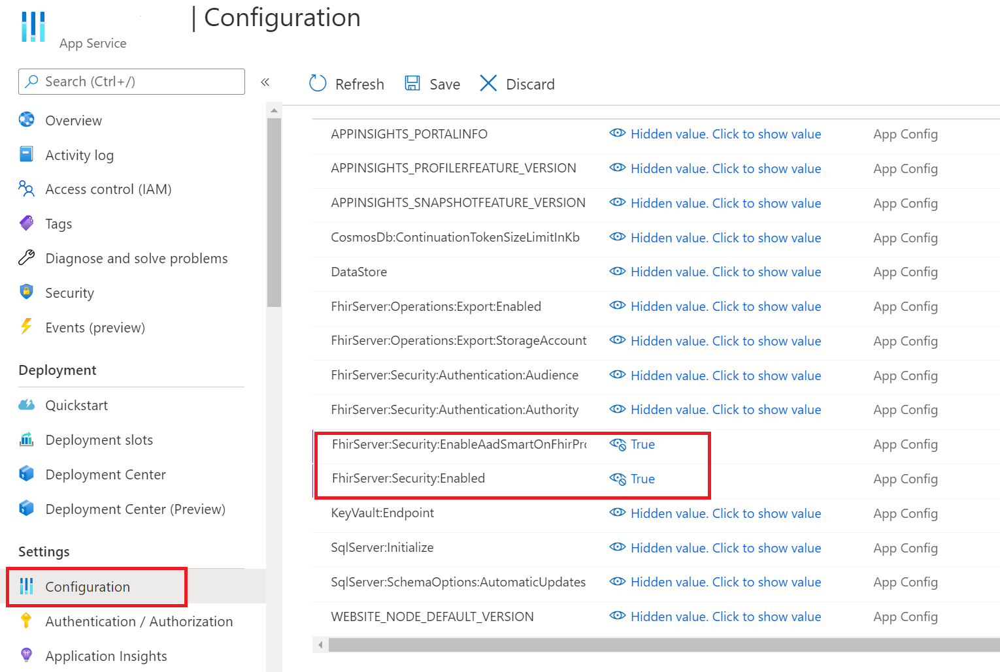
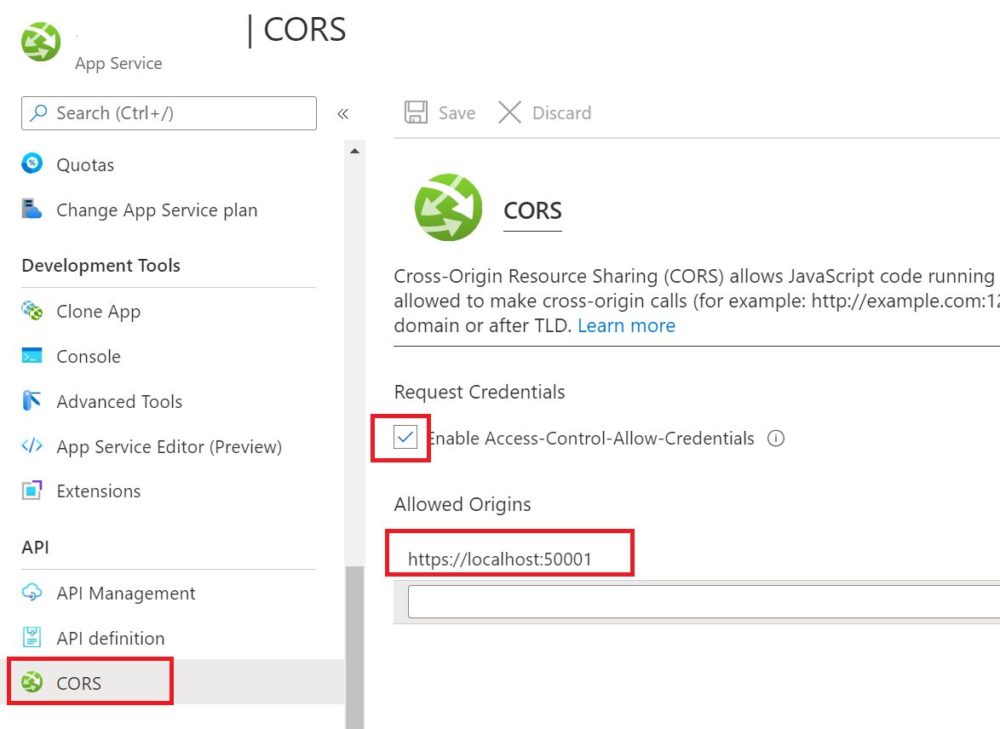

[SMART on FHIR](https://docs.smarthealthit.org/) is a set of open specifications to integrate partner applications with FHIR servers and electronic medical records systems that have FHIR interfaces. 

There is a tutorial on the managed service documentation that describes how to use the proxy to enable SMART on FHIR applications with the Azure API for FHIR. You can follow the [steps](https://docs.microsoft.com/azure/healthcare-apis/use-smart-on-fhir-proxy) for the open-source FHIR Server as well but need to configure a few settings in a different way first. 

# Initial open-source steps
The first step is to make updates/validate settings for your app service. Navigate to the App Service that was greated as part of the deployment,

# Enable the SMART on FHIR proxy
1. Select **Configuration** under Settings
1. Set FhirServer:Security:EnableAadSmartOnFhirProxy and FhirServer:Security:Enabled to **True**.

## Enable CORS

1. Under API select **CORS**
1. Select "Enable Access-Control-Allow-Credentials" 
1. Add your application url.

# Tutorial

Now that you have ensured that you have right settings, you can follow the steps for the managed service tutorial starting at the [**Configure the reply URL**](https://docs.microsoft.com/azure/healthcare-apis/use-smart-on-fhir-proxy#configure-the-reply-url) step.

# Troubleshoot the App

If your SMART on FHIR sample does not return data as expected, you can check the following:
* the permissions or roles have been granted to the public client app
* the SMART on FHIR proxy has been enabled
* the CORS values has been configured
* the scopes for the application registration for the server have been defined
* API permissions have been granted to the public client application

You can use the free tool [Fiddler](https://www.telerik.com/fiddler) and filter the network traffic and examine the detail for each request and response. For example, you can specify filters to allow only traffic for the localhost and your OSS FHIR Server, xxx.azurewebsites.net.
