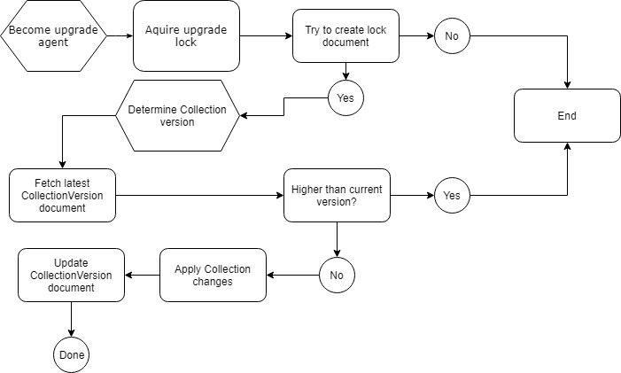
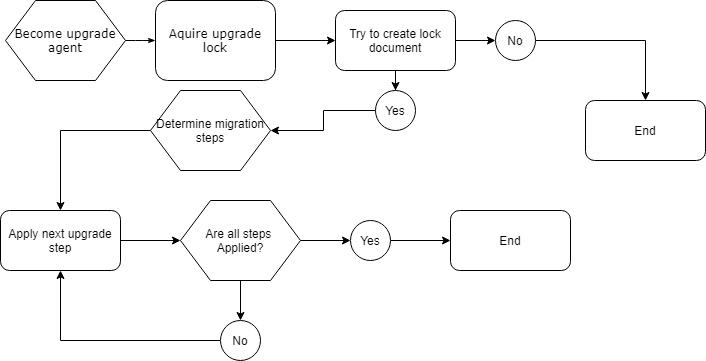

# Collection Versioning

## CollectionVersion document

As doing diffs against a schema (collection indexes and settings) at runtime, which can be time-consuming and potentially erroneous, a CollectionVersion document will be introduced to ensure we can deterministically perform upgrades to indexes and data when required. 

The ethos of the migrations is very much to maintain both backwards compatibility and the ability to run both the previous and current version of the code simultaneously. This is important to the rolling/monitored upgrade strategy. 

Actions that should be accounted for:

- Changes to index policy
- Changes to other Collection settings (i.e. Default TTL)

Example of the collection version document. There is only one collection version document which is updated by the update process is subsequent application versions.

```
{
    "id": "collectionversion",
    "version": 1,
    "Updated": "2018-07-16T21:19:33.3375273+00:00",
    "partitionKey": "_collectionVersions",
    "isSystem": true
}
```

### Data Migration

The concept of data migration is important to maintain the health and accuracy of the data in the system. Data Migration actions will run in the background as an async update operation built on the CosmosDB Bulk Execution API.

Examples that may require Data Migrations:

- Changes to semantic behavior within schema (i.e. introducing "system" documents with the `.isSystem` property. Changes to document versioning (from etag to numeric))
- Changes to data structures
- Changes that require re-indexing

Data Migration steps are programmatic and contained within the CosmosDb data provider library. The application will resolve Migration steps and determine which steps need to be run by querying for the status of these migrations persisted in the Db. The steps are designed to be idempotent such that the query for data to be migrated that is provided by the step will return only items that need action. This ensures that is a background process is terminated or other factors occur the steps can easily be resumed.

Steps are ordered, such that once step "A" is completed step "B" will be executed in order, until all migrations are completed. At this point the background task will exit.

Each step will persist its own status document "MigrationStep" which contains basic meta and execution status.

```
{
    "id": "datamigration_V001UpdateVersionProperty",
    "name": "V001UpdateVersionProperty"
    "started": "2018-07-09T00:00.00",
    "completed": "2018-07-09T00:00.00",
    "status": "pending",
    "isSystem": true,
    "partitionKey": "_dataMigrations"
}
```

## Handling multi-node concurrency

Given that the FHIR server may be running in a cluster or multi-node environment, each instance of the application should attempt to gain a lease (a CosmosDb Document with a TTL) to be able to make updates if required. The lease should be per-collection-version for collection upgrades and singleton for data migrations.

## What do other instances do when the primary is upgrading / upgrade in progress?

- Index or data changes
  - Kick off an async background task to process the data
  - Features may need to detect if they are ready to be activated based on the state of the upgrade to avoid unpredictable results (i.e. searching on a field that hasn't finished indexing)
  - Monitoring cosmosdb's index rebuild process may also be required for some features to work properly on instances with large datasets

## Collection Updates Workflow 



## Migration Updates Workflow 



[Edit diagrams](https://www.draw.io/?title=draw-io%20Upgrade%20Steps%20Diagram.xml#R%3Cmxfile%3E%3Cdiagram%20name%3D%22Page-1%22%20id%3D%228ce9d11a-91a2-4d17-14d8-a56ed91bf033%22%3E7VrLdts2EP0aLZtD8CVpadlWsmh7co7TJF7CJEyihggWBC0pXx%2BABJ%2BgbMqCRC3qjYHBe%2BbemQGomXO72X1mMI3%2FoiEiM9sKdzPnbmbbwLV98U9K9qVk4VqlIGI4VJ0awQP%2BhZSw6pbjEGWdjpxSwnHaFQY0SVDAOzLIGN12uz1T0l01hRHSBA8BJLr0Bw55rKTAspqGLwhHsVp64amGJxi8RIzmiVpvZjvPxV%2FZvIHVXKp%2FFsOQblsi537m3DJKeVna7G4Rkbqt1FaOWx9orffNUMJHDZgj6PtzBLzAFlsN%2FrAXamN8XykDhUI3qkoZj2lEE0juG%2BmqODCSUwJRi%2FmGqCKBT4isap3cUkKZaEpoIodlHDJ%2BI83Vk60xkTNYVV0BxBN1lITViIDALMPBtxgnZYMaBspaa9C%2FiPO9qsOcUyFqDvInpakalXFGX1C1S2E7q%2FirWyosyL7PNOFruMFEQvw7YiFMoBKrlRaqOjSfbidluozmLEAHjFNRAbII8UMGLPtIo7UmVtb%2FjOgGcbYXHRgikOPXLuCh4k1U92uwIwoKPiOhpOZ8hSRXq6xQIOYVsjyNGAxlSRBJaMD2iTjP6omJUsRr%2FbRAKIiSymKMdlCYTXRJEcNik4g10q%2BNaLWNMUcPKSyUuRVuqovMBrKFeSsaWiNAewRGBCBbPZUnGIMdYL8BHkhwlEgCCNUVZz2IplfEONq9iQPV6iiHpBy2r6rblverfFbcdnzW6cBZnuRxrK5d0Q7zn63yo%2Bzy6Rgn8DFq2jo1r4eJtsbEm%2F9yzLpMJDR40SzR9ezvcOp%2FFoHFdDSan4NGJXUqIgHTNBpgjTsVa05LfEa7IaEOtv%2BpRhSVM7moAd16U%2BlWd0DfioXEEUUSzxDkjQeyQhrkmyIrOMUZmYiJfpfN85Fs9g2wGQDt%2BCbo%2FOGoWMMW6LAdBUd3IHc1znU19CvFEj5NbtO1I1j2DFRuSo3q2ajexiizuRrQH8U9VrMkIeImi94HMczS8nr7jHfSriZQ7fa14emwdgdQ7RpAdeUIDKG6dqWNZ31U3Yy6Uk%2FHbtXt8r7U0yD2N70uhHl2F2GLywEMOJdxm2eFXsdHGr9FDPvIfuaq%2BciSDyZ8JPA1BJs0mtl73kAWBSZLo6rdtDS3RjyIZe4kUqhM2lNcdYhgNKaJuBJl4t81ZVRuF2T2QOg5X0Zl9p3hUrEHDAQfsJgKgfW7tWElnvkuNKjE%2BWQ01kP4F4F1xOQOYygZG%2BSsOFBBroLFznpy9jrelPTVU%2Bs7%2BdS7wQnquL2WzvoKO%2B4R2T72FTmSHyRUOSuRa30Cb96Qjnha8t9P28FQWmXibck2m1Yd8J3mo%2Fdcp%2F10iXu1m2u%2BHPZT96EXzHPl7s5ZXuDeyN0HnjKOg18PQ%2B%2FjcaHj0ZlfCn4LDX7XdnF0ll30OZd8mtA%2FV94n4eQx1wc9tz%2F2k4KJmOuazfaukJHOQIRwlhdipKMHhJs0Jft%2BOhOInDAaiBQfwKIGvAENHcSi3cOi414Si0YfCcxd345G3FJHnHupFKRavIW4f9Kw%2FPpy7oeDk6DnTYk8PTLcya%2FYpkPnSQrqRU53QEGGIqeoNr9PK5%2F%2Fmh8BOve%2FAQ%3D%3D%3C%2Fdiagram%3E%3Cdiagram%20id%3D%226ff9e5ed-0c65-d6d7-a04b-0227d28a4140%22%20name%3D%22Page-2%22%3E7Vrfc5s4EP5r%2FHqDBLbpY50m14e7m86k0yaPCiigi0CcLNdO%2F%2FpKsDIWIg1psIk75xeLRT9W33672pU9Cy%2BK3Z%2BSVPnfIqV8hoN0Nws%2FzDBGEV7oLyN5bCRxFDSCTLIUOrWCa%2FadgtB227CUrp2OSgiuWOUKE1GWNFGOjEgptm63e8HdVSuSUU9wnRDuS7%2ByVOWwi3nQyj9SluV2ZRTAmzuSPGRSbEpYb4bD%2B%2FrTvC6InQv6r3OSiu2BKLychRdSCNW0it0F5QZbC1sz7uqJt3u9JS3VkAEY1FCPdus01UjAo5AqF5koCb9spat6e9RMEOinXBVcN5Fu6jXl442R%2FzG3j7fQ7V%2Bq1CMYmmyU0KJ29r%2BEqGCORh%2BjhLOjtdjIBEQhEILIjMIm5%2F6%2B0R5NzVIqCqqV0V0k5USxb%2B7sBOiS7fu1kOkGoNaPIGjzjfANTPqBKioLVlJjcJZJvZ4oa5Cppm8Xb82AyjRzuiMaDA1BRSUrzByt9JMV6S2ttjlT9LoiNR5b7YCuFVzzZJys19AGTalUdPckX57AzQ5YAtTg2Mi6xLZ1E2TJnR%2B4SBy8HupoVLLumLo5aN%2B6vL2BES2J63cj0nju0ziejsZzj8bvq4qbpUq6U%2FprU2kmpxR47FmixRk9T9ERiIhdHuLlQB4uRuDh4gyDZuyzDQWDQR%2BdbsvfypX7wMXTgRv7viyN45K6FxxD2vgLrhVb3UndykzLeDwzAF%2Bd%2BSmFg050WJzwlHp3DGoHP6G2GzfQuNS2QeKNZFtWnQNu%2FyN8wDnXlQJ9noVkXTXlwz3bGfhHIV%2Fkki%2BMffJFPdyLRuAeQj4WZxxXbRB1Ams4Ifuwx75b6qf0k9Iv7GTo%2BJT084uhS10JT50rRl1ITpksotdVLchFg5M7ylf7S4YLwYU5gEtRmmFr7Sjqvbn%2F6MiumNGv9tb6GdyzceXUjkjMKcySzzkrmxcwrElT04NBQ318raR4oFbLGQ6D%2BrN%2FYy9XTN97UaorUjBurPSFypSUBMSwUgyPffMNiSY9FRdaThhN%2FJprRRM9j1Ntkcwo5uVqr8zQXpqg7e%2BpggEkfIHNNcEOesJV2RAuIPwTMhDOstIQWkNX73WMuBo4MeSUGSUat%2BB88lQf8%2BRe%2Br6GJ6w3rT6HNdF%2FGyZdX%2BMieXjdafW%2Fn6B4QkeJj%2BEokPKCq4xcX%2BGe%2BgpPeHeAjlK%2BTlZB9MIbTQcv9uvXz%2FVKepc4SCQlqg1EQSqSTVEf%2FxNn0OHCdepTJtD4KDWtf6EylHV75iKfuUMY2VPTHqGkhaGfBDP0aZMY147oXcdAjVYwqmOjvRrDzHYGtXLUhaPn16xj1crW6Gf1K4INnU44XUwYTiOPZG%2FtOnCOXY6d8DrGWuaNXccsUMfrhqaIv3Ca6Mf2zxRNFGv%2FsRJe%2FgA%3D%3C%2Fdiagram%3E%3C%2Fmxfile%3E)