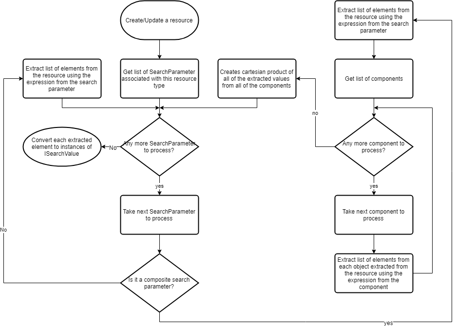

# Search architecture and implementation

This document attempts to describe how search is implemented for the FHIR service.

Search functionality consists of three areas:

- [Extraction](#Extraction)
- [Persistence](#Persistence)
- [Search](#Search)

## Extraction

Because the searchable value can be mapped to any arbitrary property within the resource and the property could be a single value or a list of values, the first step is to extract these searchable values out of the resource. To do that, we use the FHIR Path and the expression defined in the search parameter definition file.

These searchable values are in various types. To make persistence and search easy, they will be converted to types that implement a common `ISearchValue` interface, which will be described in more detail in [Normalized search value type](#Normalized-search-value-type) section.

### Normalized search value type

Each search parameter type has its own type that implements the `ISearchValue` interface and its responsibility is to normalize the value so that it can be stored using different persistence layers and it can be searched efficiently.

#### CompositeSearchValue

`CompositeSearchValue` simply contains a list of `ISearchValue`. This is because each component of the composite search value could be any search parameter type.

For example, the `code-value-concept` of the `Observation` resource is a composite search parameter with the first component being a token search value and the second component being a `CodeableConcept`, which is a list of token search values. On the other hand, the `coordinate` of the `Sequence` resource is a composite search parameter with the first component being a `CodeableConcept`, which is a list of token search values, and the second and third components being integers.

#### DateTimeSearchValue

Because FHIR supports partial dates, all date and time will be normalized into start and end date. Missing portion of the date and time will be populated automatically.

For example, '2018-05' will be populated with start date being '2018-05-01T00:00:00.0000000Z' and end date being '2018-05-31T23:59:59.9999999Z'. '2017-03-01' will be populated with start date being '2017-03-01T00:00:00.0000000Z' and end date being '2017-03-01T23:59:59.9999999Z'.

#### NumberSearchValue

Number value will be stored as decimal value.

#### QuantitySearchValue

System and code will be stored as string values and quantity value will be stored as decimal.

#### ReferenceSearchValue

The resource could contain a reference represented by a relative URL (e.g., Patient/123) or an absolute URL (e.g., <http://example.com/Patient/123>). An absolute URL could be either referencing a "external" resource (e.g., resource that exists on an external system) or referencing a "internal" resource (e.g., resource that exist within the current system). This can be determined by matching the service base URL.

The reference can be searched in 3 ways: id, type/id, or url. The following examples illustrate how the search should behave based on the data stored and the search criteria.

Assuming our service is running at http://xyz.com/ and we have the following references stored:

1. Patient/123
2. <http://xyz.com/Patient/123>
3. <http://abc.com/Patient/123>
4. Device/123

_Theoretically, #1 and #2 are equivalent since they are both referencing the same internal resource. They are both valid references. The advantage/disadvantage is discussed [here](http://hl7.org/fhir/stu3/references.html#literal)._

|Search value                |Matches   |Comment|
|----------------------------|----------|-------|
|abc                         |          |It does not match to anything.|
|123                         |1, 2, 3, 4|The resource id needs to match.|
|Patient/123                 |1, 2, 3   |The resource type and resource id need to match.
|<http://xyz.com/Patient/123>|1, 2      |Since this is an absolute URL with the service base URL matching the current server, it will match internal reference both stored in relative URL format as well as absolute URL format.|
|<http://abc.com/Patient/123>|3         |Since this is an absolute URL pointing to an external resource, it will only match that reference.|

In order to support this, we need to parse the reference into multiple parts so that they can be searched efficiently. The parsing is using a modified regular expression based on the [published version](http://hl7.org/fhir/stu3/references.html#literal).

Using the examples above:

|Reference value             |Kind              |BaseUri          |ReferenceType|ResourceId|Comment|
|----------------------------|------------------|-----------------|-------------|----------|-------|
|Patient/123                 |InternalOrExternal|                 |Patient      |123       |       |
|<http://xyz.com/Patient/123>|Internal          |                 |Patient      |123       |Because the service base URL matches the current server, the BaseUri will not be populated to indicate that this is an internal reference. The Kind will be Internal so that we don't match resources that exists on another server.|
|<http://abc.com/Patient/123>|External          |<http://abc.com/>|Patient      |123       |       |
|Device/123                  |InternalOrExternal|                 |Device       |123       |       |

_One thing to note is that with this approach if the service base URL changes (e.g., change in the domain name) and there is an internal reference with absolute URL using the old domain name, then the search using the absolute URL with the new service base URL will find resources that contains the absolute URL with the old domain name._

#### StringSearchValue

String value will be stored as is.

#### TokenSearchValue

System, code, and text will be stored as string values.

#### UriSearchValue

The Uri will be stored as string value.

### Search parameter definition

The FHIR service has a built-in search parameter definition file, which is a `Bundle` resource containing `SearchParameter` resources describing all supported search parameters. During the startup, this file is parsed and validated by `SearchParameterDefinitionManager`, which will provide mechanisms to access these search parameter definitions.

The validation ensures the following conditions are met:

- All of the resources within the bundle are not null and are `SearchParameter` resource.
- For each of the `SearchParameter` resources:
  - The type property is not null.
  - If the type is composite search type, then:
    - There is at least one component defined.
    - For each component:
      - The definition URL for the component exists.
      - The definition URL points to a valid search parameter.
      - The component is not a composite search parameter type.
      - The component expression is not empty.
  - There is at least one base element defined.
  - For each base element:
    - The resource type is defined.
    - If the resource + expression is known to have empty expression (e.g., _text or _content search parameter will not have expression defined), then expression should not be empty.

Once the bundle is validated, then the search parameter definition will be cached for lookup use.

#### Search parameter definition file

The search parameter definition file bundled with the code is the [published STU3 version](http://hl7.org/fhir/STU3/downloads.html).

It has been customized to include a fix that addresses the issue described [here](http://community.fhir.org/t/invalid-reference-url-in-search-parmaeter-definition/926).

However, it does not address the issue described [here](http://community.fhir.org/t/expression-seems-incorrect-for-reference-search-parameter-thats-only-applicable-to-certain-types/916) since resolve() does not seem to be supported with the STU3 .NET library, which is being tracked [here](https://github.com/ewoutkramer/fhir-net-api/issues/679). The logic to resolve the right reference type is implemented in the code.

### Converting from FHIR element to ISearchValue

To convert from FHIR element to `ISearchValue` type, various converters have been implemented to handle the conversion.

The current list of supported converters are:

|FHIR element type|ISearchValue Type   |
|-----------------|--------------------|
|Address          |StringSearchValue   |
|CodeableConcept  |TokenSearchValue    |
|Code&lt;T&gt;    |TokenSearchValue    |
|Code             |TokenSearchValue    |
|ContactPoint     |TokenSearchValue    |
|Date             |DateTimeSearchValue |
|FhirBoolean      |TokenSearchValue    |
|FhirDateTime     |DateTimeSearchValue |
|FhirDecimal      |NumberSearchValue   |
|FhirString       |StringSearchValue   |
|FhirUri          |UriSearchValue      |
|HumanName        |StringSearchValue   |
|Identifier       |TokenSearchValue    |
|Id               |TokenSearchValue    |
|Instant          |DateTimeSearchValue |
|Integer          |NumberSearchValue   |
|Markdown         |StringSearchValue   |
|Oid              |TokenSearchValue    |
|Period           |DateTimeSearchValue |
|PositiveInt      |TokenSearchValue    |
|Quantity         |QuantitySearchValue |
|ResourceReference|ReferenceSearchValue|
|SimpleQuantity   |QuantitySearchValue |
|UnsignedInt      |NumberSearchValue   |

If the converter does not exist, the server will write a warning message instead of failing the request.

During the startup, the list of FHIR element type converter mapping is registered with `FhirElementTypeConverterManager`, which can be used to lookup the type converter from a given FHIR element type.

### Extraction process

`SearchIndexer` does all of the job of extraction process.



Each FHIR element could produce multiple `ISearchValue` instances. This is because some FHIR element type such as `CodeableConcept` is a list of `Coding`.

## Persistence

For Cosmos DB, the search values will be persisted separately from the original resource in an array format so that search can be done efficiently.

The following is an example of what is persisted in the Cosmos DB.

``` json
{
    "id": "9240cda7-bbb7-4ad4-aa9f-971750a3dc71",
    "searchIndices": [
        {
            "p": "_id",
            "c": "9240cda7-bbb7-4ad4-aa9f-971750a3dc71"
        },
        {
            "p": "_lastUpdated",
            "st": "2018-08-22T23:37:56.1289012+00:00",
            "et": "2018-08-22T23:37:56.1289012+00:00"
        },
        {
            "p": "patient",
            "r": "Patient/example"
        },
        {
            "p": "performer",
            "r": "Practitioner/example"
        },
        {
            "p": "related",
            "r_0": "Observation/example-genetics-1",
            "s_1": "http://hl7.org/fhir/observation-relationshiptypes",
            "c_1": "derived-from"
        },
        {
            "p": "related-target",
            "r": "Observation/example-genetics-1"
        },
        {
            "p": "related-type",
            "s": "http://hl7.org/fhir/observation-relationshiptypes",
            "c": "derived-from"
        },
        {
            "p": "status",
            "s": "http://hl7.org/fhir/observation-status",
            "c": "final"
        },
        {
            "p": "subject",
            "r": "Patient/example"
        }
    ],
    "partitionKey": "Observation_9240cda7-bbb7-4ad4-aa9f-971750a3dc71",
    "lastModified": "2018-08-22T23:37:56.1289012+00:00",
    "rawResource": {
        "data": "{\"resourceType\":\"Observation\",\"id\":\"9240cda7-bbb7-4ad4-aa9f-971750a3dc71\",\"text\":{\"status\":\"generated\",\"div\":\"<div xmlns=\\\"http://www.w3.org/1999/xhtml\\\"><p><b>Generated Narrative with Details</b></p><p><b>id</b>: example-genetics-3</p><p><b>status</b>: final</p><p><b>code</b>: Further analysis <span>(Details )</span></p><p><b>subject</b>: <a>Molecular Lab Patient ID: HOSP-23456</a></p><p><b>issued</b>: 03/04/2013 3:30:10 PM</p><p><b>performer</b>: <a>Sequence Analysis Laboratory</a></p><p><b>comment</b>: The EGFR p.L858R mutation has been associated with response to anti-EGFR therapy</p><h3>Relateds</h3><table><tr><td>-</td><td><b>Type</b></td><td><b>Target</b></td></tr><tr><td>*</td><td>derived-from</td><td><a>ObservationForGenetics profile example 1</a></td></tr></table></div>\"},\"status\":\"final\",\"code\":{\"text\":\"Further analysis\"},\"subject\":{\"reference\":\"Patient/example\",\"display\":\"Molecular Lab Patient ID: HOSP-23456\"},\"issued\":\"2013-04-03T15:30:10+01:00\",\"performer\":[{\"reference\":\"Practitioner/example\",\"display\":\"Sequence Analysis Laboratory\"}],\"comment\":\"The EGFR p.L858R mutation has been associated with response to anti-EGFR therapy\",\"related\":[{\"type\":\"derived-from\",\"target\":{\"reference\":\"Observation/example-genetics-1\",\"display\":\"ObservationForGenetics profile example 1\"}}]}",
        "format": "Json"
    },
    "request": {
        "url": "https://localhost:44348/Observation",
        "method": "POST"
    },
    "isDeleted": false,
    "resourceId": "9240cda7-bbb7-4ad4-aa9f-971750a3dc71",
    "resourceTypeName": "Observation",
    "isHistory": false,
    "isSystem": false,
    "lastModifiedClaims": [
        {
            "Key": "client_id",
            "Value": "known-client-id"
        }
    ],
    "version": "1",
    "_rid": "Nv4vAM5RawDsAAAAAAAAAA==",
    "_self": "dbs/Nv4vAA==/colls/Nv4vAM5RawA=/docs/Nv4vAM5RawDsAAAAAAAAAA==/",
    "_etag": "\"00004401-0000-0000-0000-5b7df3d40000\"",
    "_attachments": "attachments/",
    "_ts": 1534981076
}
```

### Persistence format

Each search value will be persisted with the parameter name, denoted by `p` and the actual value.

The actual serialization is handled by `SearchIndexEntryJObjectGenerator`. Note that the search index is serialized into the document but is not deserialized back. Currently, we all of the search is handled within the Cosmos DB and therefore we don't need them to be deserialized back into object.

#### Serializing CompositeSearchValue

Each component of the composite search value will have the index appended at the end of the field name. Individual component follows its own persistence logic.

In the following example, the first component is a reference search parameter and therefore the field is `r_0`. The second component is a token search parameter and therefore the fields are `s_1` and `c_1`.

``` json
{
    "p": "related",
    "r_0": "Observation/example-genetics-1",
    "s_1": "http://hl7.org/fhir/observation-relationshiptypes",
    "c_1": "derived-from"
},
```

#### Serializing DateTimeSearchValue

The start date time field is `st` and the end date time field is `et`.

``` json
{
    "p": "_lastUpdated",
    "st": "2018-08-22T23:37:56.1289012+00:00",
    "et": "2018-08-22T23:37:56.1289012+00:00"
}
```

#### Serializing NumberSearchValue

The number field is `n`.

``` json
{
    "p": "dose-sequence",
    "n": 100
}
```

#### Serializing QuantitySearchValue

The system field is `s`, the code field is `c`, and the quantity field is `q`.

``` json
{
    "p": "value-quantity",
    "s": "http://unitsofmeasure.org",
    "c": "{score}",
    "q": 10
}
```

#### Serializing ReferenceSearchValue

Reference can be searched in multiple ways:

The base URI field is `rb`, the resource type field is `rt`, and the resource id is `ri`.

The base URI is normalized so that it can be searched later.

In the case of internal reference:

``` json
{
    "p": "performer",
    "rt": "Practitioner",
    "ri": "123"
}
```

In the case of external reference:

``` json
{
    "p": "performer",
    "rb": "http://example.com/stu3/",
    "rt": "Practitioner",
    "ri": "123"
}
```

#### Serializing StringSearchValue

The string field is `s`, which is the original string as is. Because Cosmos DB is case sensitive and we need to be able to search case-insensitive, a normalized string field `n_s` is also added here.

``` json
{
    "p": "address",
    "s": "Vancouver",
    "n_s": "VANCOUVER"
}
```

#### Serializing TokenSearchValue

The system field is `s`, code field is `c`, and normalized text field is `n_t` because the text is always searched case-insensitive.

``` json
{
    "p": "combo-value-concept",
    "s": "http://loinc.org/la",
    "c": "LA6718-6",
    "n_t": "AT LEAST 100 BEATS PER MINUTE"
}
```

#### Serializing UriSearchValue

The Uri field is `u`.

``` json
{
    "p": "url",
    "r": "http://example.com"
}
```

## Search

To support different types of persistence layers, the FHIR search query is transformed into an expression language, which then could be implemented differently depending on the storage technology used.

### Parsing the expression

`ExpressionParser` is used to parse the incoming query parameters into multiple `Expression` instances and ultimately grouped by an MultiaryExpression using MultiaryOperator.And.

For example, `address-city:exact=Seattle&family=Smith` will be translated into:

```
MultiaryExpression(
    MultiaryOperator.And,
    MultiaryExpression(
        MultiaryOperator.And,
        StringExpression(StringOperator.Equal, FieldName.ParameterName, "address-city", IgnoreCase: false),
        StringExpression(StringOperator.Equal, FieldName.String, "Seattle", IgnoreCase: false)
    ),
    MultiaryExpression(
        MultiaryOperator.And,
        StringExpression(StringOperator.Equal, FieldName.ParameterName, "family", IgnoreCase: false),
        StringExpression(StringOperator.Equal, FieldName.String, "Smith", IgnoreCase: true)
    )
)
```

Prefixes are also supported. For example, `date=2018-05-31&code-value-quantity=29463-7$gt150|http://unitsofmeasure.org|[lb_av]` will be translated into:

```
MultiaryExpression(
    MultiaryOperator.And,
    MultiaryExpression(
        MultiaryOperator.And,
        StringExpression(StringOperator.Equal, FieldName.ParameterName, "date", IgnoreCase: false),
        BinaryExpression(BinaryOperator.GreaterThanOrEqual, FieldName.DateTimeStart, 2018-05-31T00:00:00.0000000Z),
        BinaryExpression(BinaryOperator.LessThanOrEqual, FieldName.DateTimeEnd, 2018-05-31T23:59:59.9999999Z)
    ),
    MultiaryExpression(
        MultiaryOperator.And,
        StringExpression(StringOperator.Equal, FieldName.ParameterName, "code-value-quantity", IgnoreCase: false),
        MultiaryExpression(
            MultiaryOperator.And,
            StringExpression(StringOperator.Equal, FieldName.TokenCode, "29463-7", ComponentIndex:0)),
        MultiaryExpression(
            MultiaryOperator.And,
            MultiaryExpression(
                MultiaryOperator.And,
                StringExpression(StringOperator.Equal, FieldName.QuantitySystem, "http://unitsofmeasure.org", ComponentIndex: 1, IgnoreCase: false),
                StringExpression(StringOperator.Equal, FieldName.QuantityCode, "[lb_av]", ComponentIndex: 1, IgnoreCase: false)),
            MultiaryExpression(
                MultiaryOperator.And,
                BinaryExpression(BinaryOperator.GreaterThan, FieldName.Quantity, 150, ComponentIndex: 1)
            )
        )
    )
)
```

### Translate expressions into the Cosmos SQL Query

Once the expression tree has been built, it needs to be translated into Cosmos SQL Query so that it can be executed.

`QueryBuilder` is responsible for doing this translation.

[Edit Diagrams](https://www.draw.io/?lightbox=1&highlight=0000ff&edit=_blank&layers=1&nav=1&title=Search#R%3Cmxfile%3E%3Cdiagram%20id%3D%223a09403e-5870-ac8e-c114-314bc1092cc5%22%20name%3D%22Extraction%20Process%22%3E7VvbcqM4EP0aP06Km7H9mHiS7FTtbqUqe8vTlgIyaAKIEnJsz9evJCSMEE6YBIOp2jwkQrSQ6O5zutUiM3ed7u8JyOPfcAiTmWOF%2B5n7deY4tuf47A%2FvOZQ9y9Wq7IgICqXQseMR%2FYCy05K9WxTCQhOkGCcU5XpngLMMBlTrA4TgnS62wYk%2Baw4iaHQ8BiAxe%2F9GIY1lr21Zxxu%2FQBTFcurlXN54BsFLRPA2k%2FNlOIPlnRSox0jRIgYh3tW63NuZuyYY07KV7tcw4WpVGivH3Z24Wy2ZwIx2GuCVI15BspWvLRdGD0oPMGRqkZeY0BhHOAPJ7bH3Rrwr5I%2B02FVM04Q1bdb8Dik9SMuCLcWs6%2FiEXzHOpZy5bPkmBd6SQK5DrowCEkEp5ZZdfIW1YfJV7yFOISUHJkBgAih61Q0LpH9EldxRUawhddWuN8dQ25pAQJmZ7%2F7MQ9GwgJhYvkFTqQUl%2BKXyK0dXG%2FOKnMul%2B4hD62qT4F0QA0KvKCQpygDFhIntYkThYw6EgnZM8i1NvkJC4f5NLcm7rnJOiVtPXu5qIPBlX1z3f%2BvzerXn0%2FFH1%2FRHbyx%2FdA213bM1OVaCCv4Hb9ivRwhIED8AAtjjIREzFjhAzFtDYV5mXfY6MSo0x7XoIe%2FNf3OCA1gUwzlv5amDeK9vmOHAItilOrBnOrA%2FmgOv%2BlQTe2ty%2BKd%2B8cSFrubq8gESVKKgHHtuvbqjMYNi75pP%2Fo4NXTN0UV2FjADQD%2FAsBLiGcowyKtYxv5nNv7IekKAoYx0B0wVX5A1HKWL507W8kaIwFHZKwDNMbqqsaI0THr%2FYvO5G%2FLQqVnmEgf0q45Or01KnNk74Yl3Zy%2FlC54XyqrO65cMfuBZqInizKTjRNuxRraGbiQwLXWd8%2BSkmsJW3mX8yXSkqveuLnEMYoALhbDh2rlj3PXa2nR7o2Z2PQcUVF9Xo50k%2BrpWLOnGMb3LMom%2BKafi8tOHC1m3oeg3TlGuSoz4FDDOc%2FgFeOCQyTlfvImOqOYs3aMa9MpQ8Kkq6Rmy4R7SGKnb1pEaz9ocwtTAxtRwGU0tP9wC%2FSXcnMHVNCDjUxGSQPjmPZ%2BnzLKxGeaAhb1ufHbDU5FmjXPJHGUEZ5J0M%2BwLTGbvPdMaZLzxNzV8uKZ9xO6WcQ5CK4ogaQxz5wmCUKlB3pKCPkoqzOgur%2FCwZLNs55xS0G%2BKO1S%2ByF4bPfON1CCS8U4AkzXGBRGWtEHG%2F1L0M%2FVPOguddaxS9ZMGOic4xsNkJPEsTPL1jp6vezMhzu6cEBM0yG0xgCgXwrA3BKV9%2BDGdaRW1boCyqbsB9zu4Jl2sMafHzqeS0C7%2BR0w6Y0larnYCHr0wPt52xXNzcCphVZMHDGZSRZZK%2BOGhN2LmMEw2VCqn226lQJ9dVdYChN0eOf57N0arhJv47e52mvFpXXxmRbQbqrhEHAhE28PN3KKRhOU6c83w2KFUEMFn8d863%2BsC%2FNyrce6yO2PYwcG%2FWKM4Fd%2F%2FEPL3B18xCym8EOE4D5viwQICji%2Fl%2FuA0qNAPxFNFUUDyCVzysBnRDeILheT7mka2KxhM5slW5oZYvjvcVjLlpz8Yp9Hy4etxjOtRmmvNw5s9S3aKBMHVkcyqzacr3XeuxTdBpJ561FGO6Z53NrGPYs86Ws7PLJbWWL6n631x0PhAzv6XSTx1PeudUAq5RmxmyOOMuRwkQ%2FefDZ6rij5YPO2fOh1uqS%2F8XUE%2BD1B4zK1afq9X3Ljjji59VxYX6tkSaTBEiygoKskBsVIRJv5VfavwlHteTBdgUhP5rD2cB1zqfBdjl8aP%2FElzHf6pwb%2F8D%3C%2Fdiagram%3E%3Cdiagram%20id%3D%22dbce6825-66dc-f989-81fd-f9977a847b74%22%20name%3D%22Page-2%22%3EdZHBEoIgEIafhrtCNXk2q0snD51JEJjQdRBH6%2BnTwIyxuLB8%2F7%2B7sCCSVsPJ0EZegHGNcMQGRA4I43iDd%2BM2kYcj%2ByRxQBjFvGkBuXpyDyNPO8V4GxgtgLaqCWEBdc0LGzBqDPShrQQddm2o4CuQF1Sv6VUxK%2F0rttHCz1wJOXeOI6%2FcaHEXBrra90OYlO%2Fl5IrOtby%2FlZRB%2F4VIhkhqAKyLqiHleprtPDaXd%2Fyjfu5teG1%2FJIzBUns8BB9Ishc%3D%3C%2Fdiagram%3E%3C%2Fmxfile%3E)
