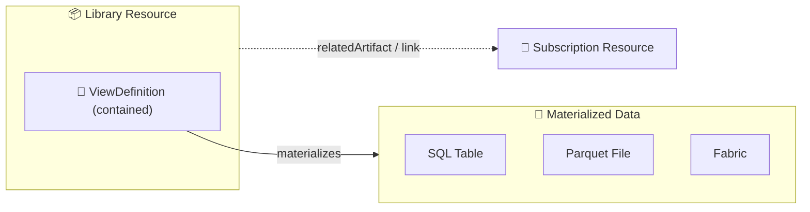
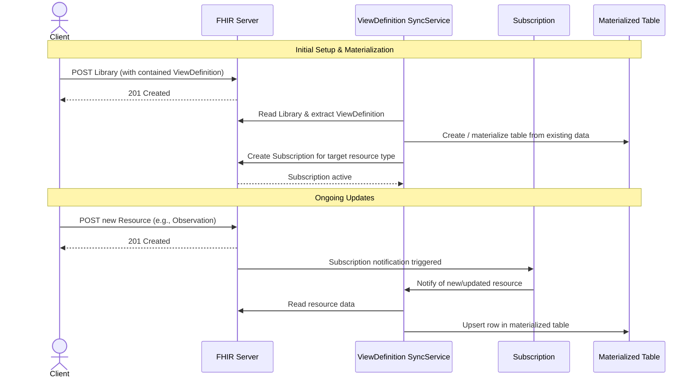

# ViewDefinition Resource Relationships

```mermaid
graph LR
    subgraph Library["📦 Library Resource"]
        ViewDef["📄 ViewDefinition (contained)"]
    end

    Subscription["🔔 Subscription Resource"]

    subgraph Materialized["💾 Materialized Data"]
        SQL["SQL Table"]
        Parquet["Parquet File"]
        Fabric["Fabric"]
    end

    Library -.->|relatedArtifact / link| Subscription
    ViewDef -->|materializes| Materialized
```

## ViewDefinition Lifecycle

```mermaid
sequenceDiagram
    actor Client
    participant FHIR as FHIR Server
    participant Sync as ViewDefinition SyncService
    participant Sub as Subscription
    participant Table as Materialized Table

    Note over Client, Table: Initial Setup & Materialization
    Client->>FHIR: POST Library (with contained ViewDefinition)
    FHIR-->>Client: 201 Created
    Sync->>FHIR: Read Library & extract ViewDefinition
    Sync->>Table: Create / materialize table from existing data
    Sync->>FHIR: Create Subscription for target resource type
    FHIR-->>Sync: Subscription active

    Note over Client, Table: Ongoing Updates
    Client->>FHIR: POST new Resource (e.g., Observation)
    FHIR-->>Client: 201 Created
    FHIR->>Sub: Subscription notification triggered
    Sub->>Sync: Notify of new/updated resource
    Sync->>FHIR: Read resource data
    Sync->>Table: Upsert row in materialized table
```
