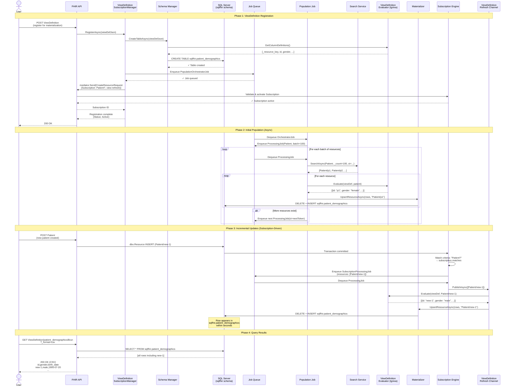

# ADR: SQL on FHIR v2 with Subscription-Driven Materialization

## Status
Accepted

## Date
2026-03-29

## Context
The SQL on FHIR v2 specification defines ViewDefinitions — portable JSON structures that project
FHIR resources into tabular schemas using FHIRPath expressions. Combined with the FHIR Subscriptions
framework, we can create event-driven materialized views that update in near real-time as clinical data
changes, eliminating batch ETL entirely.

## Decision
Implement a materialization layer in the Microsoft FHIR Server that:
1. Accepts ViewDefinition resources for registration
2. Creates and populates SQL tables in a dedicated `sqlfhir` schema
3. Auto-creates FHIR Subscriptions to receive change notifications
4. Incrementally updates materialized rows via a new ViewDefinition Refresh subscription channel
5. Supports multiple output targets (SQL Server, Parquet/Fabric)
6. Exposes spec-standard `$viewdefinition-run` and `$viewdefinition-export` operations

## Architecture

### Component Diagram

```mermaid
graph TB
    subgraph "FHIR Server"
        subgraph "API Layer"
            CTRL["ViewDefinitionRunController<br/>$run / $viewdefinition-export"]
            FHIR_API["FHIR REST API<br/>POST/PUT/DELETE Resources"]
        end

        subgraph "MediatR Pipeline"
            MEDIATOR["IMediator"]
            RUN_HANDLER["ViewDefinitionRunHandler<br/>Inline eval or materialized read"]
            EXPORT_HANDLER["ViewDefinitionExportHandler<br/>Fast-path or async job"]
            SUB_BEHAVIOR["CreateOrUpdateSubscriptionBehavior<br/>Validates & activates subscriptions"]
            CREATE_HANDLER["CreateResourceHandler<br/>Persists resources"]
        end

        subgraph "SQL on FHIR Module (Microsoft.Health.Fhir.SqlOnFhir)"
            subgraph "Channels"
                VD_SUB_MGR["ViewDefinitionSubscriptionManager<br/>Registers ViewDefs, creates Subscriptions,<br/>tracks 1:N mapping & lifecycle status"]
                VD_REFRESH["ViewDefinitionRefreshChannel<br/>ISubscriptionChannel implementation<br/>Routes change events to materializer"]
            end

            subgraph "Materialization"
                SCHEMA_MGR["SqlServerViewDefinitionSchemaManager<br/>CREATE TABLE DDL in sqlfhir schema"]
                SQL_MAT["SqlServerViewDefinitionMaterializer<br/>DELETE + INSERT atomic upserts"]
                PARQUET_MAT["ParquetViewDefinitionMaterializer<br/>Parquet files to Azure Blob/ADLS"]
                MAT_FACTORY["MaterializerFactory<br/>Routes to SQL, Parquet, or both"]
                TYPE_MAP["FhirTypeToSqlTypeMap<br/>FHIR types → SQL Server types"]
            end

            subgraph "Background Jobs"
                POP_ORCH["PopulationOrchestratorJob<br/>Creates table, enqueues processing"]
                POP_PROC["PopulationProcessingJob<br/>Batch search → evaluate → materialize"]
            end

            subgraph "Ignixa Integration"
                EVALUATOR["ViewDefinitionEvaluator<br/>Bridges Firely SDK ↔ Ignixa IElement"]
            end
        end

        subgraph "Ignixa NuGet Packages (External)"
            IGNIXA_EVAL["Ignixa.SqlOnFhir<br/>SqlOnFhirEvaluator<br/>SqlOnFhirSchemaEvaluator"]
            IGNIXA_FP["Ignixa.FhirPath<br/>Compiled FHIRPath engine"]
            IGNIXA_WRITE["Ignixa.SqlOnFhir.Writers<br/>ParquetFileWriter / CsvFileWriter"]
        end

        subgraph "Subscription Engine (Existing)"
            SUB_ORCH["SubscriptionsOrchestratorJob<br/>Detects resource changes per transaction"]
            SUB_PROC["SubscriptionProcessingJob<br/>Resolves channel, calls PublishAsync"]
            SUB_MGR["SubscriptionManager<br/>Caches active subscriptions"]
            CHAN_FACTORY["SubscriptionChannelFactory<br/>Maps channel type → implementation"]
        end

        subgraph "Data Layer"
            SQL_DB[("SQL Server<br/>dbo.Resource (FHIR data)<br/>sqlfhir.* (materialized views)")]
            QUEUE[("Job Queue<br/>dbo.JobQueue")]
        end

        subgraph "External Storage"
            BLOB[("Azure Blob / ADLS / OneLake<br/>Parquet files")]
        end
    end

    %% API flows
    CTRL --> MEDIATOR
    FHIR_API --> MEDIATOR
    MEDIATOR --> RUN_HANDLER
    MEDIATOR --> EXPORT_HANDLER
    MEDIATOR --> SUB_BEHAVIOR --> CREATE_HANDLER

    %% Registration flow
    VD_SUB_MGR --> SCHEMA_MGR
    VD_SUB_MGR --> MEDIATOR
    VD_SUB_MGR --> QUEUE

    %% Evaluation
    EVALUATOR --> IGNIXA_EVAL
    IGNIXA_EVAL --> IGNIXA_FP
    RUN_HANDLER --> EVALUATOR
    RUN_HANDLER --> SQL_DB

    %% Materialization
    SQL_MAT --> SQL_DB
    PARQUET_MAT --> IGNIXA_WRITE
    PARQUET_MAT --> BLOB
    MAT_FACTORY --> SQL_MAT
    MAT_FACTORY --> PARQUET_MAT
    SCHEMA_MGR --> SQL_DB
    SCHEMA_MGR --> IGNIXA_EVAL
    TYPE_MAP -.-> SCHEMA_MGR

    %% Subscription flow
    CREATE_HANDLER --> SQL_DB
    SQL_DB --> SUB_ORCH
    SUB_ORCH --> SUB_MGR
    SUB_ORCH --> QUEUE
    QUEUE --> SUB_PROC
    SUB_PROC --> CHAN_FACTORY
    CHAN_FACTORY --> VD_REFRESH
    VD_REFRESH --> EVALUATOR
    VD_REFRESH --> MAT_FACTORY

    %% Background jobs
    QUEUE --> POP_ORCH
    POP_ORCH --> SCHEMA_MGR
    POP_ORCH --> QUEUE
    QUEUE --> POP_PROC
    POP_PROC --> EVALUATOR
    POP_PROC --> MAT_FACTORY

    %% Styling
    classDef ignixa fill:#e1f5fe,stroke:#0288d1
    classDef existing fill:#f3e5f5,stroke:#7b1fa2
    classDef new fill:#e8f5e9,stroke:#2e7d32
    classDef storage fill:#fff3e0,stroke:#ef6c00

    class IGNIXA_EVAL,IGNIXA_FP,IGNIXA_WRITE ignixa
    class SUB_ORCH,SUB_PROC,SUB_MGR,CHAN_FACTORY,SUB_BEHAVIOR,CREATE_HANDLER,FHIR_API existing
    class VD_SUB_MGR,VD_REFRESH,SCHEMA_MGR,SQL_MAT,PARQUET_MAT,MAT_FACTORY,TYPE_MAP,POP_ORCH,POP_PROC,EVALUATOR,CTRL,RUN_HANDLER,EXPORT_HANDLER new
    class SQL_DB,QUEUE,BLOB storage
```



### Sequence Diagram: Full Lifecycle



## Consequences

### Positive
- **Sub-second data freshness**: Materialized views update as FHIR resources change, eliminating batch ETL
- **Standard-based**: Uses two complementary FHIR specs (SQL on FHIR v2 + Subscriptions)
- **Pluggable targets**: SQL Server for operational analytics, Parquet for bulk export, Delta Lake for Fabric/OneLake with ACID MERGE semantics
- **Leverages existing infrastructure**: Reuses subscription engine, job framework, SQL retry service
- **Ignixa integration**: Avoids building a custom FHIRPath engine and ViewDefinition runner from scratch

### Negative
- **Initial population cost**: Full table scan of all resources of a type (future optimization: translate FHIRPath where clauses to search queries)
- **Over-triggering**: Broad subscription criteria (e.g., `Observation?`) fires for all observations, not just those matching the ViewDefinition's where clause
- **SQL injection surface**: Dynamic DDL generation requires careful identifier validation (implemented via regex)

### Risks
- **Ignixa package stability**: External dependency (MIT licensed, net9.0 only)
- **Scale under high write volume**: Each resource change triggers ViewDefinition re-evaluation; batching mitigates but doesn't eliminate
- **Schema evolution**: ViewDefinition column changes require table recreation (not in-place ALTER)

## Future Optimizations

### 1. Parallel Population via Surrogate ID Ranges
**Problem**: Initial population currently uses sequential `ISearchService.SearchAsync` with continuation
tokens — a single-threaded chain that processes one batch at a time. This doesn't scale to databases
with millions of resources.

**Solution**: Follow the Reindex job pattern which uses `GetSurrogateIdRanges()` to partition the
resource space into non-overlapping ID ranges, then fans out **parallel processing jobs** per range:

```
Orchestrator:
  → GetSurrogateIdRanges("Observation", startId, endId, rangeSize=10000, numRanges=10)
  → Returns: [(0, 10000), (10001, 20000), (20001, 30000), ...]
  → Enqueue N processing jobs in parallel (one per range)

Processing (parallel, no contention):
  → SearchForReindexAsync with StartSurrogateId/EndSurrogateId
  → Each job processes its ID range independently
  → No continuation token dependency between jobs
```

**Reference implementation**: `ReindexOrchestratorJob` (lines 489-497) demonstrates the
`GetSurrogateIdRanges` pattern with configurable range sizes and batch counts.

**Impact**: 5-10x faster initial population for large datasets (millions of resources).

### 2. FHIRPath Where Clause → Search Parameter Translation
**Problem**: A ViewDefinition like `us_core_blood_pressures` with a `where` clause filtering for
LOINC code 85354-9 currently triggers the subscription on **every** Observation change. The evaluator
correctly filters non-matching resources (producing 0 rows), but this wastes compute evaluating
irrelevant resources.

**Solution**: Pattern-match common FHIRPath `where` idioms to equivalent FHIR search parameters:
- `code.coding.exists(system='http://loinc.org' and code=%bp_code)` → `?code=http://loinc.org|85354-9`
- `status = 'active'` → `?status=active`
- `subject.getReferenceKey(Patient)` → compartment-based filtering

This applies to both:
1. **Subscription criteria narrowing**: More specific subscriptions = fewer false triggers
2. **Population query optimization**: Search only matching resources instead of full type scan

**Phased approach**:
- Phase 1 (current): Broad resource-type subscription (`Observation?`) — correct, no missed updates
- Phase 2: Pattern-match common FHIRPath to search params as **optimization**
- Phase 3: Reverse-match against FHIR SearchParameter FHIRPath definitions for broader coverage

**Correctness guarantee**: The evaluator's FHIRPath `where` filtering is always the single source of
truth. Pre-filtering only reduces wasted work — a broader subscription means more evaluator invocations
(cost), but never incorrect results.

### 3. Delta Lake for Fabric Target ✅ Implemented
`DeltaLakeViewDefinitionMaterializer` implements `IViewDefinitionMaterializer` using the `DeltaLake.Net`
NuGet package (FFI wrapper around delta-rs/delta-kernel-rs). Routes via `MaterializationTarget.Fabric`.

**Key behaviors**:
- **Upsert**: `ITable.MergeAsync` with SQL MERGE on `_resource_key` — proper ACID upsert, no duplicate files
- **Delete**: `ITable.DeleteAsync` with predicate on `_resource_key` — actually removes rows
- **Auto-create**: Tables created on first write via `LoadOrCreateTableAsync`
- **Auth**: `DefaultAzureCredential` bearer tokens for Fabric/OneLake, or connection strings

**Configuration** (uses existing `SqlOnFhirMaterialization` section):
```json
{
  "SqlOnFhirMaterialization": {
    "DefaultTarget": "Fabric",
    "StorageAccountUri": "abfss://workspace@onelake.dfs.fabric.microsoft.com/lakehouse/Tables"
  }
}
```

Falls back to append-only Parquet materializer if Delta Lake is not configured.

### 4. Persistent Registration State ✅ Implemented
ViewDefinition registrations are persisted as FHIR **Library** resources following the SQL on FHIR v2
spec recommendation. Each Library resource wraps the ViewDefinition JSON in its `content` field with
`contentType: "application/json+viewdefinition"` and is tagged with a ViewDefinition-specific profile
for discoverability.

**Lifecycle**:
- **Registration**: `ViewDefinitionSubscriptionManager.RegisterAsync()` creates a Library resource via
  MediatR, then creates the SQL table, enqueues the population job, and creates the Subscription.
- **Startup recovery**: On server startup, the manager queries for Library resources with the
  ViewDefinition profile and re-registers each one, restoring the in-memory cache, subscriptions,
  and materialized view pipeline.
- **Deletion cleanup**: A MediatR pipeline behavior intercepts `DeleteResourceRequest` for Library
  resources that contain ViewDefinitions. When detected, it calls `UnregisterAsync(name, dropTable: true)`
  to drop the materialized SQL table and clean up auto-created Subscriptions.

**Why Library resources** (per SQL on FHIR v2 spec):
- `ViewDefinition` is not a core FHIR R4 resource type, so it cannot be stored directly
- The spec recommends Library as the standard wrapper for computable artifacts
- Library resources are searchable, versionable, and deletable via standard FHIR APIs

## Components Built

| Component | Location | Purpose |
|-----------|----------|---------|
| ViewDefinitionEvaluator | SqlOnFhir/ | Bridges Firely SDK ↔ Ignixa IElement |
| SqlServerViewDefinitionSchemaManager | SqlOnFhir/Materialization/ | CREATE TABLE DDL in sqlfhir schema |
| SqlServerViewDefinitionMaterializer | SqlOnFhir/Materialization/ | Atomic DELETE+INSERT row upserts |
| ParquetViewDefinitionMaterializer | SqlOnFhir/Materialization/ | Parquet files to Azure Blob/ADLS |
| DeltaLakeViewDefinitionMaterializer | SqlOnFhir/Materialization/ | Delta Lake MERGE for Fabric/OneLake |
| MaterializerFactory | SqlOnFhir/Materialization/ | Routes to SQL, Parquet, Delta Lake, or combinations |
| FhirTypeToSqlTypeMap | SqlOnFhir/Materialization/ | FHIR→SQL Server type mapping |
| ViewDefinitionRefreshChannel | SqlOnFhir/Channels/ | ISubscriptionChannel for incremental updates |
| ViewDefinitionSubscriptionManager | SqlOnFhir/Channels/ | Registration lifecycle + auto-subscription + Library persistence |
| ViewDefinitionLibraryCleanupBehavior | SqlOnFhir/Channels/ | Drops SQL table when Library/ViewDef is deleted |
| PopulationOrchestratorJob | SqlOnFhir/Materialization/Jobs/ | Creates table, enqueues processing |
| PopulationProcessingJob | SqlOnFhir/Materialization/Jobs/ | Batch search → evaluate → materialize |
| ViewDefinitionRunHandler | SqlOnFhir/Operations/ | $viewdefinition-run (sync eval or table read) |
| ViewDefinitionExportHandler | SqlOnFhir/Operations/ | $viewdefinition-export (fast-path or async) |
| ViewDefinitionRunController | Shared.Api/Controllers/ | HTTP endpoints for $run and $export |

## References
- [SQL on FHIR v2 Spec](https://build.fhir.org/ig/FHIR/sql-on-fhir-v2/)
- [SQL on FHIR Operations](https://build.fhir.org/ig/FHIR/sql-on-fhir-v2/operations.html)
- [FHIR Subscriptions Backport IG](http://hl7.org/fhir/uv/subscriptions-backport/)
- [Ignixa FHIR](https://github.com/brendankowitz/ignixa-fhir)
