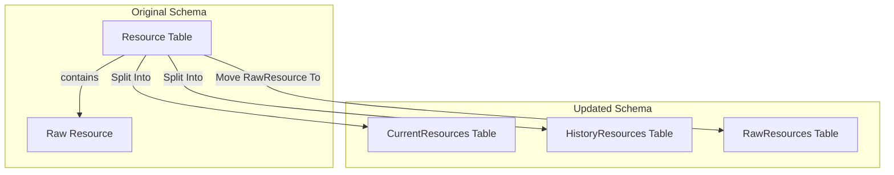
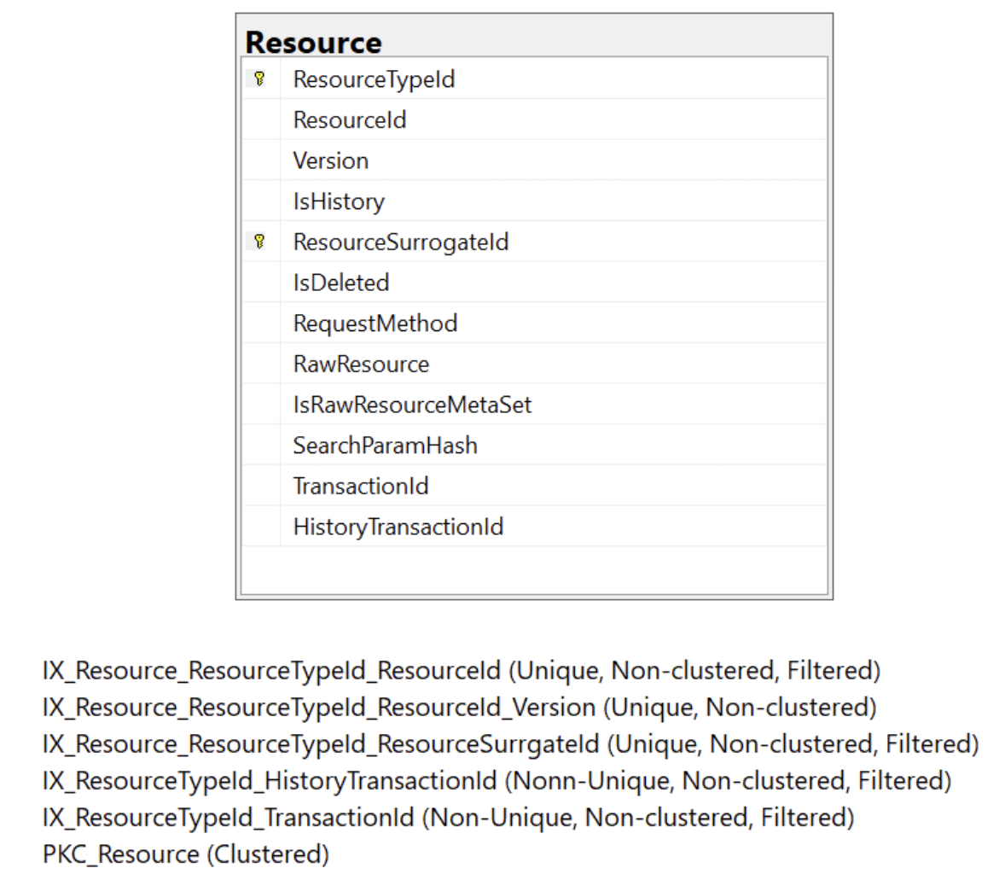
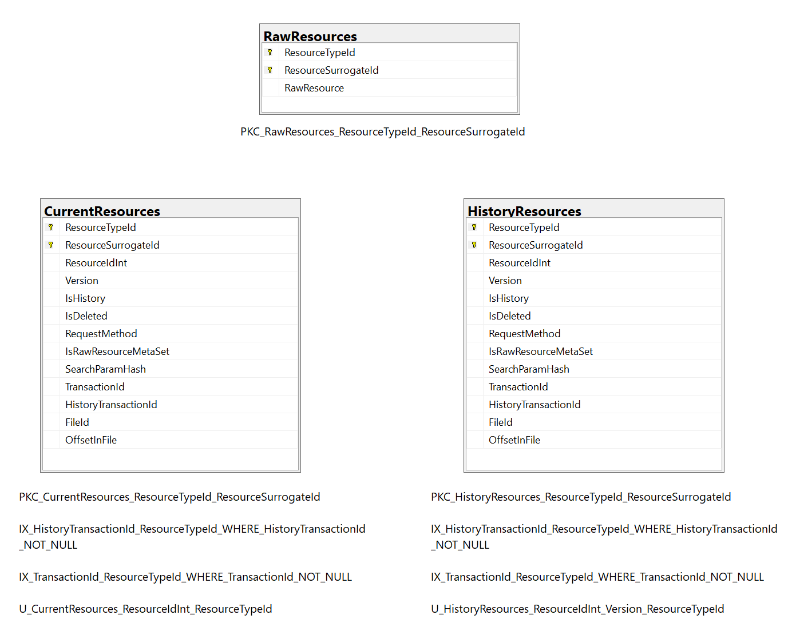

# ADR: Resource Table Refactoring and Index Optimization
Labels: [SQL](https://github.com/microsoft/fhir-server/labels/Area-SQL)

## Context
The FHIR server database schema requires optimizations to reduce index size, this change outlines splitting the resource table into Current and History to remove an index.

In order to support splitting the table, we move the raw binary of the resource to it's own table, so that the binary will not have be to be moved when resource meta data moves from the current to the history table.

1. Removing an index from the `Resource` table by splitting history and current resources into separate tables (`CurrentResources`, `HistoryResources`) and moving `RawResource` into its own table (`RawResources`).

Additionally, changes include increasing string reference ID size from 64 to 768 bytes and modifying search queries to work with the new schema.

## Decision
We will implement the schema optimizations by:
- Splitting the `Resource` table into `CurrentResources` and `HistoryResources`.
- Creating a `RawResources` table to store raw resource data without frequent movement.
- Creating views (`Resource`, `ReferenceSearchParam`) to minimize code changes.
- Managing writes using stored procedures and triggers, ensuring backward compatibility.
- Updating SQL query generation logic to remove reliance on index hints.
- Deploying changes with a phased approach, using a special flag to disable automatic schema upgrades temporarily.

The above schema diagrams shows to overall reduction of one index in the new tables.

## Status
Proposed

## Consequences
### Positive Outcomes:
- Reduced index size.
- Enhanced scalability, especially for large datasets.
- Improved maintainability and separation of concerns in the database schema.
- Minimal code changes due to the use of views.

### Potential Challenges:
- Temporary performance degradation during schema migration.
- Need for additional testing, especially for complex queries.
- Updates to existing search service logic to remove index hints.
- Potential need for adjustments in performance test suites.
- Some queries and scenarios might degrade in performance under the new schema.

### Next Steps:
- Complete production testing before final deployment.
- Ensure monitoring of query latencies before, during, and after deployment.
- Validate performance improvements against baseline metrics.
- Update documentation and guidelines for working with the new schema.
