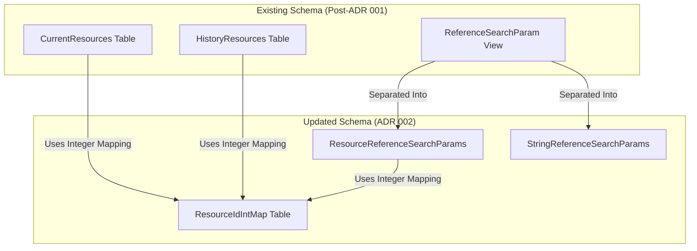

# ADR: Introducing ResourceIdIntMap for Integer-Based Resource Mapping
Labels: [SQL](https://github.com/microsoft/fhir-server/labels/Area-SQL)

## Context
The FHIR server schema requires storage optimizations in resource reference searches, which were previously reliant on string-based `ResourceId` values. By introducing an integer mapping, we aim to reduce the space required to store this data and simplify reference searches.

## Decision
We will introduce a new `ResourceIdIntMap` table that:
- Stores a mapping between `ResourceId` (string) and `ResourceIdInt` (integer).
- Requires modifications to `CurrentResources` and `HistoryResources` to store `ResourceIdInt` instead of `ResourceId`.
- Updates `ReferenceSearchParam.ReferenceResourceId` to use integer mapping.
- Separates string references from resource references by introducing `ResourceReferenceSearchParams` and `StringReferenceSearchParams`.

## Status
Proposed

## Consequences
### Positive Outcomes:
- Reduced storage size by eliminating many duplicated string values.

### Potential Challenges:
- (Possible) Degraded query performance in some scenarios with additional joins.
- Adjustments required in application logic to accommodate the new reference structure.
- Additional testing necessary to ensure correctness and performance improvements.

### Next Steps:
- Develop migration scripts to populate `ResourceIdIntMap` without affecting existing functionality.
- Implement changes in `ReferenceSearchParam` to fully leverage integer-based lookups.
- Conduct performance testing to verify improvements and address any regressions.
