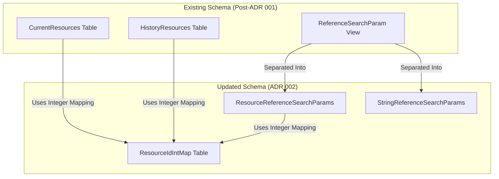

# ADR: Introducing ResourceIdIntMap for Integer-Based Resource Mapping
Labels: [SQL](https://github.com/microsoft/fhir-server/labels/Area-SQL)

## Context
The FHIR server schema requires storage optimizations in resource reference searches, which were previously reliant on string-based `ResourceId` values. By introducing an integer mapping, we aim to reduce the space required to store this data.  The ReferenceSearchParam table is one of the larger tables in our database, storing references between resources.  The current column is a string, as these references may be resource Ids (for which we could have used the resource surrogate ID), but they can also be string type data which is an "identifier" provided in the body of the resource.

## Decision
We will introduce a new `ResourceIdIntMap` table that:
- Stores a mapping between `ResourceId` (string) and `ResourceIdInt` (integer).
- Requires modifications to `CurrentResources` and `HistoryResources` to store `ResourceIdInt` instead of `ResourceId`.
- Updates `ReferenceSearchParam.ReferenceResourceId` to use integer mapping.
- Separates string references from resource references by introducing `ResourceReferenceSearchParams` and `StringReferenceSearchParams`.

## Why not use ResourceSurrogateId?
As mentioned, we do have an integer which refers to a resource.  So why are adding a new one?  ResourceSurrogateId is also actually a datetime value, and represents the latest time a resource was changed.  If we used this value in the ReferenceResource table, any time the resource was updated, we would need to come and update this table.  Having a dedicated integer allows the reference to remain static.

## Status
Proposed

## Consequences
### Positive Outcomes:
- Reduced storage size by eliminating many duplicated string values.  Also building an index on the integer columns is much smaller.

### Potential Challenges:
- (Possible) Degraded query performance in some scenarios with additional joins.
- Adjustments required in application logic to accommodate the new reference structure.
- Additional testing necessary to ensure correctness and performance improvements.

### Next Steps:
- Develop migration scripts to populate `ResourceIdIntMap` without affecting existing functionality.
- Implement changes in `ReferenceSearchParam` to fully leverage integer-based lookups.
- Conduct performance testing to verify improvements and address any regressions.
