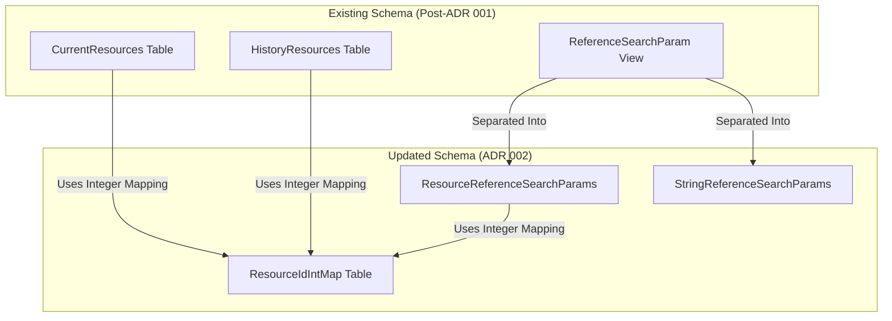

# ADR: Introducing ResourceIdIntMap for Integer-Based Resource Mapping

## Context
The FHIR server schema requires improvements in resource reference searches, which were previously reliant on string-based `ResourceId` values. These string-based references were inefficient for large-scale queries requiring many duplicated values being stored. By introducing an integer mapping, we aim to reduce the space required to store this data and simplify reference searches.

## Decision
We will introduce a new `ResourceIdIntMap` table that:
- Stores a mapping between `ResourceId` (string) and `ResourceIdInt` (integer).
- Requires modifications to `CurrentResources` and `HistoryResources` to store `ResourceIdInt` instead of `ResourceId`.
- Updates `ReferenceSearchParam.ReferenceResourceId` to use integer mapping.
- Separates string references from resource references by introducing `ResourceReferenceSearchParams` and `StringReferenceSearchParams`.

## Status
Proposed

## Consequences
### Positive Outcomes:
- Improved query performance by utilizing integer-based references instead of strings.
- Reduced indexing overhead and increased efficiency in database joins.
- Better scalability as integer-based searches are significantly faster than string-based ones.

### Potential Challenges:
- Migration complexity in converting existing `ResourceId` values to integers.
- Adjustments required in application logic to accommodate the new reference structure.
- Additional testing necessary to ensure correctness and performance improvements.

### Next Steps:
- Develop migration scripts to populate `ResourceIdIntMap` without affecting existing functionality.
- Implement changes in `ReferenceSearchParam` to fully leverage integer-based lookups.
- Conduct performance testing to verify improvements and address any regressions.
- Update documentation to reflect the schema changes and best practices for querying the new structure.
