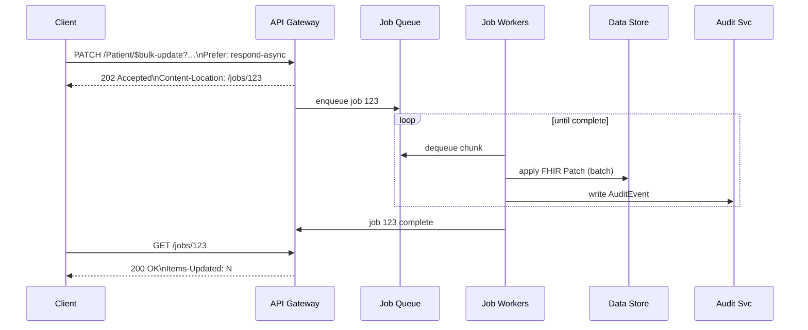

# ADR Introduce `$bulk-update` FHIR Operation
*Labels*: [Specification](https://github.com/microsoft/fhir-server/labels/Specification) | [API](https://github.com/microsoft/fhir-server/labels/Area-API) | [Asynchronous-Jobs](https://github.com/microsoft/fhir-server/labels/Area-Asynchronous-Jobs)

---

## Context
Our platform already supports the FHIR `$import` feature for incremental loads. Customers need a **large‑scale partial‑update capability** that:
- re‑uses **FHIR Patch** semantics (encoded as a `Parameters` resource — **not** JSON Patch)
- leverages the [FHIR Asynchronous pattern](https://hl7.org/fhir/async.html)
- lets them choose resources with familiar expressive search, including `_include` / `_revinclude`
- operates at **system** scope (`/$bulk-update`) or **type** scope (`/[ResourceType]/$bulk-update`).
- enables updating specific field values per resource type based on the provided `resource type field mapping.`
- updates `metadata` properties, such as `version` and `last updated date`, whenever a resource is modified.
- provides a query to retrieve the list of resources that will be updated.
- returns a response detailing the `resource count succeeded and resource count failed to update per resource type, along with the failure reasons.`
- Logs an audit entry for the bulk update operation, including the `list of resource IDs successfully updated` and `any errors with the list of resource IDs that failed to update.`

## Working of FHIR Patch
- Attempting to add an element to a resource that already contains it will result in a 400 Bad Request error.
- Attempting to replace an element that does not exist will result in a 400 Bad Request error.
- Submitting repeated requests to add elements to an array will result in duplicate entries being added.
- If the search query returns no resources, a  404 "Resource Not Found" response will be returned.
- If the search query returns multiple resources, an error indicating that the search criteria are not specific enough will be returned.

### Use‑cases 
| # | Scenario |
|---|----------|
| 1 | Correct a demographic error in millions of `Patient` records |
| 2 | Add or replace security labels on many `Observation`s linked to a cohort |
| 3 | Stamp every resource in a tenant with a provenance tag after migration |
| 4 | Update all `ServiceRequest` records with a new category within the FHIR service without manually extracting and updating them |
| 5 | Update `security tags` or `unit values` in bulk, based on changes announced by third-party sources |
| 6 | Map resources referencing old `Patient` Id to new `Patient` Id |
| 7 | `MedicationRequest` resources referencing the outdated medication need to be updated to reference the new replacement Medication |

## Decision to make
- Every patch `path` **must start with the `ResourceType` root** (e.g., `Patient.meta.tag`) to disambiguate meta‑level vs element updates. 
- To patch the `Common properties` users should use `Resource`. (e.g., `"name": "path", "valueString": "Resource"`)
- The bulk-update job should run to completion, with retry logic in place to handle transient, connectivity, or availability failures.
- Transient, connectivity, or availability failures during job processing should not result in duplicate entries being added to a resource. To prevent this, updates should be processed in chunks wrapped within a transaction.
- If a request to add an element to an array is submitted twice, duplicate entries may be created. This can be avoided by setting the `skipIfExist` query parameter flag to true. `skipIfExist` will be honored only for operation types `add` and `insert`
- If the update request results in an invalid resource, the update will fail. If one resource becomes invalid, the update will fail for all resources of the same type.
- Attempting to add an element to resources that already contain those elements will fail in the FHIR Patch call. The same behavior should apply to bulk-update operation.
- Attempting to replace an element that doesn't exist will fail in the FHIR Patch call. The same behavior should apply to bulk-update operation.
- If the search query returns no resources, a "Resource Not Found" response with a 404 Bad Request status will be returned. But for bulk-update operation, job should return success with resource updated count as 0
- Customers should use a `GET` query to retrieve the list of resources that will be updated.
- To prevent log overloading, audit entries for bulk-update operations should be recorded in chunks, following the same approach used for bulk-delete operations.
- Expected performance

### Functional behaviour

- **Invocation**  
  `PATCH [base]/$bulk-update | /{ResourceType}/{$bulk-update }?{search-params}`  
  *Headers*: `Prefer: respond-async`, `Content-Type: application/fhir+json` &nbsp;•&nbsp; *Body*: **FHIR Patch** `Parameters` resource  

  Example (request for **use‑case #2 – security‑label propagation**):

  ```http
  PATCH Patient/$bulk-update?_source=internalehr&_revinclude=Observation:patient
  Prefer: respond-async
  Content-Type: application/fhir+json

  {
    "resourceType": "Parameters",
    "parameter": [
        {
        "name": "operation",
        "part": [
          { "name": "type",  "valueCode": "add" },
          { "name": "path",  "valueString": "Resource.meta.security" },
          { "name": "value", "valueCoding": {
              "system": "http://example.org/consent",
              "code":   "no-share"
          }}
        ]
      }
    ]
  }
  ```

- **Multiple operations** – Multiple operations can be provided for various ResourceTypes
- **Search parity** – Supports the full search grammar of the FHIR Server, including `_include` and `_revinclude`.
- **Resource‑typed paths** – Every patch `path` **must start with the `ResourceType` root** (e.g., `Patient.meta.tag`) to disambiguate meta‑level vs element updates. Common properties may be patched with `Resource`.
- **Heterogeneous search rule** – If the search returns *multiple* resource types, the patch is **applied only** to items whose type matches the `ResourceType` prefix in each `path`; other types are ignored.
- **Scopes** – Allowed on the entire system or a single resource type or multiple resource types. If different fields needs to be updated per resource type then the field value mapping could be provided in different operations.
- **Trying to add the same value repeatedly to an array** – For a single bulk-update request there should only be one entry added to an array. The system should not add duplicate entry due to internal FHIR failures during job processing. If the same request is sent twice and if skipIfExists flag is set to false then server should add the duplicate entry to an array. If skipIfExists flag is passed as true then skip the records which already have the requested update.
- **Trying to add an existing element** – Trying to add an existing element to a resource would fail
- **Trying to replace an element that doesn't exist** – Trying to replace an element that doesn't exist would fail
- **Update call resulting in an invalid resource** – Should error if the PATCH update forms an invalid resource. Is there a case where one resource would result in an invalid resource and other resources of the same type won't?
- **Partial updates** – Resources with valid requests should get updated. The failed resources should be logged with the reason.
- **Logging** – Should have the audit log for each bulk-update call with the resource IDs of the items that have been updated successfully. In case of error, should provide the valid reason with failed to update resource IDs.


###  High‑Level Flow



###  In-depth work Flow
* [Bulk Update workflow](https://github.com/microsoft/fhir-server/blob/main/docs/flow%20diagrams/bulk-update.md)

### Job pattern

| Step | Behaviour |
|------|-----------|
| Submit | Server returns **202 Accepted** with `Content-Location: {pollingUrl}` |
| Processing | Job queued; workers update resources in chunks (≥ 1 000 items/sec target) |
| Processing | Job processing; Polling URL returns **202 Accepted** with the progess it has made. Headers: `Items-Updated`, `X-Error-Count`
| Complete | Polling URL returns **200 OK** when done. Headers: `Items-Updated`, `X-Error-Count` |
| Outputs | `OperationOutcome` (no PHI) |
| Cancel | `DELETE {pollingUrl}` ⇒ **202 Accepted** → job status = `cancelled` |
| Audit & Metrics | Each update emits an `AuditEvent` (`update\|bulk-update`) and increments metric |
| Events | Updated items will cause an event in Azure FHIR Events |

---

### Status
Proposed

---

## Consequences

| Benefit | Consequence |
|---------|-------------|
| Mass partial updates without full re‑imports | Higher write load on datastore |
| Detailed per‑resource audit trail | Increased `AuditEvent` volume |

---

## Estimated performance numbers based on previous runs on Update operation
For soft $bulk-delete, we achieved around 1600 reosurces per seconds. 

---
## References
* [Asynchronous Bulk Data Request Pattern](https://hl7.org/fhir/async.html)  
* [FHIR Patch](https://hl7.org/fhir/fhirpatch.html)  

