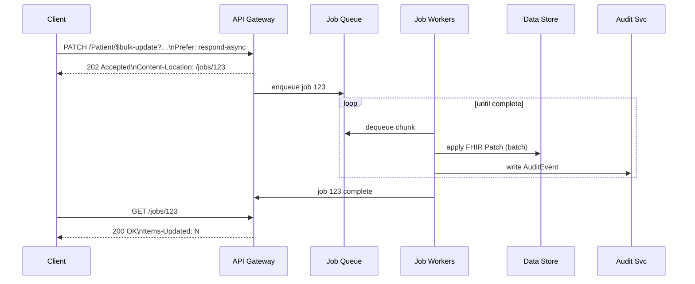

# ADR Introduce `$bulk-update` FHIR Operation
*Labels*: [Specification](https://github.com/microsoft/fhir-server/labels/Specification) | [API](https://github.com/microsoft/fhir-server/labels/Area-API) | [Asynchronous-Jobs](https://github.com/microsoft/fhir-server/labels/Area-Asynchronous-Jobs)

---

## Context
Our platform already supports the FHIR `$import` feature for incremental loads. Customers need a **large‑scale partial‑update capability** that:

- re‑uses **FHIR Patch** semantics (encoded as a `Parameters` resource — **not** JSON Patch)
- leverages the [FHIR Asynchronous pattern](https://hl7.org/fhir/async.html)
- lets them choose resources with familiar expressive search, including `_include` / `_revinclude`
- operates at **system** scope (`/$bulk-update`) or **type** scope (`/[ResourceType]/$bulk-update`).

### Use‑cases 
| # | Scenario |
|---|----------|
| 1 | Correct a demographic error in millions of `Patient` records |
| 2 | Add or replace security labels on many `Observation`s linked to a cohort |
| 3 | Stamp every resource in a tenant with a provenance tag after migration |

---

## Decision

### Functional behaviour

- **Invocation**  
  `PATCH [base]/$bulk-update { | /{ResourceType}/$bulk-update }?{search-params}`  
  *Headers*: `Prefer: respond-async` &nbsp;•&nbsp; *Body*: **FHIR Patch** `Parameters` resource  

  Example (request for **use‑case #2 – security‑label propagation**):

  ```http
  PATCH Patient/$bulk-update?_source=internalehr&_revinclude=Observation:patient
  Prefer: respond-async
  Content-Type: application/fhir+json

  {
    "resourceType": "Parameters",
    "parameter": [{
      "name": "operation",
      "part": [
        { "name": "type",  "valueCode": "add" },
        { "name": "path",  "valueString": "Resource.meta.security" },
        { "name": "value", "valueCoding": {
            "system": "http://example.org/consent",
            "code":   "no-share"
        }}
      ]
    }]
  }
  ```

- **Search parity** – Supports the full search grammar of the FHIR Server, including `_include` and `_revinclude`.
- **Resource‑typed paths** – Every patch `path` **must start with the `ResourceType` root** (e.g., `Patient.meta.tag`) to disambiguate meta‑level vs element updates. Common properties may be patched with `Resource`.
- **Heterogeneous search rule** – If the search returns *multiple* resource types, the patch is **applied only** to items whose type matches the `ResourceType` prefix in each `path`; other types are ignored.
- **Scopes** – Allowed on the entire system or a single resource type.

###  High‑Level Flow



### Job pattern

| Step | Behaviour |
|------|-----------|
| Submit | Server returns **202 Accepted** with `Content-Location: {pollingUrl}` |
| Processing | Job queued; workers update resources in chunks (≥ 1 000 items/sec target) |
| Complete | Polling URL returns **200 OK** when done. Headers: `Items-Updated`, `X-Error-Count` |
| Outputs | `OperationOutcome` (no PHI) |
| Cancel | `DELETE {pollingUrl}` ⇒ **202 Accepted** → job status = `cancelled` |
| Audit & Metrics | Each update emits an `AuditEvent` (`update\|bulk-update`) and increments metric |
| Events | Updated items will cause an event in Azure FHIR Events |

---

### Status
Proposed

---

## Consequences

| Benefit | Consequence |
|---------|-------------|
| Mass partial updates without full re‑imports | Higher write load on datastore |
| Detailed per‑resource audit trail | Increased `AuditEvent` volume |

---

## References
* [Asynchronous Bulk Data Request Pattern](https://hl7.org/fhir/async.html)  
* [FHIR Patch](https://hl7.org/fhir/patch.html)  

