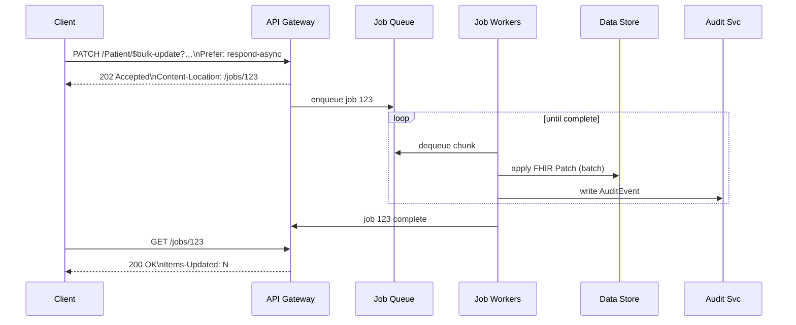

# ADR Introduce `$bulk-update` FHIR Operation
*Labels*: [Specification](https://github.com/microsoft/fhir-server/labels/Specification) | [API](https://github.com/microsoft/fhir-server/labels/Area-API) | [Asynchronous-Jobs](https://github.com/microsoft/fhir-server/labels/Area-Asynchronous-Jobs)

---

## Context
Our platform already supports the FHIR `$import` feature for incremental loads. Customers need a **large‑scale partial‑update capability** that:

- re‑uses **FHIR Patch** semantics (encoded as a `Parameters` resource — **not** JSON Patch)
- leverages the [FHIR Asynchronous pattern](https://hl7.org/fhir/async.html)
- lets them choose resources with familiar expressive search, including `_include` / `_revinclude`
- operates at **system** scope (`/$bulk-update`) or **type** scope (`/[ResourceType]/$bulk-update`).

### Use‑cases 
| # | Scenario |
|---|----------|
| 1 | Correct a demographic error in millions of `Patient` records |
| 2 | Add or replace security labels on many `Observation`s linked to a cohort |
| 3 | Stamp every resource in a tenant with a provenance tag after migration |
| 4 | Update all `ServiceRequest` records with a new category within the FHIR service without manually extracting and updating them |
| 5 | Update security tags or unit values in bulk, based on changes announced by third-party sources |
| 6 | Map resources referencing old Patient to new Patient Id |
| 7 | MedicationRequest resources referencing the outdated medication need to be updated to reference the new replacement Medication |

## Decision

### Functional behaviour

- **Invocation**  
  `PATCH [base]/$bulk-update { | /{ResourceType}/$bulk-update }?{search-params}`  
  *Headers*: `Prefer: respond-async` &nbsp;•&nbsp; *Body*: **FHIR Patch** `Parameters` resource  

  Example (request for **use‑case #2 – security‑label propagation**):

  ```http
  PATCH Patient/$bulk-update?_source=internalehr&_revinclude=Observation:patient
  Prefer: respond-async
  Content-Type: application/fhir+json

  {
    "resourceType": "Parameters",
    "parameter": [
        {
        "name": "operation",
        "part": [
          { "name": "type",  "valueCode": "add" },
          { "name": "path",  "valueString": "Resource.meta.security" },
          { "name": "value", "valueCoding": {
              "system": "http://example.org/consent",
              "code":   "no-share"
          }}
        ]
      },
      {
        "name": "operation",
        "part": [
          { "name": "type",  "valueCode": "add" },
          { "name": "path",  "valueString": "Resource.meta.security" },
          { "name": "value", "valueCoding": {
              "system": "http://example.org/consent",
              "code":   "no-share"
          }}
        ]
      }
    ]
  }
  ```

- **Multiple operations** – Multiple operations can be provided for various ResourceTypes
- **Search parity** – Supports the full search grammar of the FHIR Server, including `_include` and `_revinclude`.
- **Resource‑typed paths** – Every patch `path` **must start with the `ResourceType` root** (e.g., `Patient.meta.tag`) to disambiguate meta‑level vs element updates. Common properties may be patched with `Resource`.
- **Heterogeneous search rule** – If the search returns *multiple* resource types, the patch is **applied only** to items whose type matches the `ResourceType` prefix in each `path`; other types are ignored.
- **Scopes** – Allowed on the entire system or a single resource type. If on a resource type let's say Patient with query parameter added to include all the Observations for the Patient, different operations should be provided for each of those resources?
- **Trying to add the same value over and over again** – For one individual request there should be only one addition of the value in an array. The system should not be adding the values repeatedly due to internal FHIR failures in job processing.T
- **PATCH call resulting into an invalid resource** – Should error if the PATCH update forms an invalid resource. Is there a case where one resource would result in an invalid resource and other resources of the same type won't?
- **Partial updates** – Resources with valid requests should get updated. The failed resources should be logged with the reason.
- **Logging** – Should have the audit log for each bulk-update call with the resource IDs of the items that have been updated successfully. Should register all the individual updates (Failed/Successful) to contribute to total API calls. In case of error, should provide the valid result code and reason. Do we need to log the resource IDs of failed resources?

###  High‑Level Flow


###  In-depth work Flow
* [Bulk Update workflow](https://github.com/microsoft/fhir-server/blob/main/docs/flow%20diagrams/bulk-update.md)

### Job pattern

| Step | Behaviour |
|------|-----------|
| Submit | Server returns **202 Accepted** with `Content-Location: {pollingUrl}` |
| Processing | Job queued; workers update resources in chunks (≥ 1 000 items/sec target) |
| Complete | Polling URL returns **200 OK** when done. Headers: `Items-Updated`, `X-Error-Count` |
| Outputs | `OperationOutcome` (no PHI) |
| Cancel | `DELETE {pollingUrl}` ⇒ **202 Accepted** → job status = `cancelled` |
| Audit & Metrics | Each update emits an `AuditEvent` (`update\|bulk-update`) and increments metric |
| Events | Updated items will cause an event in Azure FHIR Events |

---

### Status
Proposed

---

## Consequences

| Benefit | Consequence |
|---------|-------------|
| Mass partial updates without full re‑imports | Higher write load on datastore |
| Detailed per‑resource audit trail | Increased `AuditEvent` volume |

---
## Decisions to make 
1. Do we need to log the resource ids of resoruces that failed Update?
2. Do we need to log Audit log for individual update? or it is ok to follow what Bulk-delete does and log the chunks with resource ids.
3. How many updates in parallel? (Bulk-delete starts 64 parallel threads. This number was decided after performing some perf runs)
4. 

---


---
## Estimated performance numbers based on previous runs on Update operation
2000 resources per seconds (For soft $bulk-delete, we roughly achieved 1600 reosurces per seconds)

---
## References
* [Asynchronous Bulk Data Request Pattern](https://hl7.org/fhir/async.html)  
* [FHIR Patch](https://hl7.org/fhir/fhirpatch.html)  

