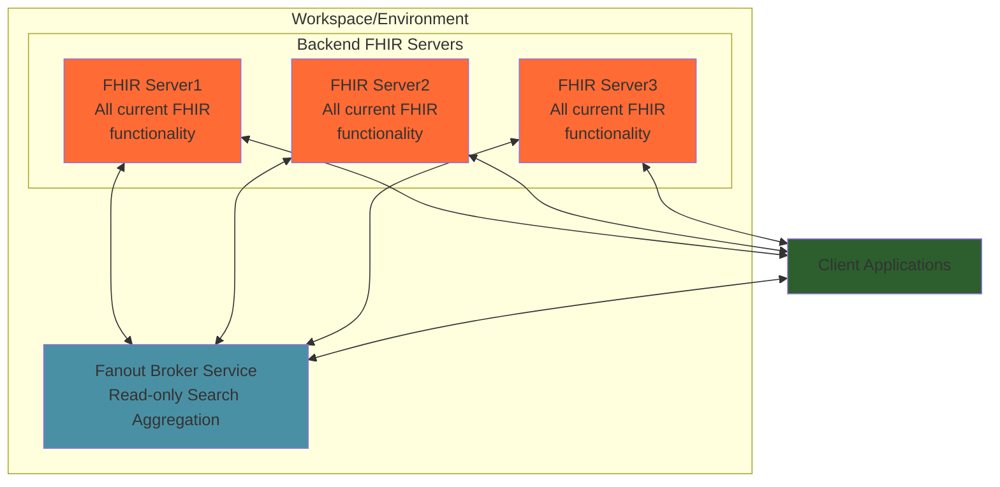
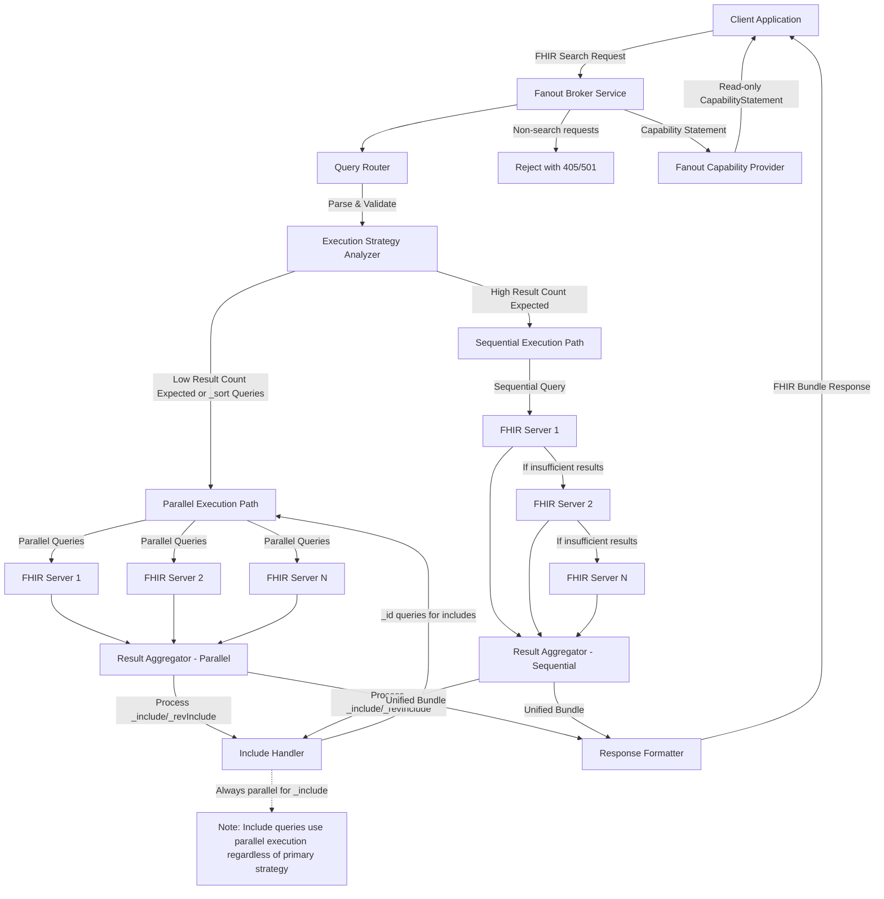

# ADR 2506: Fanout Broker Query Service for Multi-Server FHIR Search Aggregation
Labels: [Architecture](https://github.com/microsoft/fhir-server/labels/Architecture) | [API](https://github.com/microsoft/fhir-server/labels/Area-API) | [Search](https://github.com/microsoft/fhir-server/labels/Area-Search)

## Context

Healthcare organizations split datasets across multiple FHIR servers for a variety of reasons - to segment data, for performance, or for capacity reasons. However, applications frequently need to query data across these distributed FHIR servers to get a comprehensive view of patient information or gain exploritory insights across multiple datasets.

## Decision

We will implement a **Fanout Broker Query Service** that acts as a FHIR-compliant proxy to aggregate search queries across multiple running FHIR servers in a Read-only capacity. This layer will be independent and not built into the main API or Web projects. The service will:

### Core Functionality
- **Accept and process only Search operations** at system level (`GET /?[search]`) and resource type level (`GET /[ResourceType]/[search]`)
- **Reject point read queries** (e.g., `GET /Patient/123`) and return appropriate HTTP 501 Not Implemented responses
- **Reject all Create, Update, Delete (CUD) operations** and return HTTP 405 Method Not Allowed responses
- **Expose its own read-only CapabilityStatement** that accurately reflects supported operations and search parameters
- **FHIR Version** all underlying servers must be a single FHIR Spec version (R4). 

### Search Operation Handling
- **Adaptive query execution strategy** that selects between parallel and sequential execution based on search parameters and expected result patterns:
  - **Parallel execution** for queries targeting specific resources with low expected result counts (e.g., `_id=123`, `identifier=specific-value`, exact matches)
  - **Sequential execution** for broad queries with potentially high result counts (e.g., `name=John`, `status=active`, pattern matches) where a single server instance may fill the requested page size
- **Query pattern analysis** to automatically determine optimal execution strategy based on search parameter types and values
- **Result aggregation** from multiple servers into a single FHIR Bundle response with intelligent merging
- **Duplicate resource handling** where resources with identical logical IDs from different servers are all returned, differentiated by their `fullUrl` values
- **FullUrl differentiation** using a pattern like `{source-server-base-url}/{resourceType}/{id}` to maintain traceability to source systems
- **Early termination** for sequential queries when sufficient results are obtained to satisfy the requested `_count` parameter

### Advanced Search Features
- **Include/RevInclude support** through fanout of `_id=id1,id2,id3,...` queries to collect resources for inclusion across all target servers
- **Chained search expressions** support for queries like `Patient?organization.name=Acme` or `Observation?subject:Patient.name=John`:
  - **Forward chaining**: Follow references from source to target resources (e.g., `Observation?subject.name=John`)
  - **Reverse chaining**: Use `_has` parameter to find resources that are referenced by others (e.g., `Patient?_has:Observation:subject:code=vital-signs`)
  - **Multi-level chaining**: Support nested chains across multiple reference levels
  - **Fanout chain resolution**: Execute chained sub-queries across all target servers and aggregate reference IDs for final filtering
  - **Chain timeout protection**: Implement configurable timeouts (15 seconds default) for chained sub-queries to prevent resource exhaustion
- **Sorting support** with parallel execution across all servers and intelligent continuation token management:
  - **First page**: Request `_count` results (sorted) from each server, re-sort globally, return top `_count` results
  - **Subsequent pages**: Decipher aggregated continuation token to per-server tokens, request next `_count` from each server, re-sort globally, return next `_count` results
  - **Continuation token aggregation**: Combine per-server continuation tokens into single client token for seamless paging
- **Standard search parameters** support including `_count`, `_sort`, `_elements`, `_include`, `_revInclude`, `_summary`, `_id`, `_lastModified`, and resource-specific search parameters

### Execution Strategy Decision Matrix
The service determines execution strategy based on search parameter analysis:

**Parallel Execution Triggers:**
- Exact ID searches (`_id=123`, `_id=123,456,789`)
- Specific identifier searches (`identifier=system|value`)
- Unique business identifiers (SSN, MRN with system)
- Small result set modifiers (`_count=1-10`)
- **All queries with `_sort` parameter** (requires parallel execution across all servers for proper global sorting)
- **Chained search sub-queries** (chain resolution requires comprehensive collection across all servers)
- Queries likely to return < 500 results per server

**Sequential Execution Triggers:**
- Broad text searches (`name=John`, `family=Smith`)
- Status-based searches (`status=active`, `category=medication`)
- Date range searches without specific identifiers
- Queries likely to return > 500 results per server
- Large `_count` values (> 20)
- Service will use a "fill-factor" of 0.5, it should continue searching until we retrieve at least 50% of the requested result count (as done in Cosmos implementation).

**Hybrid Execution:**
- Complex queries may use parallel execution for specific parameters and sequential for broad ones
- **Include/RevInclude operations always use parallel queries** regardless of primary strategy, as they require comprehensive collection of referenced resources across all servers and cannot be paged
- **Chained search operations use hybrid approach**: sub-queries for chain resolution execute in parallel across all servers, while primary query may use sequential execution based on other criteria
- Secondary _id-based queries for includes use parallel execution to ensure all referenced resources are collected immediately

### Sorting Algorithm and Continuation Token Management
For queries with `_sort` parameter, the service implements a distributed sorting algorithm:

**First Page Request (`_count=N`):**
1. Request `N` sorted results from each FHIR server simultaneously
2. Merge and re-sort all results globally using the specified sort criteria
3. Select the top `N` results for the response
4. Calculate new per-server continuation tokens based on the last returned result from each server
5. Aggregate per-server continuation tokens into a single client continuation token
6. Return the top `N` results with the aggregated continuation token

**Subsequent Page Requests:**
1. Decipher the aggregated continuation token to extract per-server continuation tokens
2. Request next `N` sorted results from each FHIR server using their respective continuation tokens
3. Merge and re-sort all newly retrieved results globally
4. Select the next `N` results for the response
5. Calculate updated per-server continuation tokens based on the last returned result from each server
6. Aggregate updated continuation tokens into a new client continuation token
7. Return the next `N` results with the new aggregated continuation token

**Continuation Token Format:**
```json
{
  "servers": [
    {"endpoint": "server1", "token": "server1_continuation_token"},
    {"endpoint": "server2", "token": "server2_continuation_token"},
    {"endpoint": "serverN", "token": "serverN_continuation_token"}
  ],
  "sort_criteria": "_lastUpdated,desc",
  "page_size": 50
}
```

### Architecture Components
- **Query Router**: Distributes search queries to configured FHIR server endpoints using adaptive execution strategies
- **Execution Strategy Analyzer**: Determines whether to use parallel or sequential execution based on search parameter analysis
- **Result Aggregator**: Combines responses from multiple servers into unified FHIR Bundles with intelligent merging and deduplication
- **CapabilityStatement Provider**: Generates read-only capability statements based on intersection of target server capabilities
- **Configuration Service**: Manages the list of target FHIR servers, their endpoints, and authentication details

### High-Level Architecture



### Implementation Approach
- Leverage existing FHIR server search architecture (`ISearchService`, `SearchResult`, `SearchOptions`)
- Implement new `FanoutSearchService` that orchestrates queries across multiple `IFhirClient` instances
- Create `ExecutionStrategyAnalyzer` to determine parallel vs sequential execution based on search parameter patterns
- Develop intelligent result merging algorithms for both execution strategies
- Create custom `FanoutCapabilityStatementProvider` implementing `IProvideCapability`
- Utilize existing search parameter parsing and validation logic
- Implement result streaming for efficient memory usage with large result sets



## Status
Proposed

## Consequences

### Positive Impacts
- **Simplified Client Integration**: Applications can query multiple FHIR servers through a single endpoint, reducing complexity in client code
- **Improved Data Accessibility**: Enables comprehensive searches across distributed healthcare data without requiring clients to manage multiple connections
- **Consistent API Experience**: Provides a standard FHIR-compliant interface regardless of the number or configuration of backend servers
- **Optimized Performance**: Adaptive execution strategy provides optimal response times - parallel for targeted queries, sequential for broad searches
- **Resource Efficiency**: Sequential execution prevents overwhelming servers with broad queries while parallel execution ensures comprehensive coverage for specific searches

### Potential Drawbacks
- **Increased Infrastructure Complexity**: Introduces another service layer that requires deployment, monitoring, and maintenance
- **Adaptive Strategy Complexity**: Execution strategy decision-making adds computational overhead and potential for suboptimal choices
- **Resource Consumption**: Aggregating large result sets from multiple servers can consume significant memory and CPU resources
- **Limited Write Operations**: Read-only nature will require clients to maintain separate write connections to individual 

### Impact on Existing FHIR Server Architecture
- **No Breaking Changes**: Implementation will extend existing architecture without modifying core FHIR server functionality
- **Reusable Components**: Leverages existing search infrastructure, authentication, and capability statement generation
- **Consistent Patterns**: Follows established patterns for capability providers and search services
- **Extension Points**: Creates new extension points for custom aggregation strategies and server selection logic

This decision enables healthcare organizations to provide unified access to distributed FHIR data while maintaining compliance with FHIR specifications.

## Developer User Stories

The following table outlines the key user stories for implementing the Fanout Broker Query Service, organized by functional area with complexity estimates based on the current codebase architecture.

| **Story ID** | **User Story** | **Acceptance Criteria** | **Complexity** | **Dependencies** |
|--------------|----------------|-------------------------|----------------|------------------|
| **Core Infrastructure** |
| FS-001 | As a developer, I need to create a new Fanout Broker service project structure | - New service project with proper .NET structure<br>- Dependency injection configuration<br>- Configuration for target FHIR servers<br>- Basic health checks | **S** | None |
| FS-002 | As a developer, I need to implement IFhirClient orchestration for multiple servers | - Configuration-driven server endpoint management<br>- Authentication handling per server<br>- Connection pooling and lifecycle management<br>- Error handling for unreachable servers | **M** | Existing IFhirClient interface |
| FS-003 | As a developer, I need to create a FanoutSearchService implementing ISearchService | - Implements existing ISearchService interface<br>- Orchestrates searches across multiple servers<br>- Integrates with execution strategy analyzer<br>- Handles search parameter validation | **L** | ISearchService, SearchOptions |
| **Execution Strategy** |
| FS-004 | As a developer, I need to implement ExecutionStrategyAnalyzer | - Analyzes search parameters to determine strategy<br>- Parallel vs sequential decision logic<br>- Configurable thresholds and rules<br>- Logging of strategy decisions | **M** | SearchOptions parsing |
| FS-005 | As a developer, I need to implement parallel query execution | - Concurrent Task-based execution<br>- Result collection and aggregation<br>- Error handling for partial failures<br>- Timeout and cancellation support | **M** | IFhirClient, Task.WhenAll patterns |
| FS-006 | As a developer, I need to implement sequential query execution with early termination | - Server-by-server query execution<br>- Result count tracking and early termination<br>- Fill-factor logic (50% threshold)<br>- Continuation across servers | **L** | SearchResult, continuation tokens |
| **Result Aggregation** |
| FS-007 | As a developer, I need to implement result merging for parallel execution | - Bundle merge logic for multiple SearchResults<br>- FullUrl differentiation by source server<br>- Duplicate handling (preserve all with different fullUrl)<br>- Total count aggregation | **M** | FHIR Bundle structure |
| FS-008 | As a developer, I need to implement distributed sorting with continuation tokens | - Global sorting across server results<br>- Aggregated continuation token management<br>- Per-server token extraction/encoding<br>- Sort criteria preservation | **L** | Existing sort/paging logic |
| **Advanced Search Features** |
| FS-009 | As a developer, I need to implement _include/_revInclude fanout | - Reference extraction from primary results<br>- _id-based queries across all servers<br>- Always-parallel execution for includes<br>- Circular reference detection | **L** | Include/RevInclude logic |
| FS-010 | As a developer, I need to implement chained search expressions across servers | - Forward chaining (e.g., `Observation?subject.name=John`)<br>- Reverse chaining with `_has` parameter<br>- Multi-level chain resolution<br>- Sub-query fanout with 15-second timeout protection<br>- Chain result aggregation and filtering | **L** | ChainedExpression parsing, RecurseChainedExpression logic |
| FS-011 | As a developer, I need to implement search parameter validation and filtering | - Common parameter validation across servers<br>- Server capability intersection<br>- Unsupported parameter rejection<br>- Parameter transformation if needed | **M** | Search parameter definitions |
| **API and Controllers** |
| FS-012 | As a developer, I need to create FanoutController extending base FHIR patterns | - Search endpoint handling (system and resource-level)<br>- Proper HTTP method rejection (405/501)<br>- FHIR-compliant error responses<br>- Request/response logging | **S** | Existing FhirController patterns |
| FS-013 | As a developer, I need to implement capability statement generation | - FanoutCapabilityStatementProvider<br>- Read-only capability intersection<br>- Search parameter capability merging<br>- Version compatibility checking | **M** | IProvideCapability, CapabilityStatementBuilder |
| **Configuration and Management** |
| FS-014 | As a developer, I need to implement server configuration management | - Dynamic server endpoint configuration<br>- Authentication credential management<br>- Server health monitoring<br>- Configuration validation and reload | **M** | Configuration patterns |
| FS-015 | As a developer, I need to implement circuit breaker pattern for server failures | - Per-server circuit breaker state<br>- Automatic failure detection<br>- Graceful degradation logic<br>- Recovery and retry mechanisms | **L** | Polly or similar library |
| **Testing and Quality** |
| FS-016 | As a developer, I need integration tests with multiple FHIR servers | - Multi-server test environment setup<br>- End-to-end search scenario tests<br>- Chained search integration tests<br>- Performance and load testing<br>- Error condition testing | **L** | E2E test infrastructure |
| **Performance and Monitoring** |
| FS-017 | As a developer, I need to implement performance monitoring and metrics | - Query execution time tracking<br>- Server response time monitoring<br>- Success/failure rate metrics<br>- Resource utilization monitoring<br>- Chain resolution performance tracking | **M** | Telemetry patterns |
| FS-018 | As a developer, I need to implement resource limits and protection | - Configurable result set size limits<br>- Query timeout management (15s for chains)<br>- Memory usage monitoring<br>- Rate limiting per client/server<br>- Chain depth limits and protection | **M** | Existing throttling patterns |

### Implementation Priority and Sequencing

**Phase 1 - Foundation (Stories FS-001, FS-002, FS-013)**
- Establish basic service structure and server orchestration
- Implement basic search endpoint handling

**Phase 2 - Core Search Logic (Stories FS-003, FS-004, FS-005, FS-007)**
- Implement basic fanout search service and strategy analysis
- Add parallel execution and result merging

**Phase 3 - Advanced Features (Stories FS-006, FS-008, FS-009, FS-010)**
- Add sequential execution, distributed sorting, includes, and chained searches

**Phase 4 - Production Readiness (Stories FS-011, FS-013, FS-014, FS-015, FS-018)**
- Implement capability statements, configuration management, and resilience

**Phase 5 - Testing and Validation (Stories FS-016)**
- Comprehensive testing and performance validation

