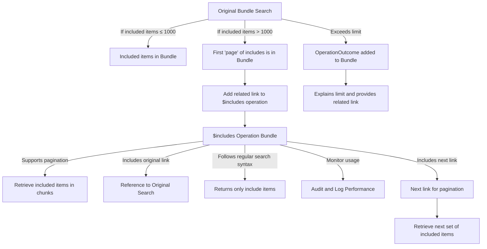

# ADR: Implementing $includes Operation for Managing FHIR Bundle Includes
Labels: [Specification](https://github.com/microsoft/fhir-server/labels/Specification) | [API](https://github.com/microsoft/fhir-server/labels/Area-API)

## Context
FHIR API users and developers need a scalable solution for handling included resources (_include and _revInclude) within a search bundle. Currently, performance constraints limit the number of included items to 1000. When this limit is exceeded, all additional included items are truncated, making it difficult to retrieve necessary data efficiently. The new $includes operation is introduced to allow separate retrieval of included items with support for pagination, maintaining API performance and usability. 

Key considerations:
- Ensuring that included resources are accessible beyond the 1000-item limit.
- Supporting pagination for large datasets.
- Maintaining consistency with standard FHIR search behavior.
- Providing clear feedback through OperationOutcome when the limit is exceeded.

## Decision
We will implement the $includes operation, which will allow users to retrieve included items separately when the 1000-item limit is exceeded. The implementation will:
- Include the first 'page' of Include items in the original bundle.
- Provide a related link in the original bundle pointing to the $includes operation.
- Support pagination within the $includes operation to facilitate efficient retrieval of large datasets.
- Include an original link in the $includes response bundle, referencing the original search request.
- Maintain standard FHIR search syntax and behavior, ensuring consistency for users.
- Log and audit usage of the $includes operation for performance monitoring.

## Status
Accepted

## Consequences
- **Positive Impacts:**
  - Improved API performance by offloading included resource retrieval to a separate operation.
  - Enables users to access all included resources even when exceeding the bundle limit.
  - Provides a structured approach to handling large datasets through pagination.
  - Maintains consistency with existing FHIR search functionality.
  
- **Potential Drawbacks:**
  - Introduces an additional step for users retrieving included resources.
  - Requires implementation effort to support pagination and logging mechanisms.

Overall, this decision enhances FHIR API usability while ensuring performance constraints are respected.
