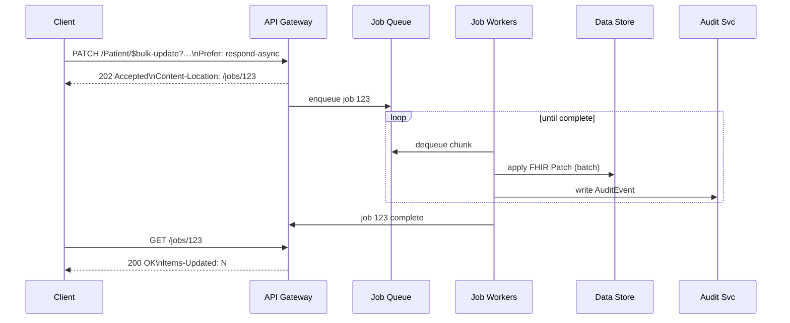

# ADR Introduce `$bulk-update` FHIR Operation
*Labels*: [Specification](https://github.com/microsoft/fhir-server/labels/Specification) | [API](https://github.com/microsoft/fhir-server/labels/Area-API) | [Asynchronous-Jobs](https://github.com/microsoft/fhir-server/labels/Area-Asynchronous-Jobs)

---

## Scope
This operation is only applicable to Azure Health Data Services - FHIR service

## Context
Our platform already supports the FHIR `$import` feature for incremental loads. Customers need a **large‑scale partial‑update capability** that:
- re‑uses **FHIR Patch** semantics (encoded as a `Parameters` resource — **not** JSON Patch)
- supports **FHIR Patch** semantics operation `replace`. Other operation types such as Move, Add, Insert, and Delete are not supported to ensure updates remain idempotent
- introduces a new operation `upsert`, which functions as `add` when the element does not exist and as `replace` when it does.
- leverages the [FHIR Asynchronous pattern](https://hl7.org/fhir/async.html)
- lets them choose resources with familiar expressive search, including `_include` / `_revinclude`
- operates at **system** scope (`/$bulk-update`) or **type** scope (`/[ResourceType]/$bulk-update`).
- enables updating specific field values per resource type based on the provided `resource type field mapping.`
- updates `metadata` properties, such as `version` and `lastUpdatedDate`, whenever a resource is modified.
- provides a query to retrieve the list of resources that will be updated.
- returns a response detailing the **resource count succeeded, resource count failed to patch and resource count ignored per resource type.**
- logs an audit entry for the bulk update operation, including the **list of resource IDs successfully updated and any errors with the list of resource IDs that failed to update.**

### Use‑cases 
| # | Scenario |
|---|----------|
| 1 | Correct a demographic error in millions of `Patient` records |
| 2 | Add or replace security labels on many `Observation`s linked to a cohort |
| 3 | Stamp every resource in a tenant with a provenance tag after migration |
| 4 | Update all `ServiceRequest` records with a new category within the FHIR service without manually extracting and updating them |
| 5 | Update `security tags` or `unit values` in bulk, based on changes announced by third-party sources |
| 6 | Map resources referencing old `Patient` Id to new `Patient` Id |
| 7 | `MedicationRequest` resources referencing the outdated medication need to be updated to reference the new replacement Medication |

### Decision
- Server processes only one bulk-update job at a time. If a new job is submitted while an existing one is in progress, the request will be rejected with a valid reason provided to the customer. This prevents conflicts during resource updates that could corrupt the data.
- The bulk-update endpoint accepts an `isParallel` flag, which defaults to `true`. When isParallel is set to true and there are no search parameters in the request, the BulkUpdate orchestrator creates processing jobs on partitions based on *resource type and surrogate ID ranges*, similar to the export job. These jobs run in `parallel` to maximize throughput.
- If isParallel is set to true and search parameters are included in the request, the BulkUpdate orchestrator reads all pages of data, including the included results, and creates processing jobs at each `continuationToken` level. These jobs also run in `parallel` to maximize throughput.
- When isParallel is set to false, the BulkUpdate orchestrator enqueues a single processing job that reads each page of data and performs updates sequentially. This approach results in relatively lower throughput.
- A single transaction will update *1,000* resources using the Merge stored procedure, similar to other background jobs.
- Updates on certain resource types could render the user's database invalid. To prevent this, specific resource types like `SearchParameter` and `ValueSet` will be excluded from bulk-update operations at both the system and resource type levels. (Previously, issues with ValueSet updates were encountered during bundle operations.)
- Every patch `path` **must start with the `ResourceType` root** (e.g., `Patient.meta.tag`) to disambiguate meta‑level vs element updates. 
- To patch the *Common properties* users should use `Resource`. (e.g., `"name": "path", "valueString": "Resource"`)
- The bulk-update job must run to completion, with retry logic in place to handle transient, connectivity, or availability failures.
- Transient, connectivity, or availability failures during job processing should not result in duplicate entries being added to a resource. To prevent this, updates should be processed in chunks wrapped within a `transaction`. 
- If the user cancels the job, any updates that have already been committed *cannot be rolled back*.
- A resource will only be updated, along with its metadata (e.g., version and last update time), when an actual change occurs.
- If the update request results in an invalid resource, the update will fail for all resources of the same type. The count of resources that failed to patch will be reported to the user. User can run the regular FHIR Patch on an individual resource to get the detailed error message.
- If you attempt to `replace` an element that does not exist on a resource during a FHIR Patch call, the operation will fail for that specific resource. However, resources that already contain the element will be updated successfully. In such cases, the job will result in a soft failure with partial success. This behavior is consistent with the bulk-update operation as well.
- If no resources are returned by the search query, the FHIR Patch call will fail with a "Resource Not Found" response and a 404 Bad Request status. However, for the bulk-update operation, the job should return success with a resource updated count of 0.
- Customers should use a `GET` query to retrieve the list of resources that will be updated. It is challenging to provide the search query or resource list for asynchronous background jobs.
- To prevent log overloading, audit entries for bulk-update operations should be recorded in chunks, following the same approach used for bulk-delete operations.
- Bulk-update operations will not allow profile validation on resources for now.
- Based on previous performance runs, we are projecting around 1000 resources per seconds as a throughput.
- Bulk-update is a powerful operation. To prevent malicious usage or improper handling, an additional RBAC role, such as "Fhir Bulk Data operator," should be introduced.
- Bulk-updates should allow `_include=* and _revinclude=*`

### Functional behaviour

- **Invocation**  
  `PATCH [base]/$bulk-update | /{ResourceType}/{$bulk-update }?{search-params}`  
  *Headers*: `Prefer: respond-async`, `Content-Type: application/fhir+json` &nbsp;•&nbsp; *Body*: **FHIR Patch** `Parameters` resource  

  Example (request for **use‑case #2 – security‑label propagation**):

  ```http
  PATCH Patient/$bulk-update?_source=internalehr&_revinclude=Observation:patient
  Prefer: respond-async
  Content-Type: application/fhir+json
  {
    "resourceType": "Parameters",
    "parameter": [
        {
        "name": "operation",
        "part": [
          { "name": "type",  "valueCode": "replace" },
          { "name": "path",  "valueString": "Resource.meta.security" },
          { "name": "value", "valueCoding": {
              "system": "http://example.org/consent",
              "code":   "no-share"
          }}
        ]
      }
    ]
  }
  ```

- **Multiple operations** – Multiple operations can be provided for various ResourceTypes
- **Search parity** – Supports the full search grammar of the FHIR Server, including `_include` and `_revinclude`.
- **Resource‑typed paths** – Every patch `path` **must start with the `ResourceType` root** (e.g., `Patient.meta.tag`) to disambiguate meta‑level vs element updates. Common properties may be patched with `Resource`.
- **Heterogeneous search rule** – If the search returns *multiple* resource types, the patch is **applied only** to items whose type matches the `ResourceType` prefix in each `path`; other types are ignored.
- **Scopes** – Allowed on the entire system or a single resource type or multiple resource types. If different fields needs to be updated per resource type then the field value mapping could be provided in different operations.
- **Logging** – Should have the audit log for each bulk-update call with the resource IDs of the items that have been updated successfully. In case of error, should provide the valid reason with failed to update resource IDs.
- **Partial updates** – Resources with valid requests should get updated. The failed resources should be logged with the reason.
- **Supports upsert operations** - Unlike FHIR PATCH, with bulk-update user can pass in operation type as `upsert`, which would replace the element if it already exists.
- **Use existing oprtation type** - Operation type such as `replace` will function in the same way as the FHIR Patch call.

###  High‑Level Flow



###  In-depth work Flow
* [Bulk Update workflow](https://github.com/microsoft/fhir-server/blob/main/docs/flow%20diagrams/bulk-update.md)

### Job pattern

| Step | Behaviour |
|------|-----------|
| Submit | Server returns **202 Accepted** with `Content-Location: {pollingUrl}` |
| Processing | Job queued; workers update resources in chunks (≥ 1 000 items/sec target) |
apurvabhaleMS marked this conversation as resolved.
| Processing | Job processing; Polling URL returns **202 Accepted** with the progess it has made. Headers: `Items-Updated`, `X-Error-Count`
| Complete | Polling URL returns **200 OK** when done. Headers: `Items-Updated`, `X-Error-Count` |
| Outputs | `OperationOutcome` (no PHI) |
| Cancel | `DELETE {pollingUrl}` ⇒ **202 Accepted** → job status = `cancelled` |
| Audit & Metrics | Each update emits an `AuditEvent` (`update\|bulk-update`) and increments metric |
| Events | Updated items will cause an event in Azure FHIR Events |

---

## Status
Accepted

---

### Consequences

| Benefit | Consequence |
|---------|-------------|
| Mass partial updates without full re‑imports | Higher write load on datastore |
| Detailed audit trail | Increased `AuditEvent` volume |

---

### Estimated performance numbers based on previous runs on Update operation
For soft $bulk-delete, we achieved around 1600 reosurces per seconds. We are projecting around 1000 resources per seconds as a throughput.

---
### For future
- At present, we are only permitting `Upsert` and `Replace` patch operations to ensure idempotency. Allowing operations like `Add` would compromise idempotency, potentially leading to data being added multiple times, which is not desirable. Users can utilize the query clause in Patch operations to ensure that only resources that have not been updated are modified.

### Some notes
- New operation is called as bulk-update and not bulk-patch(even though it follows FHIR Patch semantics) because there are some differences between how FHIR Patch works vs how the bulk-update would run. You would find the differences in Decision section above

## Working of FHIR Patch
- Attempting to add an element to a resource that already contains it will result in a 400 Bad Request error.
- Attempting to replace an element that does not exist will result in a 400 Bad Request error.
- Submitting repeated requests to add elements to an array will result in duplicate entries being added.
- If the search query returns no resources, a  404 "Resource Not Found" response will be returned.
- If the search query returns multiple resources, an error indicating that the search criteria are not specific enough will be returned.

## References
* [Asynchronous Bulk Data Request Pattern](https://hl7.org/fhir/async.html)  
* [FHIR Patch](https://hl7.org/fhir/fhirpatch.html)  