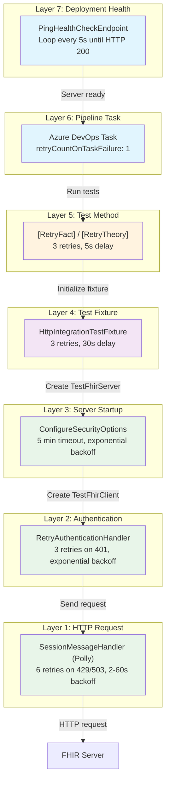

# ADR 2512: Multi-Layer Test Retry Strategy for Transient Failures

## Context

E2E and integration tests against remote Azure FHIR servers experience transient failures from various sources:

- **401 Unauthorized**: Token acquisition timing issues, AAD propagation delays after deployment
- **429 Too Many Requests**: Throttling from Azure services (CosmosDB, App Service)
- **503 Service Unavailable**: Server startup in progress, deployment not yet complete
- **404 Not Found**: Health check endpoint returns 404 during app initialization (before routes registered)
- **500 Internal Server Error**: Transient backend issues during server warmup
- **Network errors**: Timeouts, connection resets, socket exceptions

A single retry mechanism is insufficient because failures occur at different layers of the test infrastructure, each with different characteristics and recovery strategies. For example:
- A 429 throttling error needs exponential backoff respecting `Retry-After` headers
- A 401 authentication error needs token invalidation and re-acquisition
- A fixture initialization failure needs the entire server connection to be re-established
- A test failure from eventual consistency needs the test logic itself to retry

## Decision

We implement a **defense-in-depth** retry strategy with 7 layers, each targeting specific failure modes at different points in the test execution lifecycle.

### Visual Overview



### Layer Details

| Layer | Component | Retry Configuration | Failure Types Handled | Source Location |
|-------|-----------|---------------------|----------------------|-----------------|
| **7** | `PingHealthCheckEndpoint` | Loop every 5s until HTTP 200 | Server not ready after deployment | [`build/jobs/provision-healthcheck.yml`](../../build/jobs/provision-healthcheck.yml) |
| **6** | `retryCountOnTaskFailure` | 1 retry (entire test task) | Any unhandled test task failure | [`build/jobs/*.yml`](../../build/jobs/) |
| **5** | `[RetryFact]`/`[RetryTheory]` | 3 retries, 5s delay (configurable) | Transient test failures, eventual consistency | [`src/Microsoft.Health.Extensions.Xunit/`](../../src/Microsoft.Health.Extensions.Xunit/) |
| **4** | `HttpIntegrationTestFixture` | 3 retries, 30s delay | Fixture initialization failures | [`test/.../HttpIntegrationTestFixture{TStartup}.cs`](../../test/Microsoft.Health.Fhir.Shared.Tests.E2E/Rest/HttpIntegrationTestFixture%7BTStartup%7D.cs) |
| **3** | `ConfigureSecurityOptions` | 5 min timeout, exponential backoff (5-30s) | Metadata fetch failures during startup | [`test/.../TestFhirServer.cs`](../../test/Microsoft.Health.Fhir.Shared.Tests.E2E/Rest/TestFhirServer.cs) |
| **2** | `RetryAuthenticationHandler` | 3 retries, exponential backoff (2-8s) | 401 Unauthorized, token acquisition issues | [`test/.../RetryAuthenticationHttpMessageHandler.cs`](../../test/Microsoft.Health.Fhir.Shared.Tests.E2E/Rest/RetryAuthenticationHttpMessageHandler.cs) |
| **1** | `SessionMessageHandler` | 10 retries, exponential backoff (2-60s) | 429 throttling, 500 server errors, 503 unavailable | [`test/.../TestFhirServer.cs`](../../test/Microsoft.Health.Fhir.Shared.Tests.E2E/Rest/TestFhirServer.cs) |

### Layer 7: Deployment Health Check (`PingHealthCheckEndpoint`)

After Azure App Service deployment, the server may return 404 or intermittent errors for several minutes while the application initializes. The health check script waits for **5 consecutive HTTP 200 responses** within a **10-minute timeout**:

```powershell
# build/jobs/provision-healthcheck.yml
$consecutiveSuccessRequired = 5
$timeoutMinutes = 10

Do {
  Start-Sleep -s 5
  $response = Invoke-WebRequest -URI $healthCheckUrl
  
  if ($response.StatusCode -eq 200) {
    $consecutiveSuccessCount++
  } else {
    $consecutiveSuccessCount = 0  # Reset on any non-200
  }
  
  # Exit with error if timeout exceeded
  if ($currentTime -gt $timeoutTime) { exit 1 }

} While ($consecutiveSuccessCount -lt $consecutiveSuccessRequired)
```

The consecutive success requirement ensures the server is **stably healthy**, not just responding once before becoming unavailable again. If the timeout is exceeded, the task fails and `retryCountOnTaskFailure: 1` triggers a retry of the entire health check.

### Layer 6: Pipeline Task Retry (`retryCountOnTaskFailure`)

Azure DevOps pipeline tasks are configured to retry once on any failure:

```yaml
# build/jobs/e2e-tests.yml, run-tests.yml, build.yml, run-export-tests.yml
- task: DotNetCoreCLI@2
  inputs:
    command: 'test'
    # ...
  retryCountOnTaskFailure: 1
```

This provides a catch-all safety net that handles any failure not caught by lower layers.

### Layer 5: xUnit Test-Level Retry (`[RetryFact]`/`[RetryTheory]`)

Custom xUnit attributes that retry individual test methods:

```csharp
// Default: 3 retries, 5 second delay, no retry on assertion failures
[RetryFact]
public async Task MyTest() { }

// Custom configuration
[RetryTheory(MaxRetries = 5, DelayBetweenRetriesMs = 10000)]
[InlineData("value1")]
public async Task MyParameterizedTest(string value) { }

// Retry even on assertion failures (for eventually-consistent tests)
[RetryFact(RetryOnAssertionFailure = true)]
public async Task EventuallyConsistentTest() { }
```

**Important**: By default, `RetryOnAssertionFailure = false` because assertion failures usually indicate test bugs, not transient issues. Set to `true` only for tests validating eventually-consistent systems (cache refresh, reindex operations, etc.).

### Layer 4: Fixture Initialization Retry (`HttpIntegrationTestFixture`)

The test fixture retries the entire server initialization sequence:

```csharp
// HttpIntegrationTestFixture{TStartup}.cs
private const int MaxInitializationRetries = 3;
private static readonly TimeSpan InitializationRetryDelay = TimeSpan.FromSeconds(30);

public async Task InitializeAsync()
{
    for (int attempt = 1; attempt <= MaxInitializationRetries; attempt++)
    {
        try
        {
            TestFhirServer = await _testFhirServerFactory.GetTestFhirServerAsync(...);
            TestFhirClient = TestFhirServer.GetTestFhirClient(...);
            return; // Success
        }
        catch (Exception ex)
        {
            if (attempt < MaxInitializationRetries)
                await Task.Delay(InitializationRetryDelay);
        }
    }
    throw new InvalidOperationException("Fixture initialization failed after retries");
}
```

### Layer 3: Server Startup Retry (`ConfigureSecurityOptions`)

When creating a `TestFhirServer`, the metadata endpoint is fetched with retry logic to handle server startup delays:

```csharp
// TestFhirServer.cs - ConfigureSecurityOptions
var overallTimeout = TimeSpan.FromMinutes(5);
while (overallStopwatch.Elapsed < overallTimeout)
{
    response = await httpClient.SendAsync(metadataRequest);
    if (response.IsSuccessStatusCode) break;
    
    // Retry on 5xx, 401, 503 with exponential backoff (5s to 30s)
    await Task.Delay(delay);
}
```

### Layer 2: Authentication Retry (`RetryAuthenticationHttpMessageHandler`)

Handles transient 401 errors by invalidating the cached token and retrying:

```csharp
// RetryAuthenticationHttpMessageHandler.cs
while (response.StatusCode == HttpStatusCode.Unauthorized && attempt < _maxRetries)
{
    _credentialProvider.InvalidateToken();  // Force fresh token
    await Task.Delay(exponentialBackoff);
    response = await base.SendAsync(clonedRequest, cancellationToken);
}
```

### Layer 1: HTTP Request Retry (`SessionMessageHandler` with Polly)

The innermost retry layer handles throttling, transient HTTP errors, and server errors:

```csharp
// TestFhirServer.cs - SessionMessageHandler
_polly = Policy
    .Handle<HttpRequestException>(x => x.InnerException is IOException or SocketException)
    .Or<TaskCanceledException>(ex => !cancellationToken.IsCancellationRequested)
    .OrResult<HttpResponseMessage>(m =>
        m.StatusCode == HttpStatusCode.TooManyRequests ||
        m.StatusCode == HttpStatusCode.ServiceUnavailable ||
        m.StatusCode == HttpStatusCode.InternalServerError)
    .WaitAndRetryAsync(
        retryCount: 10,
        sleepDurationProvider: (retryAttempt, result, context) =>
        {
            // Honor Retry-After header on 429 responses
            if (result.Result?.Headers.TryGetValues("Retry-After", out var values) == true)
                return TimeSpan.FromSeconds(int.Parse(values.First()));
            
            // Exponential backoff: 2s, 4s, 8s, 16s, 32s, 60s, 60s, 60s, 60s, 60s (capped)
            return TimeSpan.FromSeconds(Math.Min(Math.Pow(2, retryAttempt), 60));
        });
```

## When to Use `[RetryFact]` vs `[Fact]`

### Use `[RetryFact]` or `[RetryTheory]` when:

- ✅ Test calls external services (Azure, AAD, CosmosDB, SQL Server)
- ✅ Test validates eventually-consistent behavior (with `RetryOnAssertionFailure = true`)
- ✅ Test has known transient infrastructure dependencies
- ✅ Test is in E2E or Integration test projects

### Use standard `[Fact]` or `[Theory]` when:

- ✅ Test is a unit test with fully mocked dependencies
- ✅ Test failure indicates a real bug that should not be masked
- ✅ Retry would hide actual issues in the code under test
- ✅ Test is deterministic and should never have transient failures

## Consequences

### Benefits

1. **Improved CI Stability**: Significant reduction in flaky test failures from transient infrastructure issues
2. **Self-Healing Tests**: Tests automatically recover from temporary Azure service disruptions
3. **Clear Separation of Concerns**: Each layer handles specific failure modes with appropriate strategies
4. **Safety Net**: `retryCountOnTaskFailure` provides catch-all protection for unexpected failures
5. **Visibility**: Console logging at each retry layer aids debugging when retries occur

### Trade-offs

1. **Extended Test Duration**: On transient failures, tests may take several minutes to complete
   - Worst case: Layer 1 (6 retries × 60s) + Layer 2 (3 × 8s) + Layer 4 (3 × 30s) + Layer 5 (3 × 5s) = ~8+ minutes
2. **Code Complexity**: Multiple retry mechanisms add complexity to test infrastructure
3. **Risk of Masking Bugs**: Excessive retry usage could hide real issues
4. **Compound Delays**: Multiple retry layers can compound, leading to very long waits

### Operational Guidance

1. **Prefer higher layers over lower layers** for new retry needs (pipeline/xUnit over HTTP)
2. **Use `[RetryFact]` sparingly** - most unit tests should use standard `[Fact]`
3. **Set `RetryOnAssertionFailure = true` only** for eventually-consistent validation scenarios
4. **Monitor test durations** - excessive retries may indicate underlying infrastructure issues that need addressing
5. **Check console output** when investigating failures - retry logging shows which layer handled the failure
