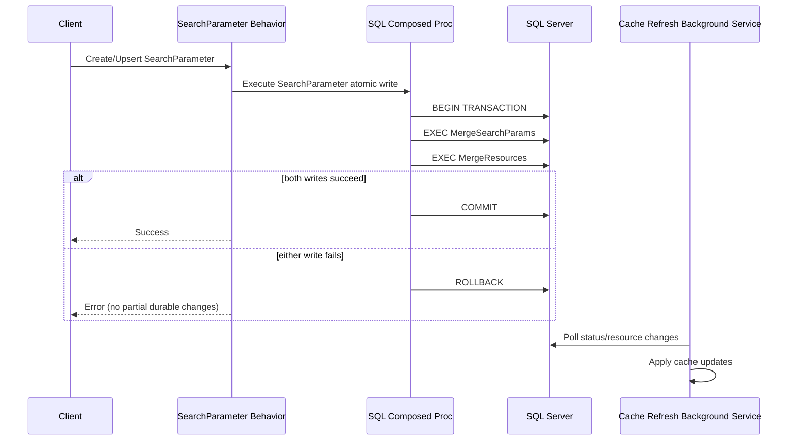
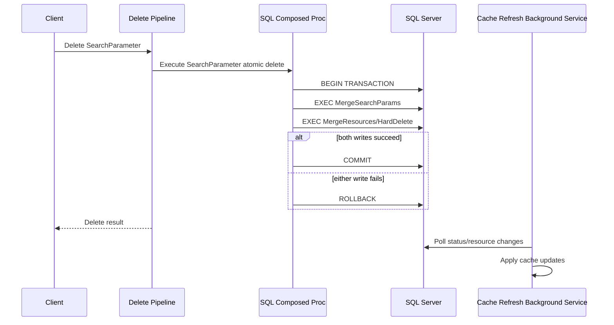

# ADR 2602: Atomic SearchParameter CRUD and Cache Refresh Ownership
*Labels*: [SQL](https://github.com/microsoft/fhir-server/labels/Area-SQL) | [Core](https://github.com/microsoft/fhir-server/labels/Area-Core) | [SearchParameter](https://github.com/microsoft/fhir-server/labels/Area-SearchParameter)

---

## Context

SearchParameter create, update, and delete operations coordinate state across:

- SearchParameter status persistence (`SearchParam` table)
- SearchParameter resource persistence (`Resource` table and related write paths)
- In-memory SearchParameter cache updates (`ISearchParameterDefinitionManager`)

Before this change, SearchParameter status writes and resource writes were performed in separate steps in the request pipeline. Partial failure windows could leave durable state inconsistent.

This branch introduces a composed write pattern that carries SearchParameter status updates alongside resource persistence, with SQL transaction ownership in the SQL data store path.

The design also introduces request-scoped buffering of pending SearchParameter status changes, so behaviors no longer persist status directly.

Primary implementation points in this branch:

- `CreateOrUpdateSearchParameterBehavior` and `DeleteSearchParameterBehavior` queue pending status updates in request context (`SearchParameter.PendingStatusUpdates`)
- `SqlServerFhirDataStore` detects pending status updates and switches to `dbo.MergeSearchParams` (instead of `dbo.MergeResources`) so status + resource writes are composed in one SQL operation
- `MergeSearchParams` was expanded to accept resource TVPs and invoke `MergeResources` within the same SQL transaction
- SQL schema version `104` adds the migration and stored procedure contract changes
- `CosmosFhirDataStore` persists pending status updates after successful SearchParameter resource upsert (best-effort sequencing, not a single datastore transaction)

Historical failure scenarios addressed by this change include:

- Status persisted but resource write fails
- Resource write succeeds while status write path fails

These failures could produce orphaned/lagging status-state behavior.

The problem affects:

- `CreateOrUpdateSearchParameterBehavior` create/upsert path
- `DeleteSearchParameterBehavior` single delete path

Conditional and bulk delete flows were not explicitly redesigned in this branch beyond behavior-level status queuing where those behavior pipelines are used.

## Decision

We implement SQL-composed SearchParameter writes for SQL Server so SearchParameter status and resource persistence execute in one stored-procedure-owned transaction when pending status updates are present.

### SQL write ordering (implemented)

1. `dbo.MergeSearchParams` applies SearchParameter status updates
2. `dbo.MergeSearchParams` invokes `dbo.MergeResources` with resource payload TVPs
3. Commit only when both operations succeed
4. Roll back both if either fails

### Scope

This decision currently applies to:

- Create and upsert of SearchParameter resources
- Single delete of SearchParameter resources

This branch does **not** assert a new cross-store atomic transaction model for Cosmos DB.

This decision does not change:

- Existing optimistic concurrency semantics of SearchParameter status rows (now enforced via `MergeSearchParams` conflict check)
- Existing SearchParameter status values and lifecycle states
- Non-SearchParameter resource CRUD behavior

### Transaction boundary strategy

For SQL Server, transaction ownership is at the stored procedure boundary (`MergeSearchParams`), not at application-layer multi-call orchestration.

Rationale:

- Aligns required ordering (`status -> resource`) in one SQL atomic unit
- Eliminates app-layer partial-commit windows in SQL SearchParameter paths
- Makes transaction ownership explicit at the stored-procedure boundary

### Status write ownership and cache behavior

Request behaviors now queue pending status updates in request context and defer persistence to the data store layer.

`SearchParameterOperations` still performs in-memory definition-manager updates for validation and transition handling in request flow, while convergence across instances remains driven by status/resource refresh (`GetAndApplySearchParameterUpdates`) and background refresh flows.

### Behavioral Expectations

For SQL Server SearchParameter CRUD through the composed path:

- No durable partial commit between status and resource persistence
- Failures result in full rollback of the SearchParameter operation unit
- Cache visibility across instances remains eventually consistent until refresh applies

For Cosmos DB SearchParameter CRUD in this branch:

- Pending statuses are flushed after SearchParameter resource upsert
- Ordering is improved, but status/resource writes are not wrapped in a single Cosmos transactional unit

### Sequence Diagrams

#### Create/Upsert SearchParameter (Atomic)

#### Delete SearchParameter (Single)

## Status

Accepted - Implemented in this branch (SQL schema 104 required for full SQL composed path)

## Consequences

### Benefits

- Eliminates orphaned status/resource records caused by partial commits
- Improves SearchParameter data integrity in SQL create/update/delete composed paths
- Clarifies ownership model: behaviors queue status intent, data stores persist
- Preserves refresh-driven cross-instance convergence for SearchParameter cache

### Trade-offs

- Increased implementation complexity across behavior, request context, and data-store write orchestration
- SQL procedure contracts and schema migration complexity increased (`MergeSearchParams` + schema 104)
- Cosmos path is improved sequencing rather than single-unit atomic commit

### Risks and Mitigations

- **Risk**: Longer transaction lifetimes could increase lock contention.
  - **Mitigation**: Keep composed transaction scope narrow and continue instrumentation.
- **Risk**: Request-context pending status payload can be left stale if not cleared correctly.
  - **Mitigation**: Data stores clear processed pending status entries after successful persistence.
- **Risk**: Cosmos path may still permit cross-write inconsistency on failure between resource write and status upsert.
  - **Mitigation**: Keep refresh/reconciliation behavior and targeted integration tests.

### Edge Cases

- SearchParameter upsert where prior version does not exist (upsert-as-create): status + resource are composed for SQL.
- URL change on SearchParameter update: previous URL is queued as `Deleted`; new URL is queued as `Supported`.
- Optimistic concurrency conflict in `MergeSearchParams`: resource write does not commit.
- System-defined parameters are not overwritten by refresh fetch/add path.

## Alternatives Considered

### A. SQL-composed stored procedure for status + resource writes

Selected.

- Pros: single SQL atomic unit for required ordering and failure handling.
- Cons: higher SQL contract/migration complexity.

### B. Keep current split writes and add compensating reconciliation

Rejected.

- Pros: less invasive near-term changes.
- Cons: still permits partial commit windows; relies on repair rather than prevention.

### C. Keep direct cache mutation in request path

Partially retained.

- We retained request-path definition-manager mutation where needed for validation/transition behavior, while moving durable status persistence to composed/queued flow.

## Implementation Notes

Implemented areas of change:

- Added request-context property key: `SearchParameter.PendingStatusUpdates`
- Updated create/upsert/delete SearchParameter behaviors to enqueue pending status updates
- Updated SQL data store merge wrapper to switch between `MergeResources` and `MergeSearchParams` based on pending statuses
- Expanded `MergeSearchParams` signature to accept resource TVPs and invoke `MergeResources` in one transaction
- Added SQL schema migration/version 104 and updated schema constants/project version
- Updated SQL status data store to call expanded `MergeSearchParams` contract with empty TVPs when needed
- Updated Cosmos data store to persist pending status updates after SearchParameter resource upsert
- Updated tests (unit/integration) to align with queued/composed behavior and refresh semantics

## Validation Strategy

- Unit tests for behavior constructor/flow updates and system-defined handling
- Integration tests for SearchParameter reindex/cache refresh behavior under new sequencing
- SQL schema migration + stored procedure contract validation
- Regression checks for non-SearchParameter CRUD paths

## Related ADRs

- [ADR 2512: SearchParameter Concurrency Management - Application Level Locking and Database Optimistic Concurrency](adr-2512-searchparameter-concurrency-management.md)
- [ADR 2505: Enable eventual consistency for maintaining search param indexes in sync with the Resource table](adr-2505-eventual-consistency.md)
