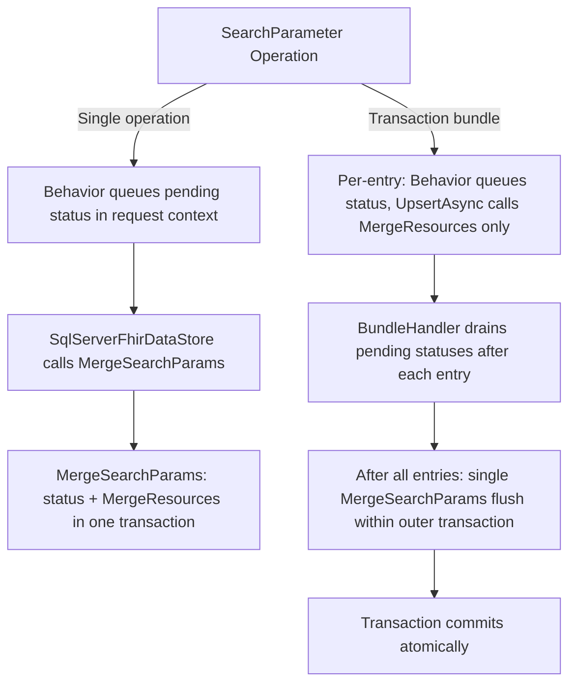

# ADR 2603: Atomic SearchParameter CRUD Operations
Labels: [SQL](https://github.com/microsoft/fhir-server/labels/Area-SQL) | [Core](https://github.com/microsoft/fhir-server/labels/Area-Core) | [SearchParameter](https://github.com/microsoft/fhir-server/labels/Area-SearchParameter)

## Context
SearchParameter create, update, and delete operations require two coordinated writes: the SearchParameter status row (`dbo.SearchParam` table) and the resource itself (`dbo.Resource` via `dbo.MergeResources`). Previously, these writes occurred in separate steps in the request pipeline, creating partial-failure windows where one could succeed while the other fails — producing orphaned or inconsistent state.

Composing these writes into a single atomic SQL operation introduced a new problem for transaction bundles: `dbo.MergeSearchParams` acquires an exclusive lock on `dbo.SearchParam` per entry, and that lock is held by the outer bundle transaction. When the next entry's behavior pipeline calls `GetAllSearchParameterStatus` on a separate connection, it blocks on the same table, causing a timeout. This required a deferred-flush approach for transaction bundles.

Additionally, SearchParameter CRUD behaviors previously performed direct in-memory cache mutations (`AddNewSearchParameters`, `DeleteSearchParameter`, etc.) during the request pipeline. This duplicated responsibility with the `SearchParameterCacheRefreshBackgroundService`, which already polls the database and applies cache updates across all instances.

Key considerations:
- Eliminating partial-commit windows between status and resource persistence.
- Handling the lock contention on `dbo.SearchParam` introduced by composed writes in transaction bundles.
- Simplifying cache ownership by removing direct cache mutations from the CRUD request path.
- Preserving existing behavior for non-SearchParameter resources and Cosmos DB paths.

## Decision
We implement three complementary changes:

### 1. Composed writes for single operations (SQL)
For individual SearchParameter CRUD, behaviors queue pending status updates in request context (`SearchParameter.PendingStatusUpdates`) instead of persisting directly. `SqlServerFhirDataStore` detects pending statuses and calls `dbo.MergeSearchParams` (which internally calls `dbo.MergeResources`) so both writes execute in one stored-procedure-owned transaction.

### 2. Deferred flush for transaction bundles
For transaction bundles, per-entry resource upserts call `dbo.MergeResources` only (no SearchParam table touch), avoiding the exclusive lock. `BundleHandler` accumulates pending statuses across all entries and flushes them in a single `dbo.MergeSearchParams` call at the end of the bundle, still within the outer transaction scope.

### 3. Cache update removal from CRUD path
SearchParameter CRUD behaviors no longer perform direct in-memory cache mutations. All cache updates (`AddNewSearchParameters`, `DeleteSearchParameter`, `UpdateSearchParameterStatus`) are now solely owned by the `SearchParameterCacheRefreshBackgroundService`, which periodically polls the database via `GetAndApplySearchParameterUpdates`. This simplifies the CRUD path and ensures consistent cache convergence across distributed instances.

### Scope
- **SQL Server**: Full atomic guarantees for create, update, and delete of SearchParameter resources, both single and in transaction bundles.
- **Cosmos DB**: Pending statuses are flushed after resource upsert (improved sequencing, not a single transactional unit).
- **Unchanged**: Non-SearchParameter CRUD, existing SearchParameter status lifecycle states, cache convergence model.

## Status
Pending acceptance

## Consequences
- **Positive Impacts:**
  - Eliminates orphaned status/resource records from partial commits.
  - Clarifies ownership: behaviors queue intent, data stores persist atomically, background service owns cache.
  - Deferred-flush approach avoids lock contention introduced by composed writes in transaction bundles.
  - Removing cache mutations from CRUD simplifies the request path and eliminates a class of cache-divergence bugs.

- **Potential Drawbacks:**
  - Increased complexity in request context, data store, and bundle handler coordination.
  - SQL schema migration required (`MergeSearchParams` expanded to accept resource TVPs).
  - Eventual consistency window: cache may lag behind database until the next background refresh cycle.
  - Cosmos DB path remains best-effort sequencing rather than true atomic commit.

