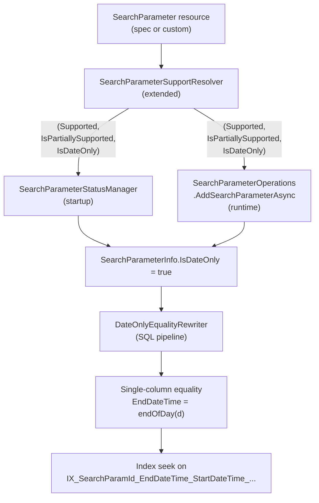

# ADR: Date-Only Search Parameter SQL Optimization
Labels: [SQL](https://github.com/microsoft/fhir-server/labels/Area-SQL), [Performance](https://github.com/microsoft/fhir-server/labels/Area-Performance)

## Context

FHIR `date`-typed search parameters are stored in `dbo.DateTimeSearchParam` as a `(StartDateTime, EndDateTime)` pair so that queries can express **overlap** semantics across `date`, `dateTime`, `instant`, `Period`, and `Timing` field types. For an equality query such as `Patient?birthdate=2016-07-06`, the Core layer emits a two-column overlap predicate of the form:

```
StartDateTime >= 2016-07-06T00:00:00Z
AND EndDateTime   <= 2016-07-06T23:59:59.9999999Z
```

`DateTimeEqualityRewriter` augments this with the cross-bounds (`StartDateTime <= endOfDay`, `EndDateTime >= startOfDay`) so the optimizer has all four sides of the box for the `(StartDateTime, EndDateTime)` index.

The `DateTimeSearchParam` table already carries two indexes:

```sql
IX_SearchParamId_StartDateTime_EndDateTime_...   -- (Start, End)
IX_SearchParamId_EndDateTime_StartDateTime_...   -- (End, Start)
```

### Observed problem

Production query logs surfaced a query of the form `Patient?identifier=<value>&birthdate=<value>` where the SQL plan chose a wide range scan over the `(Start, End)` index for the `birthdate` predicate. A side-by-side comparison of two captured plans for the same query shape showed an ~19x difference in estimated plan cost between the slow plan (range scan on `(Start, End)`) and the good plan (index seek on `(End, Start)`).

### Root cause

For a FHIR field whose type is `date` (not `dateTime`), every stored row has `StartDateTime = startOfDay(d)` and `EndDateTime = endOfDay(d)` exactly — a deterministic function of a single underlying date. The four-predicate overlap form is mathematically equivalent to a single-column equality (`EndDateTime = endOfDay(d)` or, equivalently, `StartDateTime = startOfDay(d)`), but the optimizer cannot prove this from the predicates alone because the equality rewriter and bounded-range rewriter are written generically for the date/dateTime/instant/Period/Timing case where Start ≠ End is possible.

The optimizer therefore picks an index based on selectivity heuristics that assume the two columns are independent, and it sometimes picks `(Start, End)` and performs a wider scan than necessary. For date-only fields we have static knowledge that lets us collapse the predicate set to a single-column equality and let SQL perform a clean index seek every time.

### Why a derived metadata flag (and not a `SearchParamType` value)

The FHIR `SearchParameter.type` value set defines exactly nine values: `number | date | string | token | reference | quantity | uri | composite | special`. There is no `datetime` value, and a `date`-typed search parameter can target fields whose underlying types are `date`, `dateTime`, `instant`, `Period`, or `Timing` — the type describes the **query syntax** the parser accepts, not the storage shape of the underlying field. A `Patient.birthDate` search param and an `Observation.effective[x]` search param are both `SearchParamType.Date`, but only the first stores full-day overlaps.

The optimization concern is therefore orthogonal to `SearchParamType`. Modeling it as a derived `bool` on `SearchParameterInfo` matches the existing precedent for derived per-parameter metadata (`IsSearchable`, `IsSupported`, `IsPartiallySupported`, `SortStatus`) and keeps the FHIR-spec-bound enum unchanged.

## Decision

We will introduce a derived metadata flag on `SearchParameterInfo` that captures the storage shape of a date-typed search parameter, compute it during search-parameter resolution, and use it to drive a SQL-side rewriter that collapses the equality overlap predicate to a single-column equality.

### Components



### 1. Metadata: `SearchParameterInfo.IsDateOnly`

Add `public bool IsDateOnly { get; set; }` to `SearchParameterInfo`, defaulting to `false`. Match the existing `{ get; set; }` pattern used by `IsSearchable`, `IsSupported`, `IsPartiallySupported`, and `SortStatus`. The flag is derived metadata and **must not** be included in `CalculateSearchParameterHash` (the hash is reserved for fields that affect on-disk indexing).

The flag is `true` if and only if every type-resolution result for the parameter's expression has `FhirNodeType == "date"` (and the parameter has at least one resolved type). For a parameter whose expression resolves to a mix (e.g., `date` for one resource type and `dateTime` for another), the flag is `false` — the rewrite is only valid when every stored row is guaranteed to be a full-day overlap.

### 2. Resolver: extend `SearchParameterSupportResolver`

Change `ISearchParameterSupportResolver.IsSearchParameterSupported` to return `(bool Supported, bool IsPartiallySupported, bool IsDateOnly)`. The implementation already runs `_compiler.Parse(...)` + `SearchParameterToTypeResolver.Resolve(...)` per base/target type — the `IsDateOnly` value is computed from the same type results in a single pass. A code comment on the new field documents the safety property: false-negatives (e.g., custom params using `.as(date)` syntax) reduce to "miss the optimization," never to "produce wrong results."

Both consumers — `SearchParameterStatusManager.EnsureInitializedAsync` (startup) and `SearchParameterOperations.AddSearchParameterAsync` at the two existing call sites (runtime custom-parameter registration) — read the new field and assign it to `searchParameterInfo.IsDateOnly`.

### 3. Resolver hardening: `SearchParameterToTypeResolver.GetMapping(string)`

Today the string overload coalesces both `"DATE"` and `"DATETIME"` to `typeof(FhirDateTime)`, which causes `FhirNodeType` to surface as `"dateTime"` even when the source expression said `.as(date)` or `.ofType(date)`. Split the cases so `"DATE"` returns `typeof(Date)` (yielding `FhirNodeType = "date"`). This closes a false-negative for custom search parameters that use string-cast syntax. The change is a one-line addition and does not affect existing date/dateTime parsing logic.

### 4. Rewriter: `DateOnlyEqualityRewriter`

New class in `Microsoft.Health.Fhir.SqlServer/Features/Search/Expressions/Visitors/`, mirroring the static `Instance` + inner `Scout` pattern used by `DateTimeBoundedRangeRewriter`. The rewriter runs **before** `DateTimeEqualityRewriter` in `SqlServerSearchService.CreateDefaultSearchExpression` and visits each `SearchParameterExpression`:

- If `expression.Parameter.IsDateOnly == false`, pass through unchanged.
- If `expression.Parameter.IsDateOnly == true` and the inner expression matches Core's emitted equality pattern `(StartDateTime GE startOfDay) AND (EndDateTime LE endOfDay)`, replace the pair with a single `(EndDateTime EQ endOfDay)` binary expression.
- Otherwise (range operators, missing predicate side, composite components), pass through unchanged. `DateTimeEqualityRewriter` then runs and no-ops on the rewritten subtree because the pattern it looks for is gone.

Composite parameters are out of scope for this iteration: the rewriter does not recurse into `Component`. Adding composite support is a follow-up.

The rewriter chooses `EndDateTime` (rather than `StartDateTime`) so it matches the empirically-good plan that uses `IX_SearchParamId_EndDateTime_StartDateTime_...`. Either column would be semantically correct.

### 5. Schema

No schema migration. Both the `(Start, End)` and `(End, Start)` indexes already exist on `dbo.DateTimeSearchParam` (lines 24 and 39 of `DateTimeSearchParam.sql`).

### Tests

- `SearchParameterInfoTests` — `IsDateOnly` defaults to `false`; hash invariance (changing the flag does not change `CalculateSearchParameterHash`).
- `SearchParameterSupportResolverTests` — returns `IsDateOnly = true` for `Patient-birthdate`; `false` for `Observation-date`; `true` for a custom param using `.as(date)` (after the `GetMapping` fix); `false` for a parameter whose expression resolves to a mixed `date`/`dateTime` set across resource types.
- `DateOnlyEqualityRewriterTests` — collapses the equality pattern when `IsDateOnly == true`; pass-through when `false`; pass-through for non-equality predicates; pass-through when only one side of the pair is present; pass-through for composite parameters.
- E2E (existing `Patient?birthdate=` coverage) — add a regression test asserting result-set equivalence pre/post optimization for at least equality and one range query (the latter exercises the pass-through path).

### Deferred work: range operators

The plan originally proposed extending the rewriter to all date-only operators (`gt`, `lt`, `ge`, `le`, `sa`, `eb`) by replacing `StartDateTime` with `EndDateTime` in the predicate. This proved unsound on inspection: a query such as `Patient?birthdate=gt2016-07-06` emits `StartDateTime > 2016-07-06T23:59:59.9999999Z`, and a blind column rename to `EndDateTime > 2016-07-06T23:59:59.9999999Z` would change which stored rows match (a row with `Date = 2016-07-06` has `End = endOfDay(2016-07-06)` which would match `> endOfDay(2016-07-06)`-1tick but not `> endOfDay(2016-07-06)` exactly — and the analogous mismatches for `lt`, `ge`, `le` are worse).

Correctly collapsing range operators on a date-only column requires a per-operator value-shift rule (e.g., `gt d` → `End > endOfDay(d)`; `lt d` → `Start < startOfDay(d)`; `ge d` → `End >= endOfDay(d)` only after re-anchoring; etc.) and a careful enumeration of `sa` / `eb` semantics. The motivating production trace was an equality query, so the v1 scope is intentionally restricted to the equality case where the correctness argument is straightforward and the perf win is fully captured.

The `(End, Start)` index alone may also continue to provide acceptable range-query performance once equality queries stop competing for the `(Start, End)` index plan-cache slot; the v1 measurement should inform whether range-operator work is still needed.

### Performance / observability

The expected plan-cost improvement on the motivating query shape is ~19x, based on the side-by-side plan comparison from the production trace. The v1 release should be accompanied by:
- A targeted dashboard query confirming the rewriter fires on `Patient?birthdate=` traffic in production.
- A spot-check of the per-statement CPU/duration metrics for the affected query shape.

## Status

Accepted.

## Consequences

### Benefits

- Equality queries on FHIR `date`-typed search parameters (`Patient.birthdate` is the canonical case) get a single-column index seek instead of a two-column range scan, eliminating an observed ~19x plan-cost gap.
- The fix applies uniformly to standard FHIR search parameters and customer-defined search parameters whose expressions resolve to a `date`-typed field. Both startup and runtime registration paths are covered by extending the existing `SearchParameterSupportResolver` (single FhirPath compile + resolve pass per parameter).
- No schema migration; the optimization rides on indexes that already exist on `dbo.DateTimeSearchParam`.
- The `SearchParamType` enum remains aligned with the FHIR spec value set; downstream switch statements and parser dispatch logic are untouched.

### Drawbacks

- Adds a new derived field to `SearchParameterInfo` and a new rewriter to the SQL pipeline. The field is owned by `SearchParameterSupportResolver` and not by external callers, but the public surface area of `ISearchParameterSupportResolver` changes (return tuple grows by one field), affecting any out-of-tree consumers.
- Range operators on date-only parameters are deliberately not optimized in this iteration. If real-world traffic mirrors the equality-heavy trace that motivated this work, this is acceptable; otherwise a follow-up will be needed.
- Custom search parameters that use `.as(date)` / `.ofType(date)` string-cast syntax depend on the small `SearchParameterToTypeResolver.GetMapping` change to be detected as date-only. Without that change they silently fall back to the unoptimized path (correct, but slower).

### Risk mitigations

- The rewriter is gated by `Parameter.IsDateOnly == true`. The flag is `false` for every existing `SearchParameterInfo` until the resolver promotes it, so the behavior change is opt-in per parameter.
- The transformation is provably semantics-preserving for the equality case: for any row with `Start = startOfDay(d_row)` and `End = endOfDay(d_row)`, the original 4-predicate set and the single `End = endOfDay(d_query)` predicate accept exactly the same rows.
- A `SearchParameterInfo` whose expression resolves to a mix of `date` and `dateTime` across resource types yields `IsDateOnly = false`, so the rewrite is never applied to a parameter that could store partial-day rows.
