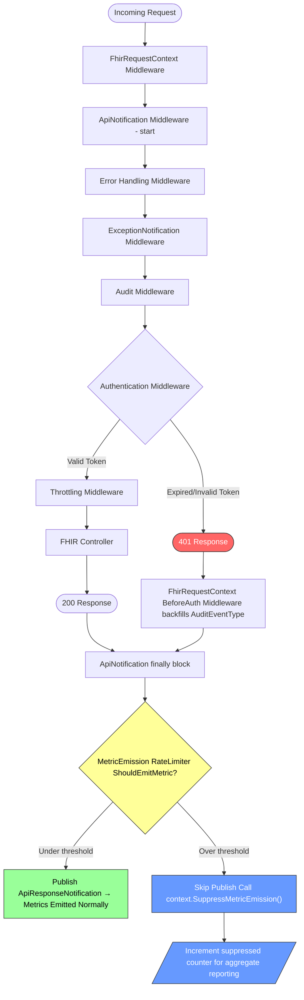
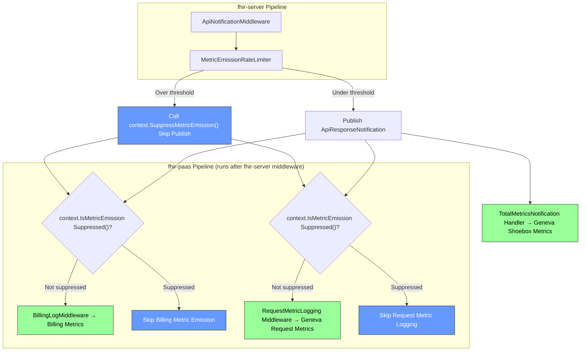
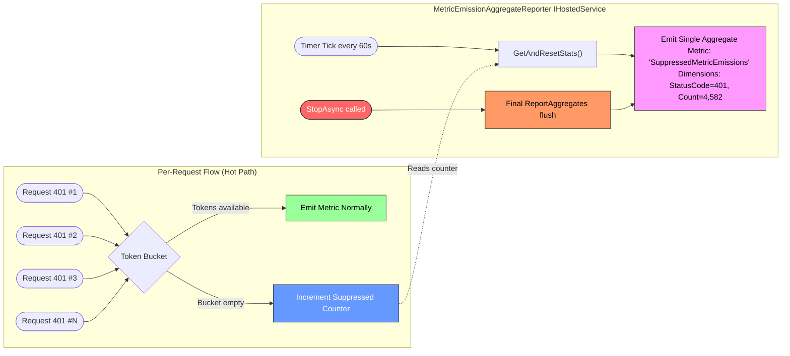

# Metric Emission Rate Limiting for Auth-Failure Flood Protection

> **Open Question — Do we need 401/403 metrics at all?**
>
> Before investing in rate-limiting infrastructure, the team should decide whether per-request metrics for 401/403 responses provide actionable monitoring value. If no dashboard, alert, or operational runbook depends on per-request 401/403 metric granularity, the simplest solution is to **skip metric emission entirely for these status codes** — a one-line guard in `ApiNotificationMiddleware` and the fhir-paas billing/metric middleware. This would eliminate the Geneva flooding problem with zero new infrastructure.
>
> If 401/403 metrics *are* valuable (e.g., for detecting credential-stuffing attacks, monitoring misconfigured clients, or tracking auth-failure trends), the rate-limiting approach in Option 2 preserves visibility under normal load while protecting Geneva under flood conditions.
>
> **Action**: Review current dashboards and alerts. If no consumer depends on per-request 401/403 metrics, adopt the simple suppression approach. If consumers exist, proceed with Option 2.

## Context

An incident occurred where a customer sent a massive volume of unauthorized requests to the FHIR service using an expired token. Each 401 response still triggered per-request metric emission to Geneva (Azure's monitoring pipeline). The metric volume was so high that Geneva began throttling the shared metric account, which degraded monitoring for **both** the FHIR service and the DICOM service — neither could reliably emit or read metrics during the incident.

### Current Middleware Pipeline (fhir-server)

The ASP.NET Core middleware pipeline is configured in `FhirServerServiceCollectionExtensions.cs` with this ordering:

```
1. UseFhirRequestContext()                 — sets up correlation ID, request context
2. UseApiNotifications()                   — wraps everything, emits metrics in finally{}
3. Error handling middleware               — exception handler, status code pages
4. UseExceptionNotificationMiddleware()    — emits exception metrics
5. UseAudit()                              — audit logging
6. UseFhirRequestContextAuthentication()   — authentication (generates 401/403 here)
7. UseThrottling()                         — concurrent request limiter
```

The critical issue: **`ApiNotificationMiddleware` is registered before authentication**. It wraps the entire pipeline and publishes an `ApiResponseNotification` via MediatR in a `finally{}` block for every FHIR request where `AuditEventType` is set. For 401 responses, `FhirRequestContextBeforeAuthenticationMiddleware` backfills the `AuditEventType`, so unauthorized requests **do** trigger metric publication.

The existing `ThrottlingMiddleware` limits concurrent in-flight requests but is positioned **after** authentication and metrics — it does not protect against metric emission floods from rejected auth requests.

### Current Middleware Pipeline (fhir-paas)

The fhir-paas layer adds additional metric-emitting middleware inside the `UseFhirServer` callback:

```
... (fhir-server pipeline above, including ApiNotificationMiddleware)
   → BillingLogMiddlewareV2ApiRequests    — billing metrics via Geneva
   → BillingLogMiddlewareV2Egress         — egress billing metrics
   → BillingLogMiddlewareV2Transformation — transformation billing metrics
   → RequestMetricLoggingMiddleware       — per-request metric logging to Geneva
   → ByteCountingStreamMiddleware         — response size tracking
```

Additionally, `ApiResponseNotification` published by fhir-server is handled by:
- `TotalMetricsNotificationHandler` — emits shoebox metrics (TotalRequests, TotalLatency, TotalErrors) to Geneva

None of these have status-code-based filtering for 401/403. `BillingUtilities.IsBillableRequest()` excludes 500s and 429s but **not** 401/403 responses.

### Metric Emission Flow — Current State


**Key insight**: Every 401 request follows the red path and still reaches the orange metric emission box. Under flood conditions, this overwhelms Geneva.

## Decision

Two design options are presented below for team discussion.

---

### Design Option 1: Include Unauthenticated Requests in Existing Throttling (Minimal Change)

This option makes the smallest possible code change: remove the unauthenticated user bypass in `ThrottlingMiddleware` so that unauthorized requests count toward the concurrency limit. **No pipeline reordering is needed.**

The current `ThrottlingMiddleware` (`ThrottlingMiddleware.cs:159-164`) explicitly skips unauthenticated requests:

```csharp
if (_securityEnabled && !context.User.Identity.IsAuthenticated)
{
    // Ignore Unauthenticated users if security is enabled
    await _next(context);
    return;
}
```

By removing (or making configurable) this bypass, unauthenticated requests would be subject to the same concurrency limits as authenticated ones. Optionally, a separate `UnauthenticatedConcurrentRequestLimit` could be added to cap them independently.

#### Why This Works (Partially)

Because the pipeline order is **unchanged**, the existing behavior properties are preserved:

```
1. UseFhirRequestContext()
2. UseApiNotifications()                ← still wraps everything
3. Error handling
4. UseExceptionNotificationMiddleware()
5. UseAudit()                           ← still audits throttled requests
6. UseFhirRequestContextAuthentication()
7. UseThrottling()                      ← now includes unauthenticated requests
```

When `ThrottlingMiddleware` rejects a request with 429:
- `ApiNotificationMiddleware` still runs its `finally{}` block, **but** `AuditEventType` is **never set** for 429 responses — `FhirRequestContextBeforeAuthenticationMiddleware` only backfills `AuditEventType` for 401/403, and MVC filters never execute since the request was rejected before reaching the controller
- Therefore, the `if (fhirRequestContext?.AuditEventType != null)` guard in `ApiNotificationMiddleware` causes **no metric to be published** for throttled 429 requests
- Similarly, fhir-paas `RequestMetricLoggingMiddleware` checks for `AuditEventType` and **skips** metric logging when it's null

In other words: throttled requests naturally avoid metric emission without any additional suppression logic.

#### Changes Required

**fhir-server:**

1. **Remove the unauthenticated bypass** in `ThrottlingMiddleware.Invoke()` (or make it configurable with a new `ThrottleUnauthenticatedRequests` boolean, defaulting to `true`)
2. **(Optional)** Add a separate `UnauthenticatedConcurrentRequestLimit` to `ThrottlingConfiguration` to avoid consuming authenticated request capacity

**fhir-paas:**

3. **Update `BillingUtilities.IsBillableRequest()`** to exclude 401/403 status codes


#### Key Limitation: Concurrency ≠ Rate for Fast Requests

This option shares the same fundamental caveat as Option 1: the `ThrottlingMiddleware` is a **concurrency limiter**, not a rate limiter.

- 401 responses complete in sub-milliseconds (no DB access, just an auth check)
- With a concurrency limit of 25, and each 401 taking ~1ms, the theoretical throughput is **~25,000 requests/second** — still enough to flood Geneva
- At lower concurrency limits (e.g., 3-5 for unauthenticated), throughput drops to ~3,000-5,000/second — this may reduce the blast radius but likely won't eliminate it

However, this provides a **first line of defense** that can be combined with other measures, and the change is low-risk enough to deploy quickly.

#### Design Option 1 — Consequences

##### Beneficial
- **Smallest possible change**: A single `if` condition removal (or configuration addition) — minimal risk of regressions
- **No pipeline reordering**: Audit and API metric middleware remain in their current positions — no loss of audit coverage or metric visibility for non-throttled requests
- **No new components**: No new interfaces, implementations, or background tasks to maintain
- **Throttled 429s naturally skip metrics**: Because `AuditEventType` is not set for 429 responses, `ApiNotificationMiddleware` and `RequestMetricLoggingMiddleware` already skip metric emission — no additional suppression logic needed
- **Quick to deploy**: Can be shipped as an emergency mitigation while a more comprehensive solution (Option 2) is developed
- **Preserves correct 401 for most requests**: Under normal load, unauthorized requests still receive 401; only under extreme concurrency do they get 429

##### Adverse
- **Concurrency limiting may be insufficient**: For sub-millisecond 401 requests, even low concurrency limits allow thousands of requests per second — this reduces but may not eliminate the Geneva flooding problem
- **Legitimate unauthenticated requests affected**: Metadata/capability statement and SMART discovery endpoints are typically unauthenticated; these would now count toward concurrency limits and could be throttled during high load (mitigable by adding them to `ExcludedEndpoints`)
- **Shared concurrency pool**: Unless a separate `UnauthenticatedConcurrentRequestLimit` is added, unauthenticated requests consume slots that authenticated requests need
- **fhir-paas billing metrics still exposed**: `BillingLogMiddlewareBase` still emits for 401 requests that pass under the concurrency limit (partially addressed by the `IsBillableRequest` fix for 401/403)
- **Does not address Geneva flooding from other status codes**: Only helps with the unauthenticated bypass; does not provide general metric emission protection

##### Neutral
- **Audit still works for all requests**: Pipeline order unchanged — throttled 429s are still audited
- **Metrics still emitted for non-throttled 401s**: Unauthorized requests under the concurrency limit still generate metrics — low-volume auth failures remain visible in dashboards
- **Billing exclusion for 401/403**: Same as other options — this is a correctness fix independent of the throttling approach

---

### Design Option 2: New Per-Status-Code Metric Emission Rate Limiter

This option builds a purpose-built rate limiter specifically for metric emission, without changing the middleware pipeline order or the behavior of the existing `ThrottlingMiddleware`.

We will implement a **per-status-code metric emission rate limiter** using the **token bucket algorithm** that caps how many per-request metrics can be emitted per second for each status code. When the bucket is empty for a given status code, per-request metric emission is suppressed and a strongly-typed flag is set on `HttpContext` for downstream middleware to honor.

The solution is implemented in three phases across the fhir-server and fhir-paas repositories.

#### Phase 1: fhir-server — Core Rate Limiting Infrastructure

We will add the following components to fhir-server:

1. **`IMetricEmissionRateLimiter`** interface with:
   - `bool ShouldEmitMetric(int statusCode)` — returns `false` when the token bucket for the given status code is empty
   - `MetricEmissionStats GetAndResetStats()` — returns counts of suppressed emissions per status code for aggregate reporting

2. **`MetricEmissionRateLimiter`** implementation using **token bucket algorithm**:
   - `ConcurrentDictionary<int, TokenBucket>` keyed by status code
   - Each `TokenBucket` holds: `double tokens`, `long lastRefillTimestamp`, `double maxTokens`, `double refillRatePerSecond`
   - On `ShouldEmitMetric()`: calculate elapsed time since last refill, add `elapsed × refillRate` tokens (capped at `maxTokens`), then attempt to consume one token
   - Thread-safe via `Interlocked.CompareExchange` spin loop on a packed `long` (tokens + timestamp) — no locks on the hot path
   - Registered as a singleton
   - **Why token bucket over sliding window**: Token buckets require only two values per bucket (tokens + timestamp) vs. tracking individual request timestamps. They naturally smooth bursts while allowing short spikes up to the bucket capacity. The algorithm is well-understood and used by Geneva itself for its own internal throttling.

3. **`MetricEmissionRateLimiterConfiguration`**:
   - `Enabled` (default: `true`)
   - `DefaultMaxTokens` (default: `50`) — bucket capacity; allows short bursts up to this count
   - `DefaultRefillRatePerSecond` (default: `50`) — sustained emission rate; set to stay well within Geneva's per-account ingest limit of ~50,000 events/minute (~833/second). The default of 50/second across all status codes leaves ample headroom for legitimate traffic while preventing any single status code from consuming more than ~6% of Geneva capacity.
   - `StatusCodeOverrides` (default: `{ 401: { MaxTokens: 5, RefillRatePerSecond: 5 }, 403: { MaxTokens: 5, RefillRatePerSecond: 5 } }`) — aggressive limits for status codes that are known flood vectors; 5/second still provides ~300 data points per minute for dashboards
   - `AggregateReportingIntervalSeconds` (default: `60`)

4. **`HttpContextMetricEmissionExtensions`** — strongly-typed extension methods in a shared package to eliminate magic string coupling between fhir-server and fhir-paas:

   ```csharp
   public static class HttpContextMetricEmissionExtensions
   {
       private static readonly object Key = new object();

       public static void SuppressMetricEmission(this HttpContext context)
           => context.Items[Key] = true;

       public static bool IsMetricEmissionSuppressed(this HttpContext context)
           => context.Items.TryGetValue(Key, out var value) && value is true;
   }
   ```

   This uses a private `object` key (not a string) so the coupling is compile-time safe — both fhir-server and fhir-paas reference the same shared extension class.

5. **`ApiNotificationMiddleware` update**: Before publishing `ApiResponseNotification`, check `ShouldEmitMetric(statusCode)`. If suppressed, skip the MediatR publish and call `context.SuppressMetricEmission()`.

6. **`ExceptionNotificationMiddleware` update**: Same rate limiter check before publishing `ExceptionNotification`.



#### Phase 2: fhir-paas — Honor Suppression Flag

The fhir-paas middleware will check the `HttpContext.Items["MetricEmissionSuppressed"]` flag set by Phase 1:

1. **`RequestMetricLoggingMiddleware`**: Call `context.IsMetricEmissionSuppressed()` — skip per-request metric logging when true
2. **`BillingLogMiddlewareBase`**: Call `context.IsMetricEmissionSuppressed()` — skip billing metric emission when true. Additionally, update `BillingUtilities.IsBillableRequest()` to exclude 401 and 403 status codes — unauthorized requests should not generate billing records.
3. **`TotalMetricsNotificationHandler`**: Already protected because `ApiNotificationMiddleware` won't publish the `ApiResponseNotification`. No code changes needed unless we want defense-in-depth.

Both fhir-server and fhir-paas reference `HttpContextMetricEmissionExtensions` from the shared package — no magic strings, compile-time safe.



#### Phase 3: Aggregate Metric Reporting via `IHostedService`

To avoid blind spots in monitoring, the `MetricEmissionRateLimiter` will support periodic aggregate reporting. Rather than emitting a metric per suppressed request, a background service will periodically emit a single summary data point.

**`MetricEmissionAggregateReporter`** implements `IHostedService`:

```csharp
public class MetricEmissionAggregateReporter : IHostedService, IDisposable
{
    private readonly IMetricEmissionRateLimiter _rateLimiter;
    private readonly IMetricClient _metricClient;
    private readonly MetricEmissionRateLimiterConfiguration _config;
    private Timer _timer;
    private readonly CancellationTokenSource _cts = new();

    public Task StartAsync(CancellationToken cancellationToken)
    {
        _timer = new Timer(
            callback: ReportAggregates,
            state: null,
            dueTime: TimeSpan.FromSeconds(_config.AggregateReportingIntervalSeconds),
            period: TimeSpan.FromSeconds(_config.AggregateReportingIntervalSeconds));
        return Task.CompletedTask;
    }

    public Task StopAsync(CancellationToken cancellationToken)
    {
        // Stop the timer immediately — no new callbacks will fire
        _timer?.Change(Timeout.Infinite, 0);

        // Flush final aggregate counts so the last reporting interval is not lost
        ReportAggregates(state: null);

        _cts.Cancel();
        return Task.CompletedTask;
    }

    private void ReportAggregates(object state)
    {
        var stats = _rateLimiter.GetAndResetStats();
        foreach (var (statusCode, count) in stats.SuppressedCountsByStatusCode)
        {
            if (count > 0)
            {
                _metricClient.EmitMetric(
                    "SuppressedMetricEmissions",
                    count,
                    dimensions: new { StatusCode = statusCode });
            }
        }
    }

    public void Dispose() => _timer?.Dispose();
}
```

**Lifecycle guarantees:**
- Registered via `services.AddHostedService<MetricEmissionAggregateReporter>()` — the ASP.NET Core host manages startup/shutdown ordering
- `StopAsync` is called during graceful shutdown (SIGTERM, app pool recycle) with a configurable shutdown timeout (default 30s in ASP.NET Core)
- The final `ReportAggregates()` call in `StopAsync` flushes any remaining suppressed counts so the last interval is not silently lost
- If `StopAsync` is not called (hard kill / SIGKILL), the worst case is losing one interval of aggregate data — per-request metrics and audit are unaffected
- The `Timer` callback is non-reentrant by default; no lock contention with the hot path since `GetAndResetStats()` uses `Interlocked.Exchange`



This ensures:
- **Normal operations**: All metrics emitted as today (token buckets stay full, rate limiter passes everything through)
- **Flood conditions**: Metrics emitted at the configured sustained rate, excess suppressed with periodic aggregate reporting
- **Monitoring visibility**: Dashboards can alert on `SuppressedMetricEmissions > 0` to detect flood conditions
- **Graceful shutdown**: Final aggregate flush in `StopAsync` prevents data loss on app recycle

#### Configuration

```json
{
  "MetricEmissionRateLimiting": {
    "Enabled": true,
    "DefaultMaxTokens": 50,
    "DefaultRefillRatePerSecond": 50,
    "StatusCodeOverrides": {
      "401": { "MaxTokens": 5, "RefillRatePerSecond": 5 },
      "403": { "MaxTokens": 5, "RefillRatePerSecond": 5 }
    },
    "AggregateReportingIntervalSeconds": 60
  }
}
```

**Threshold rationale (tied to Geneva capacity):**
- Geneva's per-metric-account ingest limit is approximately **50,000 events/minute** (~833 events/second)
- The FHIR service shares this account with the DICOM service, so FHIR should not consume more than ~50% → **~400 events/second** budget for FHIR
- `DefaultRefillRatePerSecond: 50` means any single status code can sustain at most 50 metrics/second, consuming ~12% of the FHIR budget — leaves room for multiple status codes emitting concurrently
- `StatusCodeOverrides` for 401/403 at 5/second cap auth-failure metrics to ~1.2% of budget — sufficient for monitoring trends (300 data points/minute) while making it mathematically impossible to flood Geneva from auth failures alone
- `DefaultMaxTokens: 50` allows a burst of up to 50 metrics instantly (e.g., at service startup when many requests arrive simultaneously) before settling to the sustained rate

#### Design Option 2 — Consequences

##### Beneficial
- **Protects Geneva from metric floods**: Caps per-status-code metric emission, preventing a single customer's auth failures from overwhelming the shared metric pipeline
- **Protects cross-service monitoring**: Prevents FHIR metric floods from causing Geneva throttling that impacts DICOM and other co-tenant services
- **Preserves monitoring visibility**: Rate limiting (not filtering) means low-volume auth failures are still tracked; aggregate reporting covers flood conditions
- **Configurable**: Thresholds can be tuned per deployment without code changes
- **Minimal performance impact**: The token bucket uses lightweight `Interlocked.CompareExchange` operations on the hot path — no locks, negligible overhead for normal traffic
- **Defense in depth**: Both fhir-server (MediatR publish gate) and fhir-paas (`context.IsMetricEmissionSuppressed()`) check suppression independently via compile-time-safe shared extension methods
- **Geneva-aligned defaults**: Thresholds derived from Geneva's documented per-account ingest limits, ensuring the rate limiter activates before Geneva starts throttling

##### Adverse
- **Reduced metric granularity during floods**: When rate limiting activates, individual 401 requests are not tracked in metrics. The aggregate counter partially compensates but doesn't carry per-request dimensions (operation type, resource type, etc.)
- **New configuration surface**: Operators need to understand the rate limiting configuration; misconfigured thresholds could suppress metrics prematurely or too aggressively
- **Aggregate reporting adds complexity**: The `IHostedService`-based reporter is a new background service that must be lifecycle-managed; however, it follows the standard ASP.NET Core hosted service pattern and benefits from the host's built-in startup/shutdown orchestration

##### Neutral
- **No change to request handling**: The rate limiter only affects metric emission, not request processing. 401 responses are still returned to the client identically
- **No change to audit**: Audit middleware runs independently and is not gated by the metric rate limiter
- **Billing exclusion for 401/403**: This is a correctness fix — unauthorized requests should not be billed since no work was performed

## Status

Proposed
