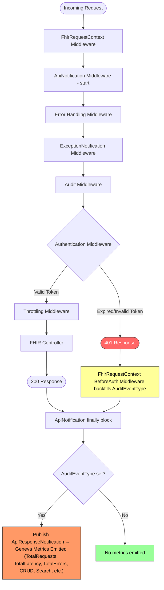
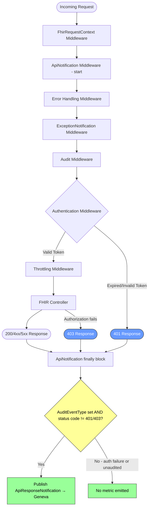

# Suppress Auth-Failure Metrics at Emission Point for Flood Protection

## Context

An incident occurred where a customer sent a massive volume of unauthorized requests to the FHIR service using an expired token. Each 401 response still triggered per-request metric emission to Geneva (Azure's monitoring pipeline). The metric volume was so high that Geneva began throttling the shared metric account, which degraded monitoring for **both** the FHIR service and the DICOM service — neither could reliably emit or read metrics during the incident.

### Why Not Filter at Geneva?

The initial plan was to filter these high-volume 401/403 metrics inbound at Geneva (e.g., via ingestion-time filters or a pre-aggregation rule on the metric account). After investigation, **this is not possible** with the current Geneva configuration:

- Geneva does not support inbound filtering of per-request metric events by status-code dimension before they count against the account's ingest budget. The metrics are charged on receipt, so a server-side filter does not relieve pressure on the shared account.
- The shared metric account is owned outside of the FHIR team's control, and per-customer/per-tenant filter rules at the account level are not a supported configuration path.
- Even if account-level filtering existed, the events still travel from the FHIR instance to the metric pipeline, consuming network resources and contributing to the per-instance/agent emission limits before they would be dropped.

Because the flood cannot be filtered at the ingest side, **the only place we can stop it is at the point of emission in the FHIR server itself.**

### Current Middleware Pipeline (fhir-server)

The ASP.NET Core middleware pipeline is configured in `FhirServerServiceCollectionExtensions.cs` with this ordering:

```
1. UseFhirRequestContext()                 — sets up correlation ID, request context
2. UseApiNotifications()                   — wraps everything, emits metrics in finally{}
3. Error handling middleware               — exception handler, status code pages
4. UseExceptionNotificationMiddleware()    — emits exception metrics
5. UseAudit()                              — audit logging
6. UseFhirRequestContextAuthentication()   — authentication (generates 401/403 here)
7. UseThrottling()                         — concurrent request limiter
```

`ApiNotificationMiddleware` wraps the entire pipeline and publishes an `ApiResponseNotification` via MediatR in its `finally{}` block for every FHIR request where `AuditEventType` is set. For 401 responses, `FhirRequestContextBeforeAuthenticationMiddleware` backfills the `AuditEventType`, so unauthorized requests **do** trigger metric publication today. 403 responses produced after authentication (e.g., authorization policy failures) likewise reach the publication path because `AuditEventType` is set during request routing.

`ApiResponseNotification` is the single in-process chokepoint for the FHIR error/request metric — it is the notification consumed by the per-request metric handler that ultimately reports to Geneva (e.g., `TotalRequests`, `TotalLatency`, `TotalErrors`). Stopping the publish here stops every downstream consumer of that signal.

### Metric Emission Flow — Before This Change



**Key insight**: Every 401 (and 403) request follows the red path and still reaches the orange metric emission box. Under flood conditions, this overwhelms Geneva.

## Decision

**Suppress metric emission entirely for 401 (Unauthorized) and 403 (Forbidden) responses at the point of emission in `ApiNotificationMiddleware`.**

Concretely: extend the existing guard in `ApiNotificationMiddleware.PublishNotificationAsync()` so that the MediatR `Publish(apiNotification)` call is skipped whenever the HTTP response status code is `401` or `403`, regardless of whether `AuditEventType` is set.

```csharp
if (fhirRequestContext?.AuditEventType != null && !IsAuthFailure(statusCode))
{
    // ... populate notification ...
    await _mediator.Publish(apiNotification, CancellationToken.None);
}

private static bool IsAuthFailure(HttpStatusCode statusCode)
    => statusCode == HttpStatusCode.Unauthorized || statusCode == HttpStatusCode.Forbidden;
```

### Why This Approach

- **It is the only place left to filter.** Geneva-side filtering is not available (see Context). The FHIR error metric must be suppressed before it is published, in the process that produces it.
- **It is the minimum viable change.** A single guard in one middleware eliminates the entire class of auth-failure metric floods — no new components, no new background services, no cross-repo coordination, no behavioural change to clients (they still receive 401/403 with normal latency).
- **`ApiResponseNotification` is the chokepoint.** All downstream Geneva consumers of the per-request FHIR metric (including `TotalErrors`) fan out from this single MediatR publish. Suppressing here suppresses everything.
- **Auth-failure metrics are low-value per-request.** 401/403 responses do not perform FHIR work, do not touch storage, and are not billable. The actionable signal for auth failures is "this client is misbehaving / this tenant has misconfigured credentials," which is better surfaced from logs, audit, and gateway/edge counters than from per-request FHIR metrics.

### Metric Emission Flow — After This Change



### Scope of Changes

- **`ApiNotificationMiddleware`** (`src/Microsoft.Health.Fhir.Api/Features/ApiNotifications/ApiNotificationMiddleware.cs`): Add the `IsAuthFailure(statusCode)` guard around the MediatR publish.
- **`ApiNotificationMiddlewareTests`** (`src/Microsoft.Health.Fhir.Shared.Api.UnitTests/Features/ApiNotifications/ApiNotificationMiddlewareTests.cs`): Add tests that confirm 401 and 403 responses do not produce a publish, and that other status codes (200, 400, 404, 429, 500) still do.

`ExceptionNotificationMiddleware` is not changed. It only fires on uncaught exceptions; authentication and authorization failures complete normally by setting a status code and do not propagate exceptions through that middleware, so no 401/403 flood reaches it.

The `ThrottlingMiddleware`'s existing unauthenticated bypass is left as-is. With auth-failure metrics suppressed at the emission point, an unauthenticated request flood no longer produces Geneva pressure regardless of how many requests get through the bypass, so a separate rate limit for unauthenticated requests is no longer needed to solve this incident.

### Considered Alternatives

The following approaches were considered and rejected in favor of the chosen design:

1. **Filter inbound at Geneva.** Not supported by the metric account configuration (see Context). This is what motivated the move to emission-point filtering.
2. **Rate-limit unauthenticated requests in `ThrottlingMiddleware` using `System.Threading.RateLimiting.TokenBucketRateLimiter`.** Adds new configuration surface, changes client-visible behavior (401 → 429), and only addresses the unauthenticated subset — it leaves authenticated 403s producing metrics. The simple emission-point suppression covers both 401 and 403 with no client-visible change and no new configuration.
3. **Global metric-emission rate limiter in `ApiNotificationMiddleware` (token bucket gating every publish).** Heavier infrastructure (rate limiter lifecycle, configuration, multi-instance tuning guidance, optional cross-repo `HttpContext.Items` flag for downstream middleware) for a problem that is solved by skipping a single well-defined class of low-value metrics. Can be revisited as a follow-up if a future flood comes from a different status-code class.

### Consequences

#### Beneficial
- **Eliminates the root cause of the incident.** No matter how many 401/403 responses a client generates, the FHIR error metric pipeline emits zero events for them.
- **Surgical change.** One guard, one middleware, one set of unit tests. No new components, configuration, dependencies, background services, or cross-repo coordination.
- **No client-visible behavior change.** Clients still receive 401/403 with the same status codes, headers, and latency as today. No 429 substitution, no `Retry-After` semantics to negotiate.
- **No tuning required per deployment.** Unlike a per-instance rate limit, the suppression is deterministic and identical across all deployment sizes — there is nothing to recalibrate as instance counts scale.
- **Aligns with billing exclusions.** 401/403 responses already perform no FHIR work; not counting them in per-request metrics is consistent with how they are (or should be) treated for billing.

#### Adverse
- **Loss of per-request 401/403 visibility in FHIR metrics.** Dashboards and alerts driven off the FHIR `ApiResponseNotification` pipeline will no longer see auth failures. Operators who need this signal must rely on:
  - Audit logs (still emitted for 401/403; pipeline order is unchanged)
  - Gateway / front-door / WAF counters for auth failures
  - Application logs (auth middleware still logs failures)
- **No granularity per failure mode.** This is a blanket suppression of 401 and 403. If, in the future, we want to distinguish "expired token" from "missing scope" in metrics, we will need a different mechanism (e.g., a low-cardinality, low-volume counter that is not per-request).
- **Does not protect against floods of other status codes.** A hypothetical flood of, e.g., 400 validation failures, would still produce metrics. This is acceptable today because (a) such floods have not been observed, and (b) authenticated request floods are naturally bounded by the existing concurrency limiter and downstream work cost. A broader emission-side rate limiter can be added later if a new failure mode emerges.

#### Neutral
- **Audit is unaffected.** `UseAudit()` runs independently of the metric publication path; 401/403 audit records continue to be written.
- **Exception-path metrics are unaffected.** `ExceptionNotificationMiddleware` only fires for thrown exceptions and is not part of the normal 401/403 flow.
- **Pipeline order is unchanged.** No middleware is added, removed, or reordered.

## Status

Accepted
