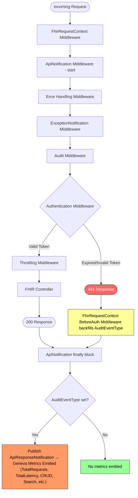
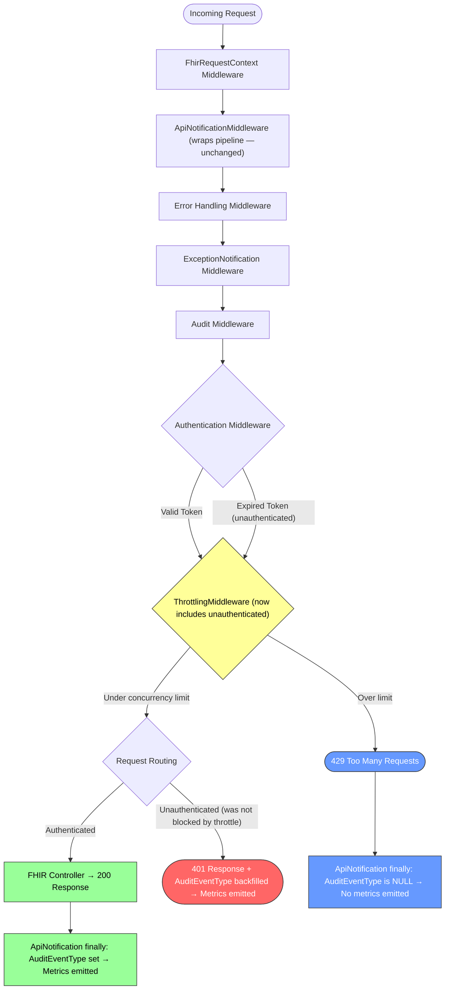
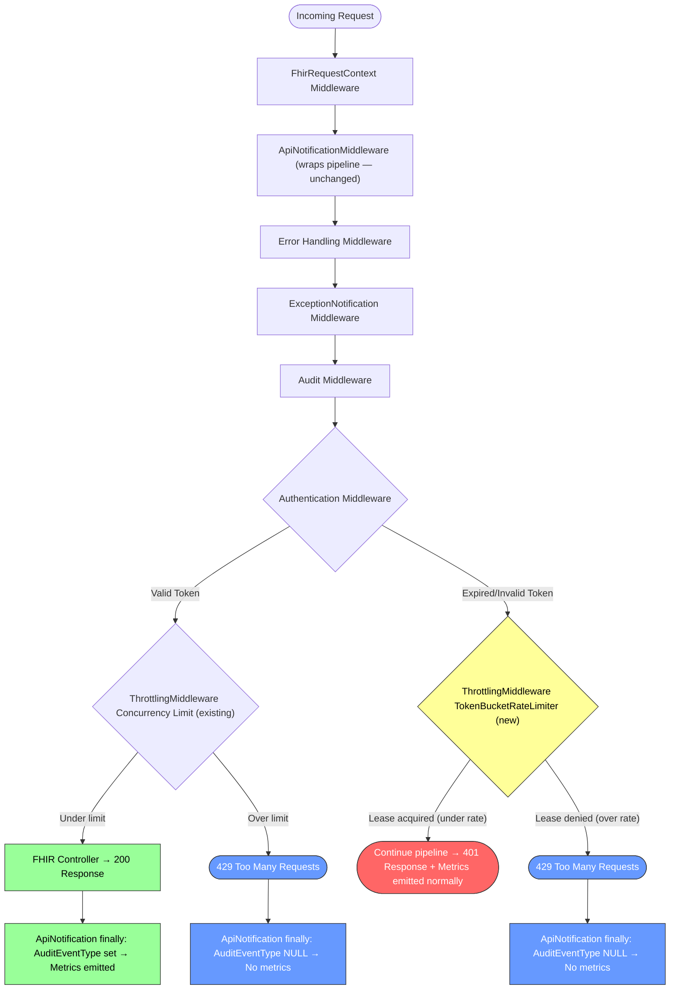
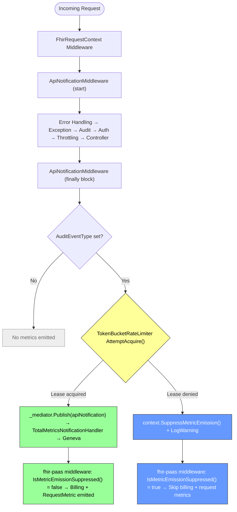
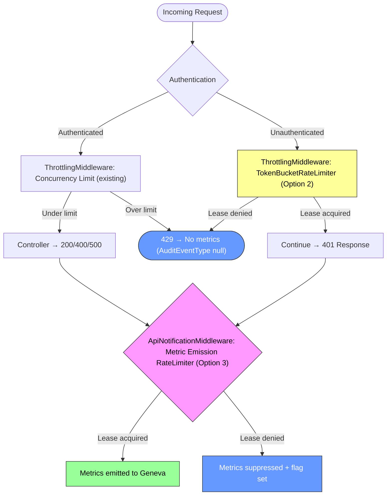

# Metric Emission Rate Limiting for Auth-Failure Flood Protection

> **Open Question — Do we need 401/403 metrics at all?**
>
> Before investing in rate-limiting infrastructure, the team should decide whether per-request metrics for 401/403 responses provide actionable monitoring value. If no dashboard, alert, or operational runbook depends on per-request 401/403 metric granularity, the simplest solution is to **skip metric emission entirely for these status codes** — a one-line guard in `ApiNotificationMiddleware` and the fhir-paas billing/metric middleware. This would eliminate the Geneva flooding problem with zero new infrastructure.
>
> If 401/403 metrics *are* valuable (e.g., for detecting credential-stuffing attacks, monitoring misconfigured clients, or tracking auth-failure trends), the rate-limiting approach in Option 2 preserves visibility under normal load while protecting Geneva under flood conditions.
>
> **Action**: Review current dashboards and alerts. If no consumer depends on per-request 401/403 metrics, adopt the simple suppression approach. If consumers exist, proceed with the rate-limiting options below.

## Context

An incident occurred where a customer sent a massive volume of unauthorized requests to the FHIR service using an expired token. Each 401 response still triggered per-request metric emission to Geneva (Azure's monitoring pipeline). The metric volume was so high that Geneva began throttling the shared metric account, which degraded monitoring for **both** the FHIR service and the DICOM service — neither could reliably emit or read metrics during the incident.

### Current Middleware Pipeline (fhir-server)

The ASP.NET Core middleware pipeline is configured in `FhirServerServiceCollectionExtensions.cs` with this ordering:

```
1. UseFhirRequestContext()                 — sets up correlation ID, request context
2. UseApiNotifications()                   — wraps everything, emits metrics in finally{}
3. Error handling middleware               — exception handler, status code pages
4. UseExceptionNotificationMiddleware()    — emits exception metrics
5. UseAudit()                              — audit logging
6. UseFhirRequestContextAuthentication()   — authentication (generates 401/403 here)
7. UseThrottling()                         — concurrent request limiter
```

The critical issue: **`ApiNotificationMiddleware` is registered before authentication**. It wraps the entire pipeline and publishes an `ApiResponseNotification` via MediatR in a `finally{}` block for every FHIR request where `AuditEventType` is set. For 401 responses, `FhirRequestContextBeforeAuthenticationMiddleware` backfills the `AuditEventType`, so unauthorized requests **do** trigger metric publication.

The existing `ThrottlingMiddleware` limits concurrent in-flight requests but is positioned **after** authentication and metrics — it does not protect against metric emission floods from rejected auth requests.

### Current Middleware Pipeline (fhir-paas)

The fhir-paas layer adds additional metric-emitting middleware inside the `UseFhirServer` callback:

```
... (fhir-server pipeline above, including ApiNotificationMiddleware)
   → BillingLogMiddlewareV2ApiRequests    — billing metrics via Geneva
   → BillingLogMiddlewareV2Egress         — egress billing metrics
   → BillingLogMiddlewareV2Transformation — transformation billing metrics
   → RequestMetricLoggingMiddleware       — per-request metric logging to Geneva
   → ByteCountingStreamMiddleware         — response size tracking
```

Additionally, `ApiResponseNotification` published by fhir-server is handled by:
- `TotalMetricsNotificationHandler` — emits shoebox metrics (TotalRequests, TotalLatency, TotalErrors) to Geneva

None of these have status-code-based filtering for 401/403. `BillingUtilities.IsBillableRequest()` excludes 500s and 429s but **not** 401/403 responses.

### Metric Emission Flow — Current State



**Key insight**: Every 401 request follows the red path and still reaches the orange metric emission box. Under flood conditions, this overwhelms Geneva.

## Decision

Two design options are presented below for team discussion.

---

### Design Option 1: Include Unauthenticated Requests in Existing Throttling (Minimal Change)

This option makes the smallest possible code change: remove the unauthenticated user bypass in `ThrottlingMiddleware` so that unauthorized requests count toward the concurrency limit. **No pipeline reordering is needed.**

The current `ThrottlingMiddleware` (`ThrottlingMiddleware.cs:159-164`) explicitly skips unauthenticated requests:

```csharp
if (_securityEnabled && !context.User.Identity.IsAuthenticated)
{
    // Ignore Unauthenticated users if security is enabled
    await _next(context);
    return;
}
```

By removing (or making configurable) this bypass, unauthenticated requests would be subject to the same concurrency limits as authenticated ones. Optionally, a separate `UnauthenticatedConcurrentRequestLimit` could be added to cap them independently.

#### Why This Works (Partially)

Because the pipeline order is **unchanged**, the existing behavior properties are preserved:

```
1. UseFhirRequestContext()
2. UseApiNotifications()                ← still wraps everything
3. Error handling
4. UseExceptionNotificationMiddleware()
5. UseAudit()                           ← still audits throttled requests
6. UseFhirRequestContextAuthentication()
7. UseThrottling()                      ← now includes unauthenticated requests
```

When `ThrottlingMiddleware` rejects a request with 429:
- `ApiNotificationMiddleware` still runs its `finally{}` block, **but** `AuditEventType` is **never set** for 429 responses — `FhirRequestContextBeforeAuthenticationMiddleware` only backfills `AuditEventType` for 401/403, and MVC filters never execute since the request was rejected before reaching the controller
- Therefore, the `if (fhirRequestContext?.AuditEventType != null)` guard in `ApiNotificationMiddleware` causes **no metric to be published** for throttled 429 requests
- Similarly, fhir-paas `RequestMetricLoggingMiddleware` checks for `AuditEventType` and **skips** metric logging when it's null

In other words: throttled requests naturally avoid metric emission without any additional suppression logic.

#### Changes Required

**fhir-server:**

1. **Remove the unauthenticated bypass** in `ThrottlingMiddleware.Invoke()` (or make it configurable with a new `ThrottleUnauthenticatedRequests` boolean, defaulting to `true`)
2. **(Optional)** Add a separate `UnauthenticatedConcurrentRequestLimit` to `ThrottlingConfiguration` to avoid consuming authenticated request capacity

**fhir-paas:**

3. **Update `BillingUtilities.IsBillableRequest()`** to exclude 401/403 status codes



#### Key Limitation: Concurrency ≠ Rate for Fast Requests

This option shares the same fundamental caveat as Option 1: the `ThrottlingMiddleware` is a **concurrency limiter**, not a rate limiter.

- 401 responses complete in sub-milliseconds (no DB access, just an auth check)
- With a concurrency limit of 25, and each 401 taking ~1ms, the theoretical throughput is **~25,000 requests/second** — still enough to flood Geneva
- At lower concurrency limits (e.g., 3-5 for unauthenticated), throughput drops to ~3,000-5,000/second — this may reduce the blast radius but likely won't eliminate it

However, this provides a **first line of defense** that can be combined with other measures, and the change is low-risk enough to deploy quickly.

#### Design Option 1 — Consequences

##### Beneficial
- **Smallest possible change**: A single `if` condition removal (or configuration addition) — minimal risk of regressions
- **No pipeline reordering**: Audit and API metric middleware remain in their current positions — no loss of audit coverage or metric visibility for non-throttled requests
- **No new components**: No new interfaces, implementations, or background tasks to maintain
- **Throttled 429s naturally skip metrics**: Because `AuditEventType` is not set for 429 responses, `ApiNotificationMiddleware` and `RequestMetricLoggingMiddleware` already skip metric emission — no additional suppression logic needed
- **Quick to deploy**: Can be shipped as an emergency mitigation while Option 2 is developed
- **Preserves correct 401 for most requests**: Under normal load, unauthorized requests still receive 401; only under extreme concurrency do they get 429

##### Adverse
- **Concurrency limiting may be insufficient**: For sub-millisecond 401 requests, even low concurrency limits allow thousands of requests per second — this reduces but may not eliminate the Geneva flooding problem
- **Legitimate unauthenticated requests affected**: Metadata/capability statement and SMART discovery endpoints are typically unauthenticated; these would now count toward concurrency limits and could be throttled during high load (mitigable by adding them to `ExcludedEndpoints`)
- **Shared concurrency pool**: Unless a separate `UnauthenticatedConcurrentRequestLimit` is added, unauthenticated requests consume slots that authenticated requests need
- **fhir-paas billing metrics still exposed**: `BillingLogMiddlewareBase` still emits for 401 requests that pass under the concurrency limit (partially addressed by the `IsBillableRequest` fix for 401/403)
- **Does not address Geneva flooding from other status codes**: Only helps with the unauthenticated bypass; does not provide general metric emission protection

##### Neutral
- **Audit still works for all requests**: Pipeline order unchanged — throttled 429s are still audited
- **Metrics still emitted for non-throttled 401s**: Unauthorized requests under the concurrency limit still generate metrics — low-volume auth failures remain visible in dashboards
- **Billing exclusion for 401/403**: Same as other options — this is a correctness fix independent of the throttling approach

---

### Design Option 2: Rate Limit Unauthenticated Requests in ThrottlingMiddleware

This option addresses Option 1's key limitation — concurrency ≠ rate for sub-millisecond requests — by adding a true **rate limit** for unauthenticated requests using the framework-provided `System.Threading.RateLimiting.TokenBucketRateLimiter`. The change is contained entirely within the existing `ThrottlingMiddleware` — no new middleware, no cross-repo coordination, no changes to metric emission infrastructure.

The FHIR server targets `net8.0`/`net9.0`, so `System.Threading.RateLimiting` is available as a built-in framework primitive.

#### How It Works

The current unauthenticated bypass in `ThrottlingMiddleware.Invoke()` (lines 159-164):

```csharp
if (_securityEnabled && !context.User.Identity.IsAuthenticated)
{
    // Ignore Unauthenticated users if security is enabled
    await _next(context);
    return;
}
```

Is replaced with a rate-limit check:

```csharp
if (_securityEnabled && !context.User.Identity.IsAuthenticated)
{
    using var lease = _unauthenticatedRateLimiter.AttemptAcquire();
    if (!lease.IsAcquired)
    {
        await Return429(context);
        return;
    }

    await _next(context);
    return;
}
```

The `_unauthenticatedRateLimiter` is a `TokenBucketRateLimiter` initialized in the constructor:

```csharp
_unauthenticatedRateLimiter = new TokenBucketRateLimiter(new TokenBucketRateLimiterOptions
{
    TokenLimit = configuration.UnauthenticatedBurstLimit,        // default: 20
    TokensPerPeriod = configuration.UnauthenticatedTokensPerPeriod, // default: 20
    ReplenishmentPeriod = TimeSpan.FromSeconds(1),
    QueueLimit = 0,             // no queueing — reject immediately
    AutoReplenishment = true,   // framework handles the timer
});
```

When the rate limit is exceeded, the middleware returns 429. As documented in Option 1, **429 responses naturally skip metric emission** because `AuditEventType` is never set — `ApiNotificationMiddleware`, `RequestMetricLoggingMiddleware`, and `TotalMetricsNotificationHandler` all guard on `AuditEventType != null`. No changes to any metric-emitting middleware are needed.

#### Pipeline — Unchanged

```
1. UseFhirRequestContext()
2. UseApiNotifications()                ← still wraps everything
3. Error handling
4. UseExceptionNotificationMiddleware()
5. UseAudit()                           ← still audits all requests
6. UseFhirRequestContextAuthentication()
7. UseThrottling()                      ← unauthenticated path now rate-limited
```



#### Changes Required

**fhir-server only** (no fhir-paas changes beyond the shared billing fix):

1. **`ThrottlingMiddleware`**: Add a `TokenBucketRateLimiter` field, initialize from configuration, replace the unauthenticated bypass with a rate-limit check as shown above. Dispose the rate limiter in `DisposeAsync()`.

2. **`ThrottlingConfiguration`**: Add two new properties:
   ```csharp
   /// <summary>
   /// Maximum burst of unauthenticated requests allowed before rate limiting kicks in.
   /// </summary>
   public int UnauthenticatedBurstLimit { get; set; } = 20;

   /// <summary>
   /// Number of unauthenticated request tokens replenished per second (sustained rate).
   /// </summary>
   public int UnauthenticatedTokensPerPeriod { get; set; } = 20;
   ```

3. **`ThrottlingMiddlewareTests`**: Add tests for the new rate-limiting behavior with unauthenticated requests.

**fhir-paas:**

4. **`BillingUtilities.IsBillableRequest()`**: Exclude 401 and 403 status codes (same correctness fix as all options).

#### Configuration

The rate limit is configured through the existing `Throttling` configuration section — no new configuration root:

```json
{
  "Throttling": {
    "Enabled": true,
    "ConcurrentRequestLimit": 25,
    "UnauthenticatedBurstLimit": 20,
    "UnauthenticatedTokensPerPeriod": 20,
    "ExcludedEndpoints": [
      { "Method": "GET", "Path": "/metadata" },
      { "Method": "GET", "Path": "/.well-known/smart-configuration" }
    ]
  }
}
```

**Threshold rationale (tied to Geneva capacity):**
- Geneva's per-metric-account ingest limit is approximately **50,000 events/minute** (~833 events/second)
- The FHIR service shares this account with the DICOM service, so FHIR should not consume more than ~50% → **~400 events/second** budget for FHIR
- `UnauthenticatedTokensPerPeriod: 20` allows 20 unauthenticated requests/second to pass through — each may generate a 401 with metric emission, consuming ~2.4% of the FHIR Geneva budget
- `UnauthenticatedBurstLimit: 20` allows a short burst (e.g., at startup or during a brief spike) without immediately triggering rate limiting
- Under flood conditions (thousands of req/sec with expired tokens), only 20/second pass through to generate 401 + metrics — the remaining are rejected with 429 (no metric emission). This caps auth-failure metric emission at ~1,200/minute, well within Geneva's capacity
- The `ExcludedEndpoints` configuration already exists and should include `/metadata` and `/.well-known/smart-configuration` since these are legitimately unauthenticated FHIR endpoints

#### Why Not a Custom Metric Emission Rate Limiter?

An earlier design considered building a per-status-code metric emission rate limiter with custom `IMetricEmissionRateLimiter` interface, `IHostedService`-based aggregate reporting, and cross-repo `HttpContext.Items` coordination. That approach was rejected in favor of this simpler design for these reasons:

| Concern | Custom metric rate limiter | Framework rate limiter in ThrottlingMiddleware |
|---|---|---|
| New interfaces / implementations | `IMetricEmissionRateLimiter`, `MetricEmissionRateLimiter`, `MetricEmissionAggregateReporter` | None — uses `System.Threading.RateLimiting.TokenBucketRateLimiter` |
| Background services | `IHostedService` for aggregate reporting with lifecycle management | None — `AutoReplenishment = true` uses the framework's internal timer |
| Cross-repo coordination | `HttpContext.Items` flag checked in fhir-paas middleware | None — 429s naturally skip metrics via existing `AuditEventType` guard |
| Changes to metric middleware | `ApiNotificationMiddleware`, `ExceptionNotificationMiddleware`, fhir-paas billing/metric middleware | None |
| Configuration surface | New `MetricEmissionRateLimiting` section with per-status-code overrides | Two properties added to existing `Throttling` section |
| Client behavior | No change (still returns 401) | Returns 429 with `Retry-After` header (provides backpressure signal) |

The only capability lost is protection against metric floods from non-auth status codes (e.g., a flood of 500s). However, authenticated requests that produce 500s are naturally rate-limited by the existing concurrency limiter — those requests touch the database and are slow enough that concurrency limiting is effective. The concurrency ≠ rate problem is specific to sub-millisecond unauthenticated responses.

#### Design Option 2 — Consequences

##### Beneficial
- **Solves the core problem**: True rate limiting (not concurrency limiting) caps unauthenticated request throughput to a configurable sustained rate, preventing Geneva flooding regardless of how fast 401 responses are
- **Uses framework primitives**: `System.Threading.RateLimiting.TokenBucketRateLimiter` is battle-tested, maintained by the .NET team, and already handles thread safety, token replenishment, and disposal
- **No new components**: No new middleware, interfaces, `IHostedService`, or background tasks — the change is contained within the existing `ThrottlingMiddleware`
- **No cross-repo coordination**: 429 responses naturally skip metric emission via the existing `AuditEventType` guard — no changes needed in `ApiNotificationMiddleware`, `ExceptionNotificationMiddleware`, or any fhir-paas metric middleware
- **Provides backpressure**: Returning 429 with `Retry-After` tells misbehaving clients to back off — the previous design silently suppressed metrics while still responding 401, potentially encouraging the flood to continue
- **Preserves 401 metrics under normal load**: Requests under the rate limit still produce 401 with full metric emission — low-volume auth failures remain visible in dashboards
- **Configurable via existing section**: No new configuration root — two properties added to the existing `Throttling` section that operators already understand
- **Geneva-aligned defaults**: Rate set to consume ~2.4% of FHIR's Geneva budget, making it mathematically impossible for auth failures to flood the metric pipeline

##### Adverse
- **Client-visible behavior change during floods**: Clients receive 429 instead of 401 when the unauthenticated rate limit is exceeded. This is a semantic change — 429 means "too many requests" rather than "unauthorized". Well-behaved clients should honor `Retry-After`, but some may not expect 429 for an auth problem
- **Does not protect against non-auth metric floods**: Only rate-limits unauthenticated requests. A theoretical flood of authenticated requests producing 500s would not be caught by this rate limiter (though the existing concurrency limiter handles this case adequately since those requests are slow)
- **Legitimate unauthenticated endpoints affected**: Endpoints like `/metadata` and `/.well-known/smart-configuration` are legitimately unauthenticated — they must be added to `ExcludedEndpoints` or they will count against the rate limit
- **Shared rate limiter across all unauthenticated traffic**: Unlike a per-status-code approach, all unauthenticated requests share one token bucket. A flood of one type of unauthenticated request could starve others (mitigated by the `ExcludedEndpoints` configuration for known legitimate endpoints)
- **No per-status-code granularity**: This approach treats all unauthenticated requests as a single class. A per-status-code metric emission rate limiter (the rejected alternative) would have allowed independent thresholds for each status code — e.g., allowing more 401 metrics than 403 metrics, or rate-limiting a sudden spike of 400s independently from 401s. With this design, we cannot distinguish *why* unauthenticated requests are being rate-limited or tune thresholds per failure mode. If the team later discovers that different unauthenticated failure modes need different visibility levels in metrics, this approach would need to be extended or replaced.
- **No aggregate "suppressed metric" signal**: The rejected alternative included a dedicated `SuppressedMetricEmissions` metric that would fire periodically during flood conditions, giving operators an explicit signal that metric emission was being rate-limited. With this approach, the signal is indirect — operators must infer suppression from an elevated 429 rate in `ThrottlingMiddleware` logs. This is arguably sufficient (429 counts are already logged with `LogWarning`), but it is a less explicit signal than a purpose-built metric. If the team wants a first-class "we are suppressing metrics right now" dashboard indicator, this approach does not provide it out of the box.

##### Neutral
- **Audit still works for all requests**: Pipeline order unchanged — rate-limited 429s are still audited
- **Metrics still emitted for non-throttled 401s**: Unauthorized requests under the rate limit still generate metrics — auth failure trends remain visible
- **Billing exclusion for 401/403**: Same correctness fix as all options — unauthorized requests should not be billed since no work was performed
- **Existing concurrency limiter unchanged**: Authenticated requests continue to use the existing concurrency-based throttling, which works well for requests that involve database access

---

### Design Option 3: Option 2 + Global Metric Emission Rate Limiter in ApiNotificationMiddleware

This option extends Option 2 (unauthenticated request rate limiting in `ThrottlingMiddleware`) with a **global metric emission rate limiter** in `ApiNotificationMiddleware` to protect against floods from *any* status code — including authenticated requests that fail fast (e.g., 400 validation errors, 403 authorization failures, 500 early failures).

The key observation: `ApiNotificationMiddleware.PublishNotificationAsync()` (line 82) is the **single chokepoint** through which all fhir-server metric emissions flow via `_mediator.Publish(apiNotification)`. A rate limiter here protects Geneva regardless of what upstream middleware produced the response.

#### Layered Defense

| Layer | What it does | What it catches |
|---|---|---|
| **ThrottlingMiddleware** (from Option 2) | Rate-limits unauthenticated *requests* via `TokenBucketRateLimiter` → returns 429 | Unauthenticated floods (the original incident). 429s naturally skip metric emission. |
| **ApiNotificationMiddleware** (this option) | Rate-limits *metric emission* via a second `TokenBucketRateLimiter` → silently skips MediatR publish | Any remaining flood that produces metrics — authenticated 400s, 403s, 500s, or unauthenticated requests that passed under the rate limit |

The two rate limiters serve different purposes and operate at different layers:
- Layer 1 (ThrottlingMiddleware): Protects the *service* from processing flood traffic — returns 429 to clients, provides backpressure
- Layer 2 (ApiNotificationMiddleware): Protects *Geneva* from metric emission floods — does not affect request handling, only metric visibility

#### Implementation

**`ApiNotificationMiddleware` change** — add a `TokenBucketRateLimiter` and gate the MediatR publish:

```csharp
public class ApiNotificationMiddleware : IMiddleware
{
    private readonly RequestContextAccessor<IFhirRequestContext> _fhirRequestContextAccessor;
    private readonly IMediator _mediator;
    private readonly ILogger<ApiNotificationMiddleware> _logger;
    private readonly TokenBucketRateLimiter _metricEmissionRateLimiter;

    public ApiNotificationMiddleware(
        RequestContextAccessor<IFhirRequestContext> fhirRequestContextAccessor,
        IMediator mediator,
        IOptions<MetricEmissionConfiguration> metricEmissionConfig,
        ILogger<ApiNotificationMiddleware> logger)
    {
        // ... existing constructor code ...

        var config = metricEmissionConfig.Value;
        _metricEmissionRateLimiter = new TokenBucketRateLimiter(new TokenBucketRateLimiterOptions
        {
            TokenLimit = config.BurstLimit,             // default: 200
            TokensPerPeriod = config.TokensPerPeriod,   // default: 200
            ReplenishmentPeriod = TimeSpan.FromSeconds(1),
            QueueLimit = 0,
            AutoReplenishment = true,
        });
    }

    protected virtual async Task PublishNotificationAsync(HttpContext context, RequestDelegate next)
    {
        // ... existing try/await next(context) ...
        finally
        {
            // ... existing AuditEventType check ...
            if (fhirRequestContext?.AuditEventType != null)
            {
                using var lease = _metricEmissionRateLimiter.AttemptAcquire();
                if (lease.IsAcquired)
                {
                    // Normal path — emit metrics
                    await _mediator.Publish(apiNotification, CancellationToken.None);
                }
                else
                {
                    // Over rate — suppress metrics, set flag for fhir-paas middleware
                    context.SuppressMetricEmission();
                    _logger.LogWarning(
                        "Metric emission rate limit exceeded. Suppressing metrics for {StatusCode} {Operation}.",
                        context.Response.StatusCode,
                        fhirRequestContext.AuditEventType);
                }
            }
        }
    }
}
```

**`HttpContextMetricEmissionExtensions`** — strongly-typed shared extension methods (eliminates magic string coupling with fhir-paas):

```csharp
public static class HttpContextMetricEmissionExtensions
{
    private static readonly object Key = new object();

    public static void SuppressMetricEmission(this HttpContext context)
        => context.Items[Key] = true;

    public static bool IsMetricEmissionSuppressed(this HttpContext context)
        => context.Items.TryGetValue(Key, out var value) && value is true;
}
```

**`MetricEmissionConfiguration`** — small config class:

```csharp
public class MetricEmissionConfiguration
{
    /// <summary>
    /// Maximum burst of metric emissions allowed before rate limiting kicks in.
    /// </summary>
    public int BurstLimit { get; set; } = 200;

    /// <summary>
    /// Number of metric emission tokens replenished per second (sustained rate).
    /// </summary>
    public int TokensPerPeriod { get; set; } = 200;
}
```

#### fhir-paas Changes

Because the MediatR publish is skipped when the rate limiter denies, `TotalMetricsNotificationHandler` is automatically protected — it simply won't fire. The fhir-paas per-request middleware needs a one-line check:

1. **`RequestMetricLoggingMiddleware`**: Add `if (context.IsMetricEmissionSuppressed()) return;`
2. **`BillingLogMiddlewareBase`**: Add same check. Additionally, update `BillingUtilities.IsBillableRequest()` to exclude 401/403 (shared correctness fix).

Both reference `HttpContextMetricEmissionExtensions` from a shared package — compile-time safe, no magic strings.

#### Pipeline Flow



#### Combined with Option 2 — Full Picture



#### Changes Required — Summary

| Component | Change | Complexity |
|---|---|---|
| `ThrottlingMiddleware` | Add `TokenBucketRateLimiter` for unauthenticated path (from Option 2) | Low — replace 3-line bypass |
| `ThrottlingConfiguration` | Add `UnauthenticatedBurstLimit`, `UnauthenticatedTokensPerPeriod` (from Option 2) | Low — 2 properties |
| `ApiNotificationMiddleware` | Add `TokenBucketRateLimiter`, gate MediatR publish | Low — ~10 lines in `finally` block |
| `MetricEmissionConfiguration` | New config class with 2 properties | Low — small POCO |
| `HttpContextMetricEmissionExtensions` | Shared extension methods for suppression flag | Low — 2 methods |
| fhir-paas `RequestMetricLoggingMiddleware` | Add `IsMetricEmissionSuppressed()` check | Trivial — 1 line |
| fhir-paas `BillingLogMiddlewareBase` | Add `IsMetricEmissionSuppressed()` check + 401/403 billing exclusion | Low |

**What we avoided vs. the old complex Option 2:**
- ❌ No `IMetricEmissionRateLimiter` interface
- ❌ No custom token bucket implementation (uses framework's `TokenBucketRateLimiter` in both layers)
- ❌ No `IHostedService` for aggregate reporting
- ❌ No per-status-code `ConcurrentDictionary` of rate limiters
- ❌ No `StatusCodeOverrides` configuration
- ❌ No `GetAndResetStats()` / aggregate flush lifecycle

#### Configuration

```json
{
  "Throttling": {
    "Enabled": true,
    "ConcurrentRequestLimit": 25,
    "UnauthenticatedBurstLimit": 20,
    "UnauthenticatedTokensPerPeriod": 20,
    "ExcludedEndpoints": [
      { "Method": "GET", "Path": "/metadata" },
      { "Method": "GET", "Path": "/.well-known/smart-configuration" }
    ]
  },
  "MetricEmission": {
    "BurstLimit": 200,
    "TokensPerPeriod": 200
  }
}
```

**Threshold rationale (tied to Geneva capacity):**
- Geneva's per-metric-account ingest limit is approximately **50,000 events/minute** (~833 events/second)
- FHIR shares the account with DICOM → ~400 events/second FHIR budget
- `TokensPerPeriod: 200` caps total metric emissions at 200/second (~48% of FHIR budget), leaving headroom for DICOM and for the fhir-paas billing/request metrics that emit independently
- `BurstLimit: 200` allows a 1-second burst at startup or during traffic spikes
- The unauthenticated rate limiter (`UnauthenticatedTokensPerPeriod: 20`) is the first line of defense for the most common flood scenario; the metric emission rate limiter is the safety net for everything else

#### Design Option 3 — Consequences

##### Beneficial
- **Protects against ANY metric flood**: Unlike Option 2 which only covers unauthenticated requests, the metric emission rate limiter in `ApiNotificationMiddleware` caps total metric output regardless of status code, authentication state, or failure mode
- **Two-layer defense**: Unauthenticated floods are caught at the request level (429 + backpressure); all other floods are caught at the metric emission level — defense in depth with each layer serving a distinct purpose
- **Still uses framework primitives**: Both rate limiters are `System.Threading.RateLimiting.TokenBucketRateLimiter` — no custom algorithm code
- **No `IHostedService` or background tasks**: Both rate limiters use `AutoReplenishment = true` (framework-managed timer). The `LogWarning` on suppression provides operator visibility without a dedicated aggregate reporting service
- **Strongly-typed cross-repo coordination**: `HttpContextMetricEmissionExtensions` with a private `object` key — compile-time safe, no magic strings
- **Preserves full metrics under normal load**: The 200/second global limit far exceeds typical metric emission rates; rate limiting only activates under genuine flood conditions
- **Geneva-aligned defaults**: Total emission rate capped at ~48% of FHIR's Geneva budget

##### Adverse
- **Cross-repo coordination required**: Unlike Option 2 (fhir-server only), this option requires fhir-paas changes to check `IsMetricEmissionSuppressed()` in billing and request metric middleware. However, the change is minimal (one-line check per middleware) and the shared extension method makes it compile-time safe.
- **Client-visible behavior change for unauthenticated floods**: Same as Option 2 — unauthenticated requests over the rate limit receive 429 instead of 401
- **Silent metric suppression for authenticated floods**: When the global metric rate limiter activates for authenticated requests, the client still receives their normal response (200/400/500) but metrics are silently dropped. There is no `Retry-After` or other client-facing signal — the only indicator is the `LogWarning` in server logs.
- **No per-status-code granularity in the global limiter**: The metric emission rate limiter is a single bucket across all status codes. A flood of 500 metrics could consume the budget and suppress 200 metrics in the same window. For most scenarios this is acceptable (floods are transient), but if the team needs independent budgets per status code class, this would need to be extended.
- **No aggregate "suppressed metric" signal as a metric**: Suppression is logged via `LogWarning` but not emitted as a dedicated Geneva metric. Operators must monitor logs or set up log-based alerts. If the team wants a first-class metric, a lightweight `IHostedService` could be added later as an enhancement without changing the core design.
- **Legitimate unauthenticated endpoints affected**: Same as Option 2 — `/metadata` and SMART discovery must be in `ExcludedEndpoints`

##### Neutral
- **Audit unaffected**: Audit middleware runs before and independently of the metric emission gate — all requests are still audited
- **Billing exclusion for 401/403**: Same correctness fix across all options
- **Existing concurrency limiter unchanged**: Authenticated request throughput is still governed by the concurrency limiter, which works well for database-bound requests

## Status

Proposed
