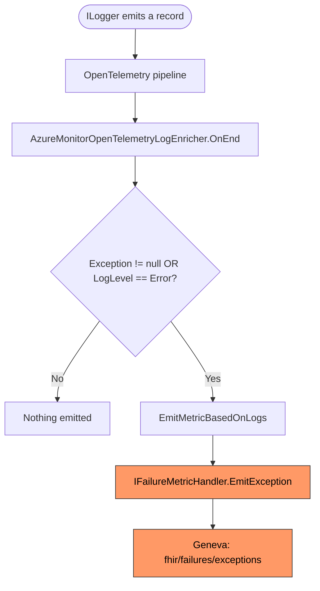
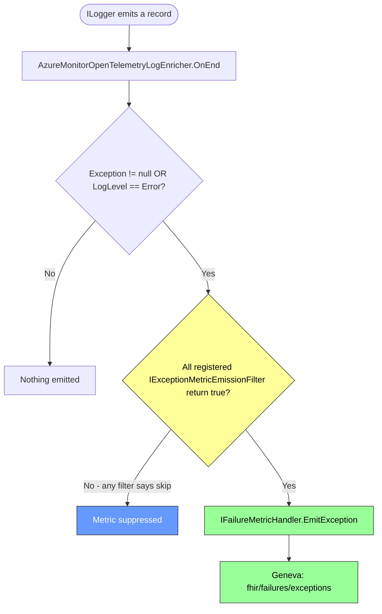

# Filter Auth-Failure Exception Metrics via a Pluggable Filter at the Emission Chokepoint

## Context

An incident occurred where a customer sent a massive volume of unauthorized requests to the FHIR service using an expired token. Every request produced a `SecurityTokenException` that was logged at error severity, which in turn caused the OpenTelemetry log enricher to emit a `fhir/failures/exceptions` metric event per request. The aggregate volume was high enough to cause Geneva (Azure's monitoring pipeline) to throttle the shared metric account, which degraded monitoring for **both** the FHIR service and the DICOM service — neither could reliably emit or read metrics during the incident.

### Why Not Filter at Geneva?

The initial plan was to filter these high-volume events inbound at Geneva (e.g., via ingestion-time filters or a pre-aggregation rule on the metric account). After investigation, **this is not possible** with the current Geneva configuration:

- Geneva does not support inbound filtering of per-request metric events by status-code or exception-type dimensions before they count against the account's ingest budget. The metrics are charged on receipt, so a server-side filter does not relieve pressure on the shared account.
- The shared metric account is owned outside of the FHIR team's control, and per-customer/per-tenant filter rules at the account level are not a supported configuration path.
- Even if account-level filtering existed, the events still travel from the FHIR instance to the metric pipeline, contributing to per-instance emission limits before they would be dropped.

Because the flood cannot be filtered at the ingest side, **the only place we can stop it is at the point of emission in the FHIR server itself.**

### Where the Metric Is Emitted

The `fhir/failures/exceptions` metric has a **single emission chokepoint** in fhir-server: `AzureMonitorOpenTelemetryLogEnricher.EmitMetricBasedOnLogs()` (`src/Microsoft.Health.Fhir.Shared.Web/AzureMonitorOpenTelemetryLogEnricher.cs`). This is an OpenTelemetry `BaseProcessor<LogRecord>` that runs for every emitted log record; when the record carries an exception or is logged at `LogLevel.Error`, it constructs an `ExceptionMetricNotification` and calls `IFailureMetricHandler.EmitException(notification)`.



Because every emission of `fhir/failures/exceptions` passes through `EmitMetricBasedOnLogs`, a single guard here suppresses the metric for all downstream consumers (Geneva counters, dashboards, alerts).

### Why a Status-Code-Only Filter at `ApiNotificationMiddleware` Was Insufficient

An earlier proposal added a status-code guard in `ApiNotificationMiddleware` to skip publishing `ApiResponseNotification` for any 401/403 response. That approach was rejected for two reasons:

1. **Wrong metric.** `ApiNotificationMiddleware` produces the request/latency metric notification, not the `fhir/failures/exceptions` metric. The metric that overwhelmed Geneva is emitted from the OpenTelemetry log enricher, not from MediatR notifications.
2. **Too broad.** Filtering on status code alone removes the metric for *every* 401/403, including 403s that come from legitimate authorization-policy failures we may want to see in dashboards. The incident was specifically driven by authentication exceptions (expired tokens producing `SecurityTokenException`), not by all 401/403 responses.

The chosen design narrows the filter to the precise condition that caused the flood — an authentication exception that resulted in a 401 response — and places it at the metric that actually went out of control.

## Decision

Introduce a pluggable `IExceptionMetricEmissionFilter` interface that decides, given an exception and the current `HttpContext`, whether the `fhir/failures/exceptions` metric should be emitted. `AzureMonitorOpenTelemetryLogEnricher` consults all registered filters before emitting; a metric is published only when every filter returns `true` (logical AND).

Ship one default implementation in fhir-server — `AuthenticationFailureExceptionMetricEmissionFilter` — that suppresses metric emission when **both**:

1. The exception (or any exception in its inner-exception chain) is a `Microsoft.IdentityModel.Tokens.SecurityTokenException`, AND
2. The HTTP response status code is `401 Unauthorized`.

This combination is the exact signature of the incident: expired-token authentication failures producing 401 responses. Authorization failures (403), validation errors, and every other failure mode continue to produce metrics, so genuine failure signals remain visible.

### Why an Interface (Not Just a Status-Code Check or an Extension Method)

The decision uses *both* the exception type *and* the request context. An extension method on `Exception` alone cannot make a request-aware decision; a status-code check alone cannot distinguish authentication failures from authorization failures (both produce 401/403). An `IExceptionMetricEmissionFilter(Exception, HttpContext) → bool` interface is the smallest abstraction that captures both inputs cleanly, while also being:

- **Composable** — multiple filters can be registered and are AND-combined. New "this exception is not worth a metric" rules can be added by registering a new implementation, with no change to the enricher or to existing filters.
- **Replaceable** — a downstream consumer can swap out our default implementation if their notion of "authentication failure" differs.
- **Testable in isolation** — each filter is a pure function of (exception, http context) and can be unit-tested without the enricher, the OpenTelemetry pipeline, or DI.

### Code Shape

```csharp
// src/Microsoft.Health.Fhir.Api/Features/Metrics/IExceptionMetricEmissionFilter.cs
public interface IExceptionMetricEmissionFilter
{
    bool ShouldEmit(Exception exception, HttpContext httpContext);
}

// src/Microsoft.Health.Fhir.Api/Features/Metrics/AuthenticationFailureExceptionMetricEmissionFilter.cs
public class AuthenticationFailureExceptionMetricEmissionFilter : IExceptionMetricEmissionFilter
{
    public bool ShouldEmit(Exception exception, HttpContext httpContext)
    {
        if (exception == null || httpContext == null) return true;
        if (httpContext.Response?.StatusCode != (int)HttpStatusCode.Unauthorized) return true;
        return !IsAuthenticationException(exception);
    }

    // Virtual so subclasses can recognize additional authentication exception types.
    protected virtual bool IsAuthenticationException(Exception exception) { /* walks inner-exception chain */ }
}
```

The enricher receives `IEnumerable<IExceptionMetricEmissionFilter>` and short-circuits on the first `false`:

```csharp
foreach (var filter in _exceptionMetricEmissionFilters)
{
    if (!filter.ShouldEmit(data.Exception, httpContext)) return;
}
```

### Updated Emission Flow



### Extensibility for Downstream Consumers (fhir-paas)

fhir-paas already extends fhir-server through DI. The filter chain is designed so that fhir-paas (or any other consumer) can extend or override behavior without forking the FHIR server:

| Goal | Pattern | Code |
|---|---|---|
| **Add a new, independent rule** (e.g., suppress a specific benign exception type) | Register an additional filter. The enricher AND-combines all registered filters. | `services.AddSingleton<IExceptionMetricEmissionFilter, MyPaasBenignExceptionFilter>();` |
| **Extend what counts as an authentication exception** (e.g., recognize a fhir-paas-specific auth exception type) | Subclass `AuthenticationFailureExceptionMetricEmissionFilter` and override `IsAuthenticationException`. Replace the registration. | `services.RemoveAll<IExceptionMetricEmissionFilter>();`<br>`services.AddSingleton<IExceptionMetricEmissionFilter, MyExtendedAuthFilter>();` |
| **Tighten or loosen the auth filter's status-code condition** | Implement a new `IExceptionMetricEmissionFilter` from scratch and replace the registration. | Same as above, with a fully custom implementation. |
| **Disable all filtering** | Remove all registrations. | `services.RemoveAll<IExceptionMetricEmissionFilter>();` |

The default registration in fhir-server uses `AddSingleton` (not `TryAddSingleton`) so that additional consumer registrations do **not** silently replace ours — they compose. Consumers that want replacement must opt in explicitly via `RemoveAll`. This is the safer default: an fhir-paas team that adds a new filter does not accidentally turn off the auth-failure suppression that protects Geneva.

The `AuthenticationFailureExceptionMetricEmissionFilter` class is intentionally **not sealed**, and `IsAuthenticationException` is `protected virtual`, so subclassing is a first-class extension path.

### Scope of Changes

**fhir-server (this repo):**
- `src/Microsoft.Health.Fhir.Api/Features/Metrics/IExceptionMetricEmissionFilter.cs` — new interface.
- `src/Microsoft.Health.Fhir.Api/Features/Metrics/AuthenticationFailureExceptionMetricEmissionFilter.cs` — default implementation (subclassable).
- `src/Microsoft.Health.Fhir.Shared.Web/AzureMonitorOpenTelemetryLogEnricher.cs` — accept and consult `IEnumerable<IExceptionMetricEmissionFilter>`.
- `src/Microsoft.Health.Fhir.Shared.Web/Startup.cs` — resolve the filter collection and pass it to the enricher.
- `src/Microsoft.Health.Fhir.Shared.Api/Registration/FhirServerServiceCollectionExtensions.cs` — register the default filter via `AddSingleton`.
- Unit tests for the filter and for the enricher's integration with the filter chain.

**fhir-paas (downstream, not in this PR):**
- No required changes. The default filter is registered automatically when fhir-paas calls `AddFhirServer`/`UseFhirServer`.
- Optional: register additional filters for paas-specific benign exception types if such a need is identified.

### Considered Alternatives

1. **Filter inbound at Geneva.** Not supported by the metric account configuration (see Context).
2. **Status-code-only suppression in `ApiNotificationMiddleware`** (the previous version of this ADR). Wrong middleware — that path produces a different metric and is not what overwhelmed Geneva — and too broad (suppresses all 401/403 regardless of cause).
3. **Extension method on `Exception` (`ShouldEmitFailureMetric`).** Considered for simplicity, but rejected because (a) authoritative emission decisions need *both* the exception and the request context, and a static extension cannot be replaced or composed by downstream consumers; (b) DI-registered filters give fhir-paas a first-class extension path without subclassing or forking.
4. **Per-instance rate limiting of the metric pipeline.** Considered for general flood protection, but rejected as overkill given that the actual incident has a precise, narrow signature (auth exception + 401) that can be eliminated deterministically. A general rate limiter can be revisited if a future flood comes from a different signature.

### Consequences

#### Beneficial
- **Eliminates the root cause.** Exact-shape filter (auth exception + 401) deterministically removes the flood class without affecting other failure metrics.
- **Targeted, not blanket.** Authorization failures (403), validation errors, expired-token retries on non-401 paths, and every other failure continue to emit metrics. Operators still see auth-failure trends via logs, audit, and gateway-level counters.
- **Composable.** Adding a new "skip this exception" rule is a single DI registration in fhir-paas. No need to coordinate changes in fhir-server.
- **Replaceable.** Subclassing and `RemoveAll` give consumers full control over the filter set without forking fhir-server.
- **Single chokepoint.** The enricher is the only place that emits `fhir/failures/exceptions`. One guard, all consumers protected.
- **Safe default.** `AddSingleton` (not `TryAddSingleton`) means a consumer that adds a new filter does not accidentally turn off the auth-failure suppression.

#### Adverse
- **Loss of per-request 401-auth-failure visibility in `fhir/failures/exceptions`.** Operators who used this metric to count expired-token events must rely on alternative signals (logs, audit, gateway/WAF counters, or a separate low-cardinality auth-failure counter).
- **Filter chain is in-process only.** No cross-instance coordination. This is fine because the filter is deterministic (same input → same decision on every instance); there is nothing to coordinate.
- **Convention-based composition.** "All filters AND-combined" is a documented contract on the interface, not a compiler-enforced invariant. A consumer that misreads the contract could be surprised.
- **Subclass-based extension of the auth filter requires `RemoveAll`.** Slightly more friction than a single `AddSingleton`. This is intentional — it makes "I am replacing the default" an explicit action.

#### Neutral
- **`ApiNotificationMiddleware` and `ApiResponseNotification` are unchanged.** The MediatR-based request/latency metric pipeline is not affected; it never had the flood problem.
- **Audit unaffected.** Audit logging for 401 requests continues to run.
- **Status code semantics unchanged.** Clients still receive normal 401 responses; no 429 substitution, no new headers.
- **No new configuration surface.** Filter selection is via DI registrations, not configuration files. Operators do not need to learn new settings.

## Status

Accepted
