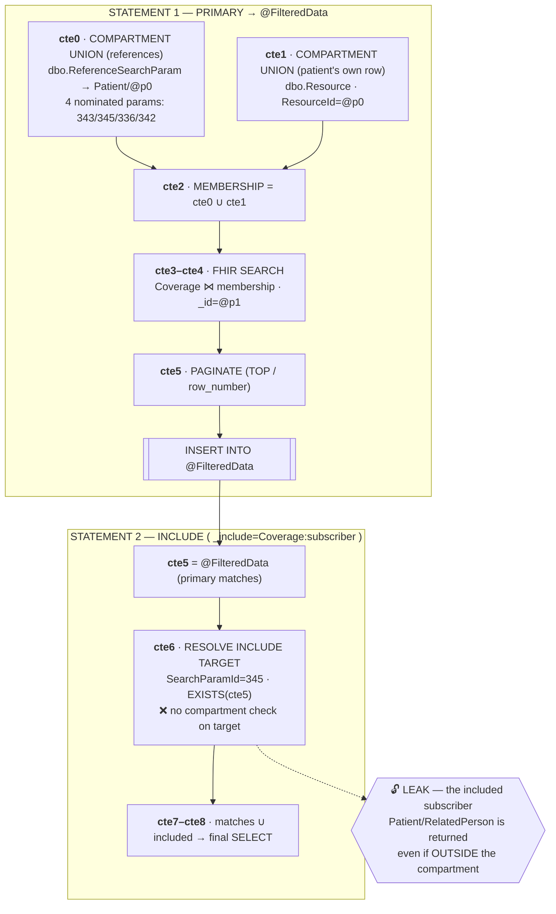
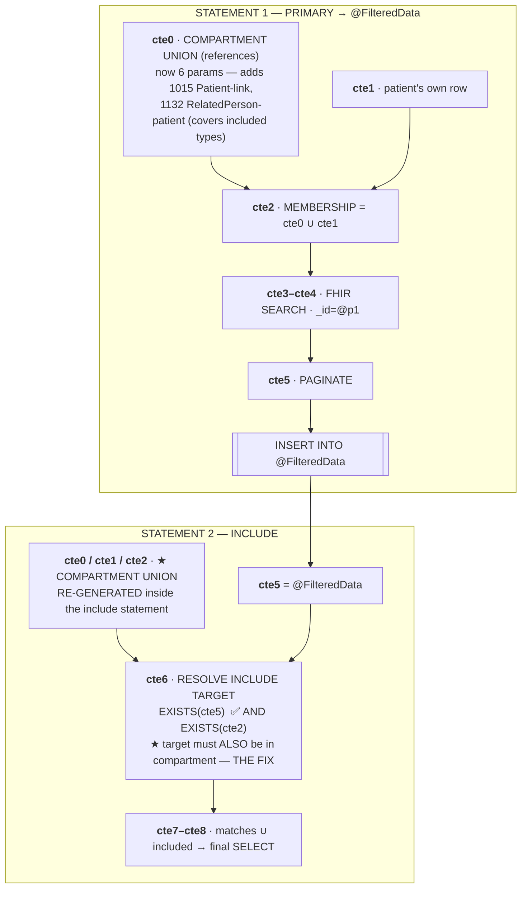

# ADR-2607: Enforce SMART Patient Compartment Scoping on `_include` / `_revinclude` (SQL)

**Status**: Proposed
**Date**: 2026-07-10
**Feature**: smart-include-compartment-leak

Labels: [Security](https://github.com/microsoft/fhir-server/labels/Security) | [Area-SMART](https://github.com/microsoft/fhir-server/labels/Area-SMART) | [Area-Search](https://github.com/microsoft/fhir-server/labels/Area-Search)

## Context

An MSRC report showed that a SMART-on-FHIR patient-scoped caller (a token such as `patient/*.read` confined to a single compartment, e.g. `Patient/CHILD`) can read resources **outside** its patient compartment by abusing search inclusions. The primary search is correctly compartment-restricted, but the `_include` / `_revinclude` expansion is not: the included/revincluded resources are resolved by plain reference joins with no compartment predicate. A caller can therefore start from an in-compartment resource and pull in resources belonging to *other* patients — a PHI disclosure.

The compartment restriction is applied to the *matched* rows of a search, but the SQL that materializes includes (built in `SqlQueryGenerator.HandleTableKindInclude`) joins `ReferenceSearchParam` to `Resource` and returns whatever is referenced, unfiltered. Any reference that crosses a compartment boundary leaks.

Constraints:
- **SQL data provider only.** Cosmos DB is being deprecated and is explicitly out of scope for this fix.
- Must not regress existing SMART include/revinclude behavior, including wildcard (`_revinclude=*`) and iterate cases, nor the SMART V2 fine-grained (`ApplyFineGrainedAccessControlWithSearchParameters`) path, which already constrains includes by scope through its own union rewrite.
- Must not collide with the query-plan / custom-query hash cache.

### Reproduction

Two integration tests were added to `SmartSearchTests` (Shared integration suite, run against a real SQL Server) before any fix, and both **failed** (confirming the leak):

1. **`_include`** — a patient-scoped caller searches a resource in its compartment with an `_include` whose target resource belongs to a different patient, and asserts the out-of-compartment target is **not** returned.
2. **`_revinclude`** — the symmetric case: a `_revinclude` that pulls in resources referencing an out-of-compartment resource, asserting they are **not** returned.

These two tests are the RED baseline; the fix turns them GREEN while the pre-existing SMART include/revinclude tests stay GREEN.

## Options Considered

1. **Post-filter in Core/API after retrieval** — drop out-of-compartment includes after the SQL result is read back. *(rejected: the PHI has already crossed the storage boundary into server memory; also breaks `_total`, paging, and the `$includes` continuation contract.)*
2. **Core expression rewriter that rewrites each include into a compartment-scoped sub-search** — express the constraint provider-agnostically in the Core expression tree. *(viable, but heavy: include expansion is emitted as a single generated statement in the SQL layer, SMART include handling already lives there, and a Core rewrite would have to reproduce the include CTE structure.)*
3. **Hand-rolled SQL predicate via the combined compartment search parameter (`clinical-patient`)** — require the produced resource to carry a `ReferenceSearchParam` row for the combined compartment parameter pointing at the compartment id. *(rejected after investigation: the common/combined search parameters that `CompartmentDefinition` maps to — `clinical-patient` and friends — are **never materialized as index rows**. Patient references are indexed only under type-specific parameters such as `Observation-subject`. A predicate keyed on the combined parameter matches nothing and drops legitimate in-compartment resources.)*
4. **Reuse the `dbo.CompartmentAssignment` membership table** — join the produced rows against the compartment-assignment table that older compartment search used. *(rejected: `CompartmentAssignment` is **deprecated** and must not be used by new code.)*
5. **Reuse the SMART compartment UNION the primary query already builds, and intersect it with the produced include/revinclude rows** — the same `SmartCompartmentSearchExpression` → UNION-of-CTEs mechanism that scopes the primary search is extended to the included rows. *(chosen: no new membership store, no deprecated table, and it composes with SMART V1 and V2 — including granular scopes.)*

## Decision

Reuse the compartment restriction the server **already** builds for the primary search rather than inventing a second membership check. `SearchOptionsFactory` emits a `SmartCompartmentSearchExpression`; the SQL rewrite (`SmartCompartmentSearchRewriter` / `SqlCompartmentSearchRewriter`) turns it into a set of per-resource-type CTEs — each keyed on a **materialized, type-specific reference parameter** that points at the compartment id — `UNION`ed into a single "compartment membership" CTE that is then intersected with the primary query. This is the mechanism the user asked us to follow; the leak exists only because that intersection was never applied to includes.

The fix extends that same union to the produced rows of `_include` / `_revinclude`:

- **Broaden the union's covered types.** The compartment union is built over the primary search types *and* the types produced by include/revinclude expansion (`primary ∪ produced`), so the membership CTE enumerates the included resource types. With no includes this covered-type set equals the primary types, so the *type-set broadening* is a no-op there, and non-SMART queries are unaffected entirely (the whole mechanism is gated to `SmartCompartmentSearchExpression`). Base SMART queries without includes do shift slightly — but only because of the membership-resolution change in the next bullet (the `subject` substitution), not because of include broadening; see *the base SMART compartment result is now more complete* under [Consequences](#consequences). A reversed wildcard `_revinclude=*:*` under an unrestricted scope produces an open-ended type set (there is no bound list of types that may reference the compartment root); this is represented as *all* compartment resource types so every revincluded type is covered. The membership union for those types is enumerated from their compartment-defining parameters; it deliberately is **not** collapsed to a single unfiltered "any reference to the root" predicate, because that collapse re-introduces the disclosure (see [Generated SQL and Performance Impact](#generated-sql-and-performance-impact)).
- **Resolve membership through the `CompartmentDefinition`'s parameters, substituting a materialized carrier for the non-materialized combined parameter.** Compartment membership is defined by the FHIR `CompartmentDefinition`: a resource is in the Patient compartment only through the parameters that definition *nominates* (for `Observation`, `subject` / `performer`; for `Encounter`, the combined `patient` parameter) — never through an arbitrary reference that merely happens to point at a `Patient`. One adjustment is required: the definition nominates the combined `clinical-patient` parameter for several clinical types (`Encounter`, `ImagingStudy`, `Procedure`, `Condition`, ...), and that parameter's FHIRPath uses `resolve()`, so it is never materialized as an index row (Option 3); a predicate keyed on it matches nothing and would silently drop those in-compartment resources. For those types — and only those — the SMART union substitutes the type's materialized `subject` parameter, which indexes exactly the reference the combined parameter describes and is the very element the Patient compartment is defined on. The substitution is narrow (`patient` → `subject`), is gated to `SmartCompartmentSearchExpression`, and can never introduce an unrelated reference such as `Observation.focus`; every union member remains constrained to `ReferenceResourceId = compartmentId`.
- **Re-generate and intersect at the include.** Includes are emitted in a separate statement (`INSERT INTO @FilteredData`, then a new `;WITH`). The compartment union is re-generated inside that statement — mirroring the existing SMART V2 scope-union handling — and applied as an `EXISTS` intersection: the include **target** (for `_include`) or the include **source** (for `_revinclude`) must appear in the compartment membership CTE.

> **Membership is defined by the compartment, not by reachability.** A parameter that *can* target `Patient` (for example `Observation.focus`, typed `Reference(Any)`) does **not** confer Patient-compartment membership; only the parameters the `CompartmentDefinition` nominates do (for `Observation`, `subject` and `performer`). The MSRC report exploited exactly this distinction: an `Observation` belonging to patient B but carrying `focus = Patient/A` was admitted into A's compartment because an earlier iteration of this fix treated *any* materialized Patient-targeting reference as membership. Restricting membership to the nominated parameters (plus the `subject` carrier substitution above) means `focus` and similar non-compartment references are no longer admitted — via includes, `_revinclude=Observation:focus`, or a direct search.

This composes across SMART versions. A V1 request, or a V2 request with granular scopes but no per-scope search parameters, carries only the compartment union, which is re-applied to includes. When a V2 fine-grained scope union is *also* present, both unions are re-generated and intersected independently, so a produced row must satisfy the compartment **and** the scope. The compartment intersection is applied even when the scope grants all resource types (`patient/*.read`), because the compartment — not the scope — is the confidentiality boundary. Because the predicate adds real SQL text (and the compartment id is a hashed parameter), the generated query gets a distinct query hash and cannot collide with non-compartment custom queries in the plan/hash cache.

## Consequences

- Closes the MSRC disclosure on the SQL provider for SMART V1 and V2 (including granular scopes): `_include` / `_revinclude` can no longer return resources outside the caller's patient compartment.
- Reuses the authoritative, already-tested compartment union — a single notion of "in compartment," consistent with primary compartment search — instead of a second divergent membership check, and avoids both the deprecated `CompartmentAssignment` table and the never-materialized combined-parameter predicate.
- **Membership is restricted to the `CompartmentDefinition`'s parameters (the MSRC over-match fix).** An earlier iteration of this fix admitted *any* materialized reference that targeted the compartment root type. That over-broad rule let a resource carrying an unrelated Patient reference leak into the compartment — concretely, an `Observation` whose `subject` is patient B but whose `focus` is `Patient/CHILD` was admitted into CHILD's compartment, disclosing B's data through a direct search or `_revinclude=Observation:focus`. Membership is now resolved strictly from the parameters the `CompartmentDefinition` nominates (plus the `subject`-carrier substitution below), so non-compartment references such as `focus` are never admitted. Two dedicated probes (a direct search and a `_revinclude=Observation:focus`) assert this.
- **Correctness depends on resolving membership to the *nominated* parameters (with the `subject` carrier substitution) — never to arbitrary Patient-targeting references.** Widening membership to any reference that can point at a `Patient` is a disclosure (the `focus` over-match above); narrowing it below the nominated set silently drops in-compartment resources (the `clinical-patient` under-match). Keeping the union's parameter resolution aligned with the `CompartmentDefinition` and with the materialized index rows the primary compartment search relies on is a security-sensitive invariant, guarded by the reproduction and regression suites.
- **Side effect: the base SMART compartment result is now more complete.** Because the union substitutes the type's materialized `subject` parameter for the non-materialized `clinical-patient` mapping, a patient's own resources that were previously dropped (e.g. an `Encounter`, `ImagingStudy` or `Procedure` linked only via `subject`) are now correctly returned. This is a safe widening (still bounded to resources referencing the compartment root) but it does change result counts; one integration assertion that hard-coded the old undercount was updated accordingly (39 → 42).
- **The regular (non-SMART) compartment search path is deliberately left untouched.** The `subject`-carrier substitution above is gated to `SmartCompartmentSearchExpression`; a conventional `Patient/{id}/*` compartment search still builds membership only from the `CompartmentDefinition`-named parameters and keeps its existing behavior — including the same pre-existing under-match for types mapped to the non-materialized combined parameter. This scoping keeps the security fix confined to the SMART path and guarantees it cannot regress non-SMART compartment semantics; broadening the base path is a separate, non-security change that was intentionally not bundled here.
- **Known residual gap (an under-match, never a disclosure): types whose *only* Patient link is the combined parameter are still not admitted.** `Immunization` is the concrete example. In R4 its sole `Patient`-targeting reference parameter is the combined `patient` parameter (`clinical-patient`); it has no type-specific materialized parameter (its other reference parameters — `location`, `manufacturer`, `performer`, `reaction`, `reason-reference` — do not target `Patient`, and there is no `Immunization-subject`). Because the substitution only adds the type's materialized `subject` parameter and `Immunization` has none, an `Immunization` linked only through `clinical-patient` remains absent from the compartment result (e.g. `Immunization/A1` in the tests). This is a pre-existing completeness gap — the missing rows reference the compartment root itself, so it can never surface another patient's data — and closing it (by materializing the combined parameter or adding an equivalent indexed path) is out of scope for this security fix and tracked separately as ADO #197858.
- Adds an `EXISTS` sub-predicate and a re-generated compartment-union CTE to include/revinclude statements. For targeted queries the cost is bounded (a semi-join over a small produced-row set against the `ReferenceSearchParam` index). The all-types wildcard `_revinclude=*:*` is the worst case: its membership CTE enumerates the compartment-defining parameters of every compartment type (nominated parameters plus `subject` substitutions, ≈ 92 branches), and that union is re-generated in the revinclude statement, for a ~2,166-line statement. It **cannot** be collapsed to a single unfiltered "any reference to the root" predicate — that collapse was the source of the `focus` disclosure — but it is still far below the naive all-parameters enumeration (~8,814 lines). The generated SQL and its performance characteristics — captured before and after the fix — are analyzed in [Generated SQL and Performance Impact](#generated-sql-and-performance-impact).
- **The `$includes` paging operation is covered by the same intersection.** When include/revinclude results exceed the include limit, clients page the remainder through the FHIR `$includes` operation, whose SQL is built by a separate path (`SearchIncludeImpl` + `IncludesOperationRewriter`) rather than the normal search build. That path shares the same `CreateDefaultSearchExpression` (which applies the compartment rewriters) and the same `HandleTableKindInclude` compartment `EXISTS`, so a paged include page is scoped identically to the first page — there is no "page past the compartment" bypass. This is verified by dedicated R4/R4B integration tests that drive `$includes` directly and confirm an out-of-compartment resource which is reachable without a compartment is filtered once the compartment is applied.
- Include/revinclude of genuinely shared, non-patient-specific reference targets (e.g. `Practitioner`, `Organization`, `Location`, `Medication`) must remain available; these are represented in the compartment union's universal-type members so they are not dropped.
- **SQL-only.** Cosmos is deliberately untouched (deprecated). If Cosmos SMART includes need the same guarantee later, it is a separate follow-up.

## Generated SQL and Performance Impact

A concern raised in review: intersecting the compartment union with includes re-generates CTEs and could enlarge the query, hurting query-plan compilation and execution. To ground this rather than reason about it abstractly, the actual parameterized SQL (`sp_executesql` statement text) emitted by the R4 integration suite against SQL Server 2022 was captured **before** and **after** the fix, for the same requests.

### Block structure — before vs after

Both the leaking and fixed queries share the same two-statement shape: a **primary** statement that materializes the compartment-restricted matches into `@FilteredData`, then an **include** statement that expands `_include` / `_revinclude`. The fix changes exactly one thing — it re-applies the compartment membership union to the include statement. The diagrams below use the representative `_include` case (`Coverage?_id=X&_include=Coverage:subscriber`, caller confined to `Patient/child`); the CTE names match the full SQL dumps that follow.

**BEFORE — `main` (leak):** the include statement resolves the included target with no compartment check.



**AFTER — this branch (B2, fixed):** the include statement re-generates the compartment union and requires the included resource to be a member.



The only structural change is in the include statement: it re-generates the compartment membership union (`cte0`/`cte1`/`cte2`) and adds a second `EXISTS(cte2)` to `cte6`, so an included resource must be a compartment member. Everything else — the primary statement, paging, and the final hydration `SELECT` — is byte-identical, apart from `cte0` widening as the union's covered types grow. The all-types wildcard `_revinclude=*:*` has the *same* block shape; the only differences are that the compartment union expands to ≈ 92 branches instead of 6, and being a `_revinclude` the intersection (`EXISTS(cte3)`) sits on the include **source** rather than the target.

### Representative case — a single `_include`

Request: `GET Coverage?_id=smart-leak-coverage&_include=Coverage:subscriber`, caller confined to `Patient/smart-leak-child` (`@p0 = 'smart-leak-child'`, `@p1 = 'smart-leak-coverage'`).

The query is two statements: a primary statement that materializes the compartment-restricted matches into `@FilteredData`, then an include statement that expands `_include`. The compartment union is `cte0` (rows in `ReferenceSearchParam` that reference the patient) `UNION ALL` `cte1` (the patient's own row) → `cte2`. Two things change with the fix:

1. **Primary `cte0` widens** from 4 to 6 reference-parameter branches (`SearchParamId` 343/345/336/342 → additionally 1015/1132), because the compartment union now covers the included types (`Patient`, `RelatedPerson`) and enumerates each type's `CompartmentDefinition`-nominated parameters (`Patient-link` = 1015, `RelatedPerson-patient` = 1132). No `subject` substitution arises in this example — `Coverage`, `Patient` and `RelatedPerson` are each nominated through materialized parameters directly. Same CTE count, a longer `OR` predicate.
2. **The include statement gains the compartment intersection.** Before, the include CTE (`cte6`) resolved `Coverage:subscriber` with *no* compartment check — the leak. After, the compartment union (`cte0`/`cte1`/`cte2`) is re-generated inside the include statement and `cte6` gains a second `EXISTS`, so the included target must also be in the compartment membership set.

The critical difference is one predicate on `cte6` (the include-target fetch):

```sql
-- BEFORE (leak): the included target only has to be referenced by a matched row (cte5)
,cte6 AS (
    SELECT DISTINCT TOP (@p3) refTarget.ResourceTypeId AS T1, refTarget.ResourceSurrogateId AS Sid1, 0 AS IsMatch, 0 AS IsPartial
    FROM dbo.ReferenceSearchParam refSource
         JOIN dbo.Resource refTarget ON refSource.ReferenceResourceTypeId = refTarget.ResourceTypeId AND refSource.ReferenceResourceId = refTarget.ResourceId
    WHERE refSource.SearchParamId = 345
        AND refTarget.IsHistory = 0 AND refTarget.IsDeleted = 0
        AND refSource.ResourceTypeId IN (31)
        AND EXISTS (SELECT * FROM cte5 WHERE refSource.ResourceTypeId = T1 AND refSource.ResourceSurrogateId = Sid1 AND Row < @p4)
)

-- AFTER (fixed): the included target must ALSO be in the compartment membership CTE (cte2)
,cte6 AS (
    SELECT DISTINCT TOP (@p3) refTarget.ResourceTypeId AS T1, refTarget.ResourceSurrogateId AS Sid1, 0 AS IsMatch, 0 AS IsPartial
    FROM dbo.ReferenceSearchParam refSource
         JOIN dbo.Resource refTarget ON refSource.ReferenceResourceTypeId = refTarget.ResourceTypeId AND refSource.ReferenceResourceId = refTarget.ResourceId
    WHERE refSource.SearchParamId = 345
        AND refTarget.IsHistory = 0 AND refTarget.IsDeleted = 0
        AND refSource.ResourceTypeId IN (31)
        AND EXISTS (SELECT * FROM cte5 WHERE refSource.ResourceTypeId = T1 AND refSource.ResourceSurrogateId = Sid1 AND Row < @p4)
        AND EXISTS (SELECT * FROM cte2 WHERE refSource.ReferenceResourceTypeId = T1 AND refTarget.ResourceSurrogateId = Sid1)  -- compartment intersection (the fix)
)
```

| Metric | Before | After | Δ |
|---|---|---|---|
| Statement text | 104 lines / ~3.9 KB | 165 lines / ~6.1 KB | +61 lines / +59 % |
| CTEs (primary ; include) | 6 ; 3 | 6 ; 7 | +4 (compartment union re-generated in the include) |
| Compartment predicate on include | none | one `EXISTS` semi-join | the fix |
| Primary `INSERT` option | — | `OPTION (RECOMPILE)` | see below |

<details>
<summary>Full generated SQL — BEFORE (leak)</summary>

```sql
DECLARE @FilteredData AS TABLE (T1 smallint, Sid1 bigint, IsMatch bit, IsPartial bit, Row int)
;WITH
cte0 AS
(
    SELECT ResourceTypeId AS T1, ResourceSurrogateId AS Sid1
    FROM dbo.ReferenceSearchParam
    WHERE ((SearchParamId = 343
        AND ResourceTypeId = 31
        AND ((ReferenceResourceTypeId = 100)
        OR (ReferenceResourceTypeId = 103)
        OR (ReferenceResourceTypeId = 114)
        OR (ReferenceResourceTypeId IS NULL))  )
        OR (SearchParamId = 345
        AND ResourceTypeId = 31
        AND ((ReferenceResourceTypeId = 103)
        OR (ReferenceResourceTypeId = 114)
        OR (ReferenceResourceTypeId IS NULL))  )
        OR (SearchParamId = 336
        AND ResourceTypeId = 31
        AND ReferenceResourceTypeId = 103 )
        OR (SearchParamId = 342
        AND ResourceTypeId = 31
        AND ((ReferenceResourceTypeId = 100)
        OR (ReferenceResourceTypeId = 103)
        OR (ReferenceResourceTypeId = 114)
        OR (ReferenceResourceTypeId IS NULL))  )) 
        AND ReferenceResourceTypeId = 103
        AND ReferenceResourceId = @p0 
),
cte1 AS
(
    SELECT ResourceTypeId AS T1, ResourceSurrogateId AS Sid1
    FROM dbo.Resource
    WHERE IsHistory = 0 
        AND IsDeleted = 0 
        AND ResourceId = @p0
        AND ResourceTypeId = 103 
),
cte2 AS
(
    SELECT * FROM cte0
    UNION ALL SELECT * FROM cte1
), 
cte3 AS
(
    SELECT T1, Sid1, ResourceTypeId AS T2, ResourceSurrogateId AS Sid2
    FROM dbo.Resource
         JOIN cte2 ON ResourceTypeId = T1 AND ResourceSurrogateId = Sid1
    WHERE IsHistory = 0 
        AND ResourceTypeId = 31 
)
,cte4 AS
(
    SELECT ResourceTypeId AS T1, ResourceSurrogateId AS Sid1
    FROM dbo.Resource
         JOIN cte3 ON ResourceTypeId = cte3.T1 AND ResourceSurrogateId = cte3.Sid1
    WHERE IsHistory = 0 
        AND IsDeleted = 0 
        AND ResourceTypeId = 31
        AND ResourceId = @p1 
)
,cte5 AS
(
    SELECT row_number() OVER (ORDER BY T1 ASC, Sid1 ASC) AS Row, *
    FROM
    (
        SELECT DISTINCT TOP (@p2) T1, Sid1, 1 AS IsMatch, 0 AS IsPartial 
        FROM cte4
        ORDER BY T1 ASC, Sid1 ASC
    ) t
)
/* HASH 8RoAjbAA9k8Qql6sbY5yVKEt4QG93ilwLWK5XdzxemY= params=@p0 */
INSERT INTO @FilteredData SELECT T1, Sid1, IsMatch, IsPartial, Row FROM cte5
;WITH cte5 AS (SELECT * FROM @FilteredData)
,cte6 AS
(
    SELECT DISTINCT TOP (@p3) refTarget.ResourceTypeId AS T1, refTarget.ResourceSurrogateId AS Sid1, 0 AS IsMatch, 0 AS IsPartial 
    FROM dbo.ReferenceSearchParam refSource
         JOIN dbo.Resource refTarget ON refSource.ReferenceResourceTypeId = refTarget.ResourceTypeId AND refSource.ReferenceResourceId = refTarget.ResourceId
    WHERE refSource.SearchParamId = 345
        AND refTarget.IsHistory = 0 
        AND refTarget.IsDeleted = 0 
        AND refSource.ResourceTypeId IN (31)
        AND EXISTS (SELECT * FROM cte5 WHERE refSource.ResourceTypeId = T1 AND refSource.ResourceSurrogateId = Sid1 AND Row < @p4)
)
,cte7 AS
(
    SELECT DISTINCT TOP (@p5) T1, Sid1, IsMatch, CASE WHEN count_big(*) over() > @p6 THEN 1 ELSE 0 END AS IsPartial 
    FROM cte6
)
,cte8 AS
(
    SELECT T1, Sid1, IsMatch, IsPartial 
    FROM cte5
    UNION ALL
    SELECT T1, Sid1, IsMatch, IsPartial
    FROM cte7 WHERE NOT EXISTS (SELECT * FROM cte5 WHERE cte5.Sid1 = cte7.Sid1 AND cte5.T1 = cte7.T1)
)
SELECT * FROM (SELECT DISTINCT r.ResourceTypeId, r.ResourceId, r.Version, r.IsDeleted, r.ResourceSurrogateId, r.RequestMethod, CAST(IsMatch AS bit) AS IsMatch, CAST(IsPartial AS bit) AS IsPartial, r.IsRawResourceMetaSet, r.SearchParamHash, r.RawResource
FROM dbo.Resource r
     JOIN cte8 ON r.ResourceTypeId = cte8.T1 AND r.ResourceSurrogateId = cte8.Sid1
WHERE IsHistory = 0 
    AND IsDeleted = 0 
) AS t ORDER BY IsMatch DESC, (CASE WHEN IsMatch = 1 THEN t.ResourceTypeId ELSE NULL END) ASC, (CASE WHEN IsMatch = 1 THEN t.ResourceSurrogateId ELSE NULL END) ASC, (CASE WHEN IsMatch = 0 THEN t.ResourceTypeId ELSE NULL END) ASC, (CASE WHEN IsMatch = 0 THEN t.ResourceSurrogateId ELSE NULL END) ASC
```

</details>

<details>
<summary>Full generated SQL — AFTER (fixed)</summary>

```sql
DECLARE @FilteredData AS TABLE (T1 smallint, Sid1 bigint, IsMatch bit, IsPartial bit, Row int)
;WITH
cte0 AS
(
    SELECT ResourceTypeId AS T1, ResourceSurrogateId AS Sid1
    FROM dbo.ReferenceSearchParam
    WHERE ((SearchParamId = 343
        AND ResourceTypeId = 31
        AND ((ReferenceResourceTypeId = 100)
        OR (ReferenceResourceTypeId = 103)
        OR (ReferenceResourceTypeId = 114)
        OR (ReferenceResourceTypeId IS NULL))  )
        OR (SearchParamId = 345
        AND ResourceTypeId = 31
        AND ((ReferenceResourceTypeId = 103)
        OR (ReferenceResourceTypeId = 114)
        OR (ReferenceResourceTypeId IS NULL))  )
        OR (SearchParamId = 336
        AND ResourceTypeId = 31
        AND ReferenceResourceTypeId = 103 )
        OR (SearchParamId = 342
        AND ResourceTypeId = 31
        AND ((ReferenceResourceTypeId = 100)
        OR (ReferenceResourceTypeId = 103)
        OR (ReferenceResourceTypeId = 114)
        OR (ReferenceResourceTypeId IS NULL))  )
        OR (SearchParamId = 1015
        AND ResourceTypeId = 103
        AND ((ReferenceResourceTypeId = 103)
        OR (ReferenceResourceTypeId = 114)
        OR (ReferenceResourceTypeId IS NULL))  )
        OR (SearchParamId = 1132
        AND ResourceTypeId = 114
        AND ReferenceResourceTypeId = 103 )) 
        AND ReferenceResourceTypeId = 103
        AND ReferenceResourceId = @p0 
),
cte1 AS
(
    SELECT ResourceTypeId AS T1, ResourceSurrogateId AS Sid1
    FROM dbo.Resource
    WHERE IsHistory = 0 
        AND IsDeleted = 0 
        AND ResourceId = @p0
        AND ResourceTypeId = 103 
),
cte2 AS
(
    SELECT * FROM cte0
    UNION ALL SELECT * FROM cte1
), 
cte3 AS
(
    SELECT T1, Sid1, ResourceTypeId AS T2, ResourceSurrogateId AS Sid2
    FROM dbo.Resource
         JOIN cte2 ON ResourceTypeId = T1 AND ResourceSurrogateId = Sid1
    WHERE IsHistory = 0 
        AND ResourceTypeId = 31 
)
,cte4 AS
(
    SELECT ResourceTypeId AS T1, ResourceSurrogateId AS Sid1
    FROM dbo.Resource
         JOIN cte3 ON ResourceTypeId = cte3.T1 AND ResourceSurrogateId = cte3.Sid1
    WHERE IsHistory = 0 
        AND IsDeleted = 0 
        AND ResourceTypeId = 31
        AND ResourceId = @p1 
)
,cte5 AS
(
    SELECT row_number() OVER (ORDER BY T1 ASC, Sid1 ASC) AS Row, *
    FROM
    (
        SELECT DISTINCT TOP (@p2) T1, Sid1, 1 AS IsMatch, 0 AS IsPartial 
        FROM cte4
        ORDER BY T1 ASC, Sid1 ASC
    ) t
)
/* HASH 8RoAjbAA9k8Qql6sbY5yVKEt4QG93ilwLWK5XdzxemY= params=@p0 */
INSERT INTO @FilteredData SELECT T1, Sid1, IsMatch, IsPartial, Row FROM cte5
OPTION (RECOMPILE)
;WITH
cte0 AS
(
    SELECT ResourceTypeId AS T1, ResourceSurrogateId AS Sid1
    FROM dbo.ReferenceSearchParam
    WHERE ((SearchParamId = 343
        AND ResourceTypeId = 31
        AND ((ReferenceResourceTypeId = 100)
        OR (ReferenceResourceTypeId = 103)
        OR (ReferenceResourceTypeId = 114)
        OR (ReferenceResourceTypeId IS NULL))  )
        OR (SearchParamId = 345
        AND ResourceTypeId = 31
        AND ((ReferenceResourceTypeId = 103)
        OR (ReferenceResourceTypeId = 114)
        OR (ReferenceResourceTypeId IS NULL))  )
        OR (SearchParamId = 336
        AND ResourceTypeId = 31
        AND ReferenceResourceTypeId = 103 )
        OR (SearchParamId = 342
        AND ResourceTypeId = 31
        AND ((ReferenceResourceTypeId = 100)
        OR (ReferenceResourceTypeId = 103)
        OR (ReferenceResourceTypeId = 114)
        OR (ReferenceResourceTypeId IS NULL))  )
        OR (SearchParamId = 1015
        AND ResourceTypeId = 103
        AND ((ReferenceResourceTypeId = 103)
        OR (ReferenceResourceTypeId = 114)
        OR (ReferenceResourceTypeId IS NULL))  )
        OR (SearchParamId = 1132
        AND ResourceTypeId = 114
        AND ReferenceResourceTypeId = 103 )) 
        AND ReferenceResourceTypeId = 103
        AND ReferenceResourceId = @p0 
),
cte1 AS
(
    SELECT ResourceTypeId AS T1, ResourceSurrogateId AS Sid1
    FROM dbo.Resource
    WHERE IsHistory = 0 
        AND IsDeleted = 0 
        AND ResourceId = @p0
        AND ResourceTypeId = 103 
),
cte2 AS
(
    SELECT * FROM cte0
    UNION ALL SELECT * FROM cte1
)
,cte5 AS (SELECT * FROM @FilteredData)
,cte6 AS
(
    SELECT DISTINCT TOP (@p3) refTarget.ResourceTypeId AS T1, refTarget.ResourceSurrogateId AS Sid1, 0 AS IsMatch, 0 AS IsPartial 
    FROM dbo.ReferenceSearchParam refSource
         JOIN dbo.Resource refTarget ON refSource.ReferenceResourceTypeId = refTarget.ResourceTypeId AND refSource.ReferenceResourceId = refTarget.ResourceId
    WHERE refSource.SearchParamId = 345
        AND refTarget.IsHistory = 0 
        AND refTarget.IsDeleted = 0 
        AND refSource.ResourceTypeId IN (31)
        AND EXISTS (SELECT * FROM cte5 WHERE refSource.ResourceTypeId = T1 AND refSource.ResourceSurrogateId = Sid1 AND Row < @p4)
        AND EXISTS (SELECT * FROM cte2 WHERE refSource.ReferenceResourceTypeId = T1 AND refTarget.ResourceSurrogateId = Sid1)
)
,cte7 AS
(
    SELECT DISTINCT TOP (@p5) T1, Sid1, IsMatch, CASE WHEN count_big(*) over() > @p6 THEN 1 ELSE 0 END AS IsPartial 
    FROM cte6
)
,cte8 AS
(
    SELECT T1, Sid1, IsMatch, IsPartial 
    FROM cte5
    UNION ALL
    SELECT T1, Sid1, IsMatch, IsPartial
    FROM cte7 WHERE NOT EXISTS (SELECT * FROM cte5 WHERE cte5.Sid1 = cte7.Sid1 AND cte5.T1 = cte7.T1)
)
SELECT * FROM (SELECT DISTINCT r.ResourceTypeId, r.ResourceId, r.Version, r.IsDeleted, r.ResourceSurrogateId, r.RequestMethod, CAST(IsMatch AS bit) AS IsMatch, CAST(IsPartial AS bit) AS IsPartial, r.IsRawResourceMetaSet, r.SearchParamHash, r.RawResource
FROM dbo.Resource r
     JOIN cte8 ON r.ResourceTypeId = cte8.T1 AND r.ResourceSurrogateId = cte8.Sid1
WHERE IsHistory = 0 
    AND IsDeleted = 0 
) AS t ORDER BY IsMatch DESC, (CASE WHEN IsMatch = 1 THEN t.ResourceTypeId ELSE NULL END) ASC, (CASE WHEN IsMatch = 1 THEN t.ResourceSurrogateId ELSE NULL END) ASC, (CASE WHEN IsMatch = 0 THEN t.ResourceTypeId ELSE NULL END) ASC, (CASE WHEN IsMatch = 0 THEN t.ResourceSurrogateId ELSE NULL END) ASC 

```

</details>

### All-types wildcard — reversed `_revinclude=*:*`

Request: `GET Patient?_id=smart-patient-D&_revinclude=*:*`. There is no bounded list of types that may reference the patient, so the compartment must cover *every* compartment resource type. Three ways to build that membership union were considered:

1. **Enumerate every materialized reference parameter that targets `Patient`** (an earlier iteration of this fix). This produced a compartment union ~4,350 lines long; because the union is re-generated wherever the compartment is re-applied, it was emitted twice, for an **8,814-line** statement — the sharpest form of the reviewer's size concern. Rejected as far too large. It was also *insecure* for a second reason: enumerating every Patient-targeting reference admits non-compartment references such as `Observation.focus` (the MSRC over-match).

2. **Collapse membership to a single unfiltered predicate** — "there exists *any* `ReferenceSearchParam` row pointing at `Patient/@p0`," independent of the referencing parameter (`WHERE ReferenceResourceTypeId = 103 AND ReferenceResourceId = @p0`, **no `SearchParamId` filter**). This is tiny (~126 lines) but **insecure**, and was rejected. Dropping the `SearchParamId` filter is exactly what lets a resource enter the compartment through a *non-compartment* reference such as `Observation.focus`: an `Observation` whose `subject` is another patient but whose `focus` is `Patient/@p0` produces a `ReferenceSearchParam` row pointing at the root and would be admitted. It is the same class of over-match the MSRC report describes, relocated into the wildcard path. **The `SearchParamId` filter is the security boundary and cannot be removed.**

3. **Enumerate the compartment-defining parameters of every compartment type** (shipped). Every union branch keeps its `SearchParamId` filter, so only the parameters the `CompartmentDefinition` nominates — plus the `subject`-carrier substitution — contribute membership. This is the honest cost of a *secure* wildcard: ≈ 92 branches, re-generated in the revinclude statement, for a **2,166-line** statement. It is roughly a quarter the size of option 1 precisely *because* it is the secure, narrower set: it enumerates the ~92 compartment-defining parameters rather than all ~210 references that merely target `Patient`.

Each branch is bound to both its `SearchParamId` and `ReferenceResourceId = @p0` (this is what option 2 threw away):

```sql
cte0 AS
(
    SELECT ResourceTypeId AS T1, ResourceSurrogateId AS Sid1
    FROM dbo.ReferenceSearchParam
    WHERE ((SearchParamId = 7   AND ResourceTypeId = 1  AND (ReferenceResourceTypeId = 103 OR ... OR ReferenceResourceTypeId IS NULL))
        OR (SearchParamId = 41  AND ResourceTypeId = 3  AND (ReferenceResourceTypeId = 103 OR ...))
        OR (SearchParamId = 206 AND ResourceTypeId IN (4,14,15,28,29,34,44,48,54,55,56,61,62,76,77,95,110,138,146) AND (ReferenceResourceTypeId = 103 OR ...))  -- combined clinical-patient: non-materialized, present for parity, matches no rows
        OR ...                                                                                   -- ≈ 92 branches total (nominated params + subject substitutions)
        )
        AND ReferenceResourceTypeId = 103                                                        -- Patient (compartment root)
        AND ReferenceResourceId = @p0
)
```

| Metric | Before fix | All-parameters enumeration (rejected: too large + over-match) | Single-predicate collapse (rejected: insecure) | Nominated-parameter enumeration (shipped) |
|---|---|---|---|---|
| Statement text | 89 lines / ~3.5 KB | 8,814 lines / ~360 KB | 126 lines / ~4.4 KB | 2,166 lines / ~88 KB |
| Compartment membership `cte0` | absent | ~4,350 lines, emitted **twice** | one unfiltered predicate, emitted twice | ≈ 92 filtered branches, emitted **twice** |
| `SearchParamId` filter per branch | — | yes | **no — the disclosure** | yes |
| Dominant shape | — | one very wide `OR` per statement | two `ReferenceSearchParam` index probes | ≈ 92-way `OR`, two statements |

The shipped enumeration is larger than the collapse would have been, but the collapse is not an option: removing the `SearchParamId` filter is the exact over-match the MSRC report exploits (see the *"Membership is defined by the compartment, not by reachability"* note in the [Decision](#decision)). The wildcard is therefore the one case where the fix pays a real size cost. It remains far below the naive all-parameters enumeration, applies only to the unbounded `_revinclude=*:*`, and a targeted `_revinclude=Type:param` still emits only the specific per-type union member(s), staying close to the single-`_include` numbers above.

<details>
<summary>Full generated SQL — BEFORE fix (leak: no compartment on the revincluded source)</summary>

```sql
exec sp_executesql N'DECLARE @FilteredData AS TABLE (T1 smallint, Sid1 bigint, IsMatch bit, IsPartial bit, Row int)
;WITH
cte0 AS
(
    SELECT ResourceTypeId AS T1, ResourceSurrogateId AS Sid1
    FROM dbo.ReferenceSearchParam
    WHERE SearchParamId = 1015
        AND ResourceTypeId = 103
        AND ((ReferenceResourceTypeId = 103)
        OR (ReferenceResourceTypeId = 114)
        OR (ReferenceResourceTypeId IS NULL))  
        AND ReferenceResourceTypeId = 103
        AND ReferenceResourceId = @p0 
),
cte1 AS
(
    SELECT ResourceTypeId AS T1, ResourceSurrogateId AS Sid1
    FROM dbo.Resource
    WHERE IsHistory = 0 
        AND IsDeleted = 0 
        AND ResourceId = @p0
        AND ResourceTypeId = 103 
),
cte2 AS
(
    SELECT * FROM cte0
    UNION ALL SELECT * FROM cte1
), 
cte3 AS
(
    SELECT T1, Sid1, ResourceTypeId AS T2, ResourceSurrogateId AS Sid2
    FROM dbo.Resource
         JOIN cte2 ON ResourceTypeId = T1 AND ResourceSurrogateId = Sid1
    WHERE IsHistory = 0 
        AND ResourceTypeId = 103 
)
,cte4 AS
(
    SELECT ResourceTypeId AS T1, ResourceSurrogateId AS Sid1
    FROM dbo.Resource
         JOIN cte3 ON ResourceTypeId = cte3.T1 AND ResourceSurrogateId = cte3.Sid1
    WHERE IsHistory = 0 
        AND IsDeleted = 0 
        AND ResourceTypeId = 103
        AND ResourceId = @p0 
)
,cte5 AS
(
    SELECT row_number() OVER (ORDER BY T1 ASC, Sid1 ASC) AS Row, *
    FROM
    (
        SELECT DISTINCT TOP (@p1) T1, Sid1, 1 AS IsMatch, 0 AS IsPartial 
        FROM cte4
        ORDER BY T1 ASC, Sid1 ASC
    ) t
)
/* HASH h0w25TcRdP73SZwvgSyrXlOobQd/GXRZr7mG+btMqD4= params=@p0 */
INSERT INTO @FilteredData SELECT T1, Sid1, IsMatch, IsPartial, Row FROM cte5
;WITH cte5 AS (SELECT * FROM @FilteredData)
,cte6 AS
(
    SELECT DISTINCT TOP (@p2) refSource.ResourceTypeId AS T1, refSource.ResourceSurrogateId AS Sid1, 0 AS IsMatch, 0 AS IsPartial 
    FROM dbo.ReferenceSearchParam refSource
         JOIN dbo.Resource refTarget ON refSource.ReferenceResourceTypeId = refTarget.ResourceTypeId AND refSource.ReferenceResourceId = refTarget.ResourceId
    WHERE refTarget.IsHistory = 0 
        AND refTarget.IsDeleted = 0 
        AND refTarget.ResourceTypeId IN (103)
        AND EXISTS (SELECT * FROM cte5 WHERE refTarget.ResourceTypeId = T1 AND refTarget.ResourceSurrogateId = Sid1 AND Row < @p3)
)
,cte7 AS
(
    SELECT DISTINCT TOP (@p4) T1, Sid1, IsMatch, CASE WHEN count_big(*) over() > @p5 THEN 1 ELSE 0 END AS IsPartial 
    FROM cte6
)
,cte8 AS
(
    SELECT T1, Sid1, IsMatch, IsPartial 
    FROM cte5
    UNION ALL
    SELECT T1, Sid1, IsMatch, IsPartial
    FROM cte7 WHERE NOT EXISTS (SELECT * FROM cte5 WHERE cte5.Sid1 = cte7.Sid1 AND cte5.T1 = cte7.T1)
)
SELECT * FROM (SELECT DISTINCT r.ResourceTypeId, r.ResourceId, r.Version, r.IsDeleted, r.ResourceSurrogateId, r.RequestMethod, CAST(IsMatch AS bit) AS IsMatch, CAST(IsPartial AS bit) AS IsPartial, r.IsRawResourceMetaSet, r.SearchParamHash, r.RawResource
FROM dbo.Resource r
     JOIN cte8 ON r.ResourceTypeId = cte8.T1 AND r.ResourceSurrogateId = cte8.Sid1
WHERE IsHistory = 0 
    AND IsDeleted = 0 
) AS t ORDER BY IsMatch DESC, (CASE WHEN IsMatch = 1 THEN t.ResourceTypeId ELSE NULL END) ASC, (CASE WHEN IsMatch = 1 THEN t.ResourceSurrogateId ELSE NULL END) ASC, (CASE WHEN IsMatch = 0 THEN t.ResourceTypeId ELSE NULL END) ASC, (CASE WHEN IsMatch = 0 THEN t.ResourceSurrogateId ELSE NULL END) ASC 
',N'@p0 varchar(64),@p1 int,@p2 int,@p3 int,@p4 int,@p5 int',@p0='smart-patient-D',@p1=11,@p2=1001,@p3=11,@p4=1001,@p5=1000
```

</details>

<details>
<summary>Full generated SQL — AFTER fix (all-types membership enumerated, ≈ 92 filtered branches, + revinclude compartment intersection — excerpted)</summary>

```sql
-- AFTER fix — all-types wildcard _revinclude=*:*  (2,166-line statement; excerpted here)
DECLARE @FilteredData AS TABLE (T1 smallint, Sid1 bigint, IsMatch bit, IsPartial bit, Row int)
;WITH
cte0 AS   -- compartment membership: ≈ 92 filtered branches (nominated params + subject substitutions)
(
    SELECT ResourceTypeId AS T1, ResourceSurrogateId AS Sid1
    FROM dbo.ReferenceSearchParam
    WHERE ((SearchParamId = 7   AND ResourceTypeId = 1  AND ((ReferenceResourceTypeId = 103) OR ... OR (ReferenceResourceTypeId IS NULL)))
        OR (SearchParamId = 41  AND ResourceTypeId = 3  AND ((ReferenceResourceTypeId = 103) OR ...))
        OR (SearchParamId = 206 AND ResourceTypeId IN (4,14,15,28,29,34,44,48,54,55,56,61,62,76,77,95,110,138,146) AND (...))  -- combined clinical-patient: non-materialized, matches no rows
        OR ...   -- ≈ 92 branches total (~1,020 lines); every branch keeps its SearchParamId filter
        ))
        AND ReferenceResourceTypeId = 103
        AND ReferenceResourceId = @p0
),
cte1 AS   -- the patient's own row
(
    SELECT ResourceTypeId AS T1, ResourceSurrogateId AS Sid1
    FROM dbo.Resource
    WHERE IsHistory = 0 AND IsDeleted = 0 AND ResourceId = @p0 AND ResourceTypeId = 103
),
cte2 AS   -- universal, non-patient-specific types (Practitioner / Organization / Location / Medication / …)
(
    SELECT ResourceTypeId AS T1, ResourceSurrogateId AS Sid1
    FROM dbo.Resource
    WHERE IsHistory = 0 AND IsDeleted = 0 AND ResourceTypeId IN (71,100,108,75,35)
),
cte3 AS   -- compartment membership union
(
    SELECT * FROM cte0
    UNION ALL SELECT * FROM cte1
    UNION ALL SELECT * FROM cte2
)
-- … primary search continues (cte4 … cte5) …
-- INSERT INTO @FilteredData SELECT … OPTION (RECOMPILE)

-- ── revinclude statement ─────────────────────────────────────────────────────
-- ;WITH cte0 / cte1 / cte2 / cte3  ← the ≈ 92-branch membership union is RE-GENERATED here (the second ~1,020 lines)
,cte6 AS (SELECT * FROM @FilteredData)
,cte7 AS
(
    SELECT DISTINCT TOP (@p2) refSource.ResourceTypeId AS T1, refSource.ResourceSurrogateId AS Sid1, 0 AS IsMatch, 0 AS IsPartial
    FROM dbo.ReferenceSearchParam refSource
         JOIN dbo.Resource refTarget ON refSource.ReferenceResourceTypeId = refTarget.ResourceTypeId AND refSource.ReferenceResourceId = refTarget.ResourceId
    WHERE refTarget.IsHistory = 0
        AND refTarget.IsDeleted = 0
        AND refTarget.ResourceTypeId IN (103)
        AND EXISTS (SELECT * FROM cte6 WHERE refTarget.ResourceTypeId = T1 AND refTarget.ResourceSurrogateId = Sid1 AND Row < @p3)
        AND EXISTS (SELECT * FROM cte3 WHERE refSource.ResourceTypeId = T1 AND refSource.ResourceSurrogateId = Sid1)  -- compartment intersection on the revinclude SOURCE (the fix)
)
-- … cte8 (matches ∪ revincluded) … final SELECT …
```

</details>
### Why this is acceptable — and where it is not

- **Plan compilation & caching.** The include re-generation reuses the *pre-existing* SMART V2 scope-union pattern, which appends `OPTION (RECOMPILE)` to the `INSERT INTO @FilteredData` (`SqlQueryGenerator`, gated on `_smartV2UnionVisited || _smartCompartmentUnionVisited`). Consequence: the statement is compiled per execution — the optimizer sees the actual literals and the real cardinality of the `@FilteredData` table variable — and, importantly, the large wildcard plan is **not** cached, so it can neither bloat nor evict the plan cache for other workloads. The compartment id stays a parameter (`@p0`) and the predicate is metadata-derived (compartment definition + search-parameter ids), so it is identical across patients and independent of stored data.
- **Execution.** Compartment membership is applied as a correlated `EXISTS (SELECT * FROM <unionCTE> …)` — a semi-join keyed on `(ResourceTypeId, ResourceSurrogateId)`, the leading columns of the `Resource`/`ReferenceSearchParam` indexes — evaluated only over the produced include rows, which are themselves capped by `TOP (@p3)` (≈1,001). The union CTE is built from `ReferenceSearchParam` index seeks (`SearchParamId = … AND ReferenceResourceId = @p0`). For targeted queries this is a handful of seeks over a bounded row set, not a scan.
- **Text size / duplication.** The compartment membership CTE is emitted twice (primary statement + include statement). For targeted SMART queries that is tens of lines. The all-types wildcard `_revinclude=*:*` is the outlier: its ≈ 92-branch union is emitted twice, for ~2,166 lines. That size is the unavoidable price of security — each branch must keep its `SearchParamId` filter, so the union cannot be collapsed to a single "any reference to the root" predicate (that collapse was the `focus` disclosure) — but it is still far below the ~8,814-line all-parameters enumeration. What is duplicated is *text*, parsed once per compilation; at the storage layer the cost is the two index-seek evaluations described above, not repeated scans.
- **Why re-generate the union twice rather than materialize it once?** The tempting optimization — compute compartment membership once into a table variable / temp table and reference it from both the primary and include statements — runs against the grain of the two changes that most recently shaped this code. #5209 (`2fe7641f9`) made the SMART-union table-variable insert conditional (only for include/revinclude), and #5224 (`5c81d2813`) then **removed** the `@FilteredDataSmartV2Union` table variable altogether, re-generating the union inline under `OPTION (RECOMPILE)`. The reason: a table variable carries no column statistics, so the optimizer assumes ~1 row and picks nested-loop shapes that degrade badly once the materialized set is large — the `@FilteredData` explosion this fix must not reintroduce. Re-generating inline under `OPTION (RECOMPILE)` instead lets the optimizer cost each occurrence against real literals and real cardinality. The reviewer's alternative — materialize the authorized keys once into an *indexed* temporary structure with statistics — is a legitimate future optimization for the wildcard case specifically, but it is a larger change that must avoid re-tripping the #5209 / #5224 table-variable regression, so it is deferred rather than bundled into this security fix.
- **Net.** For the SMART queries a patient-scoped app actually issues — a resource, or a compartment slice, with targeted includes — the added cost is a bounded semi-join plus a modest predicate, and the plan-cache behavior of non-include queries is unchanged (with no includes the generated SQL is byte-for-byte identical to before). The one genuine cost is the unbounded `_revinclude=*:*`: its ≈ 92-branch membership union is re-generated twice (~2,166 lines) because security forbids collapsing it to a single predicate and the #5209 / #5224 lesson forbids materializing it into a statistics-free table variable. Even so it is not cached (`OPTION (RECOMPILE)`), stays an order of magnitude below the naive all-parameters enumeration, and never materializes a table variable. Capping wildcard-revinclude type expansion, or the indexed-temp materialization noted above, are optional refinements deferred to keep this change focused on the security fix.
