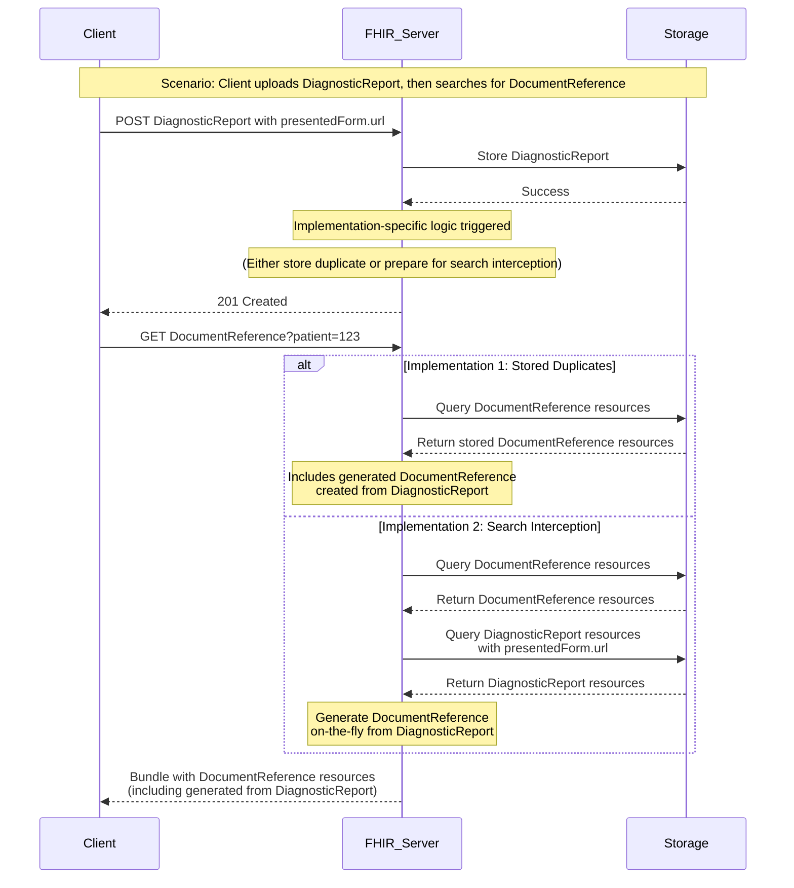

# FHIR Resource Duplication for Clinical Notes - Design Document

## Overview

This document outlines the design for implementing FHIR US Core 6.1.0 compliance for clinical notes exchange, specifically the requirement to expose overlapping scanned or narrative-only reports through both DocumentReference and DiagnosticReport resources.
https://hl7.org/fhir/us/core/STU6.1/clinical-notes.html#fhir-resources-to-exchange-clinical-notes

## Background

### Problem Statement

The FHIR US Core specification requires that FHIR servers **SHALL** expose overlapping scanned or narrative-only reports through both DiagnosticReport and DocumentReference resources when they contain the same attachment URL. This duplication requirement exists due to inconsistent implementation practices across healthcare systems:

- Some systems store all scanned reports as DocumentReference resources
- Other systems categorize scanned reports by type (e.g., Lab reports as DiagnosticReport)
- This inconsistency makes it difficult for clients to find all clinical information for a patient

### Specification Requirements

When a resource contains a URL reference to an attachment (such as a PDF scan), the server must ensure that attachment is accessible through both resource types using the corresponding elements:

- **DocumentReference**: `content.attachment.url`
- **DiagnosticReport**: `presentedForm.url`

### Example Scenario

If a DiagnosticReport is created with a PDF attachment:
```json
{
  "resourceType": "DiagnosticReport",
  "presentedForm": [
    {
      "contentType": "application/pdf",
      "url": "http://example.org/fhir/Binary/1e404af3-077f-4bee-b7a6-a9be97e1ce32"
    }
  ]
}
```

The server must ensure a corresponding DocumentReference is accessible:
```json
{
  "resourceType": "DocumentReference", 
  "content": [
    {
      "attachment": {
        "contentType": "application/pdf",
        "url": "http://example.org/fhir/Binary/1e404af3-077f-4bee-b7a6-a9be97e1ce32"
      }
    }
  ]
}
```

## Sequence Diagram



## Implementation Approaches

### Approach 1: Resource Generation and Storage

#### Description
This approach uses event notifications to automatically generate and store corresponding resources whenever a DocumentReference or DiagnosticReport is created, updated, or deleted.

#### Flow
1. **Create/Update Event**: When a resource with attachment URLs is created/updated:
   - Extract attachment URLs from the source resource
   - Generate corresponding resource of the other type
   - Add metadata linking the generated resource to the original
   - Store the generated resource in the database

2. **Delete Event**: When the original resource is deleted:
   - Find and delete the corresponding generated resource

3. **Search**: Normal search operations return both original and generated resources

#### Implementation Details
- **Linking Metadata**: Add extension or identifier to mark generated resources
- **Sync Mechanism**: Use resource versioning to detect when generated resources need updates
- **Conflict Prevention**: Ensure generated resources don't trigger generation of counter-resources

#### Pros
- ✅ Simple search implementation (no special logic needed)
- ✅ Consistent search performance
- ✅ Standard FHIR resource storage and retrieval
- ✅ Works with existing caching and indexing

#### Cons
- ❌ **Additional Storage**: Doubles storage requirements for affected resources
- ❌ **Sync Issues**: Generated resources may become out of sync with originals
- ❌ **Data Integrity**: Risk of orphaned generated resources
- ❌ **Complexity**: Additional logic for create/update/delete operations

### Approach 2: Search Interception and On-Demand Generation

#### Description
This approach intercepts search operations and dynamically generates resources on-the-fly by cross-searching the other resource type and transforming results.

#### Flow
1. **Search Interception**: When searching for DocumentReference or DiagnosticReport:
   - Execute the original search query
   - Execute a parallel search for the other resource type with attachment URLs
   - Transform found resources of the other type into the requested type
   - Merge results and return unified response

2. **Resource Operations**: Normal create/update/delete operations (no special logic)

#### Implementation Details
- **Search Expansion**: Modify search parameters to find equivalent resources
- **Resource Transformation**: Convert between DocumentReference and DiagnosticReport formats
- **Result Merging**: Combine original and generated results while respecting count limits
- **Caching**: Cache generated resources per request to avoid duplicate generation

#### Pros
- ✅ **No Additional Storage**: No duplicate resources stored
- ✅ **Always Synchronized**: Generated resources are always current
- ✅ **Simple Data Model**: No metadata pollution or linking complexity
- ✅ **Flexible**: Can be enabled/disabled without data migration

#### Cons
- ❌ **Performance Impact**: Additional search and transformation overhead
- ❌ **Result Count Management**: Complex handling of page size limits and total counts
- ❌ **Search Complexity**: Complex logic for various search parameters and combinations
- ❌ **Caching Challenges**: Generated resources can't be easily cached across requests

## Technical Considerations

### Configuration
This feature must only be enabled via configuration flag:
- `EnablClinicalReferenceDuplication`: Master switch for the feature

### Patient Context
We only "duplicate" a resource if it also has a patient reference

### Resource Identification
Generated resources need clear identification:
- meta property?
- tag?
- extension?

### Error Handling
- Handle cases where resource generation fails
- Graceful degradation when duplication is temporarily unavailable
- Logging and monitoring for duplication-related issues

## Monitoring
- Metric for everytime a "duplicate" is created/updated

## Optimization
- Caching strategies for generated resources?

## Recommended Approach  (Note this recommendation is from Claude :) )

**Recommendation**: Start with **Approach 2 (Search Interception)** for the following reasons:

1. **Lower Risk**: No data integrity concerns or additional storage requirements
2. **Easier Rollback**: Can be disabled without data cleanup
3. **Better Alignment**: Matches the specification's intent of "exposing" rather than "storing" duplicates
4. **Simpler Testing**: Easier to test and validate without complex data setup

Future migration to Approach 1 could be considered if performance requirements demand it, but the search-based approach provides a solid foundation for initial implementation.
