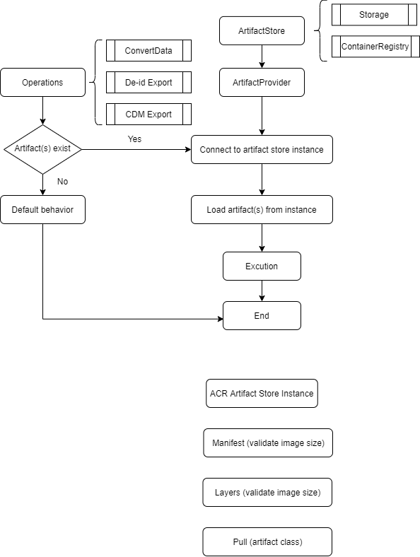

An unified ACR artifact store that provides the objects used in Converter API (templates), de-id export (configurations), CDM export, and other potential operations in the future.

[[_TOC_]]

# Business Justification

1. In recent months we released the de-id export and converter API in OSS and PaaS for fhir server, and we are planning to add CDM export. An unified artifact store provides the customized configurations for those operations, make customer's experience consistent.
2. Support customer to use Azure Container Registry to store the anonymization configuration for de-id export. That would be more secruity and convenient for management.

# Scenarios

1. Push artifacts (oras)
2. UI of PaaS solution. "Artifact Store" for registed artifact store instance.
3. ```<registry>/<name>@<digest>``` or ```<registry>/<name>:<tag>```
4. E.g. de-id Export ```GET [base]/$export?_anonymizationConfig=<registry>/<name>:<tag>```.


Some operations in fhir server need objects to trigger or implement (templates in converter API, configuration in de-id export), we plan to add a artifact store and use it to manage all the default or customized artifacts.

There is no different experience when using converter API, because we just extract the raw converter template store, implement an unified artifact store to replace the pervious one. And for de-id export, if customer use [container registry](https://azure.microsoft.com/en-us/services/container-registry/) as the artifact store, the query parameter in request should be the image reference to the configuration image in like ```GET [base]/$export?_anonymizationConfig=<registry>/<name>:<tag>```.

Target public review, we would support [Azure Conatiner Registry](https://azure.microsoft.com/en-us/services/container-registry/) and [Azure Storage](https://azure.microsoft.com/en-us/services/storage/) as the instances of artifact store. We will try to provide similar user experience when customer use atirafct store in different operations.

# Metrics

- Processing time.
- Artifacts size.
- Success/failure processing count. 
- Push/pull count.


# Design
1. oras push.
   1. Examples. (Manifest and Layers).
   2. Single file, Folder (recommanded).
2. Interface (Artifact)FetchAsync.
   1. Push the entire folder to the Container Registry as an image.
3. "Artifact Store" on Azure Protal. Regist the acr store. 
4. Current API parameters of de-id export will not be changed, and if customer trigger de-id export in released way like ```GET [base]/$export?_anonymizationConfig=config-file.json```, we still use destination blob storage account to store the configuration to grant the downword compatibility. (storage support in ACR artifact store).


5. We recommended to use Comtainer Registry as the store instance. User can use [TemplateManagementCLI](https://github.com/microsoft/FHIR-Converter/blob/main/docs/TemplateManagementCLI.md) tool to push customized artifacts to Container Registry. 
   1. Update doc.
   2. Push the entire folder to the Container Registry as an image.
   3. For de-id export, user can call ```GET [base]/$export?_anonymizationConfig=<registry>/<name>:<tag>``` to export anonymized data.
6. The size of maximal artifacts to be pushed/pulled can be set in different operations. If larger artifacts provided, then 400 should be returned with error TooLargeArtifacts.


## Operations call artifact provider work flow


## Multiple configuration support
In Container Registry, to make sure the artifact(s) is expected, user can set the image reference like ```<registry>/<name>@<digest>``` rather than ```<registry>/<name>:<tag>``` to specify the image version 

## OSS vs PaaS

Most change should be at OSS project. 

For PaaS solution, we want to add an "Artifact Store" section in navigation bar, maybe updated from current Conversation. Convenient for users to registe different artifact store instances.

## Error Handling

1. FailedToConnectToArtifactStore: when provided artifact store was not registed, then `400 Bad Request` with error code should be returned in operation result. 

# Test Strategy

- (reference to Converter API test strategy).
- Artifact Provider from TemplateManagement Nuget package. 
- E2E test to make sure the operations arw working correctly.

# Security

Use digest.


# Other

1. Converter API: Current behavior of Converter API will not be changed. But the settings will be re-organized

*Describe any impact to privacy, localization, globalization, deployment, back-compat, SOPs, ISMS, etc.*
