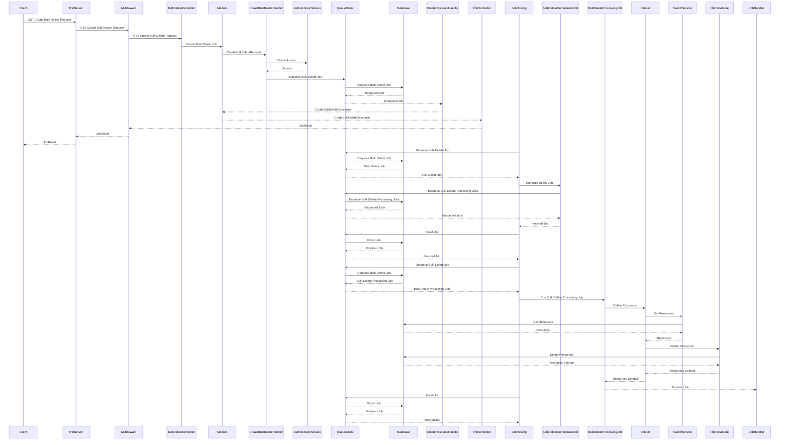

```mermaid
sequenceDiagram
    Client->>FhirServer: GET Create Bulk Delete Request
    FhirServer->>Middleware: GET Create Bulk Delete Request
    Middleware->>BulkDeleteController: GET Create Bulk Delete Request
    BulkDeleteController->>Mediatr: Create Bulk Delete Job
    Mediatr->>CreateBulkDeleteHandler: CreateBulkDeleteRequest
    CreateBulkDeleteHandler->>AuthorizationService: Check Access
    AuthorizationService-->>CreateBulkDeleteHandler: Access
    CreateBulkDeleteHandler->>QueueClient: Enqueue Bulk Delete Job
    QueueClient->>Database: Enqueue Bulk Delete Job
    Database-->>QueueClient: Enqueued Job
    QueueClient-->>CreateResourceHandler: Enqueued Job
    CreateResourceHandler-->>Mediatr: CreateBulkDeleteResponse
    Mediatr-->>FhirController: CreateBulkDeleteResponse
    FhirController-->>Middleware: JobResult
    Middleware-->>FhirServer: JobResult
    FhirServer-->>Client: JobResult
    JobHosting->>QueueClient: Dequeue Bulk Delete Job
    QueueClient->>Database: Dequeue Bulk Delete Job
    Database-->>QueueClient: Bulk Delete Job
    QueueClient-->>JobHosting: Bulk Delete Job
    JobHosting->>BulkDeleteOrchestratorJob: Run Bulk Delete Job
    BulkDeleteOrchestratorJob->>QueueClient: Enqueue Bulk Delete Processing Jobs
    QueueClient->>Database: Enqueue Bulk Delete Processing Jobs
    Database-->>QueueClient: Enqueued Jobs
    QueueClient-->>BulkDeleteOrchestratorJob: Enqueued Jobs
    BulkDeleteOrchestratorJob-->>JobHosting: Finished Job
    JobHosting->>QueueClient: Finish Job
    QueueClient->>Database: Finish Job
    Database-->>QueueClient: Finished Job
    QueueClient-->>JobHosting: Finished Job
    JobHosting->>QueueClient: Dequeue Bulk Delete Job
    QueueClient->>Database: Dequeue Bulk Delete Job
    Database-->>QueueClient: Bulk Delete Processing Job
    QueueClient-->>JobHosting: Bulk Delete Processing Job
    JobHosting->>BulkDeleteProcessingJob: Run Bulk Delete Processing Job
    BulkDeleteProcessingJob->>Deleter: Delete Resources
    Deleter->>SearchService: Get Resources
    SearchService->>Database: Get Resources
    Database-->>SearchService: Resources
    SearchService-->>Deleter: Resources
    Deleter->>FhirDataStore: Delete Resources
    FhirDataStore->>Database: Delete Resources
    Database-->>FhirDataStore: Resources Deleted
    FhirDataStore-->>Deleter: Resources Deleted
    Deleter-->>BulkDeleteProcessingJob: Resources Deleted
    BulkDeleteProcessingJob-->>JobHandler: Finished Job
    JobHosting->>QueueClient: Finish Job
    QueueClient->>Database: Finish Job
    Database-->>QueueClient: Finished Job
    QueueClient-->>JobHosting: Finished Job
```
