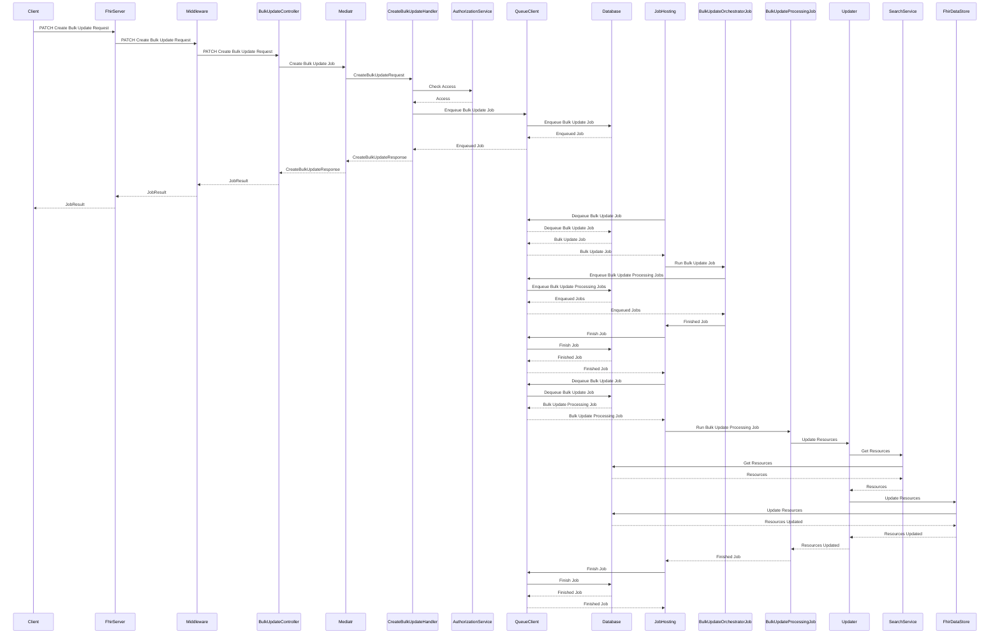

```mermaid
sequenceDiagram
    Client->>FhirServer: PATCH Create Bulk Update Request
    FhirServer->>Middleware: PATCH Create Bulk Update Request
    Middleware->>BulkUpdateController: PATCH Create Bulk Update Request
    BulkUpdateController->>Mediatr: Create Bulk Update Job
    Mediatr->>CreateBulkUpdateHandler: CreateBulkUpdateRequest
    CreateBulkUpdateHandler->>AuthorizationService: Check Access
    AuthorizationService-->>CreateBulkUpdateHandler: Access
    CreateBulkUpdateHandler->>QueueClient: Enqueue Bulk Update Job
    QueueClient->>Database: Enqueue Bulk Update Job
    Database-->>QueueClient: Enqueued Job
    QueueClient-->>CreateBulkUpdateHandler: Enqueued Job
    CreateBulkUpdateHandler-->>Mediatr: CreateBulkUpdateResponse
    Mediatr-->>BulkUpdateController: CreateBulkUpdateResponse
    BulkUpdateController-->>Middleware: JobResult
    Middleware-->>FhirServer: JobResult
    FhirServer-->>Client: JobResult
    JobHosting->>QueueClient: Dequeue Bulk Update Job
    QueueClient-->>Database: Dequeue Bulk Update Job
    Database-->>QueueClient: Bulk Update Job
    QueueClient-->>JobHosting: Bulk Update Job
    JobHosting->>BulkUpdateOrchestratorJob: Run Bulk Update Job
    BulkUpdateOrchestratorJob->>QueueClient: Enqueue Bulk Update Processing Jobs
    QueueClient->>Database: Enqueue Bulk Update Processing Jobs
    Database-->>QueueClient: Enqueued Jobs
    QueueClient-->>BulkUpdateOrchestratorJob: Enqueued Jobs
    BulkUpdateOrchestratorJob->>JobHosting: Finished Job
    JobHosting->>QueueClient: Finish Job
    QueueClient->>Database: Finish Job
    Database-->>QueueClient: Finished Job
    QueueClient-->>JobHosting: Finished Job
    JobHosting->>QueueClient: Dequeue Bulk Update Job
    QueueClient->>Database: Dequeue Bulk Update Job
    Database-->>QueueClient: Bulk Update Processing Job
    QueueClient-->>JobHosting: Bulk Update Processing Job
    JobHosting->>BulkUpdateProcessingJob: Run Bulk Update Processing Job
    BulkUpdateProcessingJob->>Updater: Update Resources
    Updater->>SearchService: Get Resources
    SearchService->>Database: Get Resources
    Database-->>SearchService: Resources
    SearchService-->>Updater: Resources
    Updater->>FhirDataStore: Update Resources
    FhirDataStore->>Database: Update Resources
    Database-->>FhirDataStore: Resources Updated
    FhirDataStore-->>Updater: Resources Updated
    Updater-->>BulkUpdateProcessingJob: Resources Updated
    BulkUpdateProcessingJob-->>JobHosting: Finished Job
    JobHosting->>QueueClient: Finish Job
    QueueClient->>Database: Finish Job
    Database-->>QueueClient: Finished Job
    QueueClient-->>JobHosting: Finished Job
```
