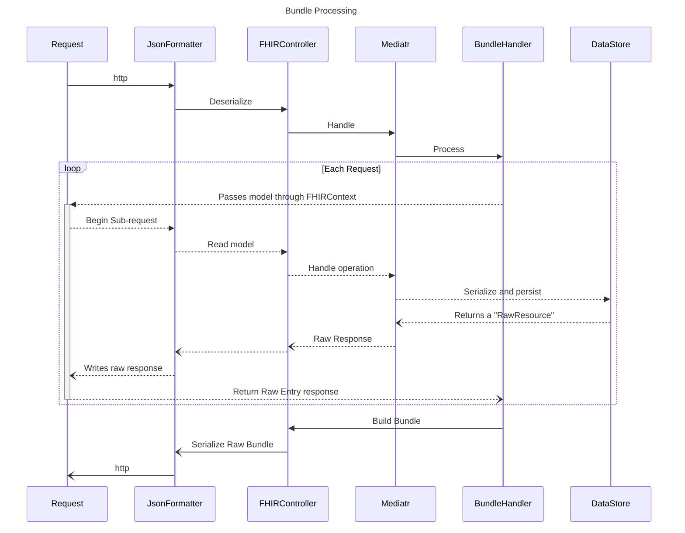

```mermaid
---
title: Bundle Processing
---

sequenceDiagram
    Request->>JsonFormatter: http
    JsonFormatter->>FHIRController: Deserialize
    FHIRController->>Mediatr: Handle
    Mediatr->>BundleHandler: Process
    
loop Each Request
    BundleHandler-->>+Request: Passes model through FHIRContext
    Request-->>JsonFormatter: Begin Sub-request
    JsonFormatter-->>FHIRController: Read model
    FHIRController-->>Mediatr: Handle operation
    Mediatr-->>DataStore: Serialize and persist
    DataStore--)Mediatr: Returns a "RawResource"
    Mediatr--)FHIRController: Raw Response
    FHIRController--)JsonFormatter: 
    JsonFormatter--)Request: Writes raw response
    Request--)-BundleHandler: Return Raw Entry response
end

    BundleHandler->>FHIRController: Build Bundle
    FHIRController-)JsonFormatter: Serialize Raw Bundle
    JsonFormatter-)Request: http
```
