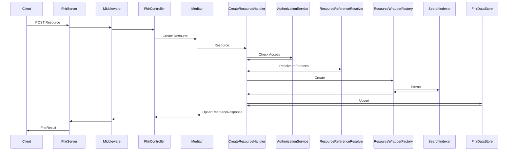

```mermaid
sequenceDiagram
    participant Client
    participant FhirServer
    participant Middleware
    participant FhirController
    participant Mediatr
    participant CreateResourceHandler
    participant AuthorizationService
    participant ResourceReferenceResolver
    participant ResourceWrapperFactory
    participant SearchIndexer
    participant FhirDataStore
    Client->>FhirServer: POST Resource
    FhirServer->>Middleware:
    Middleware->>FhirController:
    FhirController->>Mediatr: Create Resource
    Mediatr->>CreateResourceHandler: Resource
    CreateResourceHandler->>AuthorizationService: Check Access
    AuthorizationService->>CreateResourceHandler:
    CreateResourceHandler->>ResourceReferenceResolver: Resolve references
    ResourceReferenceResolver->>CreateResourceHandler:
    CreateResourceHandler->>ResourceWrapperFactory: Create
    ResourceWrapperFactory->>SearchIndexer: Extract
    SearchIndexer->>ResourceWrapperFactory:
    ResourceWrapperFactory->>CreateResourceHandler:
    CreateResourceHandler->>FhirDataStore: Upsert
    FhirDataStore->>CreateResourceHandler:
    CreateResourceHandler->>Mediatr: UpsertResourceResponse
    Mediatr->>FhirController:
    FhirController->>Middleware:
    Middleware->>FhirServer:
    FhirServer->>Client: FhirResult
```