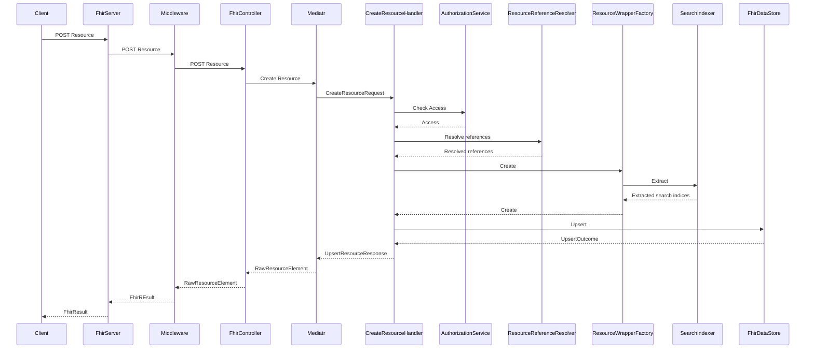

```mermaid
sequenceDiagram
    Client->>FhirServer: POST Resource
    FhirServer->>Middleware: POST Resource
    Middleware->>FhirController: POST Resource
    FhirController->>Mediatr: Create Resource
    Mediatr->>CreateResourceHandler: CreateResourceRequest
    CreateResourceHandler->>AuthorizationService: Check Access
    AuthorizationService-->>CreateResourceHandler: Access
    CreateResourceHandler->>ResourceReferenceResolver: Resolve references
    ResourceReferenceResolver-->>CreateResourceHandler: Resolved references
    CreateResourceHandler->>ResourceWrapperFactory: Create
    ResourceWrapperFactory->>SearchIndexer: Extract
    SearchIndexer-->>ResourceWrapperFactory: Extracted search indices
    ResourceWrapperFactory-->>CreateResourceHandler: Create
    CreateResourceHandler->>FhirDataStore: Upsert
    FhirDataStore-->>CreateResourceHandler: UpsertOutcome
    CreateResourceHandler-->>Mediatr: UpsertResourceResponse
    Mediatr-->>FhirController: RawResourceElement
    FhirController-->>Middleware: RawResourceElement
    Middleware-->>FhirServer: FhirREsult
    FhirServer-->>Client: FhirResult
```