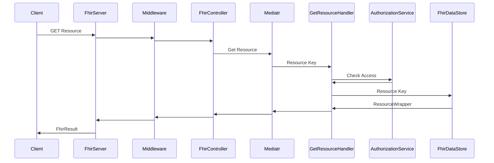

```mermaid
sequenceDiagram
    Client->> FhirServer: GET Resource
    FhirServer ->> Middleware:
    Middleware ->> FhirController:
    FhirController ->> Mediatr: Get Resource
    Mediatr ->> GetResourceHandler: Resource Key
    GetResourceHandler ->> AuthorizationService: Check Access
    AuthorizationService ->> GetResourceHandler:
    GetResourceHandler ->> FhirDataStore: Resource Key
    FhirDataStore ->> GetResourceHandler: ResourceWrapper
    GetResourceHandler ->> Mediatr:
    Mediatr ->> FhirController:
    FhirController ->> Middleware:
    Middleware ->> FhirServer:
    FhirServer ->> Client: FhirResult
```