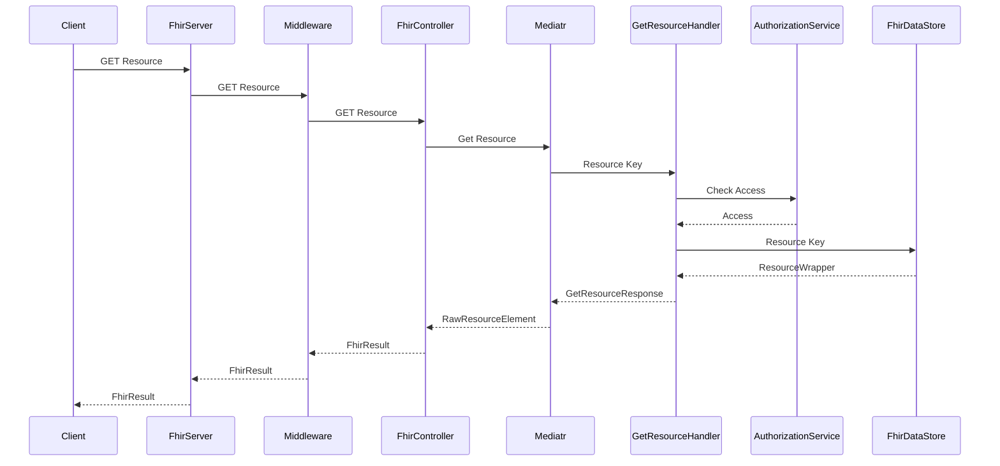

```mermaid
sequenceDiagram
    Client->>FhirServer: GET Resource
    FhirServer->>Middleware: GET Resource
    Middleware->>FhirController: GET Resource
    FhirController->>Mediatr: Get Resource
    Mediatr->>GetResourceHandler: Resource Key
    GetResourceHandler->>AuthorizationService: Check Access
    AuthorizationService-->>GetResourceHandler: Access
    GetResourceHandler->>FhirDataStore: Resource Key
    FhirDataStore-->>GetResourceHandler: ResourceWrapper
    GetResourceHandler-->>Mediatr: GetResourceResponse
    Mediatr-->>FhirController: RawResourceElement
    FhirController-->>Middleware: FhirResult
    Middleware-->>FhirServer: FhirResult
    FhirServer-->>Client: FhirResult
```