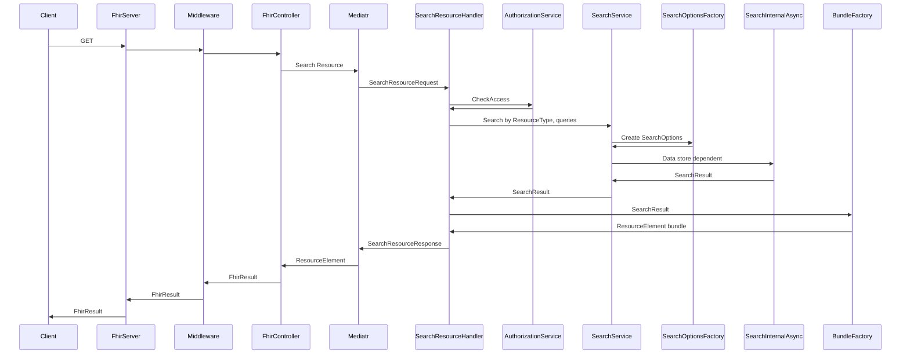

```mermaid
sequenceDiagram
    Client->>FhirServer: GET
    FhirServer->>Middleware:
    Middleware->>FhirController:
    FhirController->>Mediatr: Search Resource
    Mediatr->>SearchResourceHandler: SearchResourceRequest
    SearchResourceHandler->>AuthorizationService: CheckAccess
    AuthorizationService->>SearchResourceHandler:
    SearchResourceHandler->>SearchService: Search by ResourceType, queries
    SearchService->>SearchOptionsFactory: Create SearchOptions
    SearchOptionsFactory->>SearchService:
    SearchService->>SearchInternalAsync: Data store dependent
    SearchInternalAsync->>SearchService: SearchResult
    SearchService->>SearchResourceHandler: SearchResult
    SearchResourceHandler->>BundleFactory: SearchResult
    BundleFactory->>SearchResourceHandler: ResourceElement bundle
    SearchResourceHandler->>Mediatr: SearchResourceResponse
    Mediatr->>FhirController: ResourceElement
    FhirController->>Middleware: FhirResult
    Middleware->>FhirServer: FhirResult
    FhirServer->>Client: FhirResult
```