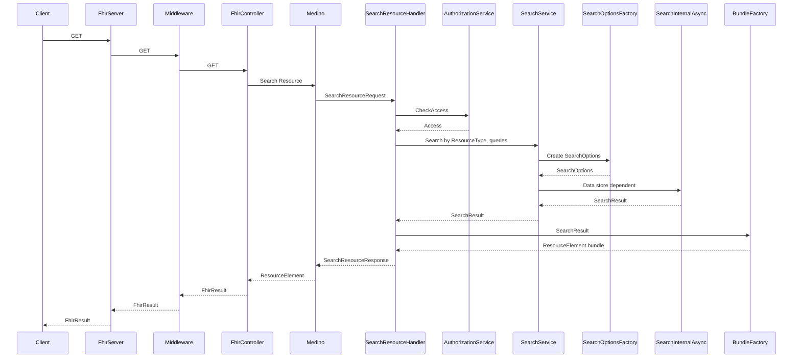

```mermaid
sequenceDiagram
    Client->>FhirServer: GET
    FhirServer->>Middleware: GET
    Middleware->>FhirController: GET
    FhirController->>Medino: Search Resource
    Medino->>SearchResourceHandler: SearchResourceRequest
    SearchResourceHandler->>AuthorizationService: CheckAccess
    AuthorizationService-->>SearchResourceHandler: Access
    SearchResourceHandler->>SearchService: Search by ResourceType, queries
    SearchService->>SearchOptionsFactory: Create SearchOptions
    SearchOptionsFactory-->>SearchService: SearchOptions
    SearchService->>SearchInternalAsync: Data store dependent
    SearchInternalAsync-->>SearchService: SearchResult
    SearchService-->>SearchResourceHandler: SearchResult
    SearchResourceHandler->>BundleFactory: SearchResult
    BundleFactory-->>SearchResourceHandler: ResourceElement bundle
    SearchResourceHandler-->>Medino: SearchResourceResponse
    Medino-->>FhirController: ResourceElement
    FhirController-->>Middleware: FhirResult
    Middleware-->>FhirServer: FhirResult
    FhirServer-->>Client: FhirResult
```