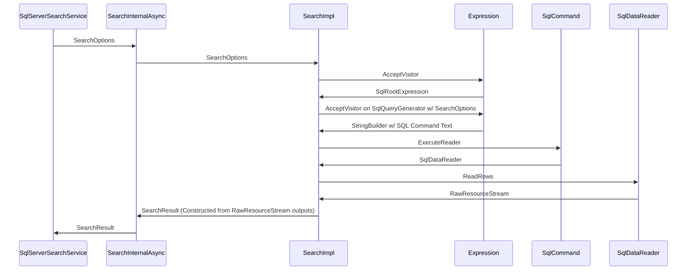

```mermaid
sequenceDiagram
    SqlServerSearchService->>SearchInternalAsync: SearchOptions
    SearchInternalAsync->>SearchImpl: SearchOptions
    SearchImpl->>Expression: AcceptVisitor
    Expression->>SearchImpl: SqlRootExpression
    SearchImpl->>Expression: AcceptVisitor on SqlQueryGenerator w/ SearchOptions
    Expression->>SearchImpl: StringBuilder w/ SQL Command Text
    SearchImpl->>SqlCommand: ExecuteReader
    SqlCommand->>SearchImpl: SqlDataReader
    SearchImpl->>SqlDataReader: ReadRows
    SqlDataReader->>SearchImpl: RawResourceStream
    SearchImpl->>SearchInternalAsync: SearchResult (Constructed from RawResourceStream outputs)
    SearchInternalAsync->>SqlServerSearchService: SearchResult
```